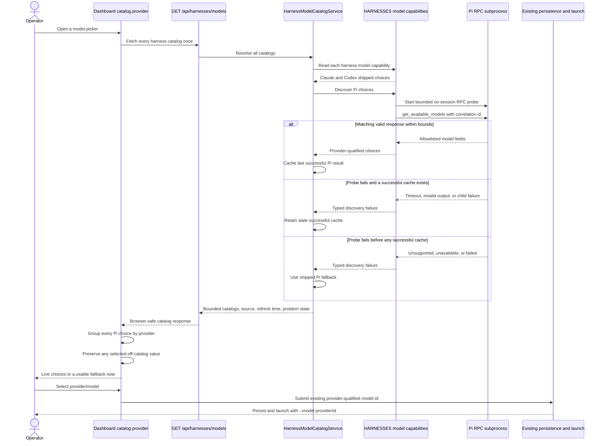

# Sequence: Pi live model catalog

**Last updated:** 2026-08-18
**Scope:** Planned discovery, fallback, presentation, selection, and existing launch flow for dispatch-time Pi models

## Diagram

## Legend

- The dashboard makes one ordinary HTTP read when its shared catalog provider mounts. It does not add browser polling or another live channel.
- `HARNESSES` remains the exhaustive owner of agent-specific process behavior. The route and cache service do not branch on the Pi agent id.
- The Pi child receives no prompt and creates no session. Process time, output bytes, row count, strings, and derived ids are bounded before any value reaches the browser.
- A cache or shipped fallback changes only catalog quality. It never blocks the existing persistence or launch path.

## Change Log

| Date | Change | Reason |
|------|--------|--------|
| 2026-08-18 | Initial planned sequence | Created during phased planning; this expands the request flow approved by the operator in `docs/plans/pi-live-model-catalog/plan.md` |
