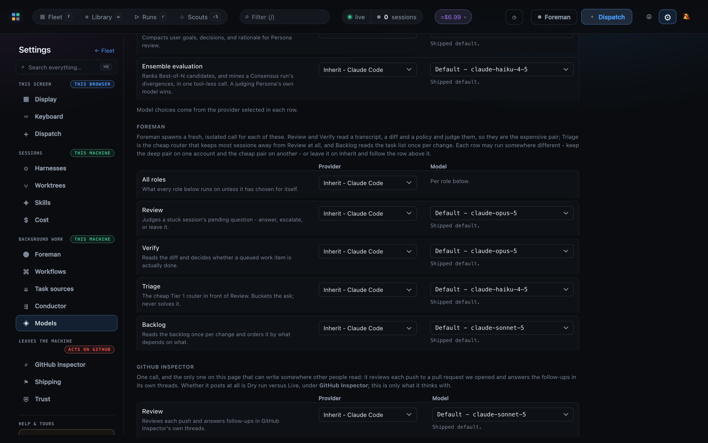

# Mission Control

Mission Control is a local control plane for teams running Claude Code, Codex, and Pi.
It brings the sessions, tasks, conversations, reviews, workflows, and delivery signals
that normally live across terminal panes into one live dashboard.

This repository is internal. It is not licensed for public distribution.

## See the fleet

The fleet view turns a working directory full of agent sessions into an operational board:
what is active, what needs a decision, and what is ready for the next step.


**Settings → Display → Board card** decides what a session card states - goal, live activity,
workflow, model, context, effort, permission mode, cost, branch, worktree, last seen - with a
live preview card beside the checklist. The flags that ask for you stay on whatever you
choose, and the defaults draw the card the previous release drew.

Fresh profiles automatically start the **See the work** guided tour once, then remember that
the orientation has been shown. Guided tours can later start from the **Help & tours** footer
in the Settings rail, which lists one row per registered tour, or from that tour's command in
the <kbd>⌘K</kbd> palette's **Do** group. One tour runs at a time, and two are registered.
Their names and stage copy are edited in [`tours/see-work.md`](tours/see-work.md) and
[`tours/library.md`](tours/library.md); see [`tours/README.md`](tours/README.md) for the format.

**See the work** teaches the operating half - the Line, the Board, one session's desk, and a
task from dispatch through review to completion.
If the fleet is empty, it starts one temporary Chat conversation and uses its real Board
drill-in to show the session desk. Its Dispatch sequence
then fills the real task input, explains the **None** Workflow choice, and waits for the
operator to click the highlighted **Dispatch now** button while the rest of the form stays
visible. Its final step opens the real Complete dialog with the outcome prefilled as **Tour
demo**, so the operator can inspect **Run a retro first** and **Complete & close**. Those dialog
actions stay disabled during the preview; the tour owns its fixed cleanup and never runs a
retro.

**Author what runs** teaches the authoring half, in dependency order: Personas, Actions,
Commands, then the workflow that composes all three. It walks fifteen stops through the Library
on shipped built-ins, ends on **No-Mistakes Review**, and then follows one already-ended run of
that workflow - completed, cancelled or failed alike - into the Runs page and its session's
**Workflows** tab. It writes nothing - no asset is saved, duplicated, published, or bound, no
run is started, and no model is called - and a machine with no ended No-Mistakes run reads the
same two stops against the built-in graph instead. Tours do not store progress, and both restore
the page, the asset, and the control you started from when you exit.

For Files workspace behavior and controls, see the
[UI keyboard shortcut reference](docs/ui.md#keyboard-shortcuts).

**Comment** turns on comment mode, so you can leave a comment on a line the way you would on a
pull request, and **Review** walks the agent through those comments one at a time - one comment
per turn, and the next only once the agent has finished with the one before it. The agent
answers through the bundled Mission MCP server's `respond_to_file_comments` tool, and the
answer appears in that comment's thread, on that line, without a refresh; the **Files** tab
raises a count of answers nobody has read yet, which expanding the thread clears. A session
whose MCP bundle cannot serve that tool is asked to quote the comment's id back in its next
turn instead, and its answer is recovered from the conversation. See
[walk the agent through your review](docs/ui.md#walk-the-agent-through-your-review).

The **Terminal view** keeps every turn in one stream while still distinguishing who sent it.
Foreman turns carry their purple provenance from the chat log into the terminal, and completion
reviews separate the original request, each missing item, its suggested fix, and the safety note
instead of presenting the whole review as one flat paste.

Every review prompt created through the bundled Mission MCP server can be dismissed from its
card, including free-text and option-based questions, plan decisions, shared plans, and diff
reviews. Dismiss resolves only that review, records no fabricated answer or verdict, and releases
the blocked tool call when one is waiting. **Close (esc)** only hides the review queue and resolves
nothing. See [the review channel MCP reference](docs/sessions.md#review-channel-mcp).

## Dispatch with context

Start a task in the right repository, choose its harness and runtime, and decide whether the
agent should ship, investigate, plan, or simply talk through something with you. Backlog and
review Workflow controls stay available only where that kind of work supports them.

<kbd>+</kbd> starts the guided pass by default. It asks for the repository, kind, harness and
what runs after the work, then hands over the same dispatch form with those answers set and
the caret in the task box. The choices print their one-key answers. <kbd>⇥</kbd> or the first
<kbd>Esc</kbd> leaves the pass at any point and keeps what it has; a second <kbd>Esc</kbd>
closes Dispatch. Closing and reopening keep the current question and every answer, while
**Clear**, **Dispatch now**, and **Add to backlog** reset the pass for the next task.
While the questions are active, dropping an image anywhere on the window attaches it to the
same task without advancing the pass.
**Guided** in the modal header and **Settings → Dispatch** control the preference, which ⌘K
also finds by name. See
[the guided pass](docs/dispatch-and-backlog.md#the-guided-pass).

The repository field is a searchable index of your workspace, and every row in it is the
checkout's **directory name** rather than its path - the list is only as wide as the field,
and a column of paths that all begin the same way ellipsizes away the one part that tells two
repositories apart. Hovering a row reveals its full path, which is also what the field itself
holds and what the task is dispatched against. Where two checkouts share a name, each of those
rows adds the **name of a folder above it** underneath - still never a path - so `~/a/api` and
`~/b/api` are told apart by `a` and `b`. A checkout with no folder above it at all is the one
row that gets nothing added, because the only thing left to add would be a path. The same
picker, and the same rows, appear wherever you choose a repository - **Settings → Trust**,
**Standing instructions**, and **Task sources**.

Open **Backlog details** to choose whether Foreman may automatically schedule a task added
from Dispatch. Turning **Allow backlog autopilot** off parks the new task in the backlog until
you enable or manually launch it. This switch affects backlog creation only: **Dispatch now**
still launches the task immediately.

When Foreman is running in **Live** mode with backlog autopilot on, an amber inline notice
marks an otherwise eligible task whose primary or attached repositories are missing from
Foreman's allowlist. The Board, the Line's Backlog drawer, and Sitrep use their existing task
notification position to name the missing grants, confirm that manual launch still works,
and link **Manage trust** to the existing
**Settings → Trust** matrix. Granting every listed repository removes the notice on the next
Foreman config update. Parked tasks and tasks carrying a launch error keep their existing,
more specific explanations instead.

If freezing a dispatch's Git bases or provisioning its worktrees fails before any worktree or
agent remains, a backlog-capable task returns to the Board's Backlog with the exact error on its
card and its normal launch control enabled. Task kinds that cannot appear in Backlog remain
failed. Foreman leaves a card carrying that launch error out of unattended scheduling so the
failure stays visible instead of retrying in a loop. Fix the reported condition, such as Git or
SSH access to the repository's origin, and launch backlog-capable work again from the same place.

Choose **chat** for an open-ended conversation. It requires an opening message and launches
immediately from Dispatch, with no backlog, dependencies, generated artifact, archive, or
automatic after-work action. The session stays yours to continue and complete unless you
explicitly choose a Workflow for that chat.

Choose **scout** for an investigation whose durable answer belongs in Scouts. Mission Control
normally verifies that report before completion. If it is missing or incomplete, the first
**Complete & close** attempt changes nothing and shows what the scout still owes; an explicit
**Close without report** confirmation can close the task when preserving that answer is not
needed.

A task can attach more than one repository. Dispatch it and you get **one** agent session
holding all of them in shared context: its working directory is the primary repo's worktree,
each attached repo gets a worktree of its own, and the agent is granted write access to every
one of them. The intent it receives names where each repo lives, which branch each one is on,
and asks for one pull request per repository it actually changes. Claude and Codex
support this; the dispatch modal offers the control only for a harness that does. Multi-repo
tasks are dispatch-only - they cannot be dropped onto an agent that is already running,
because the extra worktrees and the write access to them are granted when a session starts.

Agents using the bundled Mission MCP server can add the same work to the backlog with
`create_task`. Omitting repository selectors keeps the calling repository as primary.
`repository` selects another primary and `additionalRepositories` attaches the rest; each accepts
an absolute local checkout path or a directory name that is unique in the workspace index. Mission
Control resolves the complete set to canonical main-checkout paths and checks the selected ship
harness before storing anything. This local validation does not clone repositories or grant remote
write access. Foreman's unattended-launch allowlist remains separate, and Git plus the repository
host enforce push and pull-request authority when delivery reaches them.

Each of those pull requests is tracked on its own. The card and the console list one line per
repository with that repository's pull request and its state, so a task spanning three repos
never collapses to a single link. **A multi-repo task completes only when every repository it
changed has had its pull request merged** - a repo whose branch never moved off the commit it
was cut at is exempt, and a pull request closed without merging never satisfies the rule, so
the task stays visible for you to deal with. Merging itself is unchanged: each pull request
still merges on its own verdict, whenever it alone is ready.

**Every repository it changed gets its own full review, too.** One review run per changed
repo, running at the same time, each reading that repo's worktree, pinning that repo's pull
request and spending its own repair budget - so a finding in one repo restarts that repo's
review alone and never holds up a sibling's merge. A repo the task never touched gets no run
at all. The card shows one workflow chip per review, each naming its repository.

Everything typed at the agent is per repository too. Each review's packets name the repository
they are about, and Foreman's review follow-through - the nudge that puts a parked session back
on unresolved comments or a red CI - tracks each pull request separately, so one repository's
feedback is never mistaken for another's or lost behind it. They share the pane, so they take
turns in it: one instruction at a time, never two in a turn expecting neither.

The daemon owns a durable native worktree pool for every physical repository. New tasks,
Workflow checks, and approved `make session` work use exact lease identities from that allocator
by default. A disabled repository or positive capacity refusal degrades to a disposable Git
worktree for tasks and checks, while ambiguous outcomes fail closed. Treehouse is not required;
persisted legacy rows keep a narrow, conditional-return-only compatibility path.
**Settings > Worktrees** exposes future capacity policy, native and legacy inventory, exact path
actions, and preview-first cleanup without replacing task, check, Git, or process ownership.


## Give a repository standing instructions

**Settings → Standing instructions** is one box per repository, in your own words, sent to
every session Mission Control opens into that checkout. It fills the gap nothing else covers:
`AGENTS.md` is per-repository but committed, so it reaches every teammate on every machine,
and Foreman's instructions are machine-local but global and never reach a session at all.
This is per-repository **and** local to this machine - nothing is written to `~/` and nothing
is sent to GitHub.

Write a rule and the very next session dispatched into that repository has it. Sessions
already running keep what they launched with; a live process's system prompt cannot be
rewritten, so an edit reaches the next session rather than the ones already open.

A machine-wide **Every repository** box covers the checkouts with no rule of their own, and
the longest matching path wins, so a monorepo package's rule beats the monorepo's. Two states
that look alike are kept apart on purpose: a repository with **no** entry inherits the
machine-wide default, while one whose box is **empty** sends nothing at all and beats that
default. **Use global default** removes the entry; clearing the box does not.

Each card carries a **reach** block stating, per harness and runtime, which sessions get the
text and by which mechanism - a system prompt on Claude, developer instructions on an embedded
Codex, turn-one prose where a harness has no channel of its own. It also names what this does
**not** reach: sessions you started outside Mission Control, and Mission Control's own Foreman,
Inspector and Persona review prompts. A rule that silently reached half the fleet would be
worse than none, because it would be trusted and wrong.

Two read-only markers make it visible where it matters. The dispatch form says what a launch
will send, covering **every** attached repository rather than just the primary. A live
session's header carries a chip showing what **that** session was actually given at launch,
which does not change when you later edit the rule. Both name the mechanism as well as the
size: on Claude the text rides the system prompt and never appears in the transcript, so
without the chip there would be nothing anywhere to read.

See [Skills and settings](docs/skills-and-settings.md).

## Keep local settings recoverable

Mission Control automatically keeps versioned logical snapshots of the settings and reusable
Library definitions that shape local behavior. **Settings → Restore** provides a redacted preview,
exact confirmation, an automatic safety snapshot, and a draft-preserving notice in other windows.

See [Automatic settings snapshots](docs/configuration.md#automatic-settings-snapshots) for the
authoritative format, lifecycle, storage, scope, exclusions, and retention contract.

## Build the operating system around the work

The Library centralizes reusable workflows, personas, session actions, ensemble strategies,
mission sources, and gate commands.

**Library → Personas → Foreman** is the fixed System profile for Foreman's exact standing
guidance. Its name, policy, safeguards, models, and authority remain owned by Mission Control
and their existing Settings controls. Only the Markdown guidance is editable here, and the
System profile is never offered to workflows or ensembles as a Persona.


## Design reusable review workflows

Workflows and Personas turn the team's review practice into reusable, inspectable building
blocks. The Line keeps their live runs attached to the fleet. On a run, clicking a settled
reviewer or Command tile selects that exact result in the review worklist below.

A Persona reviews the diff, the bounded transcript, and upstream Check results, plus whatever
evidence the agent registered through Mission Control - gitignored screenshots, focused UTF-8
logs, or a completed command's exact output, none of it committed. The conversation's live
binding is what authorizes that registration, so it works the same on any kind of task and
whether the workflow was chosen at dispatch or attached by hand to a session already running.
See [workflows](docs/workflows.md) for the channels, their limits, and what a Persona can see.

On **Workflow Runs**, <kbd>↑</kbd> and <kbd>↓</kbd> select and immediately load runs.
From the selected run, <kbd>Tab</kbd> enters the pipeline; further Tabs or any arrow key move
between stages. Press <kbd>Enter</kbd> on a completed stage to load its recorded details in the
Review worklist below.


## Coordinate the fleet

Foreman provides configurable operational guidance for the fleet. GitHub Inspector keeps shipping
and remote review state visible beside the work that produced it.


With **Settings → Foreman → Safety → Keep pre-PR ship tasks moving** enabled, an
invited managed ship task that completion review holds receives its reviewed blocking gaps in
the same Foreman worker pass. The existing quiet-window shepherd remains the backstop under the
same setting. Human-driven and task-less sessions keep their silent hold and are not nudged.

Foreman durably carries each held verifier gap, including its kind, severity, and strike count,
into the next completed work cycle of the same accepted prompt. Recovery delivery has a
three-send budget for that intent episode even when the work-cycle generation advances: repeated
holds move through attempts two and three, and the next due pass escalates to the human without
sending again. A newly accepted human prompt begins a new episode and resets both the gap history
and recovery budget. Existing persisted rows without episode metadata keep their former
generation-scoped behavior. Delivery markers still identify individual attempts, preserving
idempotency across restarts.

**Settings → Task sources** pulls work in from trackers you already keep - GitHub issues and
Jira - on a schedule. A sweep only ever files backlog rows: it never dispatches an agent, cuts
a worktree, or types into a session. What it files arrives **parked**, with that source's
**Allow backlog autopilot** switched off, so a sweep's rows are a list you triage rather than
work that starts dispatching before you have read a title; enabling a row is you saying yes to
that row. Turn **Allow backlog autopilot** on for a source whose upstream is already curated
and every later sweep of it files ready-to-schedule tasks instead. See
[task sources](docs/dispatch-and-backlog.md#task-sources-pulling-work-into-the-backlog).

## Report a public product issue through an agent

When you explicitly ask an agent to report a Mission Control product issue, the bundled Mission
MCP server prepares the exact GitHub title, labels, body, and safe environment summary. Mission
Control then opens that public preview in the dashboard and blocks publication until you select
**Submit public issue**. Dismissing the review publishes nothing.

Reports are text-only in this release and use your installed, authenticated GitHub CLI. Screenshot
upload remains disabled until the upstream CLI attachment contract ships and is verified. There is
not yet a direct dashboard Feedback form or dashboard mutation endpoint; that confirmation-bound
user-facing path is a separate follow-up.

See [the MCP tool reference](docs/sessions.md#review-channel-mcp) and
[security boundaries](docs/security.md#public-product-issue-reporting).

## Watch a pipeline engine you already use

Some work is driven by an external SDLC engine rather than by a single agent.
[ai-conductor](docs/pipelines.md) is one: it walks a feature through a gated 22-step pipeline
in its own worktree and halts for a human when a gate refuses. **Settings → Conductor**
detects it and lets you consent, per repository, to Mission Control reading its state.

Detection is automatic and consent is not. Nothing is read until a repository is switched on,
and Mission Control never writes a file the engine owns. With no engine installed and nothing
configured, the dashboard is exactly what it was - no row, no panel, nothing in the command
palette. [Pipelines](docs/pipelines.md) owns the exact visibility rule.

Once a repository is switched on, the **Runs** page gains a second tab. **Workflows** is the
page it always was; **Pipelines** shows what the engine is driving - a rail grouped per
repository under its engine daemon's state, and each feature's whole gated sequence drawn in
the same diagram grammar a workflow run uses.

The engine's own agents show up on the fleet too, and are marked as its rather than yours: a
session working inside an observed feature's worktree wears the run's badge, groups under it,
and has a sentence where its composer was, because it is a `--print` process that reads nothing
typed at it. Its Workflows tab draws the feature's ladder. And when the engine **halts** a
feature for a human, that halt is a row in the [attention inbox](docs/attention-and-alerts.md)
with its class, what stopped it, and the runbook that clears it - the one thing waiting on you
that has no session behind it.

You can act on a pipeline from there, not only read it: start, stop, pause and resume the
engine's daemon, park and unpark a feature, authorize one DECIDE re-entry with your own
rationale, watch the daemon's console, and run the re-seal ceremony in a hosted terminal.

The same integration starts at Dispatch. An enabled repository offers the **pipeline** task
kind. Its shipped host is Claude Agent SDK, which starts a managed Claude session at the
repository and sends `/engineer <idea>` directly as turn one. **Settings → Conductor → Launch
runtime** can instead select the explicit Terminal compatibility host, which opens
`conduct-ts engineer --idea` with live stdin. A failed SDK launch never falls back to Terminal.
Either host lets conductor own the worktree and downstream agent, model, and effort, and only
the exact provider projection completes the task. Conductor's background build daemon keeps its
own tmux supervision. When that run opens a pull request, GitHub Inspector adopts it under
pipeline provenance and it joins **Shipped**. **Settings → Conductor → Foreman
triage** can also let Foreman unpark mechanical halts through the same action route the
dashboard uses. That switch ships off, and every needs-human or unknown halt stays with the
operator.
Every verb spawns the engine's own CLI and is judged by what it printed, never by an exit code
- and what a shipped feature cost lands in the [spend strip](docs/cost-and-usage.md) as
automation, under the engine's own figures.

## Quick start

There are two paths through this repository, and which one you want depends on whether you are
*using* Mission Control or *working on* it.

**To use it**, install the macOS app. This is the only path that receives updates.

```sh
git clone <internal-repository-url>
cd ai-harness
make install
```

That builds Mission Control in a clone only the updater ever touches, verifies the packaged
version, and installs `/Applications/Mission Control.app` - a menu-bar app that supervises the
daemon and delivers alerts with the window closed. From then on it checks for new releases on
its own and offers them in the app. Prerequisites, checked before anything long-running starts:
an Apple Silicon Mac, Node.js 24 or newer, `git`, an authenticated `gh` (`gh auth login`), and
the Xcode command line tools (`xcode-select --install`). See
[Desktop app](docs/overview.md#desktop-app-macos) for what each step does, `--ref`, and the
install receipt.

**To work on it**, run the dev server against this checkout. It needs Node.js 24 or newer and
the Xcode command line tools, receives no updates, and writes no install receipt - so the
updater deliberately stays off for a work-in-progress build.

```sh
git clone <internal-repository-url>
cd ai-harness
make init
npm run dev
```

Open `http://127.0.0.1:5173`. For the desktop shell, demo mode, hooks, state locations, and
the full verification path, use the setup guide below.

## CI runner allocation

The `gates` job runs on GitHub-hosted `ubuntu-latest`. The CPU-heavy jobs use the shared
`frontend-platform` runner group, which grants this repository access to both runner sizes.
The Node 24 and Node 26 unit jobs run directly on `ubuntu-8cpu-32ram-300ssd` with eight test
workers. Five end-to-end shards run directly on `ubuntu-4cpu-32ram-150ssd` with four
Playwright workers each.

The workflow names both the `frontend-platform` group and the relevant label for each job.
There is no repository variable or fallback selector. Access is managed centrally in
`teamupstart/Github_Org_Settings_TF`; changing the group, labels, worker counts, or shard count
is one capacity decision and should be benchmarked together.

This allocation is a performance experiment, not a claim that the five-minute target has
already been met. Accept it only after three consecutive live workflows complete all eight
checks green in five minutes or less, measured from workflow creation through completion.

## Choose how the app's own model calls are made

Beyond the agents in the cards, Mission Control makes a few model calls of its own - naming an
untitled dispatch, refining a Goal, narrating the away digest, reviewing a pull request. Those
run through a local CLI you are already logged in to, so there is no API key anywhere in this
path, and **Settings → Models** picks which provider does that work.

**Every app-owned model choice with a fixed place in this app is on that one page**, in three
groups - the background jobs, Foreman's four roles, and the GitHub Inspector's review - so one
screen answers *what is this app spending on its own work, and on whose account?* Foreman's
provider and its Review, Verify, Triage and Backlog models used to live in Foreman's own panel
and the Inspector's review model in its own; both panels keep every other setting and now point
here.

A Persona's model and an Ensemble judge's are deliberately not here, and are not an exception to
that: there is one per row and no fixed number of them, so they are a field on a definition you
wrote rather than a setting this app owns a slot for. The page says so itself, at the bottom.

Each row carries its own provider as well as its own model, and Foreman's four are no longer one
choice: its grid leads with an **All roles** row, so the deep pair can run on one account while
the cheap pair runs on another. A row on *Inherit* follows the row above it - a Foreman role
follows **All roles**, and everything else follows the app-wide picker, then
`MISSION_LLM_RUNNER`, then the shipped default. Pinning a model pins its provider, so changing
the picker re-resolves only the rows still inheriting. That pin is recorded only by a write that
reaches the pair - saving that row's model, or moving the row above it - so editing an unrelated
setting never converts an inheriting row into a pinned one. A pair that turns up anyway, from an
older blob or a hand edit, is refused when the call is resolved rather than spawned, and the row
names the model id it had to drop.

**One upgrade note.** An unset GitHub Inspector provider used to resolve to a literal `claude`,
which made it the one subsystem that ignored the app-wide picker and `MISSION_LLM_RUNNER`. It now
follows the same ladder as everything else, so **if you were relying on that fallback this changes
which provider the Inspector spawns** - set its provider explicitly to keep Claude.

The models Foreman *launches a backlog task with* are a different question - they choose what a
launched agent runs as, not what Foreman itself spends - and stay under
**Settings → Foreman → Launches**.



Each provider also has a *transport*: how the daemon talks to that CLI. Both are stored in the
`llm` config, both can be pinned from the environment, and both resolve the same way - the saved
setting first, then the environment variable, then the shipped default.

| Provider | Values | Stored as | Environment | Default |
|---|---|---|---|---|
| Claude | `sdk`, `print` | `llm.claudeTransport` | `MISSION_CLAUDE_TRANSPORT` | `sdk` |
| Codex | `exec`, `sdk` | `llm.codexTransport` | `MISSION_CODEX_TRANSPORT` | `exec` |

For Codex, `exec` spawns `codex exec` and decodes its `--json` stream by hand; `sdk` drives the
same binary through `@openai/codex-sdk` and reads typed thread events instead. **That is a choice
about how a reply is parsed, not about how it is fetched.** Both transports spawn the same
executable and pay the same model round trip, so selecting `sdk` buys typed events and a
supported cancellation path - and does not make anything faster. Reach for it to debug or to get
structured events, never to fix a slow dispatch.

Full behavior, including why the SDK is pinned to the same binary `MISSION_CODEX_BIN` names, is in
[configuration](docs/configuration.md) and [models](docs/models.md).

## Go deeper

- [Documentation index](docs/README.md) - product behavior, configuration, and feature guides.
- [Architecture overview](docs/architecture.md) - how the daemon, dashboard, integrations, and local state fit together.
- [Contributing](CONTRIBUTING.md) - clone-to-green setup, test layers, and contribution expectations.
- [Security policy](SECURITY.md) - security posture and internal vulnerability reporting.

## Regenerate screenshots

The screenshots above come from the built dashboard in deterministic, token-free demo mode.
After a dashboard change, rebuild and run:

```sh
npm run build
npm run docs:screenshots
```
