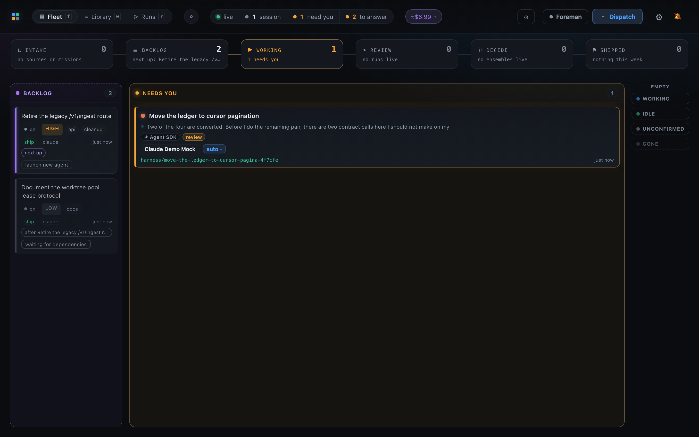
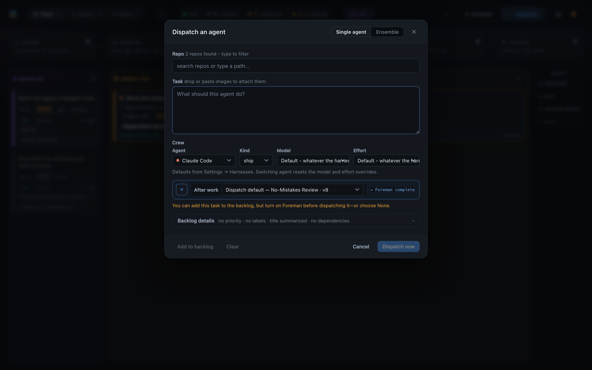
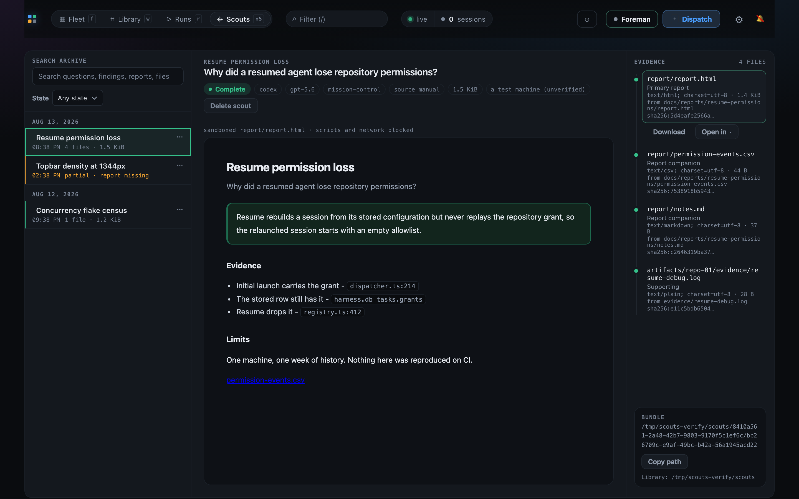
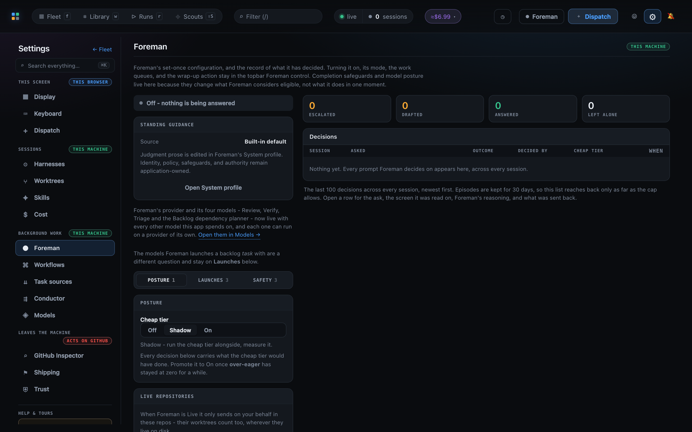
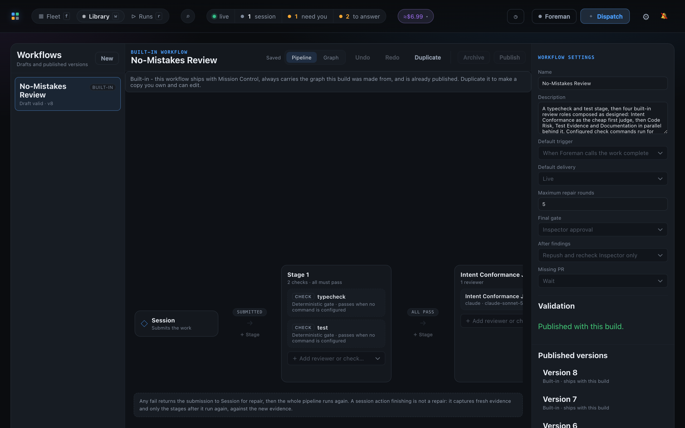
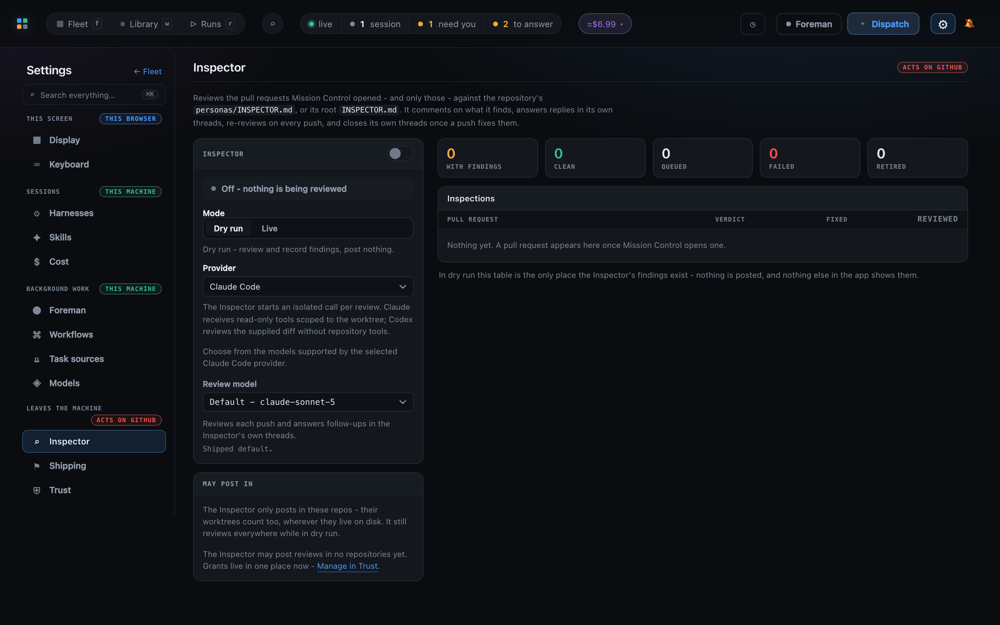

# Mission Control

**Give yourself superpowers without the compromises.**

Most software factories ask you to adopt their agent, terminal, workflow, and worldview.
Mission Control sits one layer above them. It is a meta-harness: one control plane for Claude
Code, Codex, Pi, terminal and Agent SDK sessions, isolated worktrees, verification, review, and
delivery.

## Why Mission Control instead of another software factory?

1. **It just feels good.** Every interaction has been meticulously tuned for an ergonomic, delightful,
   keyboard-friendly developer experience. Running a fleet should feel as natural as running one
   agent.
2. **It works.** High-quality code is not left to chance. Mission Control ships with fast checks, specialized reviewers,
   evidence-backed repair loops, pull request review, and CI gates enforce the quality
   bar from first diff to merge.
3. **It adapts to you.** Mission Control is designed to fit the harness, terminal, and multiplexer
   you prefer. It coordinates the system around your tools instead of replacing them. Remote
   sessions are next.
4. **It is built for what comes next.** Mission Control is built and supported by Upstart. The
   local factory is the beginning. Get ready for it to expand beyond your laptop. Prepare for
   superpowers.

**Mission Control: Building with agents never felt this natural.**

Mission Control's source code is licensed under the [Apache License 2.0](LICENSE).



## Run a whole team of coding agents like one product

One agent is easy to watch. Five are not. Mission Control gives a fleet of coding agents a single
control room: a board that shows who needs you, a backlog that feeds them work, a customizable Foreman agent
that handles the routine interruptions you don't want, a verification workflow that enforces a quality standard, 
and repository memory so the next agent does not repeat the last one's mistake. When an external SDLC engine 
drives the work, Mission Control watches that too.

- [The board](#the-board)
- [Every agent's desk](#every-agents-desk)
- [Dispatch and task types](#dispatch-and-task-types)
- [Standing instructions](#standing-instructions)
- [Scouts and the archive](#scouts-and-the-archive)
- [Backlog and sources](#backlog-and-sources)
- [Foreman](#foreman)
- [Workflows and Personas](#workflows-and-personas)
- [Shipping and the GitHub reviewer](#shipping-and-the-github-reviewer)
- [AI Conductor](#ai-conductor)
- [Retro and memory](#retro-and-memory)
- [Ensembles](#ensembles)
- [The whole loop](#the-whole-loop)

## The board

The board turns a directory full of agent sessions into an operational view. One column per state
answers what is working, what is idle, and what needs a decision. Cards group by repository and can
show the agent's goal, current activity, workflow progress, branch, model, cost, and remaining
context. The signals that need a person can never be hidden.

Keyboard navigation, fleet search, one-key Sitrep, desktop alerts, Away mode, and macOS keep-awake
support make the board useful whether you are watching closely or returning after hours away.

Read more in [The Line and fleet UI](docs/ui.md) and
[Attention, alerts, and Away mode](docs/attention-and-alerts.md).

## Every agent's desk

Open any card to see the conversation, diff, files, review progress, and controls for that session.
Read it as a terminal stream or a chat, queue and reorder messages, answer structured questions,
change permission posture, interrupt a turn, and drop images directly into the composer.
Interrupted turns retain a visible marker in the conversation across all three harnesses,
on terminal and Agent SDK runtimes.

The diff is scoped to what that agent changed. Files support pull request-style line comments and a
guided review that walks the agent through one thread at a time. A terminal in the same working copy
is one click away in the terminal or multiplexer you actually use.

Mission Control supports tmux, Herdr, and cmux through one multiplexer registry. Herdr support
requires stable Herdr 0.8.2 or newer on protocol 20 or newer, and currently runs on macOS and
Linux. It uses the default local Herdr server only, and `HERDR_BIN` can point at a non-standard
installation.
Mission Control can create, discover, write, safely paste into, capture, focus, rename, close,
detach from, and reattach to Herdr workspaces. See [Harnesses and terminal
backends](docs/harnesses-and-terminals.md#herdr) for the compatibility and focus boundaries.

Read more in [Sessions and conversations](docs/sessions.md) and
[the file review UI](docs/ui.md#walk-the-agent-through-your-review).

## Dispatch and task types

Describe the work, choose who does it, and Mission Control starts the agent in an isolated worktree
so concurrent sessions do not collide. Use the guided keyboard pass or go straight to the form,
dispatch immediately or add the work to the backlog, and attach multiple repositories when one
change spans them. Multi-repository tasks keep one conversation while receiving one worktree and,
when changed, one independently reviewed pull request per repository.

Per-harness settings choose whether dispatched sessions run on the Agent SDK or in a terminal.
Terminal-backed harnesses can stay on Automatic selection or pin dispatches to tmux, Herdr, cmux,
WezTerm, Ghostty, or iTerm2 through the detailed terminal chooser.

Mission Control supports five kinds of work:

- **Ship** delivers a change and opens a pull request.
- **Scout** investigates a question and preserves the answer as a self-contained report.
- **Plan** produces a reviewable plan that can become ordered follow-up tasks.
- **Pipeline** hands the work to an external SDLC engine while keeping it visible here.
- **Chat** opens a conversation with no required deliverable or ceremony.



Read more in [Dispatch, backlog, and task sources](docs/dispatch-and-backlog.md).

## Standing instructions

Some repository rules belong on your machine, not in every teammate's committed `AGENTS.md`. Write
those rules once in Mission Control and every new session it launches into that repository receives
them before work starts.

Global instructions are sent first, with repository instructions appended after them.
The longest matching path selects a monorepo's repository addition. Settings explains how the
instructions reach each harness and runtime. Running sessions keep the instructions they
received at launch, so the UI shows the immutable snapshot rather than pretending a live system
prompt changed.

Read more in [Skills and settings](docs/skills-and-settings.md) and
[Configuration](docs/configuration.md#repository-standing-instructions).

## Scouts and the archive

Not every valuable result is a code change. A Scout investigates a question and produces one
answer-first HTML report with its evidence and limitations. The report is self-contained, opens
without Mission Control, and must exist before normal Scout completion succeeds.

The archive makes reports and plans searchable by their question and content. They outlive the
temporary task, agent, branch, and worktree that produced them, while preserving an honest record
of missing or incomplete evidence.



Read more in [Archives](docs/archives.md).

## Backlog and sources

The backlog holds work that should happen but has not started. Order it with priorities and labels,
hold individual items, express dependencies, or let backlog autopilot schedule eligible work within
the concurrency you allow.

Task sources pull from GitHub issues and Jira without starting agents behind your back. Imported
work arrives parked by default for triage. Recurring missions and agent-created follow-up tasks feed
the same queue, so planned work, discovered work, and scheduled work share one lifecycle.

Read more in [Dispatch and backlog](docs/dispatch-and-backlog.md),
[Work queues](docs/work-queues.md), and [Recurring missions](docs/recurring-missions.md).

## Foreman

Foreman is an optional operator for routine fleet interruptions. It reads what a blocked agent is
actually asking, handles the low-risk calls you have authorized, and turns genuine forks into a
short decision brief. Draft-only, one-click, and Live modes make the level of delegation explicit,
with repository trust and hard safety boundaries beneath all three.

Foreman can also keep accepted work moving: verify completion, deliver focused repair gaps, follow
pull request feedback and red CI, and schedule backlog work. It remains off until you enable it and
never treats destructive choices as routine.



Read more in [Foreman](docs/foreman.md).

## Workflows and Personas

Workflows turn a team's definition of done into reusable, inspectable automation. Cheap checks run
before model reviewers, independent Personas review the same immutable evidence snapshot in
parallel, and failed stages return one focused repair list to the agent before the workflow tries
again. Published definitions are frozen, so a later edit cannot rewrite what an earlier run meant.
By default, judges that have passed are skipped on later repair rounds of that run. Turn off
**Skip judges that already passed** in Settings > Workflows to require fresh reviews each round.

Personas each own one reviewing concern. Session actions can send authored instructions back to the
working agent, gather fresh evidence, and continue the graph. Reports, screenshots, logs, and exact
command output can reach reviewers without being committed to the repository.

When Foreman's **Keep sessions on track with CI** option is selected, newly prepared workflow
Pull Request instructions also ask the agent to follow CI and repair failures on the same branch.



Read more in [Workflows and Personas](docs/workflows.md) and
[The Library](docs/library-and-line.md).

## Shipping and the GitHub reviewer

The GitHub Inspector reviews pull requests Mission Control can prove it opened. It comments inline,
answers replies in its own threads, re-reviews every pushed head, and resolves findings when the
code fixes them. Dry run records what it would say without publishing anything.

Optional shipping automation can merge only after the current head has a clean published review,
CI is green, every review thread is resolved, no human veto remains, the soak window has elapsed,
and the repository has separate review and merge grants. The final merge is pinned to the exact
head that passed those gates.



Read more in [GitHub Inspector and shipping](docs/inspector-and-shipping.md).

## AI Conductor

Some work is driven by a complete SDLC engine rather than one long-running agent. Mission Control
can observe ai-conductor's gated pipeline, show its agents on the same fleet, surface halts in the
attention inbox, and invoke the engine's own control commands without becoming a second writer of
its state.

Detection is automatic, but reading is opt-in per repository. Pipeline tasks, costs, pull requests,
and provenance then join the same operating view as directly dispatched work.

Read more in [Pipelines](docs/pipelines.md).

## Retro and memory

A finished task can offer a retrospective when there is evidence that something worth learning
happened. It proposes at most three grounded lessons, shows the exact text and evidence, and writes
nothing until you approve it.

Approved lessons live with the repository they describe, where future agents receive them. Repeated
lessons can be promoted into the project's main guidance so memory stays curated instead of growing
as an unstructured transcript archive.

Read more in [Repository memory](docs/repository-memory.md).

## Ensembles

When one attempt is not enough, Mission Control can run several agents independently and help you
choose among the results:

- **Best of N** ranks the attempts and recommends a winner.
- **Consensus** separates settled agreement from decisions that still need you.
- **Panel vote** assigns independent judges to correctness, maintainability, risk, evidence, scope,
  or other dimensions.

Judging is blind, ties are explicit, candidates remain available, and promotion waits for your
decision.

Read more in [Multi-agent ensembles](docs/ensembles.md).

## The whole loop

Work arrives from you, an issue tracker, a recurring mission, a retrospective, or another agent. It
waits in one backlog, starts in an isolated worktree, stays steerable while the agent works, and
moves through checks and specialist review. Failures go back to the agent as repair work. A pull
request is reviewed at its exact head and merges only when the gates you chose are satisfied.

Across that loop, Mission Control follows a few durable rules:

- It reports what it observed, not what an agent merely claimed.
- A reviewer outage is unavailable, not a rejection.
- Powerful automation and outward-facing actions start off.
- Important states are stated in words, not encoded only by color.
- App-owned model calls use local CLIs you are already logged into, with no API key stored in
  Mission Control.
- Settings, Library definitions, and the product database have recovery paths.

That is the meta-harness: your agents and tools can change while the operating loop, quality bar,
and control surface stay coherent.

## Get started

There are two paths through this repository:

- **Use Mission Control** as a managed macOS app that supervises the daemon, delivers alerts with
  the window closed, and receives updates. Updates check Node.js and npm before building and
  offer remediation with **Check again** when the runtime is incompatible. See the
  [desktop app installation guide](docs/overview.md#desktop-app-macos).
  **Settings → Setup → Runtime** also checks Node.js and can open its Homebrew installation
  command in a visible terminal, with **Re-check** to confirm the repair.
- **Work on Mission Control** from this checkout with Node.js 24 or newer:

  ```sh
  git clone https://github.com/teamupstart/mission-control.git
  cd mission-control
  make init
  npm run dev
  ```

  Then open `http://127.0.0.1:5173`. See [First-run setup](docs/setup.md) and
  [Contributing](CONTRIBUTING.md) for prerequisites and the full verification path.

Mission Control's app-owned headless calls can use either provider transport. Choose the stored
setting in the app or use the environment variable as a process-level fallback:

| Agent | Transports | Stored setting | Environment fallback | Shipped default |
| --- | --- | --- | --- | --- |
| Claude | `sdk`, `print` | `llm.claudeTransport` | `MISSION_CLAUDE_TRANSPORT` | `sdk` |
| Codex | `exec`, `sdk` | `llm.codexTransport` | `MISSION_CODEX_TRANSPORT` | `exec` |

See [Configuration](docs/configuration.md) for the complete precedence rules and transport
tradeoffs.

## Pi session integration

The Pi extension bridges Mission Control tools, lifecycle, live model, effort, context, and
attributed usage for hand-run Pi sessions. For a first installation, open **Settings > Setup >
Agent extensions > Install Pi integration**. You can also enable it from a durable built checkout:

```sh
npm run build
npm run install-pi-extension
```

This installs a machine-wide symlink at `~/.pi/agent/extensions/mission-control.js` and leaves
the integration enabled. Start a fresh Pi session normally; it loads the extension without
being launched through Mission Control or passing `-e`. Building alone installs nothing.
Keep the built checkout available because the installed link points to its extension artifact.
The standalone installer also works when the running app predates the configuration API.

Setup reports dangling or deleted links, load failures, stale extension builds, and stale MCP
tools. Pi itself says nothing about a dangling link; a bundle that throws while loading can
prevent every Pi session from starting. The warning is report-only and offers a copyable manual
installer command. Rebuild and run it from a durable clone, then press **Re-check**. Setup
never repairs an existing integration.

To disable the integration and remove its managed link durably:

```sh
npm run install-pi-extension -- --uninstall
```

A daemon with Pi extension configuration support also accepts HTTP requests:

```sh
curl --fail-with-body -sS -X PUT http://127.0.0.1:7317/api/extensions/pi/config \
  -H 'Content-Type: application/json' -d '{"enabled":true}'
curl -fsS http://127.0.0.1:7317/api/extensions/pi/config
```

Send `{"enabled":false}` with the same PUT request to disable it; GET returns the persisted
intent. Use the daemon's configured port if different from 7317. Start a fresh Pi after either
change; an already loaded extension stays in that process until it exits. A conflict returns
HTTP 409 with the saved intent and reconciliation problems; unrelated files are left untouched.

An explicit `MISSION_HOME` (or supported legacy alias) scopes installation to that state's
`pi-extensions` directory instead of the machine-wide location. `PI_EXTENSIONS_DIR` overrides
the destination directory. For a custom Pi home, point it at the `extensions` directory of the
home Pi actually uses: Pi's `PI_CODING_AGENT_DIR` must agree. `PI_EXTENSIONS_DIR` controls the
Mission Control installer, not Pi's loader.

`npm run install-hooks -- --uninstall` also removes the managed extension link, but leaves its
saved intent unchanged. Disable Pi integration first if the daemon may start again. Installing
Claude hooks never enables Pi integration.

See the [Pi extension reference](docs/pi-extension.md) for reconciliation, isolation, lifecycle,
and build contracts.

## Community participation

Sessions can [report product feedback](docs/sessions.md) with the
`report_product_feedback` MCP tool. An explicit user request publishes a public Mission Control
issue automatically and returns its GitHub URL, without a second dashboard approval.

Public users may open bug reports and feature requests through GitHub Issues. This repository
does not accept external pull requests: pull request creation is limited to authorized repository
collaborators, including Upstart maintainers. If you want to propose a code or documentation
change, describe it in an issue for the maintainers to evaluate. See
[Contributing](CONTRIBUTING.md) for details, and use the private process in
[SECURITY.md](SECURITY.md) for suspected vulnerabilities.

## Go deeper

- [Documentation index](docs/README.md) - product behavior, configuration, and feature guides.
- [Architecture overview](docs/architecture.md) - how the daemon, dashboard, integrations, and
  local state fit together.
- [Harnesses and terminal backends](docs/harnesses-and-terminals.md) - the extension boundaries
  that make Mission Control adaptable.
- [Security policy](SECURITY.md) - security posture and private vulnerability reporting.

## License

Copyright 2026 Jordan Mance.

Mission Control is licensed under the [Apache License 2.0](LICENSE). See [NOTICE](NOTICE) for
attribution information. Third-party dependencies remain subject to their own license terms,
including the `@anthropic-ai/claude-agent-sdk` dependency and
[Anthropic's applicable commercial terms](https://code.claude.com/docs/en/legal-and-compliance).
