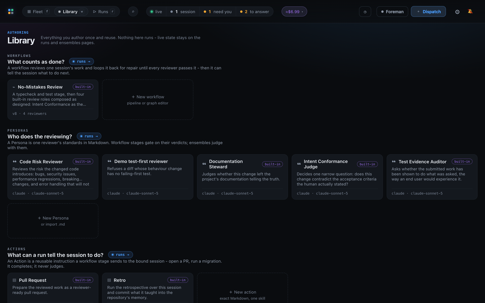

# Mission Control

Mission Control is a local control plane for teams running Claude Code, Codex, and Pi.
It brings the sessions, tasks, conversations, reviews, workflows, and delivery signals
that normally live across terminal panes into one live dashboard.

This repository is internal. It is not licensed for public distribution.

## See the fleet

The fleet view turns a working directory full of agent sessions into an operational board:
what is active, what needs a decision, and what is ready for the next step.


## Dispatch with context

Start a task in the right repository, choose its harness and runtime, and leave it attached
to the backlog and workflow that will carry it through review.

A task can attach more than one repository. Dispatch it and you get **one** agent session
holding all of them in shared context: its working directory is the primary repo's worktree,
each attached repo gets a worktree of its own on the same branch name, and the agent is
granted write access to every one of them. The intent it receives names where each repo
lives and asks for one pull request per repository it actually changes. Claude and Codex
support this; the dispatch modal offers the control only for a harness that does. Multi-repo
tasks are dispatch-only - they cannot be dropped onto an agent that is already running,
because the extra worktrees and the write access to them are granted when a session starts.


## Build the operating system around the work

The Library keeps reusable workflows, personas, session actions, ensemble strategies, and
mission sources together rather than burying them in individual terminals.



## Design reusable review workflows

Workflows and Personas turn the team's review practice into reusable, inspectable building
blocks. The Line keeps their live runs attached to the fleet.


## Coordinate the fleet

Foreman provides configurable operational guidance for the fleet. Inspector keeps shipping
and review state visible beside the work that produced it.


## Quick start

Mission Control needs Node.js 24 or newer.

```sh
git clone <internal-repository-url>
cd ai-harness
make init
npm run dev
```

Open `http://127.0.0.1:5173`. For the desktop shell, demo mode, hooks, state locations, and
the full verification path, use the setup guide below.

## Go deeper

- [Documentation index](docs/README.md) - product behavior, configuration, and feature guides.
- [Architecture overview](docs/architecture.md) - how the daemon, dashboard, integrations, and local state fit together.
- [Contributing](CONTRIBUTING.md) - clone-to-green setup, test layers, and contribution expectations.
- [Security policy](SECURITY.md) - security posture and internal vulnerability reporting.

## Regenerate screenshots

The screenshots above come from the built dashboard in deterministic, token-free demo mode.
After a dashboard change, rebuild and run:

```sh
npm run build
npm run docs:screenshots
```
