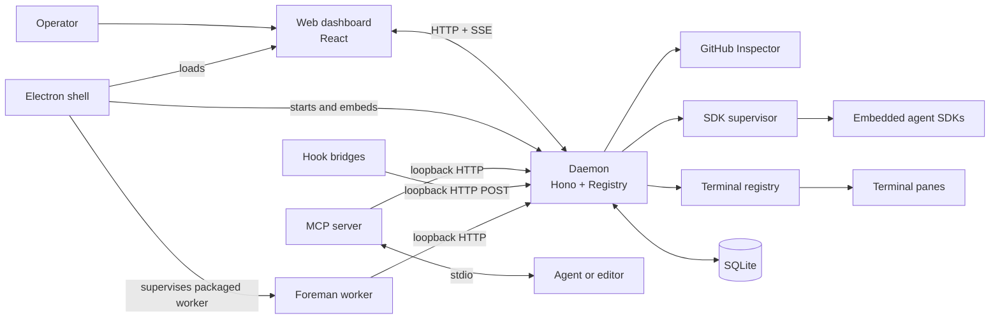

# Architecture overview

Mission Control is a local control plane for coding-agent sessions. Its daemon is the
center of the system: it observes and dispatches work, owns durable state, and publishes
one live view for the dashboard. The surrounding processes deliberately communicate with
the daemon instead of reaching around it.

The diagram is intentionally about ownership, not every module. The daemon is the only
SQLite writer. Browsers receive live changes on a single Server-Sent Events connection;
they do not poll. Foreman and the MCP server are separate processes, but use the daemon's
HTTP interface, so they cannot create competing state writers.

## Components

| Component | Job | Start here |
| --- | --- | --- |
| Daemon | Composes services, serves the loopback API and dashboard, and owns SQLite writes. | [Daemon entrypoint](../src/server/index.ts), [database](database-and-migrations.md) |
| Web dashboard | React interface that reads snapshots and applies live SSE updates. | [Event stream](event-stream.md), [UI reference](ui.md) |
| Electron shell | Starts the local daemon, supervises Foreman in packaged builds, and embeds the built dashboard. | [Desktop shell](desktop-and-packaging.md) |
| Session system | Discovers terminal sessions, supervises embedded SDK sessions, and removes sessions through one lifecycle. | [Session lifecycle](session-lifecycle.md) |
| Dispatch and harnesses | Chooses a runtime and expresses agent and terminal differences through capabilities. | [Dispatch](dispatch-and-runtimes.md), [harnesses](harnesses-and-terminals.md) |
| Work coordination | Runs workflows, personas, session actions, ensembles, tasks, queues, and schedules. | [Workflow system](workflow-system.md), [tasks and schedules](tasks-and-scheduling.md) |
| Foreman and GitHub Inspector | Foreman is an HTTP-only worker; GitHub Inspector is daemon-owned PR review state. | [Foreman](foreman.md), [GitHub Inspector and shipping](inspector-and-shipping.md) |
| Integrations | MCP and hook bridges post facts to the daemon rather than modifying state directly. | [MCP server](../src/mcp/server.ts), [hooks](../hooks/) |

## How to read the technical pages

The pages in this section explain the shape of a subsystem and point to the code that
owns it. They are deliberately not a second set of change rules. Before changing a
subsystem, use the [architecture and lifecycle guide](agent-guides/architecture.md) and
the [change contracts](agent-guides/change-contracts.md) as the authoritative contracts.

For a product-oriented tour instead, begin with the [product overview](overview.md) and
the feature pages in this index.
