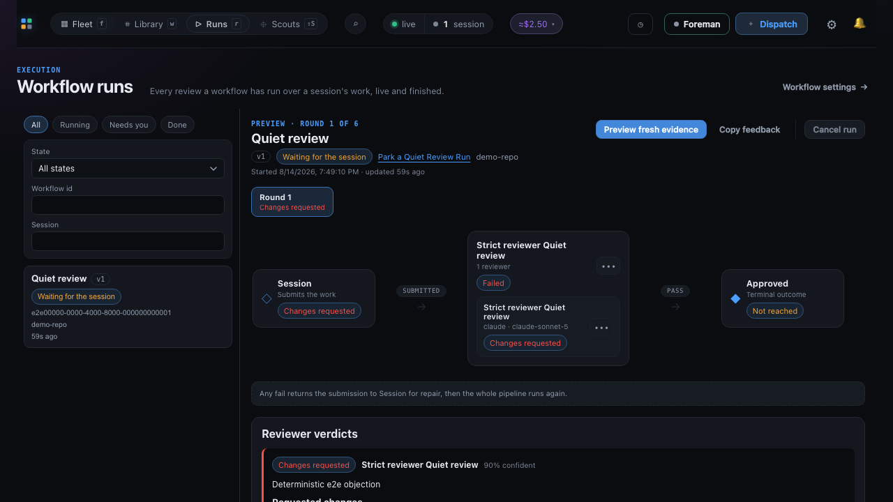
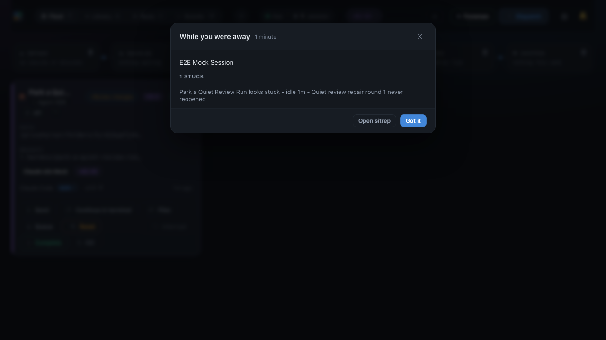
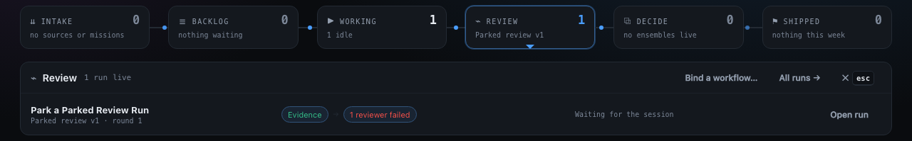
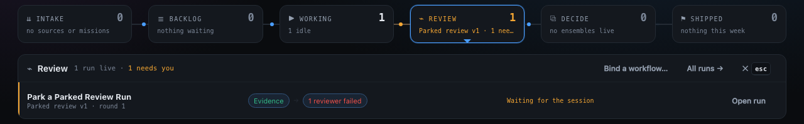
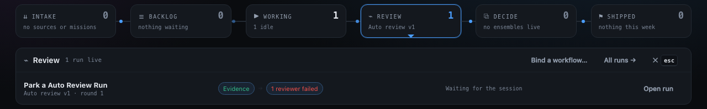

# Attention inbox (one place to drain what needs you)

The topbar's **to answer** count opens the **attention inbox**: one ordered queue holding
everything that is waiting on a person, so nothing depends on catching a toast or noticing a
card. Its sections are fixed and never interleave, because they are different kinds of
obligation:

1. **Decisions** - an ensemble run parked at `awaiting_decision`, with its progress dots and
   **Open dossier**. Nothing else in that run moves until it is answered.
2. **Questions from agents** - every pending [review](sessions.md#review-channel-mcp), grouped by the
   session that raised it and **answered right here**: the same card the per-session review
   modal draws, diff/plan/question and option menus included. A member of an ensemble carries
   its run context on the header line - *Best of N "Fix the parser" - candidate 3 of 5* - so
   whoever answers can tell they are steering one competitor of a comparison.
3. **Members parked on a menu** - an ensemble member sitting on a terminal
   [option menu](sessions.md#answer-a-sessions-menu-from-the-dashboard). Listed, not answered in the
   inbox: it deep-links to the session card, while the member's live lane in the run detail
   also renders the verified pane dialog in place.
4. **Stuck finalizations** - a promotion that stopped on an error.

The count is **answers owed**, not rows: a session holding three questions is one row and
three. It is a rendering of state the dashboard already has - it subscribes to nothing, decides
no severity, and is not a second notifier; [Alerts and Away mode](#alerts--away-mode) still own
what interrupts you. Escape closes it, like every overlay. Per-session entry points are
unchanged: a card's review affordance and a board tile's flag still open that session's own
review modal.

## Roundup

Click **Roundup** for a one-look snapshot of every session, assembled from the same live
data the grid shows: **who needs you** (needs-input, pending reviews, sessions sitting on an
[option menu](sessions.md#answer-a-sessions-menu-from-the-dashboard)),
**who's working** (with their intent + activity), **what's idle**, the **backlog**,
and **recent outcomes**. Dispatch a backlog task, [edit it](dispatch-and-backlog.md#edit-a-shelved-task) by
clicking its name, or drop it right from the panel, and **Mark
done** a running task with its outcome (e.g. "opened PR #123") to close the loop. **Copy as
markdown** yields a paste-able digest (also at `GET /api/report.md`; JSON at `GET
/api/report`).

The ☰ **Backlog** stage on [the Line](ui.md#the-line-the-pipeline-strip-above-the-fleet) used to
open this panel and now opens its own [drawer](ui.md#the-stage-drawers) - the queue in plan order,
which is the narrower thing that button's sentence promises. The drawer's footer escalates
here, because this is still where the backlog is read *against the rest of the fleet*: which
of those queued items is waiting on an agent that needs you, and what finished while you were
looking away. Nothing about this panel changed.

## Alerts & Away mode

So you don't have to watch the grid, the dashboard can **alert you when a session
needs you**. The daemon already streams every attention event over SSE; the browser
turns those into a **desktop (Chrome) notification + a short sound** the moment a
session goes to `needs-input`, a session stops on an
[option menu](sessions.md#answer-a-sessions-menu-from-the-dashboard) (which needs no hooks, and says
how many options it's offering), a review lands, or a
dispatched task fails. It's zero extra tokens - the daemon (not an LLM) does the
watching - and there's no phone/SMS piece; it's the open dashboard tab that alerts.

**Only things blocked on you ever interrupt.** Informational events (a session going
idle, a task finishing) are detected but never notify; they're digest material. Alerts
fire on the *transition* into attention (once, not every tick) and de-dupe, so a
waiting session pings you once. The chime is synthesized with the Web Audio API (no
asset, no network).

### Stuck sessions

The daemon also watches for sessions that have **gone quiet**, which no state
transition can announce - a stall is defined by nothing happening. Four rules, all
deterministic: an instrumented session that claims to be working but hasn't reported
in ~10 minutes; a session idle ~20 minutes with a task or queue still open against it
(the "died with work unfinished" case); a session idle that long with a **workflow run
parked on it**; and a Foreman escalation nobody answered. A stuck session is
attention-level, so it breaks through even while you're away.

The parked-run rule is the backstop for a review loop that quietly stopped. A run
waiting in `waiting_for_session` or `waiting_for_new_head` is waiting on *that session's
next turn*, so a session that took the repair packet, made the fix and went idle has
work outstanding against it even though its task is done and its queue is empty. The
alert names the missing step rather than the silence - "repair round 2 never reopened",
or "waiting for a pushed head" for the GitHub Inspector findings that clear only when the
poller sees a new head **on the remote**.

It deep-links to the **run** rather than to the session, because the run is where that
step is named and where its state can be read. What you can do when you arrive is not a
property of the status alone - it depends on the run's resumption posture, which is the
same distinction the Line uses to decide whether the run is counted as yours:

- **`waiting_for_session` on a `manual` version or a Preview binding** is yours to move.
  Nothing but a human resubmit reopens it, and that control is on this page. These are
  the runs counted as **needing you** from the moment they park.
- **`waiting_for_session` on an `auto` version delivering `live`** is *not* yours, and is
  never counted as such: the resumption observer reopens it seconds after the agent
  settles. Reaching this page from a stuck alert means that observer has been retrying
  and failing for the whole threshold, so the run's own state is the thing to read. A
  manual resubmit is still available; it is simply not the expected move.
- **`waiting_for_new_head`** has no such control at all, under any posture. Nothing on
  this page - or anywhere else in the app - restarts it: it clears only when the
  GitHub Inspector poller observes a new head that the bound session has **pushed**. The deep
  link is context rather than a remedy, and the useful next move is to get that branch
  pushed.

For that second case the daemon goes one step further and says whether the push is
actually the missing step. It reads the bound checkout locally - never fetching, never
pushing, never typing - and when it finds work the remote has not seen, the sentence names
it: *"waiting for a pushed head **and you have 2 commits that are not pushed**"*. That is
the difference between a session that fixed the findings and forgot the last step and one
that did nothing at all, which is otherwise invisible from the daemon's side.

The comparison is the branch's **configured upstream** - `@{upstream}..HEAD`, the commits
the branch it tracks has not received. That is the ref the GitHub Inspector is watching, because
it is the one the pull request points at, so commits that reached some other branch or
some other remote have not reached the thing being waited on.

The upstream is also the gate. A branch that tracks nothing stays silent rather than
being counted from its first commit, because work nobody ever meant to push is not a
forgotten step.

When it cannot make that claim it says nothing extra, and the wording falls back to the
plain wait. A branch that tracks no remote, a detached HEAD, and a git call that failed
are all *unknown* rather than *not pushed* - being told you forgot to push a branch that
was never meant to be pushed sends you looking for a mistake you did not make. A checkout
level with its upstream is also silent, for a subtler reason: that only proves a push is
not the missing step, not that the head the GitHub Inspector wants exists.

The same sentence is what the return digest prints if the stall happened while you were
away, so the desktop toast and the digest line can never describe one stall differently -
both are rendered from the alert the stall produced:

That one is a `waiting_for_session` run, so the line ends "repair round 1 never reopened" -
the missing step is a resubmit. Here is the same card for a run parked on
`waiting_for_new_head` whose checkout is holding work the upstream has not received:

Same card, same rollup, same clock. The only thing that differs is the half of the sentence
that says what to do next - and that half is the whole feature.

Runs that will never resume themselves do not wait for that clock at all. A run on a
`manual` version or a Preview binding is counted as **needing you** on the Line's Review
strip, in the Review drawer and in the palette from the moment it parks, because nothing
but a person moves it.

This is what that rule changed. Both pictures are the same parked run - a `manual` version
on a Preview binding, one failed reviewer, `Waiting for the session`. Before, the Review
stage counted it and said nothing else, and the drawer listed it unmarked, so a run only a
human could move was indistinguishable from one the daemon had in hand:

After, the same run is counted as yours, on the stage and in the drawer, and the row is
marked amber for "your turn":

An `auto` version delivering `live` is the daemon's own to reopen and is never called
yours - the resumption observer picks it up seconds after the agent settles, and saying
otherwise would be telling you to do by hand something already in hand. The run below is
in the identical state, down to the failed reviewer and the "Waiting for the session"
line, and is deliberately left unmarked:

### Away mode

Open the alerts control in the top bar - **🔔** when alerts are on, **🔕** when they're
muted, **🌙** once you're away. The panel is split by what owns each setting. Under
**How you're reached** sit the two delivery channels for this machine, **Desktop
notifications** (with **Enable desktop alerts** above them when the browser has not
granted permission yet - that click also unlocks the chime) and **Sound**. **Away
mode** sits below them in its own card, because it is not a third channel: it is
daemon state that survives closing the tab.

The card always states what would actually happen and names only the channels that are
live. With desktop and sound on, for example, it reads "Blockers interrupt via desktop
and sound; everything else waits in the digest". With **both channels off it says
"Nothing can reach you"** and changes colour, because away mode is not itself a delivery
path - with nothing to interrupt you on it can only hand you a digest when you get back,
and the panel never claims otherwise.

Switch away mode on and the card expands to show how long you have been gone
(`away 1h 04m`), how much has piled up (`7 buffered`), and a **Digest** button that
unfolds a preview of what is waiting. That preview is a *look*: the real digest is
written when you return, and reading it is what consumes it.

While away, anything blocked on you still notifies immediately - everything else
accumulates. When you come back, you get **one card** summarising the window: a couple
of sentences written by Haiku over what actually happened, a deterministic rollup
beneath it ("1 stuck · 3 finished"), and the per-event lines with what needs you
first. Repeats coalesce, so a session that finished twice is one line with a count,
not two notifications. A quiet window produces nothing at all.

Away state lives in the daemon, not the browser, so it survives closing the tab -
which is the case it exists for. The digest is read once; a refresh won't re-announce
it. If the provider is missing or logged out, the narrative is simply absent and the
rollup carries the summary on its own. Which model writes it is
**Settings → [Models](models.md#models-what-the-apps-own-model-work-runs-on) → Away digest**.

The count on the card comes from `GET /api/away/buffer`, a read-only look at the window
still open - deliberately a separate route from `GET /api/away/digest`, which hands the
buffer over exactly once and reports nothing at all until you are back at the desk.
