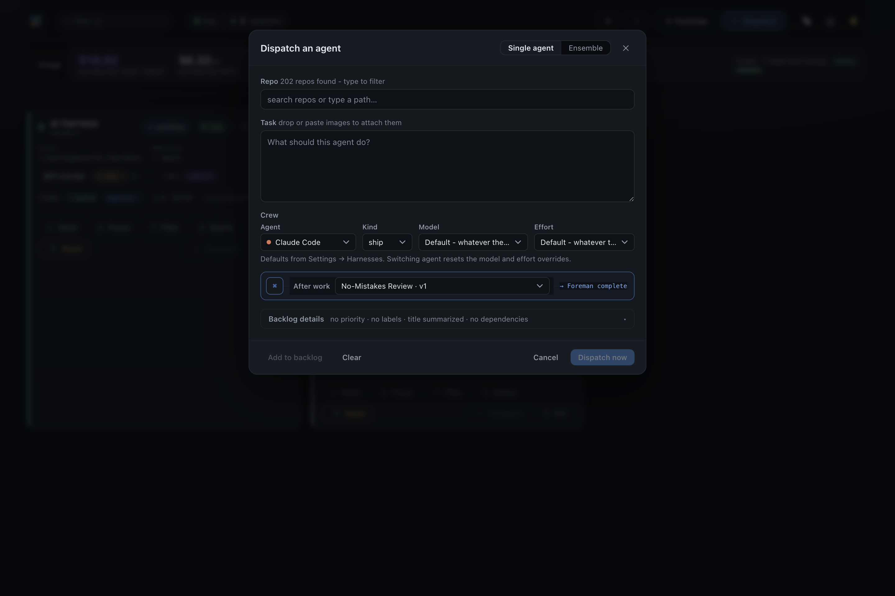
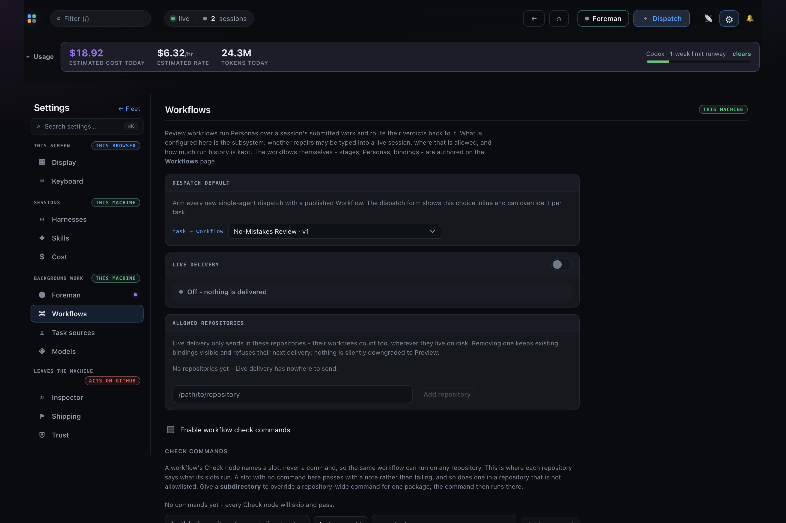

# After-work Workflow UI evidence

Captured from the Mission Control development UI at 1440 × 1000.

## Dispatch quick-select

The Dispatch an agent modal exposes active published Workflows in the **After work**
quick-select and names the **Foreman complete** handoff boundary.

## Workflow dispatch default

**Settings → Workflows** exposes the published Workflow selected as the machine-wide
**Dispatch default**.

