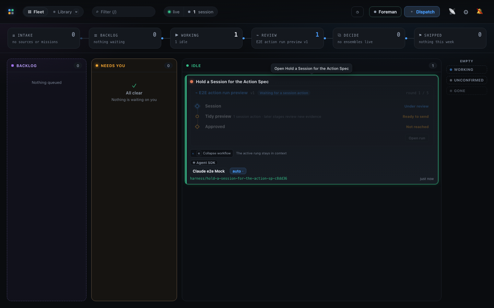
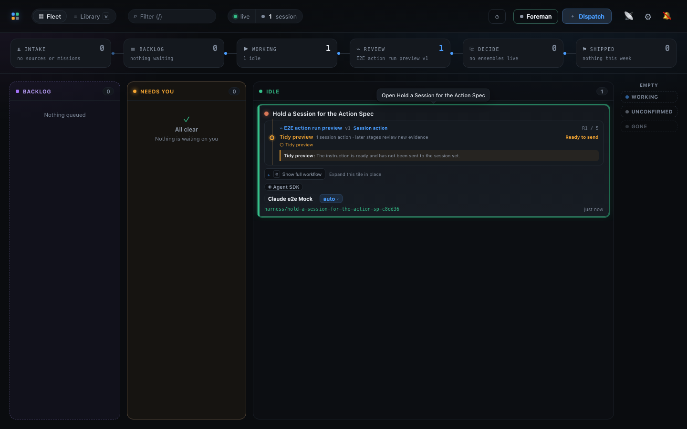

# Board workflow shortcut evidence

Both frames come from the same passing Playwright regression. The selected session card keeps
its keyboard focus outline in each frame, and the Board's columns remain visible across the page,
showing that neither <kbd>e</kbd> press opened session detail.

## First `e`: workflow expanded

The full workflow ladder is visible inside the selected card and the disclosure control reads
**Collapse workflow**.



## Second `e`: workflow collapsed

The same selected card has returned to its compact active-rung preview and the disclosure control
reads **Show full workflow**.



Regenerate both captures from the repository root:

```sh
env -u NO_COLOR FORCE_COLOR=0 MC_E2E_EVIDENCE=1 npx playwright test \
  --config e2e/playwright.config.ts \
  e2e/specs/workflow-session-action-run.spec.ts \
  -g 'e toggles the selected Board workflow card' \
  --reporter=list
```
