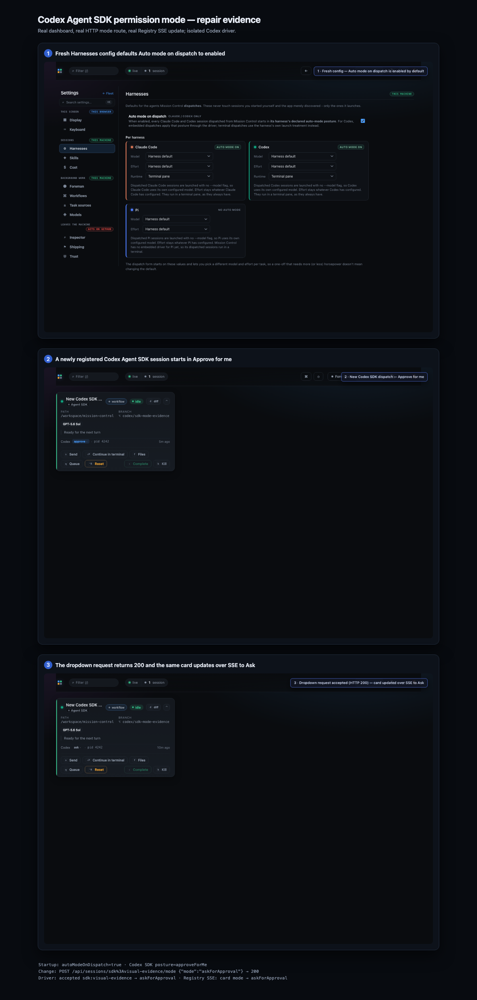

# Codex Agent SDK mode repair evidence

The capture uses the real dashboard, Harnesses configuration schema, `/api/sessions/:id/mode`
route, Registry, and SSE client. The external Codex app-server subprocess is replaced by an
isolated deterministic driver.

Observed sequence:

1. A fresh configuration read returned `autoModeOnDispatch: true`.
2. A new Codex Agent SDK session registered with the harness dispatch posture
   `approveForMe`; its card rendered **Agent SDK** and **approve**.
3. The browser sent the same `POST /api/sessions/:id/mode` request used by the dropdown with
   `{ "mode": "askForApproval" }`. It returned HTTP 200, the driver accepted the mode, the
   Registry emitted a session update, and the same card rendered **ask** over SSE.
