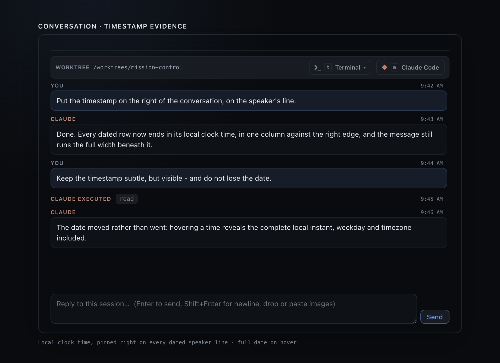

# Conversation timestamp visual evidence

This capture renders the production `TranscriptPanel`, `ConversationTimestamp`, and
`src/web/styles.css` in Electron. The seeded conversation uses fixed local times so the
image demonstrates the per-row format and its placement: the clock alone (`9:42 AM`,
`9:43 AM`), pinned to the right edge of the speaker's line, with each message flowing the
full width beneath it. The date is not dropped, only moved - it is in the hover tooltip and
the accessible description on every row.



To regenerate the capture from the repository root:

```sh
node_modules/.bin/electron scripts/conversation-timestamp-evidence.cjs
```

The capture script waits until both expected timestamped speaker rows exist in the live
DOM before taking the screenshot. Its browser harness is
`scripts/conversation-timestamp-evidence.tsx`.
