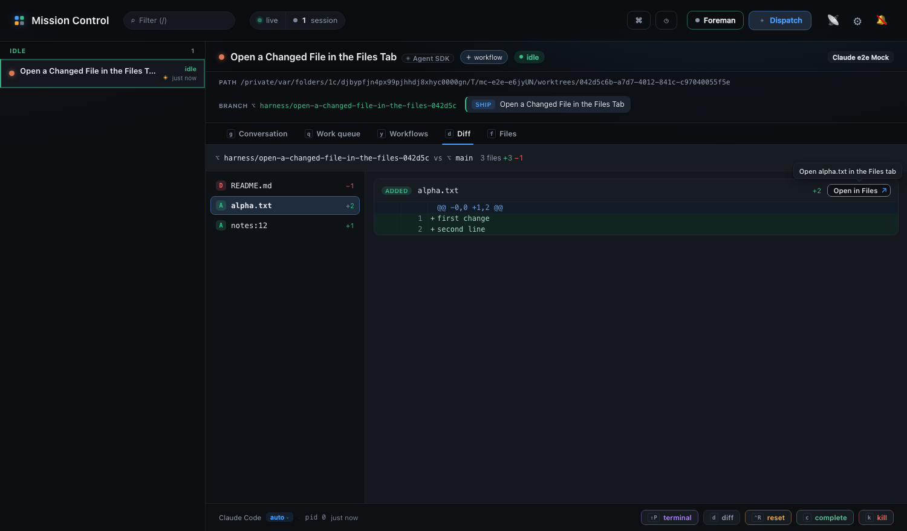
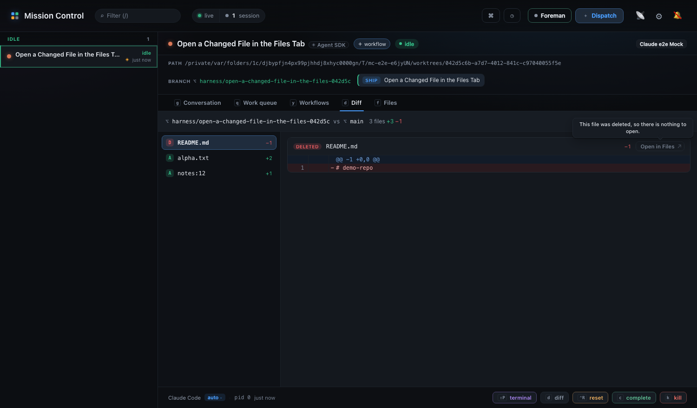
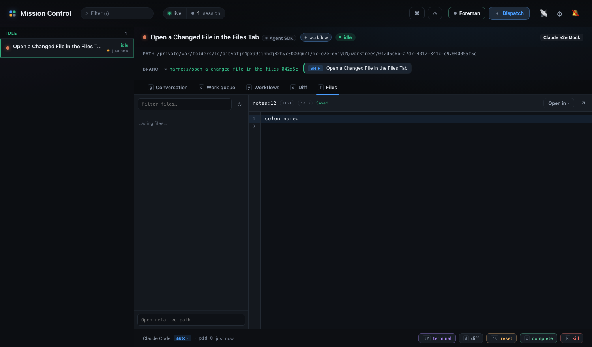

# Open a changed file from the Diff tab in the Files tab

Runtime captures of the `Open in Files` control on the Diff tab's file bar, taken in
Chromium against a live daemon and a real dispatch into a real git worktree. A green
Playwright run leaves nothing behind on its own - `screenshot`, `video` and `trace` are
all configured `on-failure` - so these are the record of the passing states.

The session's worktree carries three changed files and one deletion: `alpha.txt`,
`notes:12`, and a deleted `README.md`.

## The control



`ADDED alpha.txt … +2 [Open in Files ↗]` at the right end of the bar, after the +/−
counts, with the pointer resting on it. The tooltip names the file it will open:
"Open alpha.txt in the Files tab".

## A deleted file



The control is still there on `DELETED README.md` - a control that vanished on some
files would teach that the diff sometimes has no route to the Files tab at all. It is
`aria-disabled`, keeps its border so it reads as a switched-off button rather than
stray text, and its tooltip says why: "This file was deleted, so there is nothing to
open."

## The jump landing



After clicking the control on `notes:12`, the Files tab is selected and `notes:12` is
the open file, showing `colon named`. That filename is the regression case: the
transcript's href parser reads a trailing `:12` as a line number and would have
selected `notes`, which does not exist. A diff path is exact, so it is used as written.

## Regenerating

There is no committed spec for these captures - they were taken with a throwaway spec
driving the same flow as [`e2e/specs/diff-open-in-files.spec.ts`](../../../e2e/specs/diff-open-in-files.spec.ts),
which asserts all three states without needing the images. Run that suite for the
behaviour:

```sh
npm run build
npm run test:e2e -- e2e/specs/diff-open-in-files.spec.ts
```
