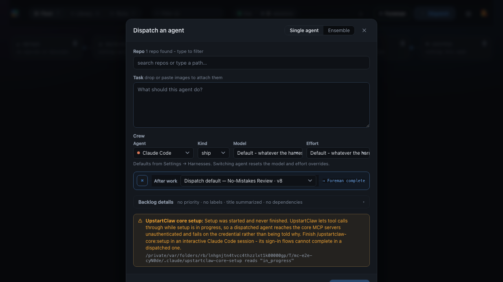
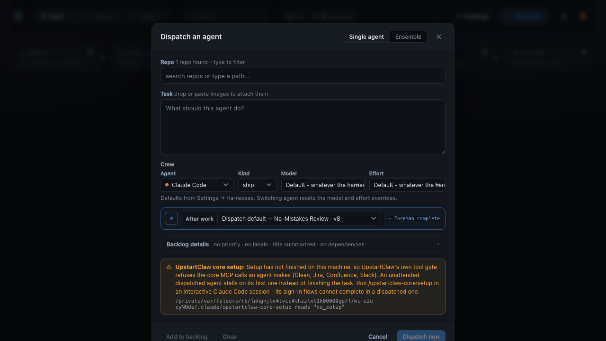

# Dispatch-time environment warning evidence

Captured by `e2e/specs/dispatch-environment-warning.spec.ts` with `MC_E2E_EVIDENCE=1`, against
a daemon whose isolated `HOME` holds an arranged `~/.claude/upstartclaw-core-setup`. The paths
in the monospace line below each note are that temporary home, which is what makes the pictures
reproducible without touching an operator's real one.

Both shots are the same amber note in the same place - last in the dialog body, above the
buttons - carrying two different sentences, because the two states have two different
consequences. The footer is untouched in both: the note informs, it does not gate.

## Setup started and never finished (`in_progress`)

UpstartClaw's own gate lets tool calls through in this state, so the note does not claim a
stall. It says what actually happens: the core MCP servers are reached unauthenticated.

## Setup never ran (`no_setup`, or a missing state file)

The state the gate refuses on - exit 2 for every core MCP call - which is the case an unattended
dispatched agent stalls on.

