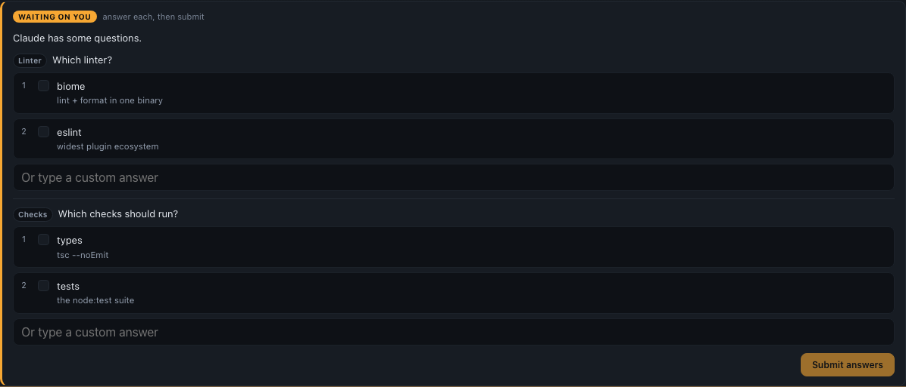
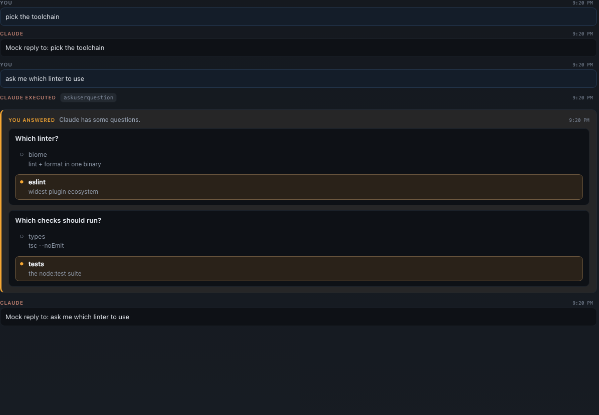
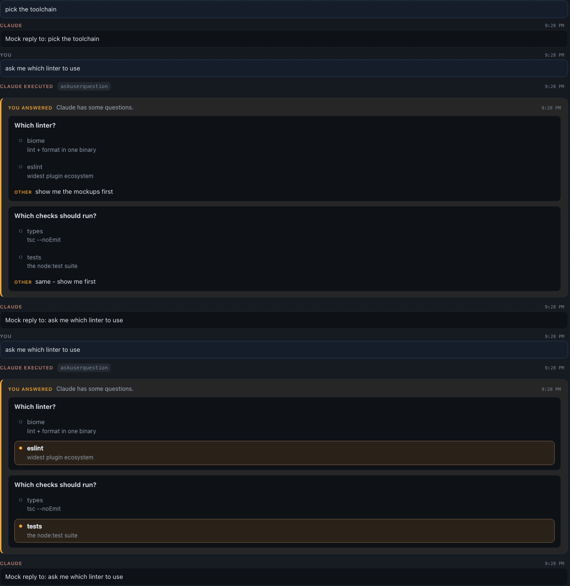

# The agent's own question, and the answer it leaves behind: visual evidence

Both frames are taken inside a passing run of
[`e2e/specs/driver-question-in-conversation.spec.ts`](../../../e2e/specs/driver-question-in-conversation.spec.ts),
on the same run whose assertions surround them. Nothing here is staged: a real dispatched
Agent SDK session, a real `can_use_tool` control request raised over the real vendored SDK,
the real form the dashboard draws for one, the real `POST /api/sessions/:id/submit-options`
route, and the real conversation read back off the SSE stream. Only the model is a fake.

## The question, as asked

A driver form: every question at once, each with its own rows and its own single/multi
choice. The TUI this replaces shows one question at a time as tabs, so a form like this could
never be read off a screen. **Submit answers** stays disabled until every question has an
answer - a half-filled form would put answers the operator never gave under their name.

## The answer, in the conversation

| In the capture | Demonstrates |
|---|---|
| the grey `askuserquestion` chip | what the whole decision used to look like - the chip, then a silence, then the agent acting on something the reader could not see |
| the gold **YOU ANSWERED** entry | the same form replayed: both questions, **every** option, the taken ones (`eslint`, `tests` - deliberately not the first row of either) filled and bolded, the passed-over ones hollow |
| its position **above** `Mock reply to: …` | placed where the operator spoke, not where the record was written. The stamp is read before the answer is handed to the driver; taken afterwards it lands a few milliseconds the wrong side of the turn it released, and the log tells the reader the wrong story about who moved first |
| the 3px gold left rule | `--attention`, the same token the form above wears - so the entry reads as that form answered, not as a new kind of message |

The entry carries no inputs, buttons or textareas. A resolved question cannot be re-answered,
and a control that looks live but does nothing is worse than prose.

## Asked twice, logged twice

The shape a real session took: the operator answered entirely in free text - "I can't see the
mockups, open them for me and re-prompt" - the agent did that and asked the **same** questions
again, and they picked. Two decisions, minutes apart, and the log owes the reader both. The
first is what explains why the second exists.

Worth a capture of its own because the plausible ways to get this wrong all look reasonable.
Keying the record on the request id, on the session's note key, or on the question text would
each have let round two overwrite round one, leaving a conversation that claims the operator
answered once - and the surviving entry would have been the *less* informative of the two.
Each round is its own row, distinguished by nothing but its own identity.

Note also what the first entry does with a question nobody picked an option for: it draws
every option unmarked and prints the typed answer under an **Other** tag, rather than
reporting the round as a dismissal. Answering in prose is still answering.

## Why it exists

The answer had nowhere else to go. It reaches the agent by resolving the `canUseTool`
callback its turn is blocked on, and the only trace it leaves in the transcript is a user
record that is purely a `tool_result` - which `harness/claude/transcript.ts` drops as machine
noise ("A user turn that's purely a tool result is machine noise, not conversation").

The identical question asked over the MCP review channel has left a permanent record since
[#358](../review-answers-in-conversation/README.md); a session on the Agent SDK runtime keeps
Claude's built-in `AskUserQuestion` deliberately (`claude/sdk.ts`) and left none. The daemon
now records an answered driver question as an already-resolved `input` review
(`server/sdk/answered-question.ts`), so both channels feed the one card, the one merge rule
and the one "whose voice is this" test rather than growing a second of each.

Only **questions** are recorded. Permission prompts, plan approvals and trust checks are
answered dozens of times an hour on an auto-mode session, none of them chose between
anything, and the next turn states the outcome anyway.
