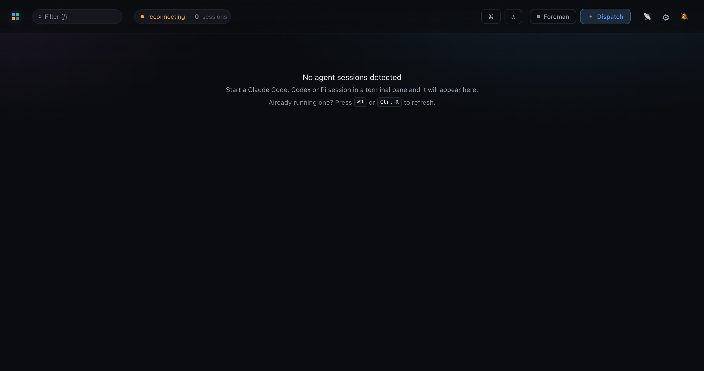
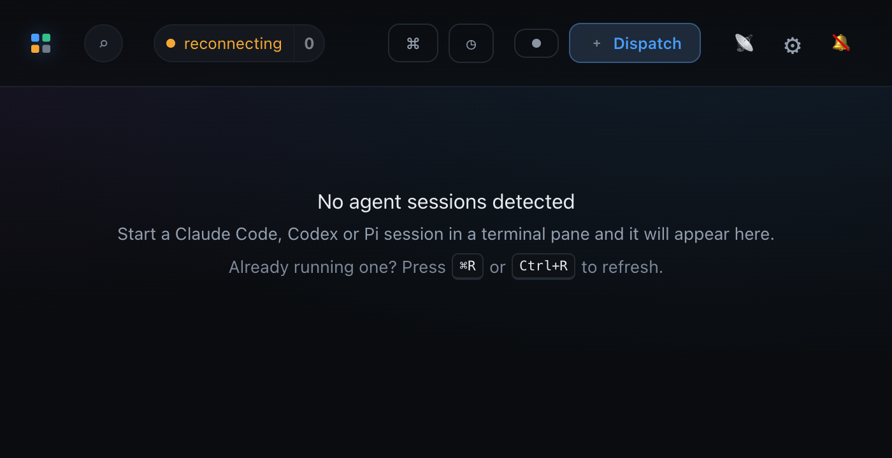

# The refresh hint on the empty fleet

Both frames are the live web app served from this worktree's own Vite on port 5199 - not
the `:5173` main checkout - driven over CDP. The proxy was pointed at a port with no
daemon behind it (`MISSION_PORT=7999`), which is what produces the state this hint was
added for: the topbar reads **reconnecting** with **0 sessions**, and because the fleet
holds no sessions the empty screen renders. Nothing about the empty state was staged; it
is the ordinary `sessions.length === 0` branch.

That is the case the hint exists to answer. A stream that dropped and a fleet that is
genuinely idle draw the identical screen, so an operator who *does* have agents running
sees "No agent sessions detected" and has no way to tell which one they are looking at.
The third line names the way out.

## In context, at 1440 × 760

The hint sits under the existing instruction, dimmer (`--dim`) and 10px below it, so it
reads as a fallback rather than a second thing to do. The `reconnecting` pill in the
topbar is the condition that makes it worth reading.

## Close up, at 700 × 360

The two keycaps use the app's existing `kbd` styling. They are raised 2px off the
baseline so their boxes center on the sentence's letters instead of hanging low against
them - measured in the page, the text line box and both caps share a center of 209.5px.

Both spellings appear because the dashboard is served to a browser on any platform as
well as to the Electron shell: `⌘R` in the macOS keycap convention, `Ctrl+R` spelled out
for everyone else.

## The shortcut is real in the packaged app too

In a browser this is the native reload. In Electron it works because `src/main/menu.ts`
installs `{ role: "viewMenu" }`, whose stock Reload item carries the `CmdOrCtrl+R`
accelerator - so the sentence is accurate in both places the dashboard runs.
