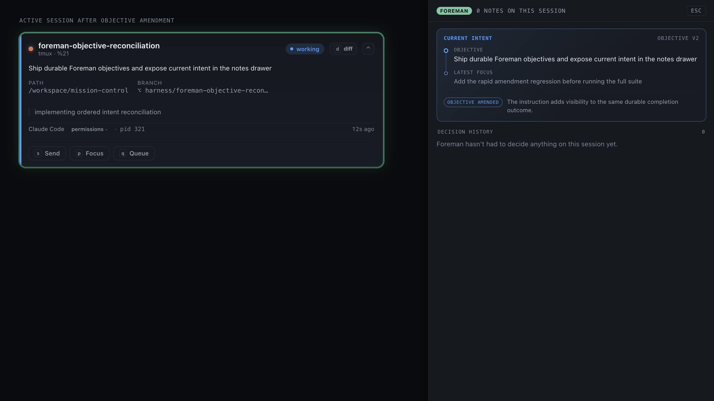

# Foreman intent reconciliation evidence

This capture renders the production `SessionCard` and `ForemanDrawer` components together
after a mid-session amendment has resolved. It shows the amended Goal text on the active
session card and the drawer's Current intent section with the same objective, the latest
tactical focus, the `objective amended` relationship, its rationale, and objective version 2.
