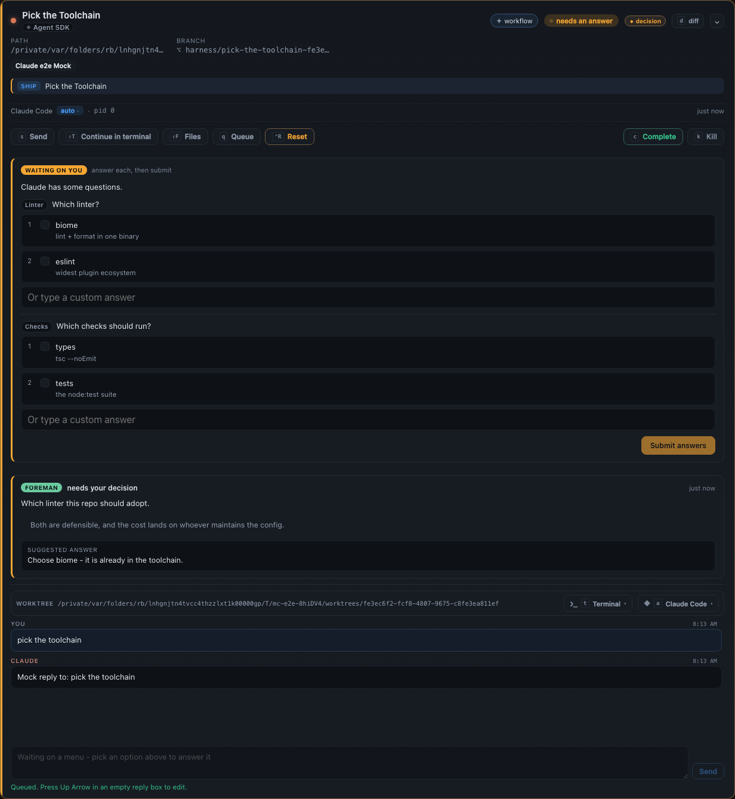
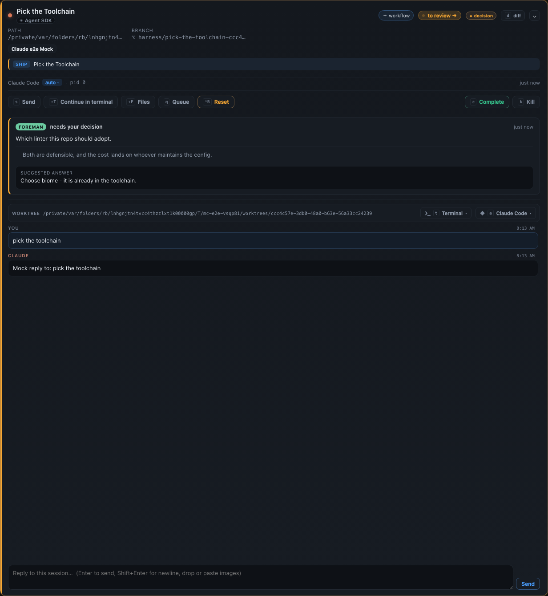
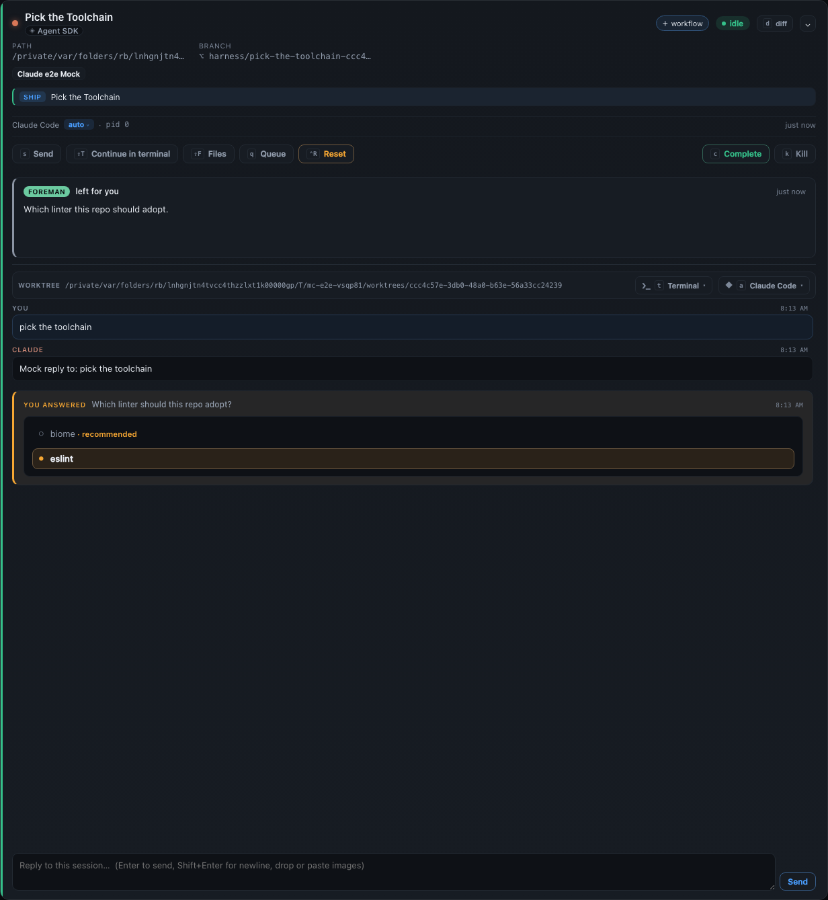

# A decision you already made stops being asked of you: visual evidence

Every frame is taken inside a passing run of
[`e2e/specs/foreman-note-retires-on-your-answer.spec.ts`](../../../e2e/specs/foreman-note-retires-on-your-answer.spec.ts),
on the same run whose assertions surround it. Nothing is staged: a real dispatched Agent SDK
session, a real `can_use_tool` request raised over the real vendored SDK, a real review posted
over the real `POST /mcp/reviews` channel, a real note written through
`PUT /api/sessions/:id/note`, real clicks on the real forms, and the card read back off the
real SSE stream. Only the model is a fake.

This bug was reported as a screenshot, so it is answered with screenshots. Route-level and
registry assertions can prove the row changed; only a frame can show a reader that the banner
went.

## The reported state



One card, two claims on the same person. The amber form is the agent's own
`AskUserQuestion`, and the panel beneath it is Foreman's escalation **about that same
question** - its marker is a `dialog:` digest of the very menu above it. Note the header
chips: **needs an answer** *and* **decision**.

What made this worse than untidy is what the marker could not say. `deliveryTarget` only
recognises staleness on a `review:` marker, so on this surface it returned "there is somewhere
to send this" and drew a live **Approve & send** - and on the driver runtime approving delivers
by *injecting* the text as a new prompt. The button offered to type Foreman's answer into a
session that already had yours.

## After one answer, and no Dismiss


The **Submit answers** click is the only thing that happened between these two frames. Nothing
on the Foreman panel was touched.

| In the capture | Demonstrates |
|---|---|
| no **SUGGESTED ANSWER**, no brief | the recommendation is no longer offered for a question that is closed. Both survive on the episode, which is where a finished decision belongs |
| no **Approve & send**, no **Dismiss** | the dangerous control goes with it. This is the click the operator used to have to make |
| the chips gone, header `idle` | the card no longer reports a person as owing anything |
| the gold **YOU ANSWERED** entry | `eslint` and `tests` - deliberately *not* what Foreman recommended. The note is retired because the ask is closed, not because the operator agreed |

## The same rule on the review channel





The other channel a session asks through, where the note carries a `review:<id>` marker. Here
the dashboard *could* tell the note had gone stale, and said so - "The question this answers
has already been resolved, so there is nothing left to send it to", with a **Dismiss** as its
only remaining control. An explanation of a spent note is not a substitute for clearing it, so
the second frame asserts that sentence is absent too, not merely that Approve is.

Two notes were sitting in this state on a real 30-day database when the bug was reported,
against a `plan` whose operator had approved it and a `plan-decisions` they had answered hours
earlier.

## What these frames also show, and this change does not fix

Both "after" frames keep a **`FOREMAN · left for you`** panel carrying a bare purpose line
over roughly 90px of empty space. Two pre-existing warts, visible here because this change
makes the retired state routine where it previously took a deliberate Dismiss:

- **The label is misleading on this path.** `left for you` is `DISPOSITION_LABEL.skipped`,
  which is right for a note Foreman declined to answer and wrong for one *you* answered.
  The note already records the truth in `lastAction` (`you answered this yourself`); the card
  renders its `✓` audit line only for `answered`.
- **The dead space is a min-height.** `.card.expanded .foreman-note { min-height: 120px }` is
  sized for a panel carrying a brief and a recommendation; a retired note has neither.

Neither is a regression - clicking **Dismiss** has always produced this exact state - and
both touch a shared label vocabulary and the expanded card's measured layout, so they are
left for a change of their own rather than folded into a bug fix.

## Regenerate

```sh
env -u NO_COLOR FORCE_COLOR=0 MC_E2E_EVIDENCE=1 npx playwright test \
  --config e2e/playwright.config.ts \
  e2e/specs/foreman-note-retires-on-your-answer.spec.ts \
  --workers=1 --reporter=list
```

Actual output from the captured run:

```text
Running 4 tests using 1 worker

CAPTURED docs/evidence/foreman-note-retires-on-your-answer/note-pinned-beside-the-open-question.png
CAPTURED docs/evidence/foreman-note-retires-on-your-answer/note-retired-after-your-answer.png
  ✓  1 … › answering the agent's own question retires the note pinned on it (5.0s)
  ✓  2 … › the drafted reply's Approve button goes with it (3.6s)
CAPTURED docs/evidence/foreman-note-retires-on-your-answer/review-note-pinned.png
CAPTURED docs/evidence/foreman-note-retires-on-your-answer/review-note-retired.png
  ✓  3 … › answering the review channel's question retires it too (2.9s)
  ✓  4 … › a note about a DIFFERENT ask is still yours to decide (3.6s)

  4 passed (15.8s)
```
