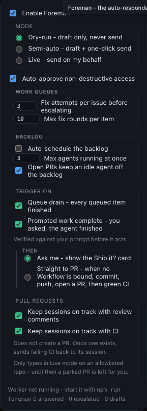

# Foreman PR follow-through evidence

This directory records the built-dashboard and focused behavior evidence for splitting
Foreman's pull-request follow-through controls.

[Open the reviewer-renderable Foreman settings capture](foreman-settings.html).

The Playwright evidence path produces two renderings of the same asserted built-dashboard
state. `foreman-settings.png` preserves its pixels. `foreman-settings.html` serializes the
actual dialog DOM, including live checked states, and links the dashboard's real stylesheet so
workflow evidence can carry and render the visual instead of reporting only a binary diff.



`foreman-settings.png` is captured after the browser has asserted the visible state. Under
**Then**, only **Ask me** and **Straight to PR** remain. Under **Pull requests**, review
comments and CI are independent controls, and the CI copy says that it does not create a PR.

[`browser-transcript.txt`](browser-transcript.txt) is the focused Playwright run that produced
that image. [`behavior-transcript.txt`](behavior-transcript.txt) records the focused worker
and policy tests proving that:

- a claimed Workflow suppresses Straight to PR;
- a Manual Workflow binding suppresses Straight to PR and raises the human choice instead;
- CI follow-through requires an existing open PR; and
- an existing combined-control opt-out migrates to both new controls.

Regenerate the browser evidence after `npm run build` with:

```sh
env -u NO_COLOR FORCE_COLOR=0 MC_E2E_EVIDENCE=1 npx playwright test \
  --config e2e/playwright.config.ts \
  e2e/specs/dispatch-and-converse.spec.ts \
  -g 'Foreman removes automatic review and separates CI follow-through' \
  --workers=1 --reporter=list
```

Regenerate the behavior evidence with the focused commands recorded in
`behavior-transcript.txt`.
