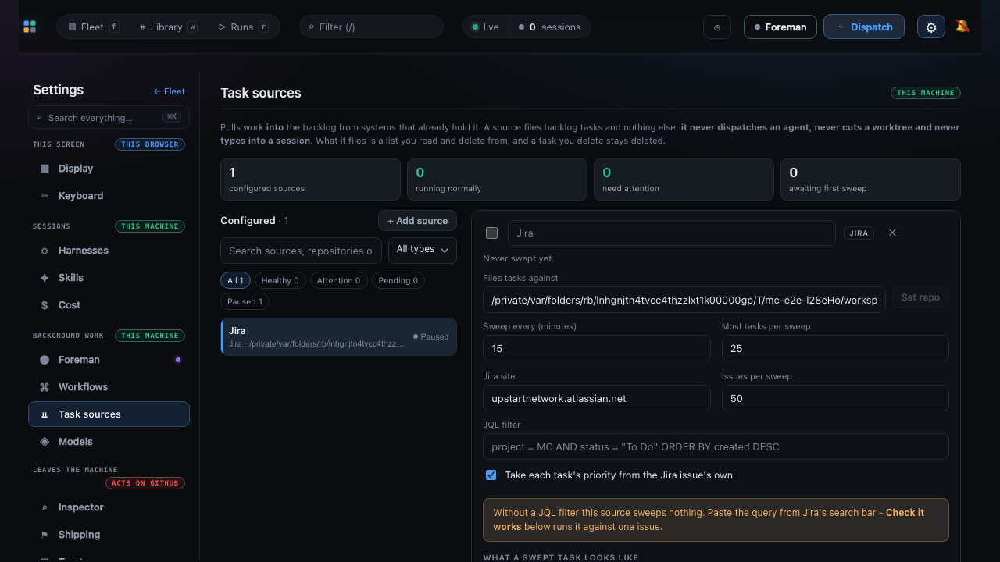
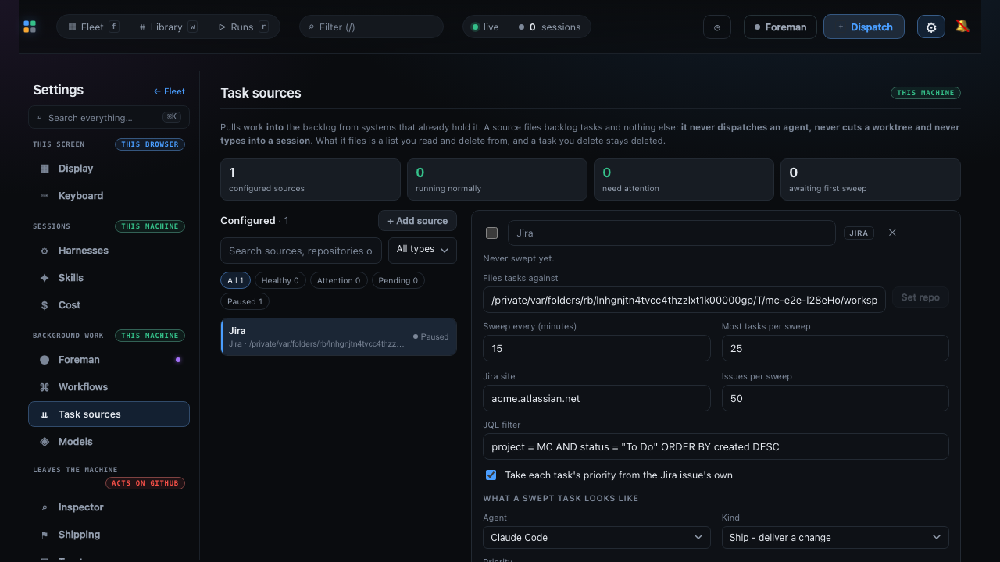
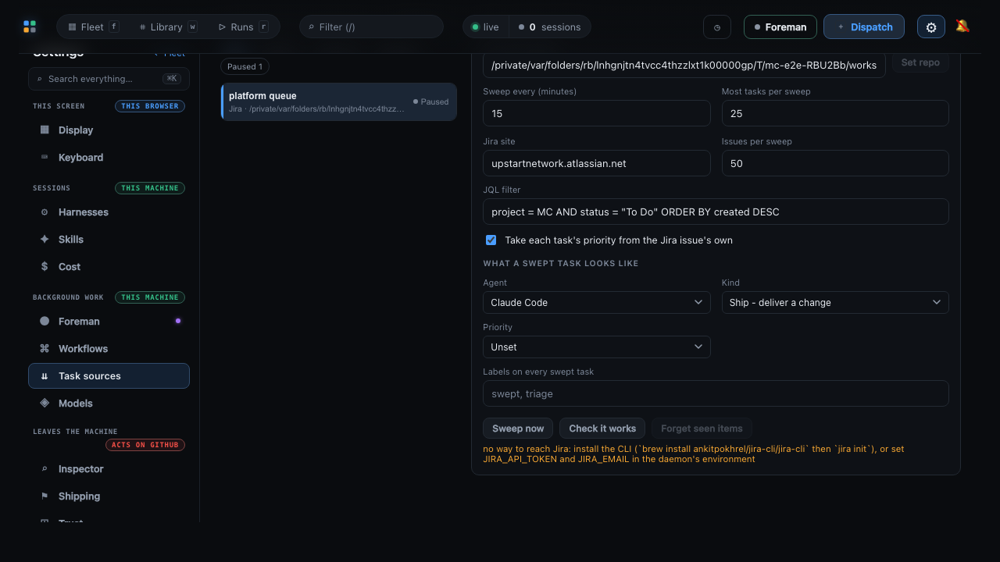

# Jira task source evidence

Three frames from the same passing browser regression
(`e2e/specs/settings-task-sources-jira.spec.ts`). Every assertion the spec makes had already
passed when each was taken.

They answer what only a picture can. The spec can prove a field exists, holds a value, and
survives a reload; it cannot show that the Jira group sits in the same rhythm as the rest of
the card, or that the sentence naming a missing credential is somewhere a person will
actually read it.

## The kind an operator has just added

Switched off, pointed at a repo, and carrying the shipped site default with no filter yet.
The amber panel is the state this whole feature exists to make impossible to miss: a source
that is configured enough to store and would sweep **nothing**, which is indistinguishable
from a filter with no matching issues once it is running.



## The same source, configured

Site and filter set and read back after a full page reload, so what is on screen came from
the daemon rather than from component state. The field group tiles into the card's existing
two-column rhythm - the wide JQL field is deliberately **last** of the inputs, since a wide
field anywhere earlier leaves a half-empty row above it, and this puts the query directly
over the warning and the priority switch that are both about it.



## A missing credential, named where it was asked for

`Check it works` on a source with no way to reach Jira. The sentence names **both** fixes -
install the CLI, or set `JIRA_API_TOKEN` and `JIRA_EMAIL` - and it is the frame two fixes in
this change were made for:

- It sits **below the buttons**, where the note used to render at the top of a card that is
  taller than the pane, so the answer to a question asked at the bottom arrived off screen
  above it.
- It is in the **error tone**. In the dim hint colour it shared with "Forgotten - the next
  sweep will file these items again", a broken credential read as reassurance.



Regenerate all three from the repository root (a successful `npm run build` first - this
suite drives `dist/`):

```sh
env -u NO_COLOR FORCE_COLOR=0 MC_E2E_EVIDENCE=1 npx playwright test \
  --config e2e/playwright.config.ts \
  e2e/specs/settings-task-sources-jira.spec.ts \
  --workers=1 --reporter=list
```

`--workers=1` keeps the two tests' `CAPTURED` lines from interleaving. The repo paths visible
in the frames are the throwaway fixture's temp directory, and differ on every run.
