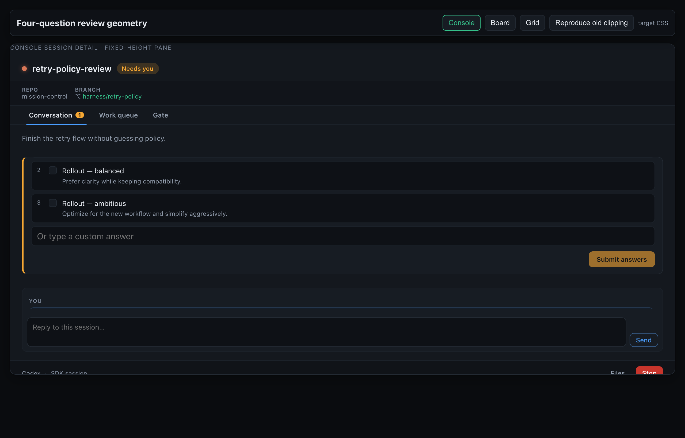
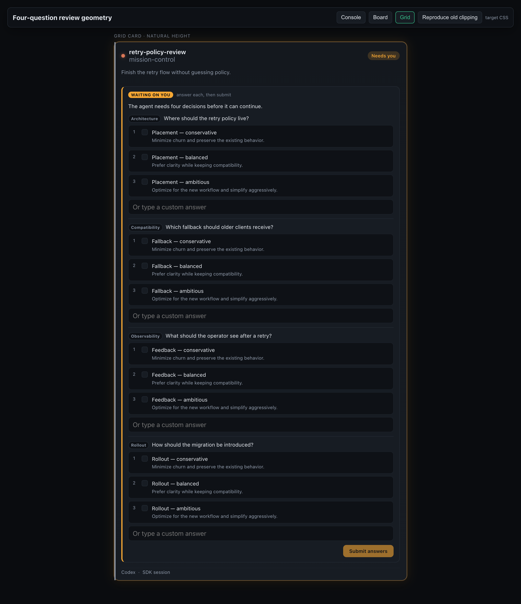

# Pane-dialog scroll evidence

Captured at 1280 × 820 from the browser evidence harness using the production
`PaneDialogPrompt` four-question form and `src/web/styles.css`.

## Console detail: Submit is reachable

The fixed-height Console detail form is scrolled to its bottom. **Submit answers** is
inside the visible review panel, while the transcript/reply surface and fixed footer
remain in place below it.

Measured in this capture, the 1,167 px form uses a 218 px scroll viewport and reaches
Submit at `scrollTop: 949`; the button is inside both the dialog and detail-body bounds.

## Grid card: natural height is preserved

The same four-question form remains uncapped in Grid. Its `clientHeight` and
`scrollHeight` are both 1,167 px, with `overflow-y: visible`, so the detail-only fix
does not introduce a second internal scroll surface on cards.

