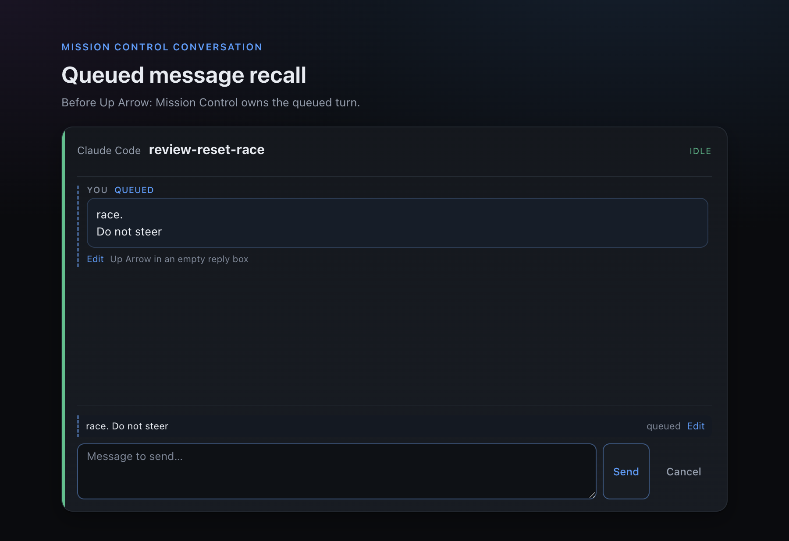
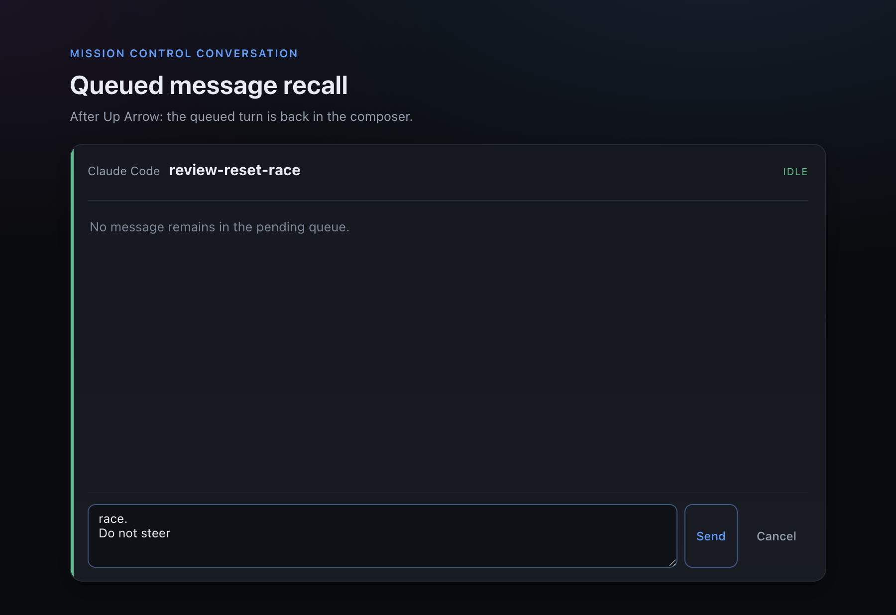

# Queued message recall evidence

These captures come from the Electron regression fixture using the production
`PendingTurnView`, `ActionBar`, pending-turn API client, keyboard handler, and stylesheet.
They show the two observable states required by queued-message recall.

## Queued conversation turn

The complete multiline message is visible as a conversation turn labeled **You** and
**queued**. The compact Send surface below it shows the same pending row and its Edit action.



## Recalled with Up Arrow

The fixture focuses the empty compact composer and dispatches <kbd>↑</kbd>. The API recall
removes the pending turn, and the exact multiline text returns to the textarea.



Regenerate both captures from the repository root:

```sh
MISSION_PENDING_TURN_EVIDENCE_DIR=docs/evidence/pending-turn-recall \
  node --test --import tsx test/pending-turn-recall-electron.test.ts
```
