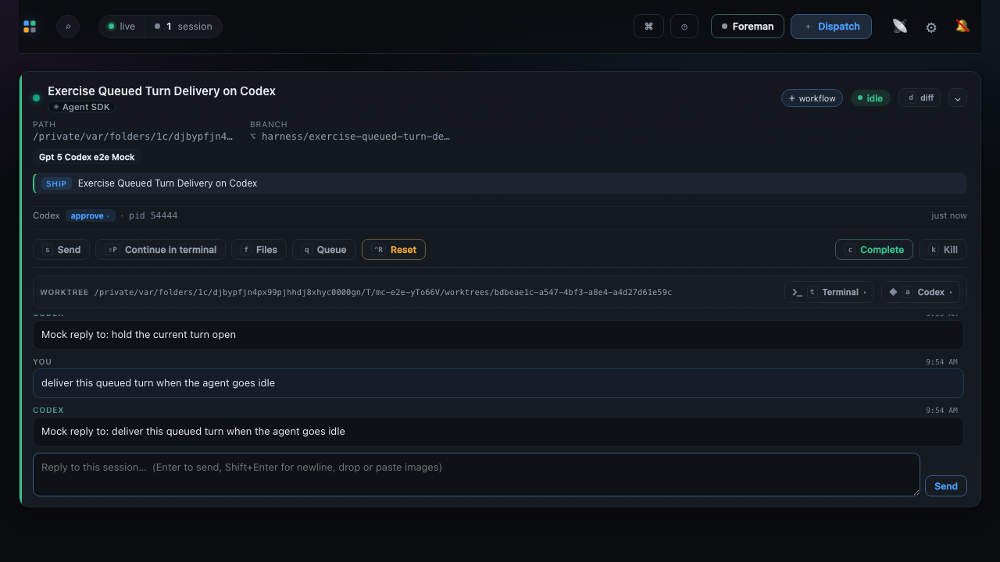
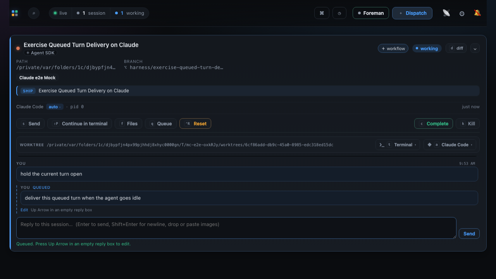
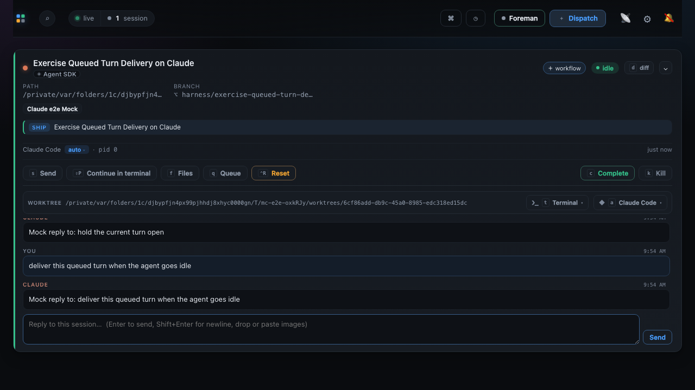
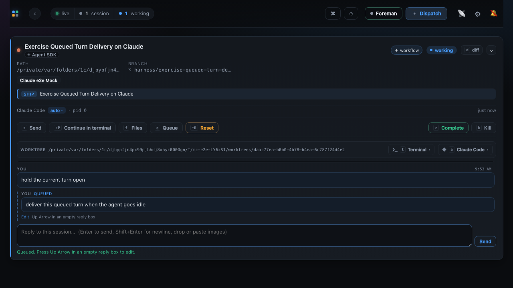
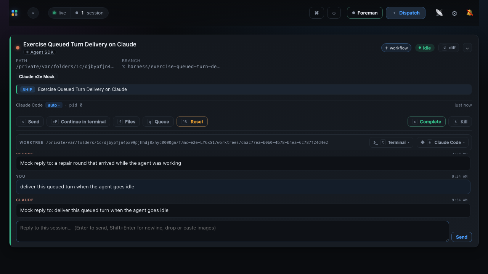
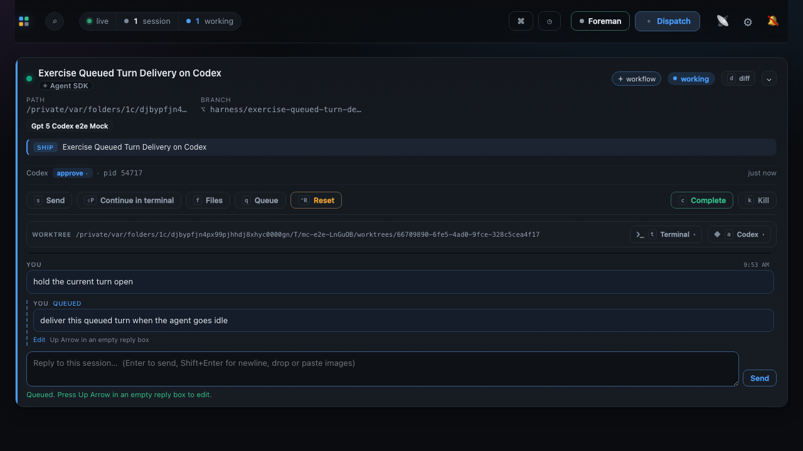
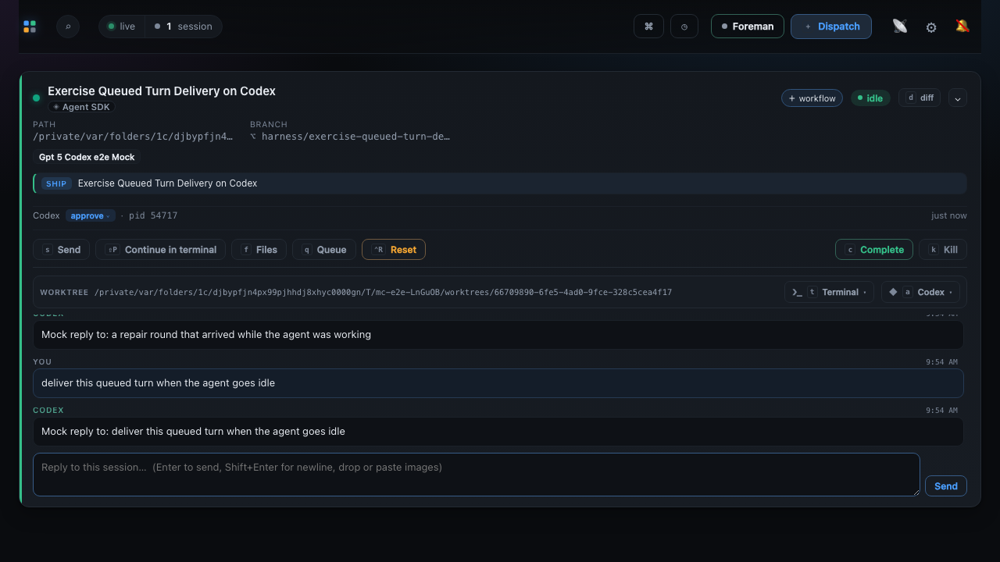

# Queued turn delivery evidence

Eight frames from one green run of `e2e/specs/queued-turn-delivery.spec.ts`, taken between the
assertions that spec already makes. They are photographs of the run that passed, not of a
scripted walk staged to look like it: the same test that asserts the row leaves takes the
pictures, so a frame exists only because the assertions under it held.

Two scenarios, two moments each, on both harnesses. The first pair is a queued turn delivered
on an ordinary idle transition. The second is the same delivery after the driver has already
taken a message mid-turn, which is a separate defect with the same symptom - see
[After a mid-turn message](#after-a-mid-turn-message).

The spec runs the identical flow against **both** embedded harnesses. That pairing is the
point rather than thoroughness for its own sake: the fix rests on the claim that the outbox
never branches on the agent, and two harnesses arriving at the same frames is how that stops
being a code-reading argument. Both drivers fold a message sent mid-turn into the turn already
running - Codex through `turn/steer`, Claude Code by attaching it to that turn - and the row
has to survive the idle transition on each.

The behaviour is the fix for a queued conversation turn that never left the editable outbox on
an Agent SDK session. The outbox armed its delivery timer only when the session was already
*settled* idle, but a driver reports idle with `lastActivity` set to that same instant, so a
session is never settled at the moment it announces going idle. The one event that should have
armed the timer cancelled it instead. An embedded session has no poller to ask again, so the
row stayed queued for the life of the session.

## Codex

The fake holds `hold the current turn open` for five seconds, so the second message meets a
genuinely busy driver and lands in the durable outbox. The card reads **working**, the held
turn is a real `YOU` turn, and the queued message is a `YOU · QUEUED` row with its **Edit**
affordance. This state is legitimate and expected - it is the state the bug never left.


The held turn finishes, the driver emits its single idle transition, and the settle window
elapses. The queued row leaves the outbox as an ordinary `YOU` turn - no `QUEUED` badge, no
pending styling - and Codex answers it. The card reads **idle**.



Before the fix the second frame never arrived: the reply to the held turn appeared, the card
went idle, and the `QUEUED` row from the first frame simply stayed there.

## Claude

The same two moments on the other embedded harness.





## After a mid-turn message

The same delivery, on a session that has already taken a message mid-turn. A workflow repair
round, a Foreman recommendation and a work-queue instruction all reach a live session through
the direct acknowledged path rather than the outbox, so they are the one thing that hands a
driver a message while a turn is running. The spec injects on that path, then types.

Claude's driver used to report that as `queued` and reserve a second completion for it. Only
one ever arrived - both harnesses answer an absorbed message inside the turn that took it - so
one reservation stayed outstanding for the life of the session. From that moment `sendIfIdle`,
the outbox's only door, was shut. The card still went idle, because a Stop hook says so
independently of the driver, which is why this reads as a session that is idle and silently
refusing to be spoken to.

The stranded state. The card is **working**, the held turn is a real `YOU` turn, and the
operator's message is a `YOU · QUEUED` row. Legitimate here - the driver is genuinely busy.



The recovery, and the frame the fix is about. The injected message has its answer, the queued
row has left the outbox as an ordinary `YOU` turn with a reply under it, and the card reads
**idle**. Before the fix the first two arrived and the third never did: the `QUEUED` row stayed
on screen, and every later message the operator typed was released with *"The agent became busy
before delivery."*



Codex reaches the same two frames, and did so before this fix as well - its driver already
reported the steer. That asymmetry is the fix in one line: run the spec against the unfixed
driver and the Codex case passes while the Claude case fails on the outbox being empty.





## The run

Verbatim, from the repository root after `npm run build`:

```
$ MC_E2E_EVIDENCE=1 npx playwright test --config e2e/playwright.config.ts specs/queued-turn-delivery.spec.ts --reporter=list

Running 4 tests using 4 workers

  ✓  3 … :63:1 › a queued conversation turn is delivered once the codex agent goes idle (18.2s)
  ✓  2 … :124:1 › a queued turn still lands after the codex driver takes a mid-turn message (18.7s)
  ✓  1 … :63:1 › a queued conversation turn is delivered once the claude agent goes idle (19.5s)
  ✓  4 … :124:1 › a queued turn still lands after the claude driver takes a mid-turn message (20.1s)

  4 passed (21.5s)
```

That command also regenerates all eight PNGs. Without `MC_E2E_EVIDENCE` the spec asserts
exactly the same things and writes nothing, so an ordinary `npm run test:e2e` does not rewrite
the binaries - the same bargain `docs/evidence/workflow-session-action-authoring/` strikes.

## That these frames are load-bearing

Restore the pre-fix manager and run the first two tests, and both fail on the assertion that
the outbox is empty - Codex included:

```
$ git show 32fccb43:src/server/pending-turns.ts > src/server/pending-turns.ts && npm run build
$ npx playwright test --config e2e/playwright.config.ts e2e/specs/queued-turn-delivery.spec.ts

  ✘  1 … › a queued conversation turn is delivered once the claude agent goes idle (24.5s)
  ✘  2 … › a queued conversation turn is delivered once the codex agent goes idle (25.0s)
    Error: expect(locator).toHaveCount(expected) failed

  2 failed
```

The mid-turn pair separates on the driver instead, which is the sharper statement: restore the
pre-fix Claude driver and Codex still passes, because its driver already reported the steer.

```
$ git checkout origin/main -- src/server/harness/claude/sdk.ts && npm run build
$ npx playwright test --config e2e/playwright.config.ts specs/queued-turn-delivery.spec.ts \
    -g "driver takes a mid-turn message"

  ✓  2 … › a queued turn still lands after the codex driver takes a mid-turn message (11.6s)
  ✘  1 … › a queued turn still lands after the claude driver takes a mid-turn message (25.1s)
    Error: expect(locator).toHaveCount(expected) failed
    Locator: locator('article.card').first().locator('.pending-turn')
    Expected: 0
    Received: 1

  1 failed
  1 passed (26.1s)
```

`Received: 1` is the `YOU · QUEUED` row still on screen - the operator's message, still in the
outbox, on a session that has gone idle and will never take it.

## Neither run spends a token

Both sessions are driven by fakes. `e2e/fixtures/fake-codex.mjs` speaks `codex app-server`
JSON-RPC over stdio and writes the rollout JSONL the dashboard renders the conversation from;
`e2e/fixtures/fake-claude.mjs` does the equivalent for Claude's control protocol. The cards
above are real embedded sessions - real subprocess, real pid, real `bound` event, real
transcript file - with no model behind either of them.
