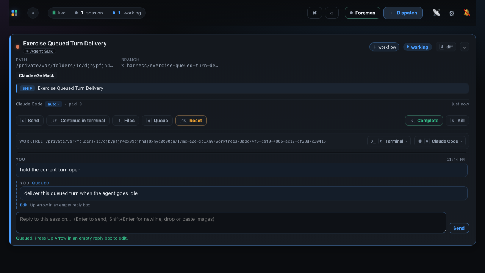
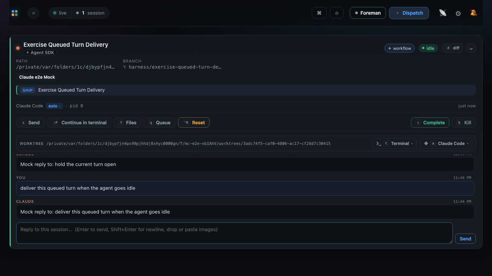

# Queued turn delivery evidence

Both captures come from one green run of `e2e/specs/queued-turn-delivery.spec.ts`, taken
between the assertions that spec already makes. They are photographs of the run that passed,
not of a scripted walk staged to look like it: the same test that asserts the row leaves is
the one that takes the pictures.

The behaviour they prove is the fix for a queued conversation turn that never left the
editable outbox on an Agent SDK session. The outbox armed its delivery timer only when the
session was already *settled* idle, but a driver reports idle with `lastActivity` set to that
same instant, so a session is never settled at the moment it announces going idle. The one
event that should have armed the timer cancelled it instead. An embedded session has no
poller to ask again, so the row stayed queued for the life of the session.

## Queued while the driver is working

The fake holds `hold the current turn open` for five seconds. The second message meets a
genuinely busy driver, so it lands in the durable outbox: the card reads **working**, the held
turn is a real `YOU` turn, and the queued message is a `YOU · QUEUED` row with its **Edit**
affordance. This state is legitimate and expected - it is the state the bug never left.



## Delivered and answered once the session goes idle

The held turn finishes, the driver emits its single idle transition, and the settle window
elapses. The queued row leaves the outbox as an ordinary `YOU` turn - no `QUEUED` badge, no
pending styling - and the agent answers it. The card reads **idle**.

Before the fix this second frame never arrived: the reply to the held turn appeared, the card
went idle, and the `QUEUED` row from the first capture simply stayed there.



## The run

Verbatim, from the repository root after `npm run build`:

```
$ MC_E2E_EVIDENCE=1 npx playwright test --config e2e/playwright.config.ts e2e/specs/queued-turn-delivery.spec.ts --reporter=list

Running 1 test using 1 worker

  ✓  1 [chromium] › e2e/specs/queued-turn-delivery.spec.ts:54:1 › a queued conversation turn is delivered once the agent goes idle (10.7s)

  1 passed (11.3s)
```

That command also regenerates both PNGs. Without `MC_E2E_EVIDENCE` the spec asserts exactly
the same things and writes nothing, so an ordinary `npm run test:e2e` does not rewrite the
binaries - the same bargain `docs/evidence/workflow-session-action-authoring/` strikes.

## Which harness these captures show, and why that is the whole story

The session above is driven by the **Claude** Agent SDK fake, because that is the only agent
`e2e/fixtures/fake-agents.ts` implements; `fake-codex` deliberately exits non-zero so nothing
can silently reach a real binary. The defect was reported against Codex.

That substitution costs nothing here, and it is checkable rather than asserted:

- The defect and the fix live in `src/server/pending-turns.ts`, which never branches on the
  agent. `grep -nE '"claude"|"codex"|"pi"|\.agent\b' src/server/pending-turns.ts` returns
  nothing. The manager reacts to registry state - `stateConfirmed`, `state`, `lastActivity`,
  `paneDialog` - all of which every harness reports through the same `applyDriverEvent` path.
- What the bug actually keys on is `runtime === "sdk"`, not the agent: an embedded session of
  any harness is event-driven and has no poller to re-emit its card. A terminal session of any
  harness recovers because the discovery poller sweeps it again.
- The Codex case is pinned in `test/pending-turn-manager.test.ts` by
  `an embedded session's only idle transition still drains the queued row`, which registers its
  session with `agent: "codex"` and fails against the pre-fix manager.

So the browser proves the user-visible half on the harness the suite can drive without
spending tokens, and the unit regression proves the reported harness. Giving Codex its own
browser capture would mean building an app-server JSON-RPC fake - worth doing when Codex needs
end-to-end coverage of its own, and not something this fix depends on.
