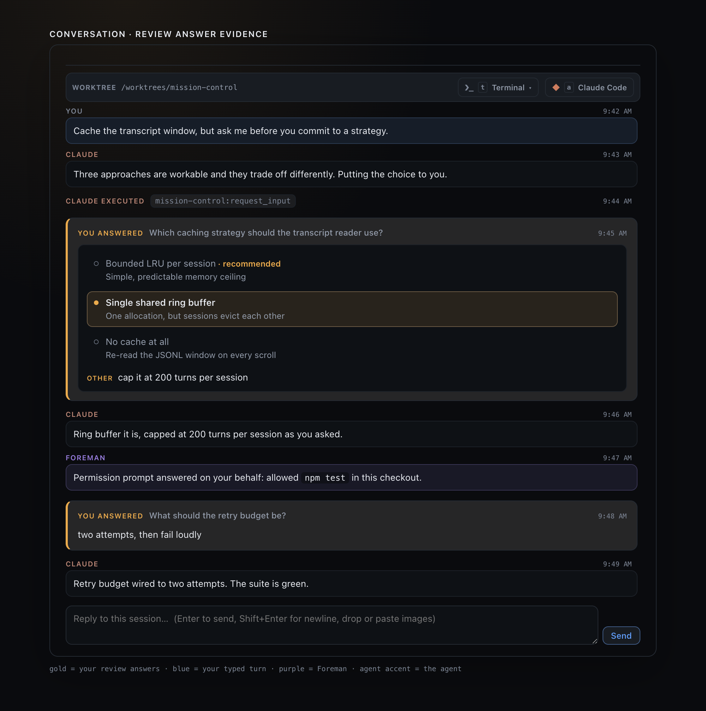

# Review answers in the conversation: visual evidence

This capture renders the production `TranscriptPanel`, `ReviewAnswerCard`, and
`src/web/styles.css` in Electron. Nothing here is a mock-up of the feature: the seeded
conversation is driven through the same components the dashboard mounts, from `ReviewItem`
values in the shape the daemon stores and serves.



## What it shows

Both shapes a submitted review takes in the log, and the contrast that makes them readable:

| In the capture | Demonstrates |
|---|---|
| **9:45 AM** - "Which caching strategy should the transcript reader use?" | a **three-option** selection replayed as a form: all three options drawn, the taken one (`Single shared ring buffer` - deliberately **not** the recommended one) marked with a filled gold dot, gold border and gold wash, plus the free-text **Other** |
| **9:48 AM** - "What should the retry budget be?" | a **direct-text** answer, shown as the text submitted (`two attempts, then fail loudly`) with no form invented for it |
| **9:42 AM** - "Cache the transcript window…" | an ordinary **user** turn, in blue - the voice the gold entries must not be confused with |
| **9:47 AM** - "Permission prompt answered on your behalf…" | a **Foreman** turn, in purple - the other voice they must not be confused with |
| **9:44 AM** - the grey `mission-control:request_input` chip | what a decision used to look like in its entirety, sitting directly above the entry that now says what was decided |

The gold is `--attention` (`#f6a733`), the same token the review form itself wears - the
3px left rule, the byline, the `recommended` hint, the selected option's dot and border.

## The browser suite

The behaviour behind the picture is asserted in
[`e2e/specs/review-answers-in-conversation.spec.ts`](../../../e2e/specs/review-answers-in-conversation.spec.ts),
which drives the whole seam: a real review created over `POST /mcp/reviews` against a real
dispatched session, answered by real clicks on the real form, and read back out of the
conversation the SSE stream feeds.

```
$ npx playwright test --config e2e/playwright.config.ts e2e/specs/review-answers-in-conversation.spec.ts --reporter=list

Running 4 tests using 4 workers

  ✓  3 › a typed answer appears in the conversation as the text submitted (3.1s)
  ✓  1 › your answer is told apart from your own turn and from Foreman's (3.4s)
  ✓  4 › Foreman's own resolution is not shown as yours (3.5s)
  ✓  2 › answering a three-option question puts the choice in the conversation (3.8s)

  4 passed (4.3s)
```

That last spec seeds a review and really resolves it as Foreman before asserting it is
absent, so the assertion can fail - removing the `resolvedBy === "human"` check from
`isHumanResolvedReview` makes it fail, and only it.

## Regenerating

From the repository root:

```sh
node_modules/.bin/electron scripts/review-answer-evidence.cjs
```

The capture script refuses to shoot an image that would not prove what this page claims. It
waits until the live DOM contains both review shapes (one with a marked option **and** an
`Other`, one with prose and no option list), a blue user turn, a purple Foreman turn, and a
conversation short enough that the log is not scrolled - so a regression that empties any of
them fails the run instead of silently producing a screenshot that no longer shows it. Its
browser harness is `scripts/review-answer-evidence.tsx`.

The window is opened with `enableLargerThanScreen`, because the page is taller than a laptop
display and macOS otherwise clamps the window and crops the bottom out of the capture rather
than reporting a problem.
