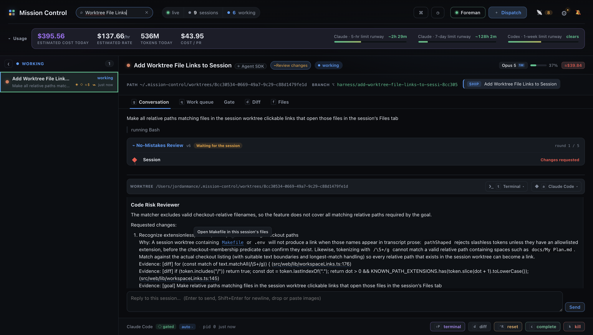
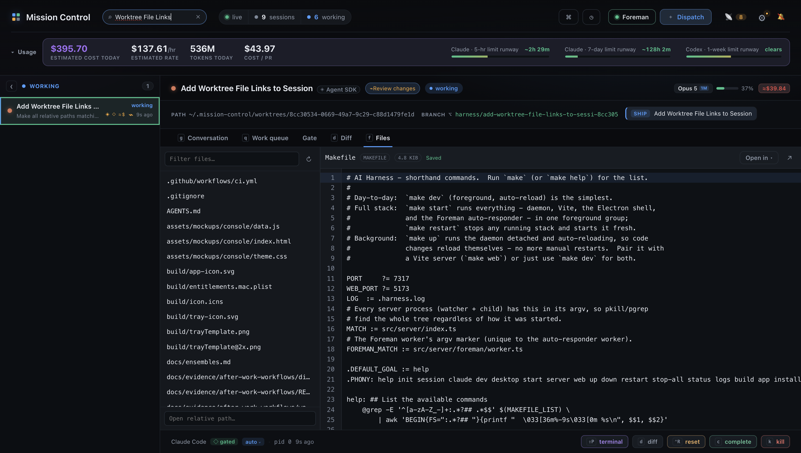
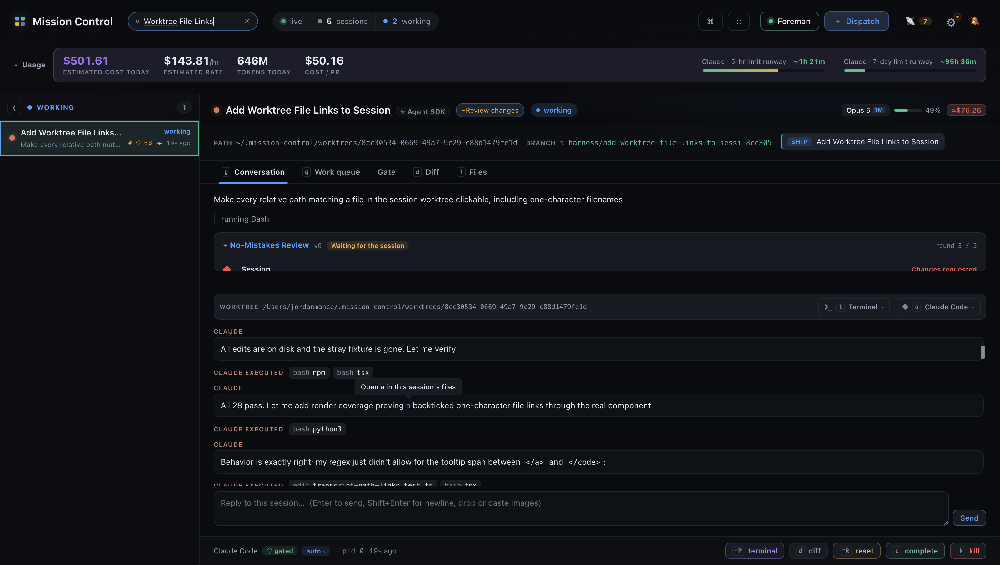

# Transcript path links: the click flow

Captured at 1600 × 1100 from a live daemon (nine real sessions) driven over CDP, against
this worktree's own Vite build rather than the `:5173` main checkout. Both frames are the
same session, `Add Worktree File Links to Session`, whose checkout is the worktree named
in the header of each capture.

The transcript on screen happens to be this feature's own review packet, so the paths in
it are real references to real files - nothing was staged or typed in to produce a match.

## A bare path in prose is a link

The pointer is on `Makefile`, which is the case a shape-based matcher cannot get right: it
has no extension and no slash, so nothing about the name says "file". It links because the
session's checkout listing has it. The tooltip names what a click will do.

Three other things are visible in the same frame, and all three are the behaviour we want:

- `src/web/lib/workspaceLinks.ts:176` and `:145` are linked **with their line numbers**,
  which no listing contains verbatim - the source location is split off and carried.
- `.env` and `docs/My Plan.md` in the reviewer's prose are **not** linked. This checkout
  has neither file. They are the same two names the matcher is built to support, which is
  the clearest possible demonstration that membership, not shape, is what decides.
- `/\S+/g` and the other inline code in that paragraph is untouched.

## Clicking it opens that file in the same session's Files tab

One click, no other input. The detail pane moved from Conversation to **Files**, `Makefile`
is the selected row in the file list, and the toolbar reads `Makefile · MAKEFILE · 4.8 KiB
· Saved` above the file's real contents. The session header is unchanged, so this is the
same session's checkout being browsed, not a new one.

## A one-character filename, written bare in prose

Captured with a real file named `a` committed into the checkout, because that is the only
way to see this behaviour at all.

The pointer is on the bare **a** in "proving a backticked one-character file links" - an
English article by any reading, and also the relative path to a file this checkout has.
It is a link, tooltip `Open a in this session's files`, and clicking it opened `a` in the
Files tab (`a · text · 65 B · Saved`, selected in the list) exactly as `Makefile` did
above. Membership is the only test, so nothing the Files tab lists is unreachable from the
conversation that named it.

The cost is visible in the same frame and is recorded here rather than smoothed over: 46
links on screen, 31 of them the article. Each one is still correct - it opens a file that
is really there - and a checkout containing a one-character file is close to unheard of,
so this is confined to a checkout almost nobody has. What the frame also shows is that the
word boundary still holds: the "a" inside "backticked", "and" or "real" is untouched.

## How many times the checkout is listed

Measured over CDP against the same live session, counting requests to
`GET /api/sessions/:id/files`:

| Action | Listing requests |
|---|---|
| Open the conversation (path links warm the index) | 1 |
| Then open the Files tab | +1 |

Which is the documented promise and not a stronger one. The path links and the
written-link resolver share a single request per session, so those two can never hold
different answers; the Files tab lists for itself and publishes the result into the same
index, converging the answer without sharing the request. Pinned by the
`the link probe and the path index share one request` case in
`test/transcript-path-links.test.ts`.
