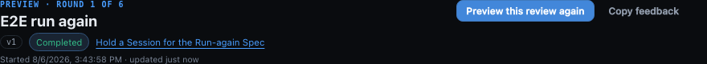
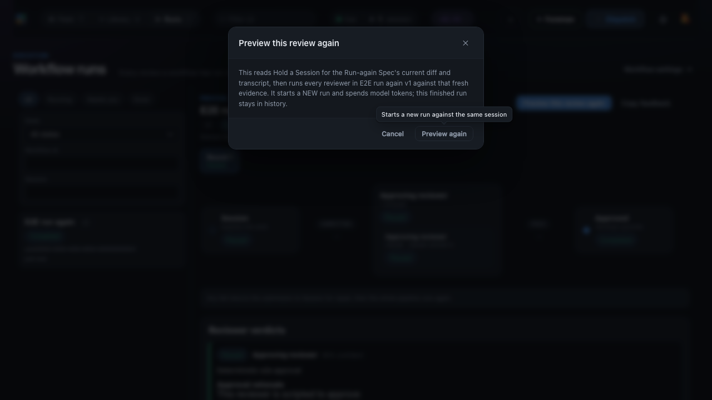

# A finished run, run again

Two frames from the same passing Playwright regression
(`e2e/specs/workflow-run-again.spec.ts`), taken between assertions that had already held.

What they show is an addition to a state that had nothing: before this change a `completed`,
`cancelled` or `failed` run offered no control that ran anything at all. `toHaveCount(1)` proves
a primary exists; only a picture shows that the finished run's header now reads as a page with a
next step rather than as an archive.

## The header of a finished run

One primary, and it is the only control here that changes anything. `Cancel run` is correctly
absent - a finished run has nothing left to stop - and that absence is exactly what used to leave
this header inert.

The label is the preview branch, because the spec binds `deliveryMode: "preview"`. A bound
preview must never invite an operator to a live submission, so the same arm reads
**Run this review again** on a live binding.



## The confirm

It asks once and does not demand a typed phrase. The phrase gate exists for the two actions that
abandon work - `Restart full workflow` and `Discard and send new round` - and this one only adds,
so a phrase here would be ceremony charged to the person the page is for. The body names the
session, the workflow and its version, and says plainly that it captures fresh evidence, starts a
new run and spends model tokens.

The frame is the whole viewport rather than the dialog's own box, and shows a pre-existing wart
rather than hiding it: the confirm button autofocuses, and `Tooltip` shows on focus as well as on
hover (deliberately - a description only a pointer can reach is one a keyboard user never gets),
so its `confirmHint` bubble is on screen beside the button. That is what every workflow confirm in
the app already looks like on arrival, `Cancel run` included; it is not introduced here, and
`WorkflowConfirmModal`'s own comment names it.



Regenerate both from the repository root:

```sh
npm run build
env -u NO_COLOR FORCE_COLOR=0 MC_E2E_EVIDENCE=1 npx playwright test \
  --config e2e/playwright.config.ts \
  e2e/specs/workflow-run-again.spec.ts \
  --workers=1 --reporter=list
```
