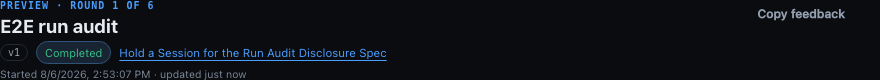
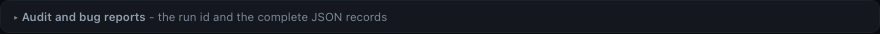
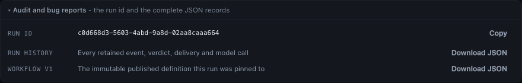

# The run header, decluttered

Three frames from the same passing Playwright regression
(`e2e/specs/workflow-run-audit.spec.ts`), taken between assertions that had already held.

The change they show is a subtraction, and a subtraction is the one thing a green test run
cannot make legible: `toHaveCount(0)` proves four controls are unreachable, but only a picture
shows what the row looks like without them.

## The header

`Copy run id`, `Export run`, `Export version` and `Open version` are gone from the action row.
What remains is `Copy feedback`; this run has no pull request, so `Open PR` is absent rather than
disabled - the repair that landed with the derived next move, one phase after this frame's own
subtraction. It is reframed here rather than left describing the greyed-out button, because a
committed capture that keeps naming a control the build no longer renders is a worse artifact
than no capture at all.

The `v1` badge is now the control that opens the composer, which is where the `Open version`
button went. It is a `<button>` dressed by the same pill rule as the `<span>` it replaced, so
the only visible difference is the pointer and the hover.



## The disclosure, closed

Collapsed by default, below the Timeline, and deliberately quieter than the sections above it:
`--border-soft` and no heading, so it reads as a footnote to the page rather than a ninth
section of it.



## The disclosure, open

The run id in mono, because it is the only value here you might compare character by character,
and one download per record. Both downloads read `Download JSON` on screen and carry distinct
accessible names, so the two rows are one control each to a screen reader as well as to an eye.



Regenerate all three from the repository root:

```sh
npm run build
env -u NO_COLOR FORCE_COLOR=0 MC_E2E_EVIDENCE=1 npx playwright test \
  --config e2e/playwright.config.ts \
  e2e/specs/workflow-run-audit.spec.ts \
  -g 'leave the header for a collapsed disclosure' \
  --workers=1 --reporter=list
```
