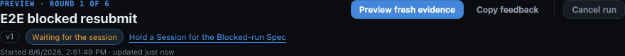
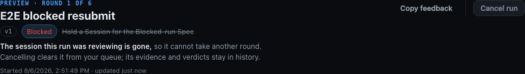

# One next move, and a sentence when there is none

Two frames of the same run's header from the same passing Playwright regression
(`e2e/specs/workflow-blocked-resubmit.spec.ts`), taken between assertions that had already held.

They exist because the assertions and the pictures answer different questions. `toHaveCount(0)`
proves the two submissions and the destination-less `Open PR` are unreachable, and the text
assertions prove the sentence is in the DOM. Neither shows what the header now *reads* like -
and the change was reported as a screenshot, so it is answerable in the same terms.

## A run with a move

One primary, filled, first in the row. `Copy feedback` sits after it as a ghost and `Cancel run`
stays behind the divider in the danger group this phase did not touch.

The row this replaced had five controls of equal weight here - `Submit fresh evidence`,
`Submit unchanged`, `Prepare PR in session`, `Retry provider call`, `Recheck Inspector` - none of
them a primary, so finding the one that applied meant reading all of them.



## The same run, after its session disappeared

This is the reported state. The bound session was killed, `session_remove` orphaned the binding,
and the daemon will now refuse a resubmission - so there is no primary at all, and the reason is
a sentence in the identity block instead of the `title` of a button that refuses.

Two details are the whole point of the frame. The fact leads in `--fg` and the rest follows in
`--muted`, so the sentence is scannable rather than a wall - and the second half names what *is*
available, which the tooltip it replaced never did. The struck-through session name above it is
unchanged: it was already saying the session had gone, and now the sentence beside it says what
that means for the run.



Regenerate both from the repository root:

```sh
npm run build
env -u NO_COLOR FORCE_COLOR=0 MC_E2E_EVIDENCE=1 npx playwright test \
  --config e2e/playwright.config.ts \
  e2e/specs/workflow-blocked-resubmit.spec.ts \
  --workers=1 --reporter=list
```
