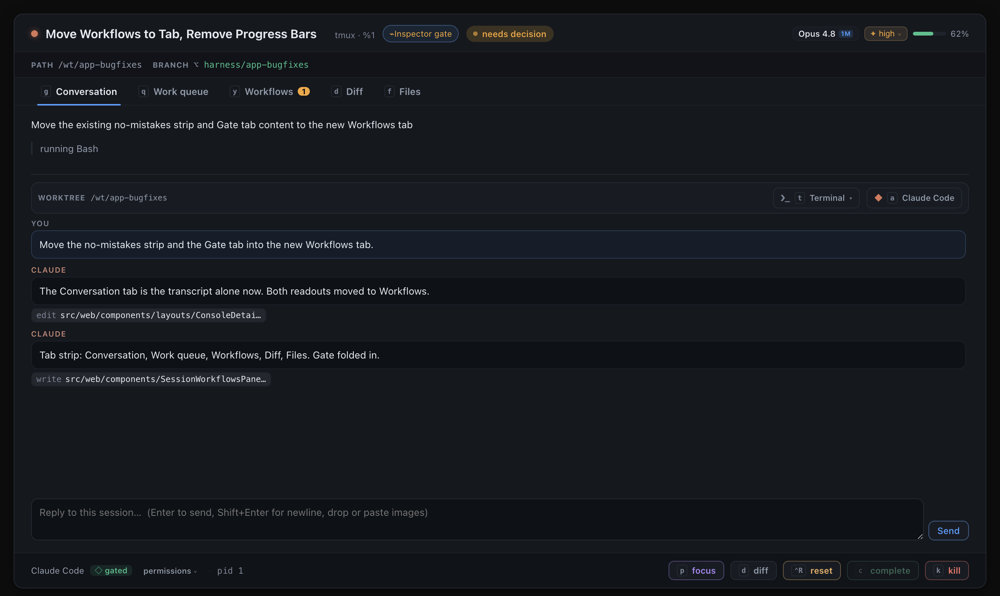
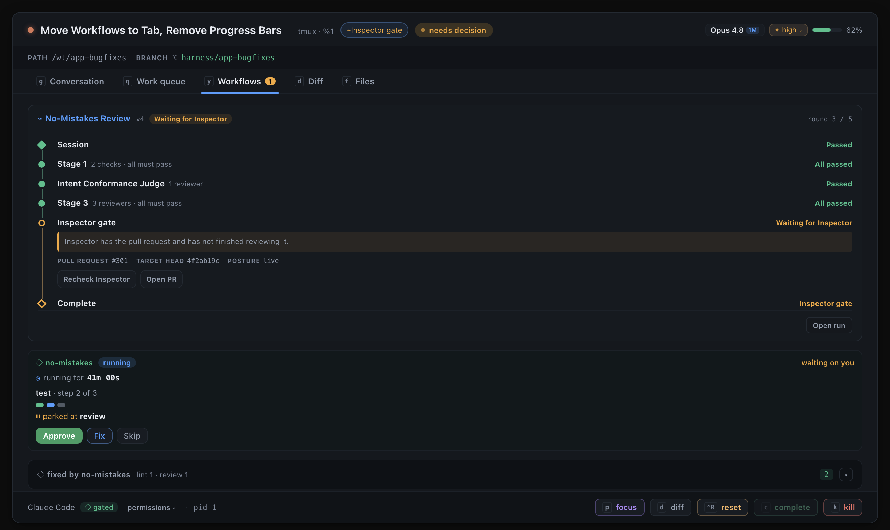

# Workflows tab evidence

Captured at 1320 × 820 by `scripts/workflows-tab-evidence.cjs`, which drives the harness in
`scripts/workflows-tab-evidence.tsx`. Regenerate with:

```sh
npx electron scripts/workflows-tab-evidence.cjs
```

Both frames are the real `ConsoleDetail` - the component Console and the Board drill-in both
mount - reading the production `src/web/styles.css`. The tab strip, `detailTabs`, the
`Keycap`, `SessionWorkflowsPane`, `NomistakesStrip`, `NomistakesFixLog` and
`WorkflowLadderPanel` are all production code. Only `fetch`, the session-files controller and
the transcript history store are replaced.

A fixture rather than the live fleet, for two reasons. A screenshot of the real dashboard is
operator data - other people's session names, branches, PR numbers and spend - which this
repository does not commit. And the state worth photographing (one session holding a bound
workflow run *and* a parked no-mistakes gate *and* fix commits simultaneously) is not a state
a live fleet happens to be in when the picture is needed.

The harness asserts what each capture contains before writing it, and exits non-zero if the
screenshot would disagree with the claims below - so these images cannot silently drift from
their caption.

## Conversation: the transcript, and nothing else

The tab strip reads **Conversation · Work queue · Workflows · Diff · Files**. There is no
**Gate** tab: it was folded into Workflows. Each tab carries the chord that reveals it -
`g`, `q`, `y`, `d`, `f` - and the amber **1** on Workflows is the parked gate's attention
pip, inherited from the Gate tab it replaced.

The body holds the goal line, the activity line and the transcript with its composer. No
no-mistakes strip, no fix log, no workflow ladder. The transcript is populated on purpose:
an empty one would let "no no-mistakes UI here" read as "nothing loaded yet".



## Workflows: everything the Gate tab held, plus the ladder

Opened by setting `workflowsTabRequest` - the literal value App's `y` handler produces - so
this frame exercises the chord's effect rather than a click that lands in the same place.

Top to bottom: the **workflow ladder** for the bound run (stages, the Inspector gate with its
PR and target head, `Recheck Inspector` / `Open PR` / `Open run`), then the **no-mistakes
strip** (elapsed, step dots, `parked at review`) with its **Approve / Fix / Skip** actions,
then the **fix log** rolling up 2 fix commits by step.

Those three buttons are why the strip moved here rather than being deleted: it is not a
read-only progress bar, and Console and the Board drill-in have no card to carry them.


