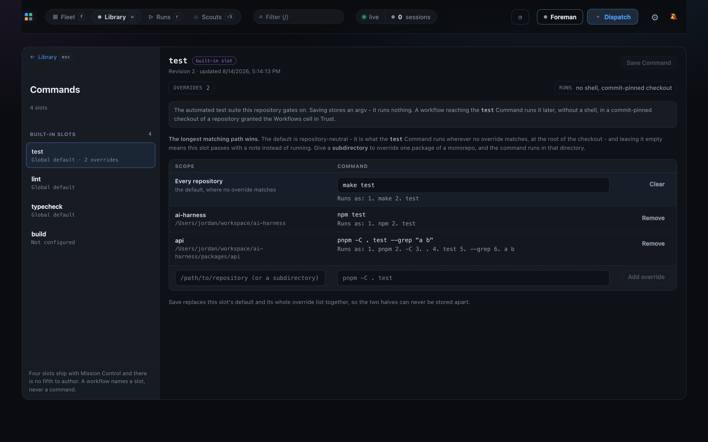

# The Library

Mission Control keeps its three primary pages in one segmented top bar control:
**▦ Fleet / ⌗ Library / ▷ Runs**. Fleet shows the sessions doing the work, **Library** holds
everything you author once and reuse, and **Runs** monitors live and finished workflow runs.
Nothing runs *from* the Library - each shelf carries a single cross-link to where its assets
are executing, and the **shelf index** renders no live run state beyond it. That link sits
beside the shelf's question as a counted pill wearing a status dot: blue while work is merely
open, amber when the count is one you have to answer. A Persona or Action detail is the
deliberate exception: once you open an asset, its footer says which workflows depend on it and
whether one of their runs is gating on it now. The original pull request includes runtime
captures of both the wide and narrow shelf layouts.

"Nothing runs from here" rather than "nothing here runs", because the Commands shelf holds
executable argvs. Saving one executes nothing; a workflow reaching that slot, later, in a
repository granted the Workflows cell in Trust, is what runs it.

Switching primary pages changes only the dashboard body. The fleet header, live SSE
connection, and Cards, Console, or Board selection stay mounted, so returning to **Fleet**
does not reconnect or discard the fleet view.

`#/library` opens six shelves, each headed by the question it answers rather than by its own
noun:

| Shelf | Question | What is on it |
| --- | --- | --- |
| Missions · Sources | Where does work come from? | Recurring missions and a link to task sources in Settings |
| Workflows | What counts as done? | Workflow cards - version, reviewer count, draft validation errors. The builder is one level deeper |
| Commands | What does each standard gate run? | The four portable workflow slots - `test`, `lint`, `typecheck`, `build` - each with what it runs on this machine |
| Personas | Who does the reviewing? | The fixed Foreman System profile, followed by Persona cards with the provider and model each resolves to |
| Actions | What can a run tell the session to do? | [Session action](workflows.md#session-actions) cards - required skill and what proves completion |
| Ensembles | Not sure of the best approach? | Strategy launchers (Best of N, Panel vote, Consensus) that open Dispatch already in Ensemble mode on that strategy |

The four authoring surfaces mount one level deeper at bookmarkable hashes:

| Hash | Surface |
| --- | --- |
| `#/library` | The six shelves |
| `#/library/workflows[/:id]` | The workflow builder, on that workflow |
| `#/library/personas[/:id]` | The Persona library and editor |
| `#/library/personas/foreman` | Foreman's fixed System profile and exact standing-guidance editor |
| `#/library/actions[/:id]` | The session action library and editor |
| `#/library/commands[/:slot]` | The Command editor, on that slot |
| `#/library/<shelf>/new` | The same surface, opened on a blank draft - not Commands, which has nothing to draft |

The asset id follows what the editor actually has open: selecting a second Persona rewrites
the hash without adding a history entry, so the address bar is always a shareable link to what
you are looking at and **Back** still means the page you came from. `new` is reserved and
never an asset id.

Commands is the one surface whose ids are a closed set. `#/library/commands/test` opens the
`test` slot; anything else in that position - a slot this build does not have, an undecodable
segment, or `new` typed out of habit from the other shelves - opens the surface on its default
rather than on a blank pane.

### Commands

A workflow's Command node names a portable slot and never an argv, so the same workflow runs
against any repository. This shelf is where *this machine* says what each slot runs:

- one optional **global default** per slot, which is repository-neutral and runs at the root
  of whatever checkout the run leased;
- zero or more **overrides**, keyed by repository or by a subdirectory inside one. The longest
  matching path wins, and a nested override also decides which directory the command runs in.

A slot with neither passes with a note rather than failing, which is what lets a shipped
workflow name `typecheck` on a machine that has never configured one.

Saving replaces a slot's default and its complete override list in one compare-and-swap, so
the two halves can never be stored apart, and a second window's save is refused rather than
silently overwriting your unsaved typing. Commands are stored as argv and executed without a
shell: there are no pipes, no redirection, no environment interpolation and no shell-mode
toggle, and the editor shows the exact split under every rule before you save.

Whether a Command may run at all is policy, and it stays in
[Settings › Workflows](skills-and-settings.md#settings): **Allow workflow Commands** is the
machine-wide switch, and the repository has to be granted the Workflows cell in Trust.

Execution is not a Library shelf. Workflow Runs is a top-level page in the segmented control
and [the Line](ui.md#the-line-the-pipeline-strip-above-the-fleet) links directly into it; Ensemble
runs remain a top-level page reached from the Line. The Workflows page that once held all five
surfaces as sibling tabs is retired:

| Hash | Surface |
| --- | --- |
| `#/runs` | Every workflow run, its rail and reader. `?status=`, `?workflowId=` and `?session=` filter the list |
| `#/runs/:id` | That run's reader - verdicts, deliveries, timeline, exports |
| `#/ensembles` | Every ensemble run |
| `#/ensembles/:id` | That run's full dossier and its one-shot decision |
| `#/shipped` | The **Ship log**: every pull request the fleet opened, across every repository |

Every `#/workflows/*` spelling redirects permanently, and the address bar is rewritten to the
new one so a kept bookmark stops being a legacy link: `#/workflows` → `#/library`,
`#/workflows/personas` → `#/library/personas`, `#/workflows/actions` → `#/library/actions`,
`#/workflows/runs[/:id]` → `#/runs[/:id]`, `#/workflows/ensembles[/:id]` →
`#/ensembles[/:id]`. The runs page's three filters - `status`, `workflowId` and `session` -
survive the redirect, so a saved `#/workflows/runs?status=completed` lands on the same filtered
list it always did.

Those three are the only query parameters any route has ever had, and **anything else in a
query string is dropped**. That is a property of the router rather than of redirecting: a route
is a typed value serialized back out of its own fields, so `#/runs?source=x` loses `source`
exactly as `#/workflows/runs?source=x` does, and always has.

Those five are every spelling that ever shipped, and **anything else under the prefix lands on
`#/library` too** rather than falling through to the fleet. The prefix named one page, so a
hash carrying it is a link to that page however it is misspelled or half-remembered, and an
unrecognized sub-path cannot say which half was meant - so it takes the front door the whole
page's front door took. A hash that does *not* carry the prefix still falls back to the fleet,
as every unknown hash always has.

An editor with unsaved changes still holds a navigation away from it and asks first, whichever
home you are leaving for.

### Getting back out of an authoring surface

Every authoring rail begins with a **← Library** row, above its own heading, so the way back is
the first thing in reading order on every one of the four surfaces. It carries `esc` on its
face when keyboard hints are on, because the keystroke is the half you could not have guessed.

<kbd>Esc</kbd> is a ladder rather than a single action, and it peels one layer per press:

1. An overlay - a confirm dialog, the unsaved-changes question - closes itself, and the page
   stays where it is.
2. Otherwise, if the keyboard is inside something that edits text - the guidance or prompt
   editor, a name field, a Command's argv box - the press leaves that and nothing else.
   Leaving the page out from under a half-typed field is not a back button.
3. Otherwise the press leaves for `#/library`.

With text selected in the guidance editor that reads as three presses, and each one is doing
something: the editor collapses the selection, then the second leaves the editor, then the
third leaves the page.

Both exits leave through the same navigation, so an unsaved draft raises the same
leave-with-unsaved-changes question either way and neither is a route around it.

### The Persona detail screen

Behind a Persona card is a rail and a workspace, and both are arranged around the one thing on
the screen that is the asset: the guidance Markdown.

**The rail** starts with a fixed **System** group containing Foreman, then lists workflow
Personas in **Built-in** and **Yours** groups. The System row is always present above search,
Active/Archived filtering, and the workflow Persona counts because it cannot be archived and
is not a catalog member. The two Persona groups each carry their own count, so
the roles that ship with the build stop reading as things you wrote and forgot. Each row's
sub-label is the resolved runner and model, which is what tells two reviewers apart; the
description is not repeated there, because on the shipped roles it restates the title. Search
sits above the list. **Import .md**, **Import from path**, **Check upstream** and the
**Archived** toggle sit in a footer below it, out of the path between the heading and the row
you came for. The Archived toggle carries the archived count, so whether there is anything in
there is answered without pressing it.

**The workspace header** carries the name and description as the fields they are - editing the
title edits the Persona - with the revision and the import provenance on one dim line beneath.
Exactly one verb is promoted: **Save** on a Persona you can edit, **Duplicate to edit** on a
built-in or an archived one, where there is no revision the editor could write. Copy Markdown,
Download .md, Duplicate, Re-import from source and Archive live behind the `⋯` menu beside it.
The menu closes on <kbd>Esc</kbd> without leaving the page.

**Property chips** replace the metadata block. `provider` and `model` open the control that set
them; `source` and `utf-8 bytes` are readouts. A chip whose value is inherited from the app
defaults draws quiet, and one this Persona overrides draws solid - so what this Persona
actually changes is legible without opening anything, and `source` names where the routing was
decided. Everything left over is the guidance editor.

**Used by** is the footer beneath the guidance. It names every workflow whose current draft or
current published version references this Persona, links to that workflow, and labels those two
graphs separately because they are different promises: a draft follows Library edits, while a
published version keeps its frozen Persona snapshot. A live mark appears only when an in-flight
attempt names this exact Persona id. Matching by id matters when an operator Persona shadows a
same-named built-in. The mark links to the run and retires from the open screen through SSE when
the run finishes; the Library shelf index remains unchanged.

Opening `#/library/personas/foreman` keeps the same rail and workspace grammar but changes the
ownership boundary. Foreman's name and application-owned description are fixed. The only
editable field is the exact `FOREMAN.md` standing guidance, with Editor/Preview, Save,
Copy Markdown, Download, and confirmed Reset actions. Source reports **Built-in default**,
**Customized**, or **No standing guidance**. Provider/model, top-bar posture, and repository
authority appear as read-only summaries that link to their existing owners in Settings and
Trust. The System card appears first on the Persona shelf but is composed beside
`personaCards()` and never increases a workflow Persona count.

### The Action detail screen

The same rail and workspace as Personas, because an operator moving between them should be
moving through one surface with different contents. What is specific to an Action is that it is
the only Library asset carrying a **machine-checked contract**: something observable has to
happen before a workflow stage may call it done, and - where the action names one - the bound
session has to be able to invoke a named skill before the instruction is sent at all.

The two halves are not equally optional. Every action names a completion; the **required skill
is a choice**, and an action that requires none is not inheriting a default but asserting
nothing, so it is sent to whatever skills the bound session has already loaded.

**The rail** groups **Built-in** and **Yours** with counts, and each row's sub-label is that
contract - `Skill · pull-request · Pull request is opened and verified`, or
`No required skill · Session turn finishes` where the action asks for none. The description is
not repeated there, because on the shipped pair it restates the title, and the contract is the
thing that tells two actions apart. Search sits above the list; the **Archived** toggle, carrying
its count, sits in a footer below it.

**The workspace header** carries the name and description as the fields they are, with the
revision and when it was last written on one dim line beneath. **Save** is promoted on an action
you can edit and **Duplicate to edit** on a built-in or an archived one, where there is no
revision the editor could write. Duplicate and Archive live behind the `⋯` menu, which is absent
on a read-only action because both of its entries are.

**Two property chips carry the contract** - `requires skill` and `completes when` - and each
opens the control that sets it. `requires skill` draws quiet when the action requires none and
solid when it names one, so what this action actually demands is legible without opening
anything. **The contract line beneath them is the sentence those two values form**: what the
stage sends, what the session must be able to invoke, and what Mission Control has to observe
before the stages below this one may read the evidence. An action requiring no skill says so in
that sentence rather than leaving the clause out, which would read as though the requirement had
been forgotten. That completion clause is the same string the chip shows and the same one the
pipeline card, the graph rail and the version history print, from the one shared table that owns
it - there is no second wording of what an adapter proves anywhere in the browser.

A completion this build cannot prove is **kept, marked and readable while the control is shut**:
the chip draws amber and a sentence beside it says why. It stays selected, because rewriting it
would silently change the proof contract the action was authored with, and it cannot be chosen
again - the option is there to be read, disabled.

**The mark waits for the daemon's answer.** Which completions a build can prove is read over
HTTP, so for one round trip after the screen opens nothing is known - and a screen that marked
the chip then would be accusing every action of naming something unprovable, including the
ordinary default this daemon runs perfectly well. Until that read lands nothing on the screen
claims anything about it. Save stands down in the meantime and says which fact it is waiting
for, because a pending read is not a refusal but it is a reason not to write. Everything left
over is the instruction editor, whose Markdown reaches the session byte for byte.

The shared **Used by** footer sits beneath that instruction. As on a Persona, it links each
referencing workflow and keeps `Draft` apart from `Published vN`. Its live mark is stricter than
"this workflow contains the Action": it appears only while a waiting action attempt carries
this Action's exact source id, so a workflow with several action stages never marks all of them
at once. The run link and live count update from the existing SSE summary and disappear when
the run finishes, without a workflow-detail fetch or a page reload.

Both footers stay absent when connected to an older daemon that does not project references.
They never turn missing wire data into the false empty answer "nothing uses this". If an exact
live run names a workflow the browser cannot resolve, the workflow is omitted and the footer
states how many were omitted rather than guessing a name or destination.

### The Command detail screen

Behind a Command card is the same rail and workspace, arranged around the thing this screen
actually decides: which argv a repository resolves to.

**The rail** is one group, **Built-in slots**, with its count - there are four slots and there
will never be a fifth, so there is no New, no search and no state filter. Each row's sub-label
is the slot's stored state (`Global default · 2 overrides`, `Not configured`), which is the one
fact that tells four rows apart; it is the same sentence the Library card and the workflow
palette use, so the three cannot disagree. The slot's purpose has moved off the rows to the
row's tooltip, and it opens the workspace's execution note - so it is read once for the slot
you opened, rather than four times identically down a list. A note below the list says why the
catalog is closed.

**The workspace header** carries the slot name and a `built-in slot` tag with the revision line
beneath, and promotes exactly one verb: **Save Command**. There is no `⋯` menu, because a slot
that cannot be copied, duplicated or archived has nothing to put in one. Two read-only property
chips sit under it: the number of overrides in the open draft, and `runs` - a reminder that
execution is shell-free and commit-pinned. Below them, the execution note opens with what this
slot gates on and then states, once, that saving stores an argv and runs nothing.

**The default and its overrides are one table**, with a header row. The default is the first
rule, labelled *Every repository - the default, where no override matches*, because that is
what it is; drawn as a separately titled section above an unrelated list, the precedence the
screen exists to configure was the one thing it never showed. Each override follows, named by
repository with its full path underneath, in the order they resolve. The add row is last and is
drawn as an add row - its own fill, a dashed rule above it, and its **Add override** control
disabled until both halves are given.

**Every rule shows its parsed argv**, not just the default. That readout is where a quoting
mistake becomes visible - `--grep "a b"` is one argument or two - and until it was on every row
it was offered only for the rule you were already reading back as you typed it.

Nothing about how a Command runs is decided here. Resolution order, the machine-wide switch,
the Trust grant and the compare-and-swap save are exactly as described above.

### The Ship log

`#/shipped` is the cross-repo record of what the fleet landed: the GitHub Inspector's adoption
ledger, read as a page rather than counted. Every row is one pull request Mission Control can
prove one of its agents opened, tagged with the repository it belongs to - which is what makes
this the surface that answers "what shipped, across everything we touched".

The page has three parts.

- A **KPI row**: how many shipped in the range and how that compares with the range before it
  (with a twelve-week trend line), how many of them merged and at what rate, the same
  fleet-wide per-pull-request cost figure the [spend chip](sessions.md#cost-telemetry) carries, and how
  many repositories the range touched.
- A **repository rail**: one row per repository with its count and a merged / open / gone mix
  bar. The rail doubles as the filter - press a repository to narrow the feed to it, press it
  again to come back. The KPI row deliberately does *not* narrow with it, because the context
  the selection was made from is what makes the selection readable.
- The **feed**: the range's pull requests grouped by the local day they were adopted, newest
  first. Each row carries its merge state as a mark *and* a word, the repository, the title,
  the number and branch, the session that opened it, and how long ago.

Three details are worth knowing.

**Titles arrive late, and rows are named by what is known.** The adoption signal is a hook
catching `gh pr create` and carries only a URL, so the title is written by the GitHub Inspector's
first poll afterwards. A row falls back to its branch name until then, and to its number when
even the branch has not been observed. A row adopted before this build and already closed may
keep its branch name for ever - the poll retires merged and closed rows and never looks again.

**Merged means merged by anyone.** YOLO mode records the merges it performs itself; a merge a
person pressed is visible only through what the poll last observed. The page counts both, so
"merged" here answers "did this land" rather than "did the fleet land it unattended". The
[Shipping settings panel](skills-and-settings.md#settings) keeps the finer five-way reading (merged, soaking, held
at a gate, not looked at, closed), which is a different question about the same rows.

**Range and repository are not in the hash.** Both are what you are currently looking at
rather than where you are, so `#/shipped` is the whole address and a reload comes back to the
default seven days across every repository. The page reads the ledger once over a window wide
enough for every range it offers, so switching between Today, 7 days and 30 days is instant
and cannot fail halfway through a comparison. It is fetched only while the page is open.

A range here is **whole local days ending today**, because the feed's day headings are its
ordering and half a day under a heading naming all of it would be a lie about both. The
Line's Shipped count is a rolling seven days to the minute, so the two figures differ by
however much of today has already gone. That is the only way they are allowed to differ: the
page reads the ledger through the adoption window, so neither truncation nor a re-review can
put them out of step about which pull requests exist.

Reach it with `⌘K` (search for "shipped", "merged" or "pull request"), by opening the hash, or
from the Line: clicking ⚑ **Shipped** opens the [Shipped drawer](ui.md#the-stage-drawers) over the
fleet, and its **Ship log →** header action lands here.
