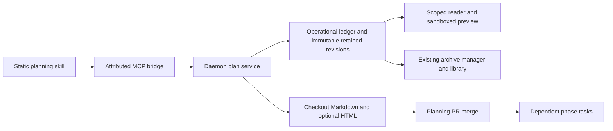

# Managed repository plans

Mission Control's daemon saves complete plan revisions. Markdown in
`docs/plans/<slug>/` is the repository source of truth. Generated HTML stays available
locally for review and is omitted from Git by default. Settings > Skills > **Commit
generated HTML plan files** opts new plans into publishing HTML alongside Markdown.
The checkbox remains configurable when skill installation is off.

Each plan pins that policy when created. Changing settings does not relocate active
plans, reinterpret old revisions, delete tracked HTML, or migrate unmanaged plans.
Legacy plans keep their tracked layout and existing archive discovery. Adoption,
renaming, and deletion of managed checkout outputs require a future explicit migration.

## Tools and storage

Registered sessions use `get_plan_context`, `save_plan`, and `read_plan`. The MCP bridge
adds its own launch identity; the daemon resolves the primary or attached repository
from issued slots. Callers cannot choose a state-home path, storage policy, task, or
session owner. Missing registration and corrupt saved settings refuse managed writes.
Taskless sessions write relative to their registered checkout root even when launched
from a subdirectory. A linked worktree remains the write destination while its owning
repository supplies the retained plan namespace.
Both terminal and SDK plan dispatches require these tools in the built MCP handshake.

`save_plan` accepts a UUID request identity, a slug, an expected revision, and a complete
array of UTF-8 `{name, content}` files. Updates also name the returned plan id. Repeat
the identical request after an interruption; use a new request id for new content.
Each Markdown file has a same-name HTML rendering. The API accepts flat `.md`, `.html`,
`.txt`, `.css`, and `.svg` files, at most 64 files, 1 MiB per file and 8 MiB total.
HTML is static and self-contained, using inline resources and bundle-relative navigation.
Unsupported artifacts, invalid Unicode, traversal, case collisions, missing renderings,
symlink components, and conflicting edits refuse the whole save. No file import or
agent-writable staging directory is needed.

The retained layout is:

```text
$MISSION_HOME/plans/<sanitized-repository-name>/<repository-key>/<plan-id>/<revision>/
```

`MISSION_HOME` normally resolves to `~/.mission-control`. The key hashes the canonical
owning repository path resolved by the existing repository resolver. Linked worktrees
share a namespace; unrelated same-name clones do not. Moving a repository requires
explicit future mapping. Revisions survive authoring-checkout and task/session removal.
Settings snapshots contain the HTML preference, not retained plan contents. There is no
automatic remote backup of excluded previews.

## Revisions, recovery, and publication

The daemon-only `managed_plans` and `managed_plan_revisions` tables retain attribution,
pinned policy, current revision, request identity, manifest hash and write intent.
Schema version 5 adds both tables without changing existing plan files. Manifests use
version 1 and contain a bounded inventory, SHA-256 digests, source-rendering digest pairs,
and policy-eligible checkout paths. Unknown manifest or policy versions refuse reads.

A write intent is durable before staging starts. All retained files are staged and
verified before their revision directory is renamed into place. Checkout replacements
compare recorded baselines and use temporary files plus rename. Only after every
required output is rechecked against its saved digest does the ledger expose the ready
revision. Conflicting edits during a multi-file write leave the save incomplete. Startup reports
incomplete revisions without applying their intents, because writer registration may have
been revoked before the interruption. A currently registered session must retry the exact
save request with matching attribution, repository slot, and issued checkout. That retry
rechecks live authority, removes orphan UUID staging directories under the repository's
write queue without touching published revisions or following symlinks, and replays
matching writes; operator conflicts remain incomplete. No cross-filesystem atomicity is
claimed, and the service never resets the index or runs Git publication commands.

`ready` means saved, not human-approved or published. The save result's `requiredPaths`
are Markdown plus opted-in HTML; verify those in the pushed commit when publication is
authorized. Verify excluded HTML with `read_plan`. Phase tasks continue citing Markdown
paths and depending on the planning session. Only the planning PR's merge releases
repository publication prerequisites. The existing publication-context contract and
workflow versions are unchanged.

## Review and archives

Every save returns an exact `/?plan=<id>&revision=<n>` preview. Files > **Refresh managed
plans** lists each repository plan's latest revision and opens that reader. **Previous
revision** links make every retained older revision reachable from the latest. The reader
identifies the revision, source Markdown and pinned Git eligibility. Relative phase links navigate the verified
bundle. It uses the same sandbox and CSP as Files and Archives. Guarded file endpoints
serve attachments; the session-file API remains checkout-confined.

At plan-task cleanup the existing archive manager reserves exact registered revisions
and captures them through the existing archive library, including excluded HTML. It
checks source digests during copying. Missing registered bytes refuse capture rather
than being mistaken for policy omission. Legacy plans retain diff discovery and partial
capture semantics. Saved Markdown and relevant phase context must still be registered
with `submit_workflow_evidence`; a preview locator alone cannot reach tool-less Personas.



## Phase 2 handoff and route adjustments

Phase 2 extends `ManagedPlanPolicySchema` in `src/shared/managed-plans.ts`, using the
same writer, repository identity, immutable references, preview and capture adapter.
It adds whole-plan local storage and its approval/publication and task-input contracts.
This release exposes no local-mode preference or new dependency satisfaction path.

The implementation uses a dedicated reader opened from Files rather than extending
editable session-file buffers to state-home paths. This preserves the checkout boundary
and keeps retained revisions readable after the session disappears. Content-only flat
bundles replace the proposed optional file-import path, avoiding a second filesystem
authorization surface. All Markdown documents get renderings, which makes phase navigation
consistent. Recoverable write intents include staging, closing the pre-manifest crash
window as well as partial checkout writes. Recovery requires an attributed retry instead
of automatic startup replay: startup precedes live session registration, and retained
attribution alone cannot authorize checkout writes after revocation. These are the material
route adjustments to carry into the Phase 1 PR description.

Behavior is covered by `managed-plans.test.ts`, attributed HTTP tests, settings
upgrade/restore tests, plan capture and MCP handshake tests, and
`e2e/specs/plan-storage.spec.ts`. Follow [AGENTS.md](../AGENTS.md) for test execution.
