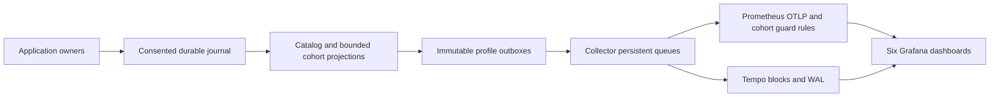

# Local telemetry dashboards

The six dashboards are provisioned automatically in Grafana's **Mission Control** folder.
They use actual Mission Control OTLP metrics and Tempo traces. The optional stack is independent
of application and Electron startup. No product-sharing profile is enabled by these commands.

## Start and connect

Use Node.js 24 or newer, installed repository dependencies, and Docker with Compose v2.
The pinned images are Grafana 12.4.10, Prometheus 3.14.0, Collector Contrib 0.160.0 and
Tempo 2.10.8. This phase was exercised on macOS arm64 with Docker Engine 29.7.2 and Node 26.7.0;
x86 Linux images are published upstream but this phase does not claim a local x86 run.

```sh
npm ci
npm run observability:verify
npm run observability:up
```

In Mission Control, open **Settings > Telemetry**, enable collection, and separately enable the
user backend at `http://127.0.0.1:14318`. Save, probe, then drain. Configuring a backend does not
opt in to product analytics. Keep the product destination disabled for this installation.
Open [Grafana](http://127.0.0.1:13000/d/mission-adoption).

| Dashboard | Stable UID | Reading the view |
| --- | --- | --- |
| Adoption and first value | `mission-adoption` | Active observed installations, repeat use, first observed success, task and positive PR outcomes |
| Workflow completion | `mission-workflows` | Exact matured outcomes, pending/cancelled/unknown, stage/queue/execution waits and repair activity |
| Persona quality and burden | `mission-personas` | Executed reviews, rejection and next-review resolution, invalid/reused responses, findings and control activity |
| Models and effort | `mission-models` | Effective effort, pending selections, runtime, model usage, attributed cost, separate author/reviewer cohorts |
| Human involvement | `mission-interventions` | Distinct recovery runs, authored gates, unknown actors and known human-free completion |
| Reliability and data quality | `mission-reliability` | Safe errors, failed operations, per-destination queue health, recovery and analytical gaps |

Shared links preserve environment, installation and time. Personal data defaults to environment
`local`; synthetic projects use `demo` or `test`. Anonymous access is Viewer, bound to loopback.
There is no password or required Grafana login for viewing and Explore. Persistent dashboard
editing and administrator access are unnecessary; change the source generator instead.

## Separate demo and acceptance projects

```sh
npm run observability:demo
```

The demo uses its own network, four named volumes and ports. It creates a disposable Mission
Control state directory, executes real workflow stores/engines, primary-action routes, Registry
observations and telemetry source adapters, using injected fake model runners. No agent binary,
model API or public GitHub write is required. Only synthetic facts leave the temporary home.
The command prints the installation-scoped dashboard URL and writes a gitignored fixture receipt.
Each invocation creates a new installation; use that URL to avoid summing previous runs.
This is a one-shot workload. Rerun it for a fresh live view after the two-hour cohort freshness
window, or select the earlier populated time range to inspect retained history. Queue health
becomes absent after two minutes because the fixture application has exited.

Historical activity is exported while the fixture clock is in its historical period, then the
clock advances to calculate matured cohorts. This models an online installation aging into a
cohort. It does not claim a 7.5-day-old unsent payload survives the seven-day queue contract.
The workload uses the source owners for six runs: eight executed reviews, six pass, two fail;
four completed, one pending, one cancelled; one confirmed recovery; five automation-eligible
runs and only R2 known human-free. R6's actor remains unknown. The task example includes a
positively observed PR merge after the outcome horizon.

| Service | Real | Demo | Test | Container address |
| --- | --- | --- | --- | --- |
| Grafana | 13000 | 23000 | 33000 | `grafana:3000` |
| Collector OTLP/HTTP | 14318 | 24318 | 34318 | `collector:4318` |
| Collector readiness | 14133 | 24133 | 34133 | `collector:13133` |
| Prometheus | 19090 | 29090 | 39090 | `prometheus:9090` |
| Tempo query | 13200 | 23200 | 33200 | `tempo:3200` |

All host addresses use `127.0.0.1`. Do not use `collector:4318` from the host application.
`MC_OBSERVABILITY_MODE` accepts only `real` (default), `demo`, or `test` and selects both
ports and Compose project. Do not run acceptance outage tests against the real project.

```sh
MC_OBSERVABILITY_MODE=demo npm run observability:status
MC_OBSERVABILITY_MODE=demo npm run observability:down
MC_OBSERVABILITY_MODE=demo npm run observability:up
MC_OBSERVABILITY_MODE=demo npm run observability:restart
# Explicitly destructive, only for the selected project's metrics, traces and Grafana state:
MC_OBSERVABILITY_MODE=demo npm run observability:reset
```

Normal down/up and restart preserve all four volumes. Readiness waits for each service and all
six dashboard UIDs. A reset recreates dashboards from provisioned files but erases stored data.
Do not reset a real-data project to troubleshoot a dashboard.

## Populations, filters and missing data

Read the [analytical contract](telemetry-analytics.md) alongside these panels. Exact cohort
counts are gauges. At selected end time T, starts lie in `[T-14d,T-7d)`, and each start has a
seven-day outcome horizon. Widening the Grafana range changes activity/trace history; it does
not change that cohort definition. Newly opted-in installations initially have zero matured
runs and incomplete observation. Recent activity is still visible in the cumulative panels.

Every metric and trace panel uses environment and installation scope. Additional controls are
explicitly labelled **runs cohort**, **reviews cohort** or **tasks cohort** and only appear when
that dashboard uses them. Other panels retain environment/installation scope; panel descriptions
state their dimensions. These are independent marginal axes, not joint SQL-style filters.
Persona identity/revision, workflow revision, terminal metadata and full event-time model
context remain trace attributes where the metric contract does not offer those dimensions.

- Exact ratios use the same coherent producer/slice set for numerator and denominator.
  Guarded recording rules require every declared field and one calculation timestamp. Panels
  compare that timestamp again and reject fields newer than the calculation, so partial
  delivery before or after calculation metadata cannot pair with an older guard.
- An explicit **0** is an exported zero. No denominator gives **No eligible / stale or partial**.
  Absent, partial and older-than-two-hour calculations give **Absent / stale / partial**.
  **Incomplete** means observed counts exist but observation coverage cannot prove completeness.
- Each participating cohort view has coverage and age panels. Coherent producers are compared
  with producers seen in the last 30 days, exposing previously observed stale installations
  when the cohort axis is `all`. Narrower slices can also reduce the coherent count.
  This is not an inventory of producers that have never exported.
- Activity tables say **cumulative**: they show the last cumulative stream observation within
  the selected range. They are not exact counts of events occurring inside that range. Resource
  changes and consent resets can introduce new streams. No analytical gauge uses `increase()`.
- PR panels show verified positives and unknown visibility. The current source contract cannot
  prove all PR-eligible tasks, so no PR-production percentage is fabricated. Abandonment candidates
  remain unconfirmed. Cost includes only attributed priced observations and is not subscription billing.
- Empty renderer-error, suppression, restoration or human-wait panels are expected when that
  source has not observed such an event. They do not mean zero failures or zero waiting.

## Trace drill-down

Open **Event-time traces: select a Trace ID** at the bottom of each dashboard, then select its
Trace ID. Persona and reliability tables search executed reviews and safe errors respectively,
so general workflow chatter cannot displace those examples from the result limit. The opened
Tempo trace shows immutable event-time context, bounded reason/error fields and audience-scoped
references. It contains no prompts, feedback prose, paths, repository URLs or credentials.
Trace limits/sampling never supply cohort denominators. Use Explore for narrower TraceQL searches,
including `span.mission.verdict = "fail"`, reviewer model and opaque persona/stage references.

## Storage and delivery limits

Prometheus retains 30 days and accepts out-of-order samples within eight days. Tempo retains
14 days, allows 14-day searches and sets WAL ingestion slack to 14 days so replayed spans remain
findable by original time after block flush/restart. The app's supported unsent-payload retention
remains seven days; minimal analytical state remains bounded to 30 days and the shared byte budget.

Collector metric and trace exporters each use a persistent queue of 5,000 requests, one consumer,
and unlimited transient retries. There is no asynchronous in-memory batch processor before these
queues: an ACK must follow queue persistence. A backend rejection after the Collector ACK cannot
be reported retrospectively through the daemon's accepted counter. Inspect Collector logs for
permanent downstream rejection; the integration test separately asserts Prometheus's explicit
rejection past the late window. Disk exhaustion and permanent rejection are not lossless cases.

Queue-health gauges are new additive instruments, sampled before a drain at most once per
30-second bucket. Each destination receives only its own health. They show pending bytes/age,
retrying, accepted, rejected and expired batch accounting, with no endpoint or error text.
After two minutes without export those panels are absent. **Settings > Telemetry** remains the
local authority while the backend is disconnected. Stale cohort coverage remains visible for
longer; it is deliberately distinct from recent queue-health coverage.

## Maintain and verify

The source of truth is `scripts/observability/dashboards.ts`, which maps each question to its
instruments, query, unit, filters and oracle where available. Generated JSON, recording rules
and `observability/grafana/panel-manifest.json` are committed outputs. Do not edit them in Grafana
or by hand. Regenerate with `npm run observability:generate`; verify drift with its `--check` mode.
`observability:verify` runs Compose validation and pinned `promtool` config, rule and rule-fixture
checks, including coherent, missing-field, mismatched-timestamp and stale snapshots, plus a
partial update arriving between rule evaluations before its calculation metadata.

```sh
npm run build
npm run smoke
MC_OBSERVABILITY_MODE=test npm run observability:up
MC_OBSERVABILITY_MODE=test npm run observability:verify
MC_OBSERVABILITY_MODE=test npm run observability:integration
MC_OBSERVABILITY_MODE=test MC_E2E_OBSERVABILITY=1 MC_E2E_EVIDENCE=1 npm run test:e2e -- e2e/specs/telemetry-dashboards.spec.ts --workers=1
npm run typecheck
npm run lint
```

Run outage integration and browser checks sequentially against the same test project. Unit
fixture, health and definition checks live in `test/telemetry-dashboard-*.test.ts`; follow the
root AGENTS.md runner contract. Screenshots, receipts and logs belong in gitignored evidence
locations and are registered with Mission Control, never committed.

## Measured limits

Measurements below are from the tested macOS arm64 / Node 26.7.0 host, with local Docker and
fake agents, on 2026-09-17. Run `npm run observability:benchmark` for the owner-path comparison.
It uses a disposable database and sends nothing to a backend. These are observations, not
production latency or memory guarantees.

| Application workload | Collection off | Collection on |
| --- | --- | --- |
| 20 synthetic session contexts, 10 owner events/s for 10 seconds, then 100-event burst: owner p95 | 0.356 ms | 1.521 ms |
| Same paced workload: event-loop p95 / p99, 10 ms resolution | 11.100 / 11.592 ms | 11.076 / 11.829 ms |
| Same paced workload: RSS change after GC | -0.44 MiB | 21.86 MiB |
| 1,000 synchronous captures: capture p95 | 0.0145 ms | 0.1789 ms |

The paced owner p95 increase was 1.165 ms. The separate synchronous burst used another
79.92 MiB RSS before GC, took 101.97 ms to project and produced a 250.74 ms event-loop p95.
The candidate 32 MiB steady-state target was met by this short paced sample, but is not a proven
ceiling; the burst exceeds it. The benchmark rotates 20 synthetic session contexts and does not
run 20 agent processes. It does not measure sustained production CPU, long-running heap growth,
or real model latency. Further optimization of the inherited capture/projection path is outside
this dashboard phase.

The benchmark's resulting logical telemetry size was 404,259 bytes, with a 2,314,240-byte SQLite
file and 4,152,992-byte WAL. Logical quota is not a physical disk cap. Queue age/byte-pressure
behavior remains covered by the existing telemetry durability tests.

The isolated backend stack measured 352.46 MiB container memory in one post-acceptance sample:
Grafana 137.1, Prometheus 113.9, Tempo 53.21 and Collector 48.25 MiB, at a combined 0.91% CPU.
This is separate from application overhead and includes repeated fixture history. Use
`docker stats --no-stream` with the selected project's four containers to repeat the sample.
Cold image download time depends on the host/network and is not included.
Read-only volume measurement after repeated acceptance runs totaled 65.05 MiB: Prometheus
2,960 KiB, Tempo 5,660 KiB, Grafana 57,040 KiB and Collector queues 948 KiB. These are current
usage, not capacity limits. One isolated six-run demo produced 944 source metric series across
all its event and analytical dimensions; it had no matching series in the real or test backend.

The acceptance run executed all 140 metric panel queries, with 135 populated (five source panels
had no corresponding event), at p50 1.40 ms and p95 3.06 ms on the local Prometheus API. This is
query latency, not browser render time. Restoring the entire stopped stack and draining the
durable application backlog took 20.92 seconds. Independent Prometheus/Tempo outages followed
by Collector SIGKILL/restart preserved acknowledged data and allowed the other signal to drain.
Seven-day-old metrics and time-bounded trace searches passed; nine-day-old metric delivery to
Prometheus was explicitly rejected with HTTP 400. Normal restart preserved history and all UIDs.

## Phase 7 implementation decisions

The proposed inventory was reconciled to the merged source/query contract. There is no new
warehouse, cohort reducer, identity, task outcome rule, deployment service or public sharing.
Changes needing explicit review rationale are:

1. Added bounded per-destination health gauges because the existing Settings health reader had
   no exported signal for required reliability panels. Existing profile isolation and consent
   remain authoritative; no migration or additional state owner was introduced.
2. Added Tempo WAL slack and removed the Collector's pre-queue batch processor to satisfy
   historical search and crash-after-ACK guarantees on the pinned stack.
3. Kept unsupported persona/revision/terminal dimensions in trace drill-down, and labelled
   marginal cohort controls and cumulative activity precisely. We do not manufacture joint
   cohort dimensions or a missing PR-production denominator.
4. Use the real six-run owner fixture instead of seeding final metric values. The original
   schema-level analytical oracle remains covered separately, including partial/version overlap.
5. Use separate real/demo/test Compose projects and ports so acceptance outages cannot alter
   the operator's active backend. The demo's temporary application database is destroyed only
   after export; normal service stop preserves backend history.

## Data flow



Each synthetic project uses the same topology with independent volumes and ports.
