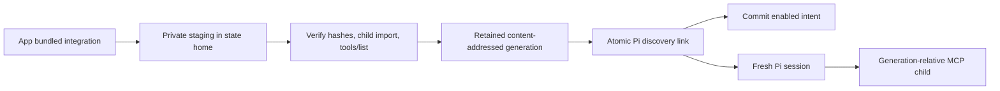

# Pi's Mission Control extension

Install from **Settings > Setup > Agent extensions > Install Pi integration**. If a
Mission Control-owned installation is unhealthy, the same page offers **Repair Pi integration**.
Desktop installation needs no clone, npm, tsx, terminal, package manager, or network download.
Start a fresh Pi session after installation or repair so it loads the current extension.

`npm run build` produces a deployable `dist/pi-integration/` directory containing
`extension.js`, `mcp-server.mjs`, and `manifest.json`. Building installs nothing.
Concurrent builds serialize artifact publication using a process-identity lock beside the
canonical output directory, including when callers use different symlink aliases. Each build
verifies the final manifest and both artifacts before releasing the lock and reporting success.
Setup, the configuration API, the installed CLI and enabled daemon startup all use the same
publisher. Source development uses that contract too.



## Ownership and publication

The publisher copies into a private directory on the same filesystem as
`~/.mission-control/integrations/pi/<buildId>/`, verifies the manifest, loads the copied
extension in a bounded child, and completes a real initialize/tools-list handshake against
its copied bridge. Only then does it publish the generation and update
`~/.pi/agent/extensions/mission-control.js`. Fresh publication captures a private symlink's
identity before exposing it, uses `linkat` without following the symlink to atomically refuse
an occupied destination, and keeps a private link to that inode until the operation finishes.
Replacement uses an atomic exchange, retaining the displaced entry in private staging, and
verifies its identity and target before committing intent. The prior owned link remains
recoverable until intent and the final provenance check succeed; failure restores it when the
discovery path is free, or retains and reports it when a concurrent entry blocks restoration.
The native state-lock addon supplies
the exchange and exclusive-rename primitives on macOS and Linux; no external utility is required.
Filesystems that do not support them refuse publication without an unsafe fallback.

`pi-extension.json` stores machine-local enabled intent, independently of skills and SQLite.
Unknown or malformed intent is refused. Enable stages intent before publication and commits it
only after the link is published. All paths, including an unchanged link, verify identity and
target both before and after the intent write. A lost publication compensates that write by
restoring the exact prior intent bytes, or removing newly created intent. Already-enabled intent
remains enabled after a failed update. An intent rollback I/O failure reports its retained recovery
directory rather than claiming success.

Link rollback and disable withdraw an entry into private staging and verify it before discarding it.
Disable pins the observed owned inode before withdrawal, so a concurrent replacement cannot
reuse that inode or be mistaken for the owned link.
Restoration uses an exclusive rename, so it cannot overwrite a later arrival. A foreign entry
that races with exchange or withdrawal can temporarily move; its inode and bytes are preserved
and restored to the discovery path when free. If another arrival or I/O failure prevents
restoration, publication fails and reports a `.mission-extension-*` recovery directory beside
the discovery path. That directory is retained for the operator, including foreign directory
contents, and is never automatically pruned. Failed copy or verification preserves the previous
installation. Disable persists
off even if a foreign entry prevents removal. This state is excluded from portable backups.
An operation queue and a process-identity lock serialize startup, Setup and standalone CLI
writers. Crashed process claims are reclaimed by the existing installer lock protocol.

When enabled, startup publishes the current app generation, including after updates. Artifact
bytes remain immutable. After a successful publication, cleanup keeps the current and one
previous publication, plus the newest damaged backup from repair. Older generations
are retained only while a Pi process holds a lease on them. The extension records that lease
at import time beside its canonical bundle, so isolated agent homes and session switches do
not lose protection. Process exit releases the lease; after a crash, the next successful
publication reclaims it using the process identity. Unreadable or unknown leases fail closed.
After its final lease scan, cleanup renames the retiring generation to a unique `.retired-*`
directory before deleting its contents, so a new holder cannot enter a partially deleted bundle.
Later publications retry interrupted tombstone deletion in both the generation root and damaged
backups, retaining the current and previous generations.
Cleanup failures defer reclamation until a later publication and never undo a successful install.
Failed publication or intent commit does not run cleanup. No health read prunes files.
Failed generation swaps remove empty damaged-backup containers; backups holding recovery
bytes remain intact even if restoration fails.

Real files, directories and foreign or unknown links found at Pi's reserved extension name are
refused. Concurrent replacements are preserved by the recovery protocol above, not overwritten
or recursively deleted. Owned links include managed generation paths, readable legacy targets
with the `missionControlBuild` marker, and dangling legacy `dist/pi-extension/index.js` targets.
A foreign entry requires its owner to move it before Setup can install. Health reads never
repair anything; only explicit install/repair and enabled startup publish.

The destination resolver is shared with skills: `PI_EXTENSIONS_DIR` first, then `pi-extensions`
under an explicit `MISSION_HOME` (including supported legacy aliases), then Pi's default home.
For a custom `PI_CODING_AGENT_DIR`, set `PI_EXTENSIONS_DIR` to that home's `extensions` directory.
An isolated daemon never reconciles a real machine's Pi directory against its own empty intent.
Hook teardown removes only owned links without changing intent; plain hook installation never
enables Pi integration.

The extension starts one Node MCP child per active Pi session. It discovers every published tool
from the generation's `mcp-server.mjs`, passes its JSON Schema directly to Pi, and forwards execution over
stdio. A tool error throws so Pi sees a failed tool call. Blocking questions wait for the operator;
Pi's abort signal cancels the MCP request. Shutdown and session switches close the old child.
Tool adapters belong to the extension and resolve the current session's child when called.
Unchanged tool definitions register once; changed descriptions or schemas refresh through Pi's
replacement-by-name registration API, and newly discovered names register on demand.
The factory itself starts no processes or timers.

Lifecycle events feed the existing hook registry. Only `agent_settled` maps to `Stop`; `agent_end`
does not complete a work cycle. Human and RPC input start work, while extension-injected input
does not impersonate a human prompt. Pi's UI prompt events report waiting for input. Bash PR
results report URLs and creation provenance without transmitting the command. Live statusline
readings report model, context percentage, and effort, including display-only native levels such
as `off` and `minimal`. Those native readings do not expand the shared effort picker vocabulary.
Both status classification and ingest validation derive shared effort from `THINKING_LEVELS`.

When a hook omits a terminal pane key, the Registry retains its state on the pane of the
session already matched by native conversation identity or unique cwd. This lets a Herdr
session's Stop survive discovery without weakening ambiguous-cwd or conflicting-identity
refusals. After a daemon restart or hook expiry, Pi's passive transcript reader treats both
clean completion and an interrupted assistant turn as idle; pending tool calls and errors
remain working. Dashboard follow-ups can therefore drain after an interrupt on either path.
Both legacy and resolved pane keys share the existing overlay cleanup: entries older than
30 minutes are deleted on subsequent hook ingest, including entries whose sessions were
evicted. Eviction itself does not delete hook overlays.

The existing Pi usage reader prices the exact transcript once the extension supplies identity.
An explicit transcript path is accepted only when its bounded first-line header agrees with the
session ID and canonical cwd. Default-home discovery remains the fallback when there is no
reported path. This also permits isolated Pi homes without searching for the newest file.

Hand-run sessions fetch the repository's standing instructions before a turn. If Pi's assembled
prompt options already contain appended system instructions, the extension leaves that delivery
alone. Hook and statusline failures are silent and bounded to 800 ms per request. Tool discovery
has a 15-second handshake budget, a 1 MiB frame bound, a 20-page list bound, and a two-second
child termination grace. Tools have no human-answer timeout.

## Artifact and health contracts

The extension keeps its `.js` suffix because Pi's automatic discovery does not load `.mjs`.
It resolves its own canonical real path at import time and resolves `mcp-server.mjs` beside it.
That path stays bound to the generation even when an app update repoints the discovery link.
No absolute build path or credential is embedded.

The protocol-1 manifest contains `buildId` and the SHA-256 of each JavaScript artifact. The
build ID is SHA-256 over the fixed-order JSON representation of protocol and artifact hashes.
It depends on bytes and protocol, never the checkout location. Identical source and locked
dependencies produce identical artifacts in different directories. The builder publishes
complete files with the manifest last; a racing installer refuses any inconsistent snapshot.

`piExtensionPath()` resolves the bundled extension and honors `MISSION_PI_EXTENSION`.
Build destinations must use `extension.js` within a deployable directory. `missionControlBuild`
exports the manifest build ID as `version` and the canonical sibling `mcpServerPath`.
`MISSION_MCP_SERVER` remains an explicit runtime override. Publication always tests the copied
bridge; installed health also probes an override when present.

`extensions/pi-candidate.ts` owns artifact validation and bounded child probes for both the
publisher and health inspection, without importing enabled intent or environment reporting.
`extensions/pi-paths.ts` owns managed generation paths used by publication and link ownership.
`environment/pi-extension.ts` supplies Setup and the Mission tools dispatch guard. Absence
without intent is silent but unavailable. Enabled absence, dangling links, permission failures,
load errors, malformed manifests, changed hashes, stale build IDs and missing required tools
all report unavailable. Every generation is hash-verified before its extension is imported.
Legacy bundles without a manifest remain diagnosable but cannot pass the current health contract.

Imports execute outside the daemon, using canonical paths, a three-second SIGKILL deadline and
16 KiB output cap. The real MCP probe uses the existing bounded handshake. Both children have
isolated state and scrubbed credentials, and their output is not repeated in user diagnostics.
Dispatch caches only completed readings for at most thirty seconds. Link, artifact, manifest,
reference, intent and environment identities invalidate the cache; Setup Re-check bypasses it.

## Installed CLI and source development

Setup is the primary desktop entry point. The app also ships a self-contained installer at
`Contents/Resources/app/dist/pi-installer/index.mjs`. It runs from any directory using the
installed Electron runtime, without Node, npm or tsx installed separately:

```sh
app="$HOME/Applications/Mission Control.app"
ELECTRON_RUN_AS_NODE=1 "$app/Contents/MacOS/Mission Control" \
  "$app/Contents/Resources/app/dist/pi-installer/index.mjs"
```

Add `--uninstall` to disable and remove the owned link. It publishes the app's bundled generation,
not a clone's build. Developers can use `npm run build` and `npm run install-pi-extension` from
a source checkout; that command uses the exact same publisher, ownership and health checks.
The configuration API remains `GET`/`PUT /api/extensions/pi/config` with `{ "enabled": boolean }`.

## Verification

Focused tests cover reproducibility across two source roots, relocation after source deletion,
manifest refusal, copied-byte corruption, ownership, atomic replacement, intent rollback,
retention, failed publication, concurrent intent changes and bounded health/cache behavior.
Bundle smoke checks the real artifacts. `e2e/specs/pi-extension-setup.spec.ts` covers first
install, owned repair, foreign refusal, rejected candidates and a real Pi terminal dispatch
using only a local deterministic provider. Other Pi runtime specs use the same new artifact.

`node scripts/check-pi-extension.mjs /absolute/path/to/pi [extension.js]` verifies Pi's native
`.js` symlink discovery and all Mission Control tool registrations without a model prompt.
On Apple Silicon macOS, `node scripts/check-pi-desktop-install.mjs` exercises the standard Bash
installer with a local working-tree snapshot and cached locked dependencies as its retrieval
inputs. Compilation, Electron packaging, managed app swap, source removal, Setup browser action,
installed CLI, and fresh Pi discovery are real. It uses only disposable homes and captures
screenshots/logs under `.evidence/pi-integration/desktop/`; those artifacts are never committed.
