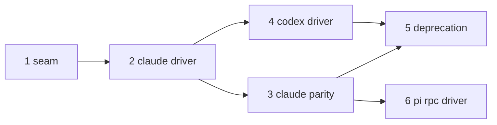

# Agent SDK sessions - phased implementation

Source plan: `docs/plans/agent-sdk-sessions/plan.md` (rendered at `plan.html`).
This index turns it into six merge units. Phase files (`phase-<n>-<slug>.md`, beside this
file) are the authoritative per-phase instructions.

## Incorporated human decisions (submitted 2026-07-24)

| Decision | Selection | Consequence |
|---|---|---|
| Codex transport | `codex app-server` (JSON-RPC) | Phase 4 speaks app-server in one adapter with generated typed bindings; `@openai/codex-sdk` is not used |
| Toggle scope | Harnesses settings panel only | No per-dispatch runtime override; `sessionRuntime` is one per-agent default read at dispatch time |
| Terminal handoff | Built with the Claude driver | "Continue in terminal" ships in phase 2, not phase 3 |
| Default flip | No - operator flips each toggle | Phase 5 never changes stored defaults; deprecation is docs plus retiring SDK-unreachable machinery |
| pi RPC driver | In scope, final phase | Phase 6 exists; pi's `runtimes` gains `"sdk"` there |
| Follow-up | Phased implementation plan | This document |

## Repository findings that shaped the phases

Verified against the worktree at planning time (implementers re-verify at execution):

- **The seam exists.** `ControlSpec` declares `{ kind: "stream-json" }` unimplemented
  (`src/server/harness/types.ts:434-476`); `controlFor(session)` takes a `Session`
  (`src/server/harness/index.ts:196`); exactly two refusal sites (`actions.ts:909`,
  `:970`) are tested by `test/harness-control.test.ts`.
- **Sessions are discovered, never registered.** The registry's only entry point is
  `applyDiscovery` (`registry.ts:770-830`); eviction is "unseen by a completed sweep"
  (`:803-812`). SDK subprocesses have no tty, so discovery will never see them (its
  interactive rule requires one) - phase 1 must add a registration path and scope
  eviction.
- **The ordering point for restart reconciliation** is `startPoller(registry)` at
  `src/server/index.ts:140`; a comment at `:135` already records that ensemble resume
  waits on the first sweep. Supervisor restore must complete before that line runs.
- **`canWriteTo` operates on `PaneHandles`** (`@shared/pane.ts:104`), implemented by both
  `Session` and `DiscoveredSession`. The new `canMessage` needs `runtime`, so it takes
  `PaneHandles & { runtime: SessionRuntime }` and only Session-shaped call sites move to
  it; `DiscoveredSession` consumers (e.g. the `paneDialog` stickiness fallback at
  `registry.ts:929-934`) stay on `canWriteTo`.
- **The settings surface is `src/web/lib/settings-registry.ts` + `SettingsPage.tsx` +
  `HarnessesPanel.tsx`** (AGENTS.md's `SettingsModal.tsx` reference is stale). No new
  settings category is needed: the runtime control lands inside the existing per-agent
  Harnesses cards, and `HarnessesConfig` (`src/server/harnesses.ts`) is the documented
  dispatch-time blob (schema in `protocol.ts`, hand-written patch blocks).
- **There is no `harness/claude/launch.ts`.** Claude launch config is assembled inline in
  `dispatcher.ts` from `dispatchPermissionMode`, its terminal argv renderer,
  `EffortSpec.launchArgs`, and `askChannelArgs`. The SDK branch composes from the same
  sources; it does not invent a launch module the terminal path never had.
- **`PaneDialog` already ships to the browser** (`@shared/types.ts`, comparator `byJson`
  in `registry.ts`, rendered by `PaneDialogPrompt.tsx`, answered via
  `POST /select-option` and `/submit-options` in `routes.ts`). Extending it with optional
  fields is wire-compatible.
- **Foreman is HTTP-only** (`foreman/client.ts`); everything it needs for SDK sessions
  must arrive via existing routes or the `Session` payload, never a new process coupling.
- **PR provenance** requires authorship evidence (`prCreated` from the hook matching
  `gh pr create`, via `@shared/pr-command.mjs` `opensPullRequest`); the Claude driver
  pairs that pre-tool command evidence with the matching post-tool URL before emitting.
  A driver event must feed the same rule, not a `prUrl` sniff.
- **SDK subprocess binary resolution**: the Agent SDK auto-detects `claude` on PATH; the
  adapter must pin it to `resolveAgentBin("claude")` (env override or the SDK's
  executable-path option - verify against the installed SDK version at implementation).
  Same for `codex app-server` via `resolveAgentBin("codex")`. Any driver subprocess
  inheriting the daemon's environment strips `TMUX_PANE`, `WEZTERM_PANE`, and
  `TERM_PROGRAM` so hooks cannot attribute it to the daemon's own pane.
- **Packaging**: the daemon bundles to `dist/server/index.mjs` (esbuild); a new npm
  dependency must survive that bundle and electron-builder's `files:` allowlist, with
  asar disabled. Phase 2 owns this for `@anthropic-ai/claude-agent-sdk`; phase 4 adds no
  runtime dependency (app-server is spoken over stdio to the codex binary).

## Phases

| # | File | Merge unit | Direct prerequisites |
|---|---|---|---|
| 1 | `phase-1-runtime-seam.md` | The runtime axis, registration/eviction seam, request-shape extensions, `SdkSpec` slot, supervisor skeleton + `sdk_sessions` table. No behavior change | - |
| 2 | `phase-2-claude-driver.md` | Claude Agent SDK adapter, dispatch branch, `sessionRuntime` config + panel toggle, answer routing, resume-on-restart, terminal handoff | 1 |
| 3 | `phase-3-claude-parity.md` | Foreman structured answers + prompt runtime projection, work queue over acked send, reset/clear, skills+wrap-up delivery, cost verification, PR provenance | 2 |
| 4 | `phase-4-codex-driver.md` | Codex app-server adapter (generated bindings), approval projections, mode/effort mapping, thread resume | 2 |
| 5 | `phase-5-keystroke-deprecation.md` | Retire SDK-unreachable dispatched-session machinery, defaults untouched, README/AGENTS.md deprecation docs, full E2E gate | 3, 4 |
| 6 | `phase-6-pi-rpc-driver.md` | pi `--mode rpc` adapter, `extension_ui_request` projection, pi `runtimes` + work-queue revisit | 3 |

## Dependency graph and concurrency

- **Concurrent group A**: phases 3 and 4 (both depend only on 2; phase 3 edits
  foreman/queue/reset surfaces, phase 4 adds `harness/codex/sdk.ts` and codex
  declarations - disjoint files, either merge order).
- **Concurrent group B**: phases 5 and 6 (5 needs 3+4, 6 needs 3; both touch README in
  different sections - trivial adjacency, either merge order).
- Numbering is topological presentation order, not serialization.

## Cross-phase contracts

Named once here; each phase file restates the ones it inherits or owns.

- **C1 (P1): the runtime axis.** `SessionRuntime = "terminal" | "sdk"` and
  `Session.runtime` in `@shared/types.ts`; comparator `byValue`; SDK ids `sdk:<uuid>`;
  `NameSource` gains `"sdk"`. Later phases never branch on an id prefix - always on
  `runtime`.
- **C2 (P1): the delivery predicate.** `canMessage(s)` in `@shared/pane.ts` =
  `canWriteTo(s) || s.runtime === "sdk"`, over `PaneHandles & { runtime }`.
  `canWriteTo` keeps its literal pane meaning. The call-site assignment table in phase 1
  is exhaustive; later phases must not re-derive either predicate by hand.
- **C3 (P1 shape, P2 answering): the request shape.** `PaneDialog` gains optional
  `source` / `requestId` / `kind` / `questions`; absent fields mean a pane dialog.
  `/select-option` keeps `{number, label}` semantics on both runtimes (label verified via
  `optionRowMiss` on both); `/submit-options` keeps the pane `{options}` body and adds a
  driver `{answers}` body keyed per question. Each shape is refused on the other runtime.
- **C4 (P1): the driver interface.** `SdkSpec` / `SdkLaunchOptions` / `SdkSessionHandle`
  / `SdkEvent` in `server/harness/types.ts`; `Harness.sdk: SdkSpec | null`; pure
  `HarnessCapabilities.runtimes: readonly SessionRuntime[]`; contract test pins
  `runtimes.includes("sdk") === (HARNESSES[a].sdk !== null)`. Adapters (P2/P4/P6) are
  constructed over an injectable transport seam (the `PaneDeps` pattern) so tests drive
  real adapters on scripted frames. P2 extends the seam with
  `SdkSpec.resumeArgv(agentSessionId)` for harness-neutral terminal handoff and nullable
  `SdkSessionHandle.setEffort`.
- **C5 (P1): registration and eviction.** `registry.registerSdkSession`,
  `registry.applyDriverEvent`, supervisor-driven removal via the existing
  exited-then-`session_remove` sequence; `applyDiscovery` eviction scoped to
  `runtime === "terminal"` entries; supervisor restore completes before
  `startPoller(registry)`. P2 adds append-only `suspended` status for clean daemon
  shutdowns so startup reconciliation keeps interrupted work alive. `bound` events fill
  `agentSessionId` / `transcriptPath` and set `instrumented` / `stateConfirmed` /
  `hooksSeen` true, which is what keeps the file-based read path and every
  hooks-instrumentation gate working unchanged.
- **C6 (P2): the toggle.** `HarnessesConfigSchema.sessionRuntime` per-agent map,
  default `"terminal"`, hand-written patch entries, unknown persisted values fall back to
  `"terminal"` and report; `resolveDispatchRuntime(agent)` gates on
  `HARNESSES[agent].sdk !== null`. Panel control only for agents whose `runtimes`
  includes `"sdk"`. No per-dispatch override anywhere (resolved decision).
- **C7 (P2): the dispatch branch.** One branch in `Dispatcher.dispatch` after identical
  worktree provisioning. SDK dispatches: no terminal home (`Task.homeName` stays null),
  no `awaitReady`, no `deliverIntent`; task liveness for SDK sessions is answered by the
  supervisor (true/false, never null).
- **C8 (P2): handoff.** `POST /api/sessions/:id/handoff` (SDK sessions only): graceful
  driver stop, terminal home launched with the harness's resume argv, decorations follow
  `noteKeyFor` through the existing rebind machinery.
- **C9 (P3): automation grammar.** `promptHarness` gains `runtime`; driver multi-question
  forms are answered via `answer.form`; queue delivery for SDK sessions rides the acked
  `send()` with no `mayHaveLanded` / `paneBlocked` / pane-recreated arms;
  `foremanAutomationAuthorized` gains the runtime-aware arm (SDK sessions are
  instrumented by construction). P6 relies on this arm for pi.
- **C10 (P4): Codex transport.** One `codex app-server` subprocess per session (crash
  isolation, per-session `-c` config scoping); generated bindings committed and pinned to
  the launched binary version; the protocol is spoken only inside
  `harness/codex/sdk.ts` and its bindings module.
- **C11 (P6): pi transport.** `pi --mode rpc` JSONL (LF-only framing - not Node
  `readline`, per pi's own docs); `extension_ui_request` projects into C3;
  `new_session` implements `clearContext`; pi's work-queue capability is revisited on top
  of C9's runtime arm.

## Merge order and final verification

Merge 1 → 2 → (3 ∥ 4) → (5 ∥ 6). After phase 5: dispatching Claude and Codex with the
toggle on runs end to end (dispatch → structured asks answered from the card and by
Foreman → queue → wrap-up → PR adopted by the Inspector) with zero keystroke writes, and
with the toggle off the terminal path is byte-identical to today. After phase 6 the same
holds for pi. Defaults remain `"terminal"` everywhere; flipping them is an operator act
in settings, per the resolved decision. Every phase leaves CI green
(`npm run typecheck`, `npm test`, `npm run build`, bundle smoke) on Node 24 and 26.
