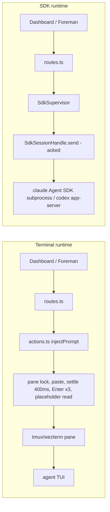
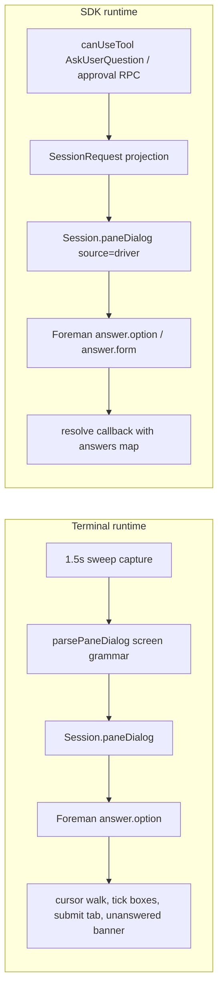
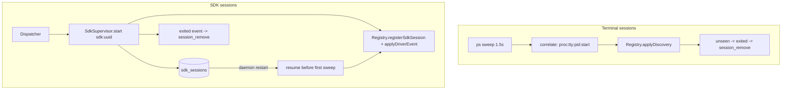

# Agent SDK sessions

Dispatched sessions today are driven by typing into terminal panes: bracketed paste, a
measured settle window, an Enter that may or may not land, and a screen-scrape parser that
reads permission prompts and `AskUserQuestion` menus off a pane capture so a cursor walk
can answer them. This plan migrates dispatched Claude and Codex sessions to their vendors'
programmatic interfaces - the Claude Agent SDK and Codex's `app-server` protocol - behind a
shared abstraction, selected by a settings toggle, without adding new agent ids and without
touching sessions an operator starts themselves.

The plan answers three questions:

1. **What would we lose?** A precise tradeoff inventory (section: Tradeoffs).
2. **What is the abstraction?** A per-session *runtime* axis behind the seams the codebase
   already declared for this (section: Architecture).
3. **How do we cut over and deprecate?** Toggle-gated phases that leave the terminal path
   intact for operator-started sessions (section: Phases).

## Where the terminal path is today

Four choke points carry every write to a session, and one parser carries every structured
read:

- `injectPrompt` / `sendText` (`src/server/actions.ts`) - paste, settle 400ms, Enter,
  verify against a paste placeholder the harness may not render (`submitVerified: false`
  for Codex and pi, which declare `pastePlaceholder: null`).
- `selectPaneOption` / `submitPaneForm` (`actions.ts`) - answer a menu by walking the
  cursor row by row, re-reading the pane after every keystroke; multi-select forms tick
  checkboxes and walk to a Submit tab, refusing on an "unanswered" banner.
- `parsePaneDialog` (`src/server/discovery/pane-dialog.ts`) - the harness-neutral screen
  grammar (numbered block, exactly one cursor row) with per-harness tokens in `DialogSpec`
  (cursor glyph, checkbox form vocabulary).
- The 1.5s discovery sweep (`discovery/processes.ts`, `correlate.ts`) - sessions exist
  because `ps` found a process on a tty; identity is `proc:<tty>:<pid>:<startMs>`.

The seam for this migration already exists and is deliberate: `ControlSpec`
(`src/server/harness/types.ts:434-476`) declares `{ kind: "stream-json" }` with zero
implementations, `controlFor(session)` takes a `Session` rather than an `AgentType`
precisely so "the delivery path asks the SESSION how to talk to it", and exactly two call
sites refuse the unimplemented variant by name (`actions.ts:909`, `:970`). The
pluggable-integrations plan calls this "the seam that makes headless dispatch possible
later". This plan is that later.

## Research findings

### Claude: the Agent SDK (`@anthropic-ai/claude-agent-sdk`)

The TypeScript SDK spawns the `claude` CLI as a subprocess and drives it over the
stream-json control protocol. Everything the pane path scrapes arrives structured:

- **Sessions**: streaming input mode (an `AsyncIterable` of user messages) holds one
  process across many turns; `interrupt()`, `resume: <sessionId>`, `forkSession`. Session
  files land in `~/.claude/projects/<encoded-cwd>/` - the same storage the interactive CLI
  uses, so an SDK session can later be resumed in a terminal (`claude --resume <id>`) and
  vice versa.
- **Permissions**: `canUseTool(toolName, input, {suggestions})` is called for anything the
  mode does not settle; the caller answers `{behavior: "allow"|"deny", updatedInput,
  updatedPermissions}`. `permissionMode` accepts the same values our `PermissionMode`
  union already models, and `setPermissionMode` / `setModel` work live on the query.
- **`AskUserQuestion` (the multi-select case)**: arrives as a `canUseTool` call carrying
  `questions: [{question, header, options: [{label, description}], multiSelect}]`; the
  answer is returned as `updatedInput.answers`, mapping each question to a label or an
  array of labels, with free text supported. No tabs, no checkboxes, no Submit walk, no
  "you have not answered all questions" banner - the entire `DialogFormSpec` machinery has
  no SDK equivalent because the problem it solves does not exist there.
- **Hooks**: in-process callbacks for the full event set (PreToolUse, PostToolUse, Stop,
  Notification, SessionStart/End, PermissionRequest, ...). Machine-installed
  `~/.claude/settings.json` hooks also still fire in the subprocess.
- **Everything else**: MCP servers via `options.mcpServers`; skills and CLAUDE.md via
  `settingSources`; `/clear` and `/compact` sent as user messages; images as base64
  content blocks in streaming input; per-turn usage and `total_cost_usd` on result
  messages; `maxThinkingTokens` / effort via options.

### Codex: the SDK cannot answer approvals; `app-server` can

This is the decisive Codex finding. `@openai/codex-sdk` is a thin wrapper over
`codex exec --experimental-json`: approval policy is **pre-set** (`approvalPolicy`,
`sandboxMode`) and there is no callback - a headless run either auto-decides or fails.
Human-input tools (`request_user_input`, `ask_user_question`) are stripped from the
toolset in exec mode. The SDK's only interrupt is killing the subprocess.

`codex app-server` - the JSON-RPC-over-stdio interface the IDE extension, the Desktop
app, and the official Python SDK use - surfaces everything we need:

- **Approvals as answerable server-to-client requests**: v2
  `item/commandExecution/requestApproval` and `item/fileChange/requestApproval`, answered
  `accept` / `decline` / `cancel`.
- **Threads and turns**: `thread/start`, `thread/resume`, `thread/fork`, `turn/start`
  (with per-turn model / effort / sandbox overrides), `turn/interrupt`, and
  `turn/steer` - input appended to an in-flight turn, which no other Codex interface has.
- **Programmatic equivalents of TUI-only commands**: `thread/compact` (`/compact`),
  `review/start` (`/review`), `account/rateLimits/read`.
- **Typed bindings** generated from the pinned binary: `codex app-server generate-ts`.
- **Shared rollouts**: sessions land in `~/.codex/sessions/` like every other Codex
  surface; the interactive TUI resumes them (`codex resume`, with
  `--include-non-interactive` in its picker).

Caveat: the protocol is documented as experimental with no third-party stability
guarantee. Mitigation is the generated bindings against the binary we launch, plus the
adapter isolation below - the protocol is spoken in exactly one module.

### pi: has a first-class RPC mode

In scope as this plan's final phase (a resolved decision, below): `pi --mode rpc` is
LF-delimited JSONL over stdio with `prompt` / `steer` / `abort` / `switch_session` /
`fork` / `set_model` / `set_thinking_level` / `compact`, full streaming events, and -
notably - interactive dialogs surfaced as `extension_ui_request` (`select` / `confirm` /
`input`) that the client answers over stdin. That last part matters doubly for pi: it has
no hooks and no readable TUI grammar today, so the RPC driver is the first time a pi
session gets structured needs-you evidence at all. One caveat to design around: pi
enforces no tool approvals itself (permission gating is an extension concern), so the
driver surfaces whatever dialogs pi's configured extensions raise rather than a built-in
approval stream.

## Tradeoffs

The direct answer to "is there any current functionality we'd lose?".

### Lost or changed

| What | Today (terminal) | Under the SDK runtime | Severity |
|---|---|---|---|
| Surviving daemon death | tmux keeps the agent running if the daemon crashes or restarts; the sweep re-adopts it | SDK subprocesses are daemon children: a daemon restart interrupts the in-flight turn. Conversation state survives (session files); the supervisor resumes on startup, but the interrupted turn's remaining work is lost and must be re-prompted | The one real regression. Mitigated by resume-on-start and graceful drain on shutdown; accepted because the daemon is already the control plane for everything else about a dispatched session |
| Glanceable terminal presence | Every session is a wezterm/tmux pane you can look at and type into | No pane. The dashboard transcript stream is the view; taking over means an explicit handoff (below), not wandering into a terminal | Medium. The shared session storage makes handoff first-class: `claude --resume <id>` / `codex resume <threadId>` continue the same conversation interactively |
| Codex live TUI menus | `/permissions` picker driven by keystrokes; `/model`, `/status` readable | No slash commands headless. Permission posture becomes per-turn `turn/start` overrides (approval policy + sandbox); `/compact` and `/review` become `thread/compact` / `review/start`; `/status` facts come from the event stream | Low. Every lost menu has a structured replacement |
| Codex protocol stability | The TUI's screen grammar (also unstable, also unversioned) | `app-server` is explicitly experimental. Pinned, generated bindings; one adapter module absorbs drift | Low, and strictly better than screen-scraping the same vendor's TUI |
| Claude TUI chrome | Todo strip, background-bash UI, spinner | Narration still comes from the transcript file (unchanged reader); background bash has no UI equivalent | Cosmetic |
| `/login` and first-run auth | An operator can log in inside the pane | SDK requires auth to already exist (subscription login or API key) - but dispatched sessions already assume this today | None in practice |
| pi dispatch | Terminal panes | Unchanged until the pi RPC driver lands (this plan's final phase); terminal until then | None |
| Operator-started sessions | Discovered from `ps`, read passively, driven by keystrokes | **Completely unchanged.** Discovery, pane dialogs, Foreman's cursor walks, the whole keystroke stack stays for sessions we do not own | None - and this is why "deprecate terminal use" means "for dispatched sessions", not deletion of the pane stack |

### Gained

- **Delivery stops being probabilistic.** `send()` acks; there is no settle window, no
  paste placeholder, no `submitVerified: false`, no Enter swallowed by a mention popup
  (the entire measured Codex `$skill` popup dance in `SkillsSpec.invoke` exists because of
  one Enter), no pane lock, no copy-mode probe, no capture-miss tolerance counter.
- **Menus stop being screens.** A permission prompt is a callback with the tool name and
  input as data; an `AskUserQuestion` multi-select is a typed form with free-text support;
  a Codex approval is an RPC carrying the exact command and diff. Foreman's answer is
  delivered exactly - the failure class where a dialog swallows typed characters and Enter
  confirms the default row (documented at length in `pane-dialog.ts`) is structurally gone.
- **The folder-trust dialog disappears** for SDK sessions (waived for non-TTY runs) - the
  dialog that motivated the `--permission-mode` launch-flag work (#223).
- **True interrupt, live mode/model changes** (`interrupt()`, `setPermissionMode`,
  `setModel`, `turn/steer`) instead of TUI walks that read footers which dialogs hide.
- **Exact usage**: per-turn tokens and cost on the event stream, rather than inferred.
- **Dispatch verification collapses**: `awaitReady`'s 20s hook wait, pi's session-file
  polling, and `waitForSessionAtCwd` all become "the SDK reported init".

### Unchanged by design

- **The read path stays file-based.** Both SDKs write the same session files the CLIs
  write (`~/.claude/projects/`, `~/.codex/sessions/`), so `transcript.locate` /
  `passiveRead` / `messages`, goal reading, queue verification windows, Codex usage
  ledger, and the transcript SSE stream all keep working with zero changes. The driver
  replaces the *write* path and the *state* path, never the read path.
- **Worktree provisioning, pinned bases, the pool** - identical; the dispatcher swaps
  only the "spawn a terminal home" step.
- **Task lifecycle contracts** - `session_remove` remains the durable signal;
  `agentWentAway` and the startup reconciliation twins keep their semantics (details
  below).
- **The MCP ask-channel descriptor** (`mission-mcp.ts`) is rendered into SDK options
  instead of argv; same single declaration.

## Architecture

### The axis is a per-session runtime, not a new harness

An SDK-backed Claude session is still Claude on every axis the registries measure - same
transcript format, same skills directory, same models, same identity, same accent. A
`claude-sdk` agent id would give one product two settings cards, two model catalogs, two
entries in every `agentList()` sentence, would fragment the hook-overlay namespace
(`overlayFor` matches on `agent`), and would silently become the ensemble default if it
ever landed at `AGENT_TYPES[0]`. The fact being encoded is *how this particular session
is driven*, which is exactly what `controlFor(session)` was shaped to answer.

So:

```ts
// @shared/types.ts
export type SessionRuntime = "terminal" | "sdk";

export interface Session {
  // ...
  /**
   * How Mission Control talks to this session: "terminal" for pane-backed sessions
   * (discovered or dispatched into a terminal home), "sdk" for sessions the daemon runs
   * through the harness's programmatic interface. Fixed for the life of an entry - a
   * takeover ends the SDK session and discovery adopts its terminal successor as a new
   * entry.
   */
  runtime: SessionRuntime;
}
```

`SESSION_FIELD_COMPARATORS` gains `runtime: byValue`. `NameSource` gains `"sdk"`.
SDK session ids are `sdk:<uuid>` (minted by the supervisor), disjoint from
`proc:<tty>:<pid>:<startMs>` by construction.

### The harness slot: `SdkSpec`

One new nullable capability on the server-side `Harness`, following every existing
purity-split rule:

```ts
// src/server/harness/types.ts
export interface Harness extends HarnessCapabilities {
  // ...
  /** How to run this harness embedded, or null when no driver exists (yet). */
  sdk: SdkSpec | null;
}

export interface SdkSpec {
  /** Start (or resume) an embedded session. Rejects rather than degrades. */
  launch(opts: SdkLaunchOptions): Promise<SdkSessionHandle>;
}

export interface SdkLaunchOptions {
  cwd: string;
  prompt: string;                       // the task intent, delivered as turn one
  model: string | null;
  effort: ThinkingLevel | null;
  permissionMode: PermissionMode | null; // from dispatchPermissionMode, same source as argv today
  mcp: McpLaunchDescriptor | null;       // rendered from mission-mcp.ts's single descriptor
  resume: string | null;                 // harness-native session/thread id, for restarts
}

export interface SdkSessionHandle {
  /** Structured lifecycle; the supervisor's only view of the session. */
  events: AsyncIterable<SdkEvent>;
  /** Deliver a user turn. Resolves when the harness accepted it - the ack injectPrompt never had. */
  send(turn: { text: string; images?: SdkImage[] }): Promise<void>;
  interrupt(): Promise<void>;
  /** Resolve a pending SessionRequest (permission, question, approval). */
  answer(requestId: string, answer: SessionRequestAnswer): Promise<void>;
  /** Live controls; null when this driver cannot (mirrors capability-null doctrine). */
  setPermissionMode: ((mode: PermissionMode) => Promise<void>) | null;
  setModel: ((model: string) => Promise<void>) | null;
  clearContext: (() => Promise<void>) | null;
  stop(): Promise<void>;
}

export type SdkEvent =
  | { kind: "bound"; agentSessionId: string; transcriptPath: string | null }
  | { kind: "state"; state: "working" | "idle"; activity: string | null }
  | { kind: "request"; request: SessionRequest }
  | { kind: "request_resolved"; requestId: string }
  | { kind: "turn_done"; usage: SdkUsage | null }
  | { kind: "pr_created"; url: string | null }   // gh pr create observed on the tool stream
  | { kind: "exited"; reason: string; resumable: boolean };
```

The two records stay honest about purity: the browser needs to know *whether* a harness
offers the SDK runtime (to draw the toggle), which is pure data, so
`HarnessCapabilities` gains `runtimes: readonly SessionRuntime[]`. A contract test pins
`runtimes.includes("sdk") === (HARNESSES[a].sdk !== null)` - the same one-fact-two-files
treatment `GOAL_UNSUPPORTED` gets from `harness-transcript.test.ts`.

Declarations as the phases land: claude `["terminal", "sdk"]` (phase 2), codex
`["terminal", "sdk"]` (phase 4), pi `["terminal"]` with `sdk: null` until its driver
phase (phase 6) - a real absence (no adapter built yet), taking the tested degradation in
the interim: the toggle does not render, dispatch stays terminal, and the panel sentence
is composed from the capability, not typed at the surface.

### The supervisor

`src/server/sdk/supervisor.ts`, **in the daemon** - the Inspector precedent, for the
Inspector's reasons: a packaged Electron build must have it, and its state must survive
restarts. The Foreman stays a separate HTTP-only process and never touches it directly.

Responsibilities:

- Owns the `SdkSessionHandle` map; serializes `send()` per session (the pane lock's job,
  without the pane).
- **Registers sessions with the registry** - the counterpart of `applyDiscovery` for
  sessions that no `ps` sweep will ever see (SDK subprocesses have no tty and are
  invisible to discovery by its own "interactive sessions require a tty" rule; a
  belt-and-braces `detect.background` addition keeps any future tty-holding form out of
  the sweep). It mints `sdk:<uuid>` ids, feeds `bound` events into the same identity slots
  hooks fill today (`agentSessionId`, `transcriptPath` - which is what keeps the entire
  file-based read path working), and applies `state` / `request` events through a new
  `registry.applyDriverEvent`, a first-class ingest beside `applyHook`. No attribution
  guard is needed: the supervisor *owns* the binding it reports, which is a stronger claim
  than any hook can make.
- **Persists** to a new `sdk_sessions` table (id TEXT PRIMARY KEY NOT NULL, agent,
  agent_session_id, cwd, task_id, model, effort, permission_mode, status, timestamps).
  New table, so `migrate()` needs nothing; no REFERENCES clauses (the ensemble family
  stays the only one).
- **Resumes on startup**: restore rows, relaunch handles with `resume`, register the
  sessions as `starting` - and this restore completes **before** the discovery poller
  starts, so `registry.onSessionsObserved` (the restart twin that settles orphaned tasks)
  sees SDK sessions on the first completed sweep exactly as it sees rediscovered terminal
  ones. A session whose resume fails is registered, marked `exited`, and evicted through
  the normal path so `TaskManager.reconcileTasksBoundTo` settles its task visibly.
- **Evicts**: `applyDiscovery`'s unseen-means-exited rule is scoped to `proc:` sessions;
  SDK sessions exit when their handle says so (`exited` event), through the same
  `state: "exited"` then `session_remove` sequence, so both existing subscribers
  (WorkflowManager, TaskManager) work unchanged.

### One request shape for menus, permissions, questions, approvals

This is the multi-select special case, resolved by making the pane dialog one *producer*
of a shared shape rather than the shape itself.

`PaneDialog` (`@shared/types.ts`) is already the wire shape the dashboard renders and
Foreman answers: numbered options with labels, details, optional `checked`, a
`highlighted` row, `multiSelect`, a `prompt`. It generalizes cleanly:

```ts
export interface PaneDialog {
  // existing fields unchanged: options, highlighted, multiSelect?, prompt?
  /** Where this came from. Absent means "pane" (wire compatibility). */
  source?: "pane" | "driver";
  /** Driver correlation id; answers must echo it. Absent for pane dialogs. */
  requestId?: string;
  /** What kind of ask this is; display only. Pane dialogs cannot classify themselves. */
  kind?: "permission" | "question" | "plan" | "approval" | "trust";
  /** Multi-question forms (Claude's AskUserQuestion carries several); absent for pane
   *  dialogs, which only ever see one tab at a time. */
  questions?: SessionRequestQuestion[];
}
```

Per-harness projection into that shape:

| Source | Projection |
|---|---|
| Claude `canUseTool` (ordinary tool) | kind `permission`; options `Yes` / `Yes, don't ask again` (from `suggestions`) / `No`; answering resolves the callback with allow / allow+updatedPermissions / deny |
| Claude `AskUserQuestion` | kind `question`; one entry per question with its own options and `multiSelect`; free text allowed; answering resolves with `updatedInput.answers` |
| Claude `ExitPlanMode` | kind `plan`; the plan text as prompt; approve / keep planning |
| Codex `item/commandExecution/requestApproval` | kind `approval`; the command as prompt; accept / decline |
| Codex `item/fileChange/requestApproval` | kind `approval`; the diff summary as prompt; accept / decline |
| Pane parse (`parsePaneDialog`) | exactly what it produces today, `source` absent |

Answering routes by runtime, not by caller:

- `POST /sessions/:id/select-option` keeps its `{number, label}` body. For pane sessions
  it walks the cursor as today. For SDK sessions it verifies the label against the pending
  request (the same `optionRowMiss` rule - the miscount-catching label check is about
  callers, not panes, and exact labels make it strict) and resolves the callback.
- `POST /sessions/:id/submit-options` (multi-select) likewise: pane sessions run the form
  walk; SDK sessions resolve with the full answers map - no Submit tab, no unanswered
  banner, and free-text answers become possible instead of refused.
- Foreman's `answer.option` grammar is unchanged for single-select. `promptHarness`
  (`foreman/prompt.ts`) gains `runtime`, so the reviewer prompt states the true grammar:
  for SDK sessions the menu is data, prose answers ARE deliverable (a deny-with-message /
  free-text answer), and multi-question forms become answerable (`answer.form`) instead of
  `menuMismatch`'s blanket multi-select refusal.

`reportBucket`'s `activePaneDialog` check needs no change: a pending driver request lives
in the same field, so an SDK session with an open ask reads `needs-you` on every surface
that already asks that question.

One simplification falls out: dispatched Claude sessions today launch with
`--disallowed-tools AskUserQuestion` plus a redirect prompt steering asks into the MCP
ask-channel. SDK sessions re-enable the native tool - the card renders the question
directly, which is what the redirect was approximating.

### The delivery predicate

`canWriteTo` answers "is there a composer to type into", and ~20 call sites use it to mean
"can Mission Control deliver a turn". Those are different questions now:

- `canMessage(s)` (new, `@shared/pane.ts`): pane-writable OR `runtime === "sdk"`. Adopted
  by every delivery-intent call site: ActionBar/card `canSend`, the queue's `hasPane`
  gate, `TaskManager.assign`'s preflight, `clearsContext`, Foreman's `canSend`,
  `ModePicker` / `EffortPicker` enablement.
- `canWriteTo(s)` keeps its literal meaning for pane mechanics: focus, rename, pane locks,
  capture tolerance, the skills reload broadcast (SDK sessions need no nudge delivery via
  pane - see below).

The sweep is enumerated per call site in the phase work; `session-leaf-parity.test.ts` and
a new predicate test pin that no surface re-derives either by hand.

### Capability remaps for SDK sessions

The capabilities that are *strings typed into a composer* each get a driver-side answer
instead of a null:

| Capability | Terminal mechanism | SDK mechanism |
|---|---|---|
| `clearContext` | type `/clear` (`/new` for pi) | Claude: send `/clear` as a user message (supported input; supervisor rebinds the rotated session id). Codex: start a fresh thread on the same card - `handle.clearContext` owns which |
| `skills.invoke` (wrap-up) | single-line composer grammar incl. Codex's popup-closing clause | the same line delivered as turn text via `send()` - the clause machinery becomes inert but harmless for SDK delivery |
| `skills.reloadCommand` | typed at idle sessions holding a pane | Claude SDK: same line via `send()`; the pane-guard preconditions (mode line readable, pane idle) reduce to "driver idle" |
| `permissionModes.liveControl` | Shift+Tab cycle / `/permissions` menu | `handle.setPermissionMode`: Claude maps 1:1; Codex renders modes as per-turn approval-policy + sandbox overrides (mapping table in the Codex driver) |
| `effort.sessionPicker` | TUI picker walks | Claude: `setModel` + options; Codex: per-turn `modelReasoningEffort` override |

None of these become nulls - which matters, because every null on this table costs a real
feature (`workQueueBlockedReason`, wrap-up degradation to `ask`).

### Dispatch, the toggle, and the settings panel

`HarnessesConfig` (`src/server/harnesses.ts`) is the documented home for dispatch-time
defaults, read at dispatch time so a toggle mid-batch affects the next launch:

- Schema: `sessionRuntime: Record<AgentType, SessionRuntime>` defaulting every agent to
  `"terminal"`, with the hand-written per-agent patch blocks the existing keys use. A
  persisted value this build cannot read falls back to `"terminal"` and reports the drop
  (the `ResolvedLlmRunner.unknown` precedent) rather than guessing.
- `resolveDispatchRuntime(agent)`: config value, gated on the harness actually declaring
  the runtime (`HARNESSES[agent].sdk !== null`) - a toggle stored for a harness whose
  driver was removed dispatches terminal and says so.
- Panel: the Harnesses settings card per agent gains a runtime control, rendered only for
  agents whose capabilities declare `"sdk"`; the absence sentence is composed from the
  capability (`AGENT_IDENTITY`), never typed at the surface.
- `Dispatcher.dispatch`: after worktree provisioning (identical), branch once:
  - terminal: exactly today's path (home spawn, awaitReady, deliverIntent).
  - sdk: `supervisor.start({harness, cwd, prompt, model, effort, permissionMode, mcp})`.
    No home, no `awaitReady` hook wait (init IS ready), no `deliverIntent` paste (the
    prompt is turn one). `Task.homeName` stays null; task liveness for SDK sessions is
    answered by the supervisor (the `homeAlive` three-valued contract gets an sdk arm:
    the supervisor always knows, so it answers `true`/`false`, never `null`).

Resolved: the toggle lives in the Harnesses panel only - no per-dispatch runtime picker.
One per-agent default, read at dispatch time, is the whole consent surface.

### Automation parity

- **Foreman** (HTTP-only, unchanged process shape): `classifyPending` already keys on
  `activePaneDialog(s) || state === "awaiting_input"` - both fire for SDK sessions via the
  shared request field and driver state. The pane capture (`GET /sessions/:id/pane`)
  returns null for SDK sessions; the review prompt substitutes the structured request and
  transcript window, which is strictly more faithful than a 60-line viewport.
- **Work queue**: pickup/completion arrive as driver `state` / `turn_done` events (the
  hooks-shaped signals `foremanAutomationAuthorized` requires; SDK sessions are
  instrumented by construction, so `hooksSeen` semantics are satisfied at bind time).
  Delivery goes through `send()` with a real ack - `mayHaveLanded`, `paneBlocked`, and the
  pane-recreated guard have no SDK arm because their failure modes cannot occur; the
  verification path (`transcript.since` from the anchor offset) is unchanged.
- **Reset**: `resetSession` routes through `handle.clearContext()`; the work-episode
  rebind logic keys on the rotated `agentSessionId` exactly as the hook path does today.
- **Inspector / PR provenance**: `prCreated` proof currently comes from the hook bridge
  matching `gh pr create`. The driver watches the same fact on its tool stream
  (`pr_created` event) and feeds the same `adoptPr` path - authorship evidence, not a
  `prUrl` sniff, so the two-signal provenance rule is preserved.
- **Cost**: unchanged pipelines. Claude's OTEL telemetry env fires from the subprocess
  (settings-driven); Codex's rollout-based `codexUsage` reads the files SDK sessions still
  write. Driver `turn_done` usage is display enrichment, not a second ledger writer
  (verified against double-counting in phase 2).

### Terminal takeover

Because both vendors share session storage between their programmatic and interactive
surfaces, "let me drive" is an explicit handoff rather than a lost capability:

`POST /sessions/:id/handoff` (SDK sessions only): the supervisor stops the driver
gracefully, marks the SDK session exited (normal eviction settles nothing prematurely -
the task binding transfers), and launches a terminal home in the same cwd running
`claude --resume <agentSessionId>` / `codex resume <threadId>`. Discovery adopts the new
process; session decorations keyed by `noteKeyFor` follow the agent session id through the
same rebind machinery a `/clear` exercises today. The card gains a "Continue in terminal"
action where "Focus" renders for pane sessions.

## Flows

Delivery, before and after:



A multi-select, before and after:



Session lifecycle:



## Phases

1. **The seam** (no behavior change): `Session.runtime` + comparator, `canMessage` /
   `canWriteTo` split with the enumerated call-site sweep, `PaneDialog` extensions,
   `registry.registerSdkSession` / `applyDriverEvent` / eviction scoping, supervisor
   skeleton + `sdk_sessions` table, `SdkSpec` slot (all three harnesses `null`),
   `runtimes` capability + contract test.
2. **Claude driver, behind the toggle** (default stays terminal): the
   `@anthropic-ai/claude-agent-sdk` adapter, request projections (permission /
   AskUserQuestion / plan), dispatch branch, `sessionRuntime` config + Harnesses panel
   control, resume-on-restart, all four session-drawing components rendering runtime
   truthfully - and the "Continue in terminal" handoff, so the first SDK session an
   operator ever dispatches is never a trap.
3. **Automation parity on Claude**: Foreman structured answers + prompt runtime
   projection, work queue over `send()`, reset, wrap-up invocation, cost double-count
   verification, PR provenance events.
4. **Codex driver**: app-server adapter with generated bindings pinned to the launched
   binary, approval projections, per-turn permission/effort overrides, thread resume,
   parity re-run of phase 3's checklist.
5. **Deprecation of the dispatched-session keystroke surfaces**: defaults stay
   `"terminal"` - cut-over is the operator flipping each harness's toggle, never a
   default change (resolved decision). What this phase retires is the machinery only
   SDK-runtime dispatch makes unreachable (`awaitReady`'s hook wait and prompt-acceptance
   polling on SDK dispatches, the ask-channel AskUserQuestion redirect for SDK sessions),
   and it documents the enduring terminal surface: operator-started sessions, and
   Foreman's pane-menu answering for sessions we do not own.
6. **pi RPC driver**: a pi adapter over `--mode rpc` behind the same `SdkSpec` - JSONL
   transport, `prompt`/`steer`/`abort`/`switch_session`, `extension_ui_request` dialogs
   projected into the shared request shape, pi's `runtimes` gaining `"sdk"` and the
   Harnesses toggle appearing for it. This is also where pi first gains structured
   needs-you evidence and a deliverable work queue signal (its `workQueue: null` and
   `hooks: null` were both consequences of having no push channel; the driver IS one),
   so those capability declarations are revisited for SDK-runtime pi sessions.

Each phase lands green with the existing suites; new contracts get their own tests
(`session-runtime.test.ts`, `sdk-supervisor.test.ts`, `sdk-requests.test.ts`,
`harness-sdk.test.ts` pinning the runtimes/spec agreement, dispatch branching in
`dispatcher-runtime.test.ts`), each seamed the way the terminal axis is - the driver
adapters take a fake transport the way `PaneDeps.pane` takes a fake subprocess.

## Resolved decisions

Submitted from the Mission Control dashboard on 2026-07-24:

1. **Codex transport: `codex app-server`.** The only interface with answerable
   approvals; the official `@openai/codex-sdk` was rejected because it reduces approvals
   to pre-set policy. Drift risk is absorbed by generated typed bindings pinned to the
   launched binary, spoken in exactly one adapter module.
2. **Toggle scope: Harnesses settings panel only.** One per-agent default read at
   dispatch time; no per-dispatch override.
3. **Terminal handoff: built with the Claude driver (phase 2).** The first SDK sessions
   ship with the escape hatch.
4. **No default flip.** The stored default stays `"terminal"` for every harness;
   cut-over is the operator flipping each toggle in settings.
5. **pi RPC driver: in scope, as the final phase (6).**

## Documentation

README gains: a Session runtimes section (what the toggle does, what changes for a
dispatched session, the handoff action), a Configuration line for any new env, and the
keyboard/action table entry for handoff. `docs/plans/pluggable-integrations/plan.md`'s
`stream-json` note gets a pointer here. `AGENTS.md` gains the supervisor's invariants
(in-daemon like the Inspector, restore-before-first-sweep, eviction scoping) in the
architecture table and the session-going-away section.
