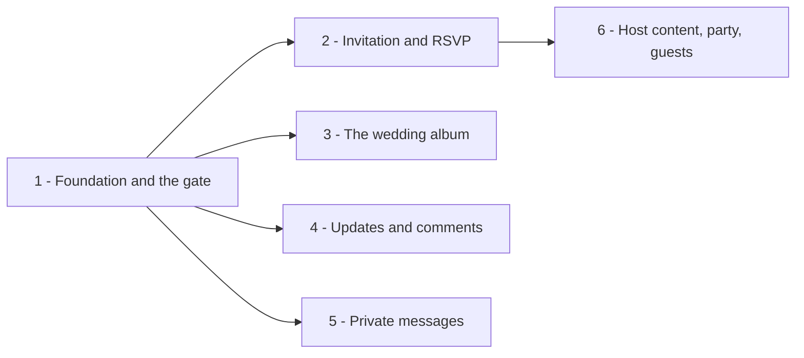

# Anniversary party site - phased implementation

Source plan: [`plan.md`](plan.md) (rendered: [`plan.html`](plan.html)).
Chosen visual direction: [`mockups/b-blue-hour.html`](mockups/b-blue-hour.html).

**The implementation repository is `mancej/rsvp`, not this one.** Every phase below is implemented
in that repository, with this checkout attached read-only so the phase agent can read the plan.

## Incorporated decisions

These came back from the plan review and are requirements now, not options:

| Decision | Resolution |
|---|---|
| Supabase project placement | A **new organization on the Free plan**, with a daily Vercel Cron keepalive |
| Guest identity | **Cookie only**, plus a merge tool in `/host`. No resume codes. |
| Photo hosting | **Private Supabase Storage bucket**, signed URLs minted server-side |
| Host notifications | **None.** No email provider. Unread counts live in the host console. |
| Visual direction | **B - Blue hour.** A dark-only theme; tokens are recorded in `plan.md`. |

## What I found before decomposing

| Finding | Evidence | Consequence for the phases |
|---|---|---|
| The implementation repository is **greenfield** | `mancej/rsvp` created during this session; contains `README.md` and nothing else. No `package.json`, no framework, no CI, no `AGENTS.md`. | Phase 1 is unusually large because every shared contract has to be invented, not extended. There is no existing code to reconcile the plan against. |
| A phase agent arrives with **no repository conventions** | The multi-repository dispatch manifest tells an agent to read each repository's own `AGENTS.md`; `mancej/rsvp` has none, and only the primary repository's instructions load automatically. | **Phase 1 must write `AGENTS.md` in `mancej/rsvp`.** Without it, phases 2 to 6 arrive with no statement of the server-only-key rule, the token file, or the no-raw-HTML rule, and will each re-derive them differently. |
| The Supabase MCP **cannot create an organization** | The tool surface offers `list_organizations`, `create_project`, `apply_migration` and friends - there is no `create_organization`. `create_project` requires an existing `organization_id`. | Creating the Free organization is a **human prerequisite of Phase 1**, not agent work. Phase 1 also needs the project URL and service role key handed to it. |
| The Supabase GitHub integration is configured in the dashboard | Supabase docs describe enabling it from project settings, not from an API. | Phase 1 states the dashboard steps as human prerequisites and verifies the result, rather than pretending to automate them. |
| Vercel project creation and env vars **are** automatable | The Vercel MCP exposes `create_git_project`, and the Vercel CLI sets environment variables. | Phase 1 can do the Vercel half itself once the repository exists. |
| Vercel team is on **Pro**, Supabase's only existing org is on **Pro** | Read from the live APIs during planning; recorded in `plan.md`. | Confirms the new-Free-org decision has a real cost consequence and is not a formality. |
| The party is **62 days out** (Saturday 14 November 2026) | Confirmed against today's date, 13 September 2026. | Sets the phase priority: the gate, the invitation and the RSVP come first because invitations want sending. The album, updates and messages can land afterwards without holding anything up. |

## Sizing

**Estimated total: 3,500 to 4,500 non-test implementation lines**, excluding generated scaffold
output (`create-next-app`, lockfiles, Tailwind config) and excluding test files.

Assumptions behind the range: six guest-facing and host-facing surfaces rather than one; a full
schema with seeds written from scratch; a session and identity layer that cannot be borrowed from
an existing auth library because the model is a shared password plus an anonymous identity; and a
theme built from tokens plus hand-authored SVG rather than a component library.

That is an order of magnitude above the 200-line one-phase threshold, so more than one phase is
warranted. The count below is six, and each addition is justified against combining it with its
neighbour.

### Why six

- **Phase 1 cannot be split.** The schema, the session, the guest identity, the theme tokens, the
  app shell and the deploy pipeline are mutually dependent: any subset merged alone is a repository
  that does not run. It is the largest phase by design.
- **Phase 2 is deliberately the smallest thing that lets invitations go out.** Combining it with
  Phase 6's host editors would roughly double it and delay the only surface with a calendar deadline.
- **Phases 3, 4 and 5 are three unrelated features** - an album, a comment system, a message
  thread - sharing nothing but the shell Phase 1 provides. Combining any two produces a pull request
  that reviews two products at once, and combining all three produces roughly 1,500 lines in one
  unit. Kept apart they also run concurrently, which matters against the date.
- **Phase 6 is separated from Phase 2 because it depends on it** and because the host editors are
  the one part with no deadline pressure. Merging it into Phase 2 would put the critical-path work
  behind work that can wait.

No phase here is a preparation, test-only, documentation-only or cleanup phase. Each ends with a
site a person can use.

## Phases

| # | Phase | File | Depends on | Rough size |
|---|---|---|---|---|
| 1 | Foundation and the gate | [`phase-1-foundation-and-gate.md`](phase-1-foundation-and-gate.md) | - | ~1,100 |
| 2 | Invitation, RSVP and getting there | [`phase-2-invitation-and-rsvp.md`](phase-2-invitation-and-rsvp.md) | 1 | ~500 |
| 3 | The wedding album | [`phase-3-album.md`](phase-3-album.md) | 1 | ~520 |
| 4 | Updates and comments | [`phase-4-updates-and-comments.md`](phase-4-updates-and-comments.md) | 1 | ~540 |
| 5 | Private messages | [`phase-5-private-messages.md`](phase-5-private-messages.md) | 1 | ~470 |
| 6 | Host console: content, party and guests | [`phase-6-host-content-and-guests.md`](phase-6-host-content-and-guests.md) | 2 | ~560 |

Dependencies are **direct** prerequisites only. Phase 6 lists Phase 2, which implies Phase 1.

### Dependency graph

**Concurrency groups.** Phase 1 alone. Then phases 2, 3, 4 and 5 concurrently. Phase 6 after
Phase 2. Phases 3, 4 and 5 may still be in flight when Phase 6 starts; none of them shares a file
with it.

**Merge order.** 1, then any order among 2/3/4/5, then 6. Every pair among 2/3/4/5 merges cleanly in
either order because of the registry contract below.

## Cross-phase contracts

Phase 1 owns all of these. Phases 2 to 6 consume them and must not change them.

1. **The full schema ships in Phase 1**, including tables no phase-1 surface reads
   (`photos`, `posts`, `comments`, `messages`, `content_blocks`). Later phases add indexes and data,
   never columns to these tables. One migration that matches `plan.md` is easier to review than six
   that arrive piecemeal, and it removes every ordering hazard between the concurrent phases.
2. **Seed rows ship with the schema**, so every page has real copy to render before any editor
   exists. A phase-2 invitation page reads seeded `content_blocks` and `party` rows; it does not
   wait for Phase 6.
3. **`lib/supabase.ts` is the only module that constructs a Supabase client**, and it is
   server-only. No other file imports `@supabase/supabase-js`. No environment variable is prefixed
   `NEXT_PUBLIC_`.
4. **`lib/session.ts` owns both cookies** and exports `requireGuest()` and `requireHost()`. No later
   phase reads or writes a cookie directly.
5. **`lib/markdown.ts` is the single renderer**, with no raw HTML passthrough. Phases 2, 4 and 6 all
   render host-authored prose; they all call this. Phase 1 owns it and tests it even though Phase 1
   has no surface that renders prose, because the alternative is three incompatible renderers.
6. **`lib/theme.css` holds the direction-B tokens.** No component declares a colour literal, and
   there is no light variant - Blue hour is dark by design, not a night mode.
7. **Navigation is declared once, in Phase 1**, in `lib/nav.ts` (guest) and `lib/host-tabs.ts`
   (host). Phase 1 also creates every route those files point at as a minimal placeholder page.
   **Phases 2 to 6 replace their own page file and touch neither registry.** This is what makes the
   concurrent phases conflict-free: without it, four agents edit the same array and every pair
   collides. The placeholders are short-lived and honest ("The album goes here"), not broken states.
8. **Every guest-facing route is gated by the Phase 1 middleware.** A later phase adding a route
   under the guest tree inherits the gate; it does not re-implement one.
9. **`AGENTS.md` in `mancej/rsvp` states rules 3 to 8** so an agent arriving with only a phase file
   still finds them.

## Verification strategy

Each phase runs its own Playwright specs plus the whole accumulated suite, against the built app,
in CI. Phase 1 establishes the harness and the fake-free approach: there are no model tokens or
paid services in this product, so the specs drive the real app against a real Supabase project.

Two checks run in every phase because they are the ones that end the surprise or take the site down:

- **The home page ships no `og:image` and no occasion-naming metadata.** Asserted in Phase 1 and
  re-asserted by every phase that touches a page's metadata.
- **No route returns guest content without `party_session`.** Asserted in Phase 1 and extended by
  each phase for the route it adds.

The final state matches `plan.md` with no cleanup phase: Phase 6 is the last to merge and leaves no
placeholder behind, because each of phases 2 to 6 replaces the placeholder it inherits.

## Human prerequisites

These cannot be done by an agent and block Phase 1:

1. Create a **new Supabase organization on the Free plan** and one project inside it. The MCP has no
   `create_organization`.
2. Hand Phase 1 the project URL and **service role** key.
3. Enable the **Supabase GitHub integration** for `mancej/rsvp` in the project dashboard.
4. Choose the party and host passwords. Phase 1 generates the scrypt hashes from them.

One more input has a deadline rather than a blocker: **the party start time**. The mockups show 6pm
as a placeholder, and Phase 2 cannot ship an invitation without the real one.
