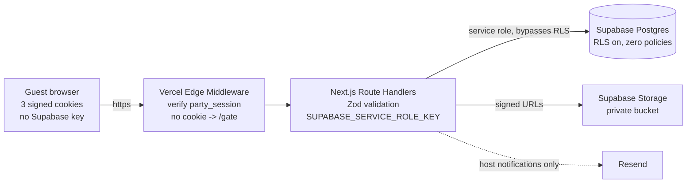
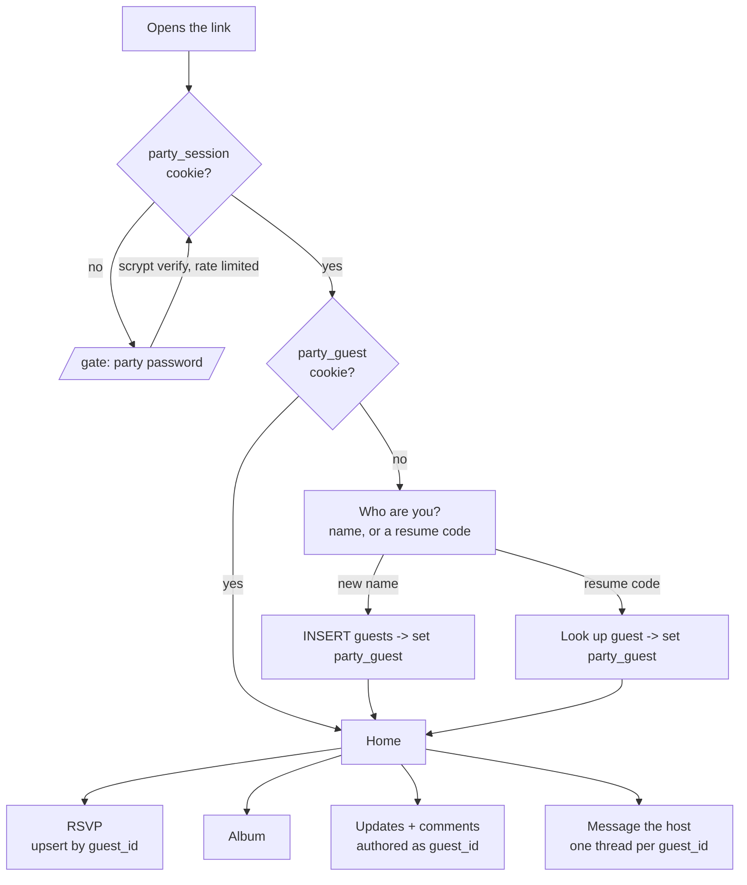
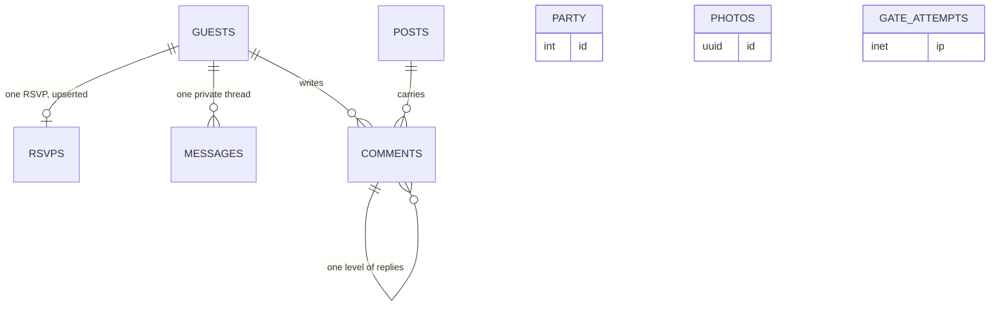

# Anniversary party site

> One link, one password, one name. Guests RSVP, browse the wedding album, read your updates
> and comment on them, and can message you privately - with no accounts to create and nothing
> in the link preview that can spoil the surprise.

A small Next.js app on Vercel, a Postgres schema on Supabase, and a private GitHub repo at
`mancej/rsvp`. Four guest-facing functions - RSVP, album, updates with comments, message the
host - plus one host console behind a second password.

## What I checked before planning

These are account facts, read from the live APIs, not assumptions. Two of them contradict the
brief and change what "free" means here.

| Thing | What is actually there | Why it matters |
|---|---|---|
| Vercel teams | one: `mancej's projects` (`team_kk8pgfBj70UFlHGr2PAtCKLl`) - plan **pro** | Deploying here adds **$0**. There is no free/Hobby account on this login to deploy to. |
| Supabase orgs | one: `Claim Your Court` (`mzkjsbalifykumkrlpin`) - plan **pro**, holding one ACTIVE_HEALTHY project | A second project in this org is **not free** - Pro bills compute per project beyond the included credit. A genuinely free project needs a **new org on the Free plan**. |
| GitHub | `mancej` is authenticated on this machine but is **not** the active `gh` account (`mancej2` is). `mancej/rsvp` does not exist. | Every repo action needs `gh auth switch --user mancej` first, or it silently lands under the wrong account. |
| Supabase Free pausing | Confirmed in Supabase docs: Free projects with low activity over a 7-day window are paused, after a warning email, restorable for 90 days. | A party site can easily sit idle for a week. Unmitigated, this is the site being down the morning someone tries to RSVP. |

So "free" is a real choice, not a default - see the decisions at the bottom.

## The one idea the whole design rests on

"No individual user accounts" and "people can message me directly" pull against each other.
A private thread has to know whose thread it is. The resolution is a **guest identity**, which
is not an account: no password, no email, no verification, nothing to forget.

Three signed, HttpOnly cookies, all minted server-side, none of which a browser can forge:

| Cookie | Claim | Set by |
|---|---|---|
| `party_session` | "this device knows the party password" | the gate, on a correct password |
| `party_guest` | "this device is guest `<uuid>`" | the first time someone submits their name |
| (an `admin: true` claim inside `party_session`) | "this device is the host" | `/host`, on a correct, different host password |

They are JWTs signed with HS256 over a server-only secret (`jose`, which runs on Vercel's Edge
runtime where the middleware lives). A guest cannot mint another guest's id, cannot promote
themselves to host, and cannot read anything without the first cookie.

## Trust boundary: the browser never holds a database credential

Every read and write goes through a Next.js Route Handler holding the Supabase **service role**
key as a server-only environment variable. Row Level Security is enabled on every table with
**zero policies** - a deliberate deny-all, since `anon` and `authenticated` match no policy and
the service role bypasses RLS entirely. If a Supabase publishable key ever leaked, it would open
nothing.



**The cost of this choice, stated plainly:** no Supabase Realtime in the browser, because a
Realtime subscription needs a Supabase key client-side. Live-feeling updates instead come from
the page polling a route handler roughly every 10 seconds while the tab is visible, and stopping
when it is not. For a guest list in the dozens that is the right trade; it is the wrong trade at
1,000 concurrent users, which this will never have.

**Rejected alternative - anonymous Supabase Auth plus RLS policies.** It puts a key in the
browser, moves correctness from one auditable server module into policy SQL spread across seven
tables, and is rate limited to 30 anonymous sign-ins per hour per IP - which one venue's shared
Wi-Fi or one corporate NAT can exhaust. For a site with exactly one shared password there is
nothing for per-user RLS to express.

**Rejected alternative - Vercel's built-in Password Protection.** It is available on Pro and is
zero code, but it is all-or-nothing: it cannot tell a guest from the host, cannot capture the
name, and gives the app no session to hang an identity on. Adding it *on top* would mean two
passwords to explain to every guest for no security the app gate does not already provide.

## Guest identity lifecycle



Losing the cookie - a cleared browser, a second device - is the one rough edge. How much to
spend closing it is a decision below.

## Pages

| Route | Who | What it does |
|---|---|---|
| `/gate` | anyone with the link | One password field. Nothing above it names the occasion or the honoree. |
| `/` | guest | The invitation: date, time, place, and the RSVP form. Shows a running count of who is coming (host-toggleable, default on). |
| `/album` | guest | The wedding photos. Responsive grid, click to open full size, captions optional. |
| `/updates` | guest | Host posts newest-first, pinned ones on top. Each opens a comment thread, one level of replies. |
| `/messages` | guest | That guest's private thread with the host. Empty state invites the first message. |
| `/host` | host | Second password, then: RSVP table with totals and a CSV export, every message thread with unread counts, post composer, comment and message moderation, party-detail editor, guest-list visibility toggle. |

Party details - date, time, venue, address, dress code, the invitation copy - live in a
single-row `party` table edited from `/host`, not in a config file. The host console has to exist
anyway for posts and messages, and putting the venue behind a redeploy means every small change
needs an engineer.

## Data model



`party`, `photos` and `gate_attempts` carry no foreign keys - single-row settings, the album,
and the brute-force limiter respectively.

```sql
create table guests (
  id            uuid primary key default gen_random_uuid(),
  display_name  text not null check (length(trim(display_name)) between 1 and 80),
  resume_code   text unique,                    -- only if the resume-code option is chosen
  created_at    timestamptz not null default now(),
  last_seen_at  timestamptz not null default now()
);

create table rsvps (
  guest_id    uuid primary key references guests(id) on delete cascade,
  attending   boolean not null,
  party_size  int not null default 1 check (party_size between 0 and 12),
  note        text,                              -- dietary needs, "arriving late", anything
  created_at  timestamptz not null default now(),
  updated_at  timestamptz not null default now()
);

create table posts (
  id           uuid primary key default gen_random_uuid(),
  title        text not null,
  body         text not null,
  pinned       boolean not null default false,
  published_at timestamptz,                      -- null = draft, host-only
  created_at   timestamptz not null default now(),
  updated_at   timestamptz not null default now()
);

create table comments (
  id         uuid primary key default gen_random_uuid(),
  post_id    uuid not null references posts(id) on delete cascade,
  guest_id   uuid references guests(id) on delete set null,   -- null = the host
  parent_id  uuid references comments(id) on delete cascade,  -- one level of replies
  body       text not null,
  deleted_at timestamptz,
  created_at timestamptz not null default now()
);

create table messages (
  id               uuid primary key default gen_random_uuid(),
  guest_id         uuid not null references guests(id) on delete cascade, -- whose thread
  from_host        boolean not null,
  body             text not null,
  read_by_host_at  timestamptz,
  read_by_guest_at timestamptz,
  created_at       timestamptz not null default now()
);

create table party (
  id          int primary key default 1 check (id = 1),
  title       text not null,
  starts_at   timestamptz,
  venue_name  text,
  venue_addr  text,
  details_md  text,
  show_guest_list boolean not null default true
);

create table photos (
  id           uuid primary key default gen_random_uuid(),
  storage_path text not null,
  caption      text,
  sort_order   int not null default 0,
  created_at   timestamptz not null default now()
);

create table gate_attempts (                    -- brute-force limiter for the password gate
  ip         inet not null,
  attempted_at timestamptz not null default now()
);
create index on gate_attempts (ip, attempted_at desc);

create index on comments (post_id, created_at);
create index on messages (guest_id, created_at);
```

Every table gets `alter table <t> enable row level security;` and no policies. Supabase's
security advisor reports "RLS enabled, no policy" as informational for this shape; that is the
intended state, not a gap.

Migrations are plain SQL files under `supabase/migrations/`, applied with the Supabase CLI, so
the schema is reviewable in the pull request rather than clicked into a dashboard.

## Keeping the surprise

The password gate is the easy half. These are the leaks it does not cover.

- **Link previews are the real risk.** When a guest forwards the link into a group text or
  WhatsApp thread, every person in that thread sees a preview card without opening anything -
  and one of them may be the honoree. So: a deliberately bland `<title>`, **no** `og:image`, no
  `og:description` naming the occasion or either of you. Something like "You're invited" and
  nothing more. This is the single highest-value item on the page.
- **`robots`**: `noindex, nofollow` on every route, an `X-Robots-Tag` response header, and a
  `robots.txt` that disallows everything. A gated site can still leak through a referrer or a
  browser extension that reports URLs.
- **The domain shows in the preview card.** The Vercel project name becomes the deployment
  hostname, so it wants to be neutral. `rsvp` is fine; anything with a name or a number in it is
  not.
- **Private repo.** Non-negotiable once wedding photos and a guest list are involved.
- **Nothing above the password.** The gate page carries no names, no date, no photo.

## Password gate hardening

A single shared password that lives for months is worth hardening properly.

- Store a **scrypt hash** in `PARTY_PASSWORD_HASH`, never the plaintext, so an env dump does not
  hand over a password that may be reused elsewhere. Same for `HOST_PASSWORD_HASH`.
- Verify with a constant-time compare, in a Node-runtime route handler (Edge has no
  `timingSafeEqual`).
- Rate limit on `gate_attempts`: at most 10 attempts per IP per 15 minutes, then a delay
  response. Cheap, portable, and visible in the database rather than in a vendor console.
- Session cookie: `HttpOnly`, `Secure`, `SameSite=Lax`, and a long expiry - the party is months
  out and nobody should have to re-enter the password twice.
- Rotating the password is a single env var change plus a redeploy, and bumping a `kid` claim in
  the signing secret invalidates every existing session at once. Worth building in from the start;
  it costs nothing and it is the only recovery if the password gets posted somewhere public.

## Stack

| Layer | Choice | Why |
|---|---|---|
| Framework | Next.js App Router, TypeScript, React Server Components | Route Handlers and Edge middleware are exactly the two primitives this design needs. |
| Styling | Tailwind CSS | No design system to maintain for a six-page site. |
| Validation | Zod, on every route handler input | One schema per payload, shared between the form and the server. |
| Sessions | `jose` (HS256 JWT) | Runs unchanged in Edge middleware and Node route handlers. |
| Data | `@supabase/supabase-js`, server-only client | One module owns the service-role client; nothing else imports it. |
| Tests | Playwright end-to-end against the built app; `node:test` units for session and crypto | The flows worth protecting are all multi-step and browser-shaped. |

Versions get pinned by `create-next-app` at scaffold time rather than guessed at here.

## Testing bar

Each core flow gets a Playwright spec, written before or alongside the feature:

1. Wrong password is rejected, and rejected again after the limiter trips.
2. Correct password, then a name, produces a guest and lands on the invitation.
3. RSVP submits, then editing it updates rather than duplicating.
4. The album renders every photo and opens one full size.
5. A guest comments on a post; a second guest sees it.
6. A guest messages the host; the host sees it in `/host` and replies; the guest sees the reply.
7. A guest cannot reach `/host` without the host password.
8. No route returns anything without `party_session`.

## What I still need from you

None of this blocks writing the implementation phases - all of it is data, entered in `/host`
or set as an env var, not code.

- Party date, start time, venue name and address.
- The invitation copy, and how much it should say on the gate page (currently: nothing).
- The two passwords - party and host.
- Roughly how many wedding photos, and their total size before resizing.
- Whether there is a gift or registry note to include.

## Cost

| Item | Free-org path | Existing-Pro-org path |
|---|---|---|
| Vercel (Pro team, already paid) | $0 added | $0 added |
| Supabase project | $0, on a **new Free org** | roughly $10/month for the second project's compute |
| Supabase Free limits | 500 MB database, 1 GB storage, 5 GB egress - all far above this site | n/a |
| Pausing risk | Real. Mitigated by a Vercel Cron job hitting a trivial keepalive endpoint daily. | None - paid projects never pause |
| Resend (host notifications) | $0 on the free tier | $0 |

## Repo and deploy

- `gh auth switch --user mancej` **first**, every time. The machine's active account is `mancej2`.
- Create `mancej/rsvp`, **private**.
- Link a Vercel project on the `mancej's projects` team; production tracks `main`, every pull
  request gets a preview.
- Preview deployments inherit the password gate, so they are not an open door - but they should
  also carry Vercel's Deployment Protection, which is on by default for previews on Pro.
- Environment variables: `SUPABASE_URL`, `SUPABASE_SERVICE_ROLE_KEY`, `SESSION_SECRET`,
  `PARTY_PASSWORD_HASH`, `HOST_PASSWORD_HASH`, and `RESEND_API_KEY` plus `HOST_EMAIL` if
  notifications are on. All server-only - none prefixed `NEXT_PUBLIC_`.
- A `GET /api/keepalive` route running `select 1`, called daily by Vercel Cron, if the Supabase
  project is on the Free plan.

## Out of scope

Named so they do not creep in: guest photo uploads, per-guest invitations or a known guest list,
email or SMS to guests, calendar invites, seating charts, gift registry integration, payments,
translation, and a custom domain. Any of them can follow; none belongs in the first version.

## Risks

| Risk | Severity | Handling |
|---|---|---|
| The honoree sees a forwarded link preview | High - it ends the surprise | Blank OG tags, bland title, no preview image. First thing built, first thing tested. |
| Free Supabase project pauses before the party | High - site down | Daily Vercel Cron keepalive, plus the warning email Supabase sends a week ahead. |
| A guest clears cookies and loses their message thread | Medium | Addressed by the guest-identity decision below. |
| The password gets forwarded outside the guest list | Medium | Rotatable in one env var; `kid` bump invalidates every session. |
| A guest opens on two devices and appears twice in the RSVP count | Low | Host console merges duplicate guests; RSVP is keyed per guest so totals stay correctable. |
| Photos push the repo or the free storage tier | Low | Resize to max 2000px and re-encode before adding; 40 photos land near 15 MB. |

## Open decisions

Presented for selection in the dashboard rather than decided here: where the Supabase project
lives, how durable a guest's identity should be, where the photos live, whether the host gets
email, and the visual direction.
