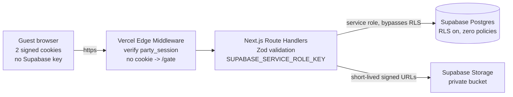
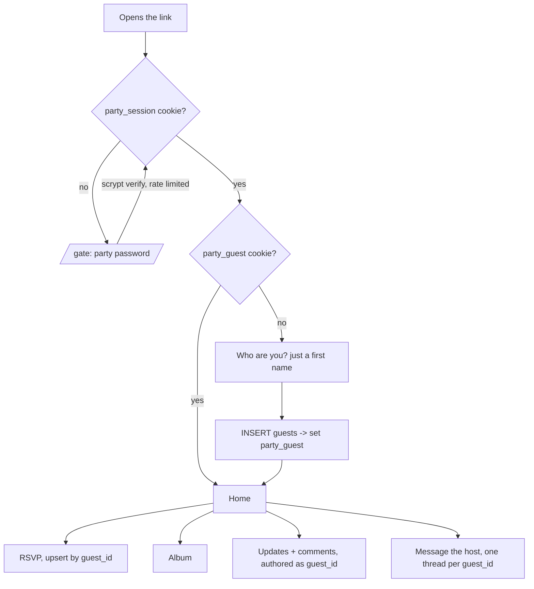
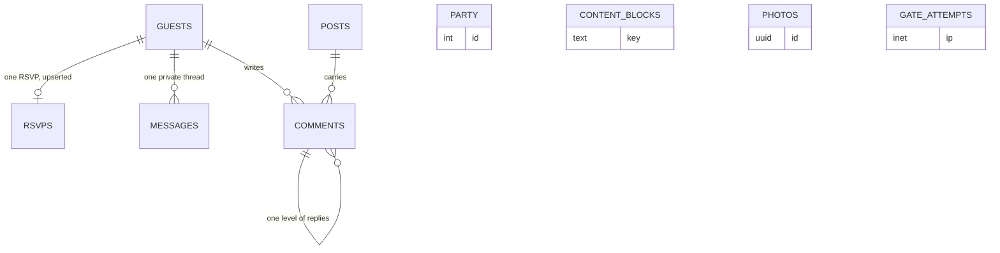
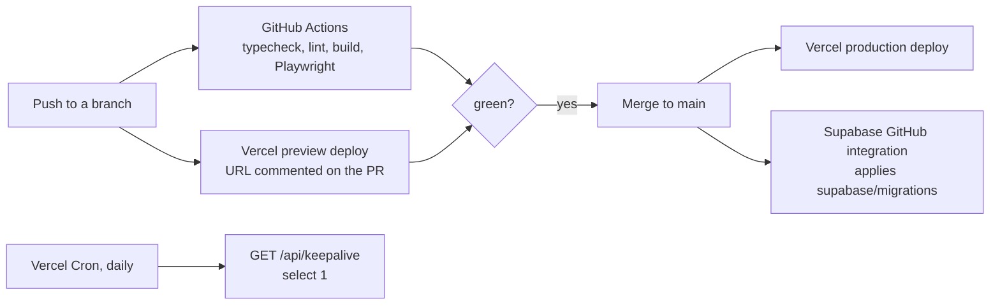

# Anniversary party site

> One link, one password, one name. Guests RSVP, browse the wedding album, read your updates
> and comment on them, and can message you privately - with no accounts to create and nothing
> in the link preview that can spoil the surprise.

A small Next.js app on Vercel, a Postgres schema on Supabase, and a private GitHub repo at
`mancej/rsvp`. Four guest-facing functions - RSVP, album, updates with comments, message the
host - plus one host console behind a second password, from which every word on the site is
editable.

## Decisions already taken

| Question | Chosen | What it means here |
|---|---|---|
| Where Supabase lives | **New org on the Free plan** | $0/month. Free projects pause after 7 idle days, so a daily Vercel Cron keepalive ships as part of the build, not as an afterthought. |
| Guest identity | **Cookie only, plus a merge tool in `/host`** | No resume codes to lose. If someone clears their browser they simply reappear as a new guest, and you join the two rows yourself from the host console. |
| Photos | **Private Supabase Storage bucket** | Signed URLs minted server-side, so the album is genuinely behind the password, and you add photos from `/host` without a deploy. |
| Host notifications | **None** | No Resend, no email. The host console carries unread counts. One fewer service, one fewer API key. |
| Visual direction | **Warm archival, extended to a Blue Ridge Mountains theme** | Three mockups are built and waiting - see below. |

## What I checked before planning

Account facts, read from the live APIs, not assumptions. Two of them contradict the brief and
change what "free" means.

| Thing | What is actually there | Why it matters |
|---|---|---|
| Vercel teams | one: `mancej's projects` (`team_kk8pgfBj70UFlHGr2PAtCKLl`) - plan **pro** | Deploying here adds **$0**. There is no free/Hobby account on this login to deploy to. |
| Supabase orgs | one: `Claim Your Court` (`mzkjsbalifykumkrlpin`) - plan **pro**, holding one ACTIVE_HEALTHY project | A second project there is **not free** - Pro bills compute per project beyond the included credit. Hence the new Free org. |
| GitHub | `mancej` is authenticated on this machine but is **not** the active `gh` account (`mancej2` is). `mancej/rsvp` does not exist. | Every repo action needs `gh auth switch --user mancej` first, or it silently lands under the wrong account. |
| Supabase Free pausing | Confirmed in Supabase docs: Free projects with low activity over a 7-day window are paused, after a warning email, restorable for 90 days. | A party site can easily sit idle for a week. Unmitigated, this is the site being down the morning someone tries to RSVP. |

## Look and feel: Blue Ridge

Three directions are built as working pages, not pictures. Each shows the same five screens at
phone width, which is where almost everyone will open a link sent by text. Open them and pick one:

| Direction | File | The idea |
|---|---|---|
| **A - Blue Ridge at dawn** | `mockups/a-blue-ridge-dawn.html` | Cream letterpress paper, a sunrise over layered ridges, serif throughout. The warmest, and the closest to a printed keepsake. Reads as an anniversary first and a web app second. |
| **B - Blue hour** | `mockups/b-blue-hour.html` | Dusk on the parkway. A dark ground so the wedding photographs are the only bright thing on screen, lantern-amber for anything you can act on. The most atmospheric, and the most obviously an evening party. |
| **C - Field guide** | `mockups/c-field-guide.html` | A trail map for the evening. Off-white stock, a tight sans for structure and a serif for prose, forest green against ridge blue. The clearest to read on a phone in a parking lot. |

The ridgelines are **inline SVG**, layered and hazed the way the Blue Ridge actually recedes.
That is deliberate: no image request, no loading flash, sharp on any screen, and recolourable
per direction from one set of tokens. The same four-layer silhouette appears full height on the
gate and the invitation, and as a thin band under the navigation everywhere else, so the theme
carries without repeating itself.

Whichever direction wins becomes a small token file - paper, ink, four ridge blues, one accent -
and every screen is built from those tokens rather than from hand-picked colours.

## The one idea the whole design rests on

"No individual user accounts" and "people can message me directly" pull against each other.
A private thread has to know whose thread it is. The resolution is a **guest identity**, which
is not an account: no password, no email, no verification, nothing to forget.

Two signed, HttpOnly cookies, both minted server-side, neither of which a browser can forge:

| Cookie | Claim | Set by |
|---|---|---|
| `party_session` | "this device knows the party password" | the gate, on a correct password |
| `party_guest` | "this device is guest `<uuid>`" | the first time someone submits their name |

Plus an `admin: true` claim inside `party_session`, set at `/host` on a correct, different host
password. They are JWTs signed with HS256 over a server-only secret (`jose`, which runs on
Vercel's Edge runtime where the middleware lives). A guest cannot mint another guest's id, cannot
promote themselves to host, and cannot read anything without the session cookie.

Because identity is cookie-only, a guest who clears their browser comes back as a new row. That
is a feature of the simplicity, not a bug to engineer around: `/host` lists guests with their
RSVP and message counts and lets you **merge two rows into one**, which reassigns their RSVP,
comments and messages and keeps the totals correct. You will do this roughly never.

## Trust boundary: the browser never holds a database credential

Every read and write goes through a Next.js Route Handler holding the Supabase **service role**
key as a server-only environment variable. Row Level Security is enabled on every table with
**zero policies** - a deliberate deny-all, since `anon` and `authenticated` match no policy and
the service role bypasses RLS entirely. If a Supabase publishable key ever leaked, it would open
nothing.



**The cost of this choice, stated plainly:** no Supabase Realtime in the browser, because a
Realtime subscription needs a Supabase key client-side. Live-feeling updates come from the page
polling a route handler roughly every 10 seconds while the tab is visible, and stopping when it
is not. For a guest list in the dozens that is the right trade; it is the wrong trade at 1,000
concurrent users, which this will never have.

**Rejected - anonymous Supabase Auth plus RLS policies.** It puts a key in the browser, moves
correctness from one auditable server module into policy SQL spread across eight tables, and is
rate limited to 30 anonymous sign-ins per hour per IP - which one venue's shared Wi-Fi or one
corporate NAT can exhaust. For a site with exactly one shared password there is nothing for
per-user RLS to express.

**Rejected - Vercel's built-in Password Protection.** Zero code and available on Pro, but
all-or-nothing: it cannot tell a guest from the host, cannot capture the name, and gives the app
no session to hang an identity on. Adding it *on top* would mean two passwords to explain to
every guest for no security the app gate does not already provide.

## Guest identity lifecycle



## Pages

| Route | Who | What it does |
|---|---|---|
| `/gate` | anyone with the link | One password field. Nothing above it names the occasion or the honoree. |
| `/` | guest | The invitation: date, time, place, and the RSVP form. Shows a running count of who is coming (host-toggleable, default on). |
| `/album` | guest | The wedding photos, from the private bucket via signed URLs. Responsive grid, tap to open full size, captions optional. |
| `/updates` | guest | Host posts newest-first, pinned ones on top. Each opens a comment thread, one level of replies. |
| `/messages` | guest | That guest's private thread with the host. Unread replies badge in the nav. |
| `/host` | host | Second password, then six tabs: **RSVPs** (table, totals, CSV export, merge duplicate guests), **Messages** (every thread, unread counts, reply), **Posts** (compose, edit, pin, draft, delete), **Album** (upload, caption, reorder, delete), **Content** (every word on the site), **Party** (date, time, venue, guest-list toggle). |

## Everything on the page is editable

Nothing a guest reads is hardcoded in the repo. Two tables carry it:

- **`party`** - the structured facts. Date and time, venue name and address, and the
  `show_guest_list` toggle.
- **`content_blocks`** - every piece of prose, keyed by slug: `gate.note`, `home.eyebrow`,
  `home.title`, `home.body`, `album.title`, `album.intro`, `updates.title`, `updates.intro`,
  `messages.title`, `messages.intro`, `footer`. Each row has a human label so the Content tab
  reads as a list of places on the site rather than a list of database keys.

Posts, comments and album captions are already editable as data. Together that means **you never
need a developer, or a deploy, to change what the site says.**

Two consequences worth naming up front:

1. **Markdown is rendered through a restricted renderer with no raw HTML passthrough.** Bold,
   italic, links, line breaks and lists - nothing else. The host is the only author, but a
   markdown-to-HTML step that passes raw tags through is an XSS hole regardless of who is typing,
   and closing it later is harder than never opening it.
2. **Pages render dynamically rather than being fully static**, so an edit in `/host` is live on
   the next request with no redeploy. At this size that costs nothing; it is the whole reason the
   Content tab is worth having.

Seed values ship in the first migration, so the site reads correctly the moment it deploys and
before anyone has edited anything.

## Data model



```sql
create table guests (
  id            uuid primary key default gen_random_uuid(),
  display_name  text not null check (length(trim(display_name)) between 1 and 80),
  merged_into   uuid references guests(id) on delete set null,  -- set by the host merge tool
  created_at    timestamptz not null default now(),
  last_seen_at  timestamptz not null default now()
);

create table rsvps (
  guest_id    uuid primary key references guests(id) on delete cascade,
  attending   boolean not null,
  party_size  int not null default 1 check (party_size between 0 and 12),
  note        text,                              -- dietary needs, "arriving late", anything
  created_at  timestamptz not null default now(),
  updated_at  timestamptz not null default now()
);

create table posts (
  id           uuid primary key default gen_random_uuid(),
  title        text not null,
  body_md      text not null,
  pinned       boolean not null default false,
  published_at timestamptz,                      -- null = draft, host-only
  created_at   timestamptz not null default now(),
  updated_at   timestamptz not null default now()
);

create table comments (
  id         uuid primary key default gen_random_uuid(),
  post_id    uuid not null references posts(id) on delete cascade,
  guest_id   uuid references guests(id) on delete set null,   -- null = the host
  parent_id  uuid references comments(id) on delete cascade,  -- one level of replies
  body       text not null,
  deleted_at timestamptz,
  created_at timestamptz not null default now()
);

create table messages (
  id               uuid primary key default gen_random_uuid(),
  guest_id         uuid not null references guests(id) on delete cascade, -- whose thread
  from_host        boolean not null,
  body             text not null,
  read_by_host_at  timestamptz,
  read_by_guest_at timestamptz,
  created_at       timestamptz not null default now()
);

create table party (
  id              int primary key default 1 check (id = 1),
  starts_at       timestamptz,
  venue_name      text,
  venue_addr      text,
  show_guest_list boolean not null default true,
  updated_at      timestamptz not null default now()
);

create table content_blocks (
  key        text primary key,                   -- 'home.title', 'album.intro', ...
  label      text not null,                      -- what the Content tab calls it
  body_md    text not null default '',
  updated_at timestamptz not null default now()
);

create table photos (
  id           uuid primary key default gen_random_uuid(),
  storage_path text not null unique,
  caption      text,
  sort_order   int not null default 0,
  created_at   timestamptz not null default now()
);

create table gate_attempts (                    -- brute-force limiter for the password gate
  ip           inet not null,
  attempted_at timestamptz not null default now()
);
create index on gate_attempts (ip, attempted_at desc);

create index on comments (post_id, created_at);
create index on messages (guest_id, created_at);
create index on photos (sort_order);
```

Every table gets `alter table <t> enable row level security;` and no policies. Supabase's security
advisor reports "RLS enabled, no policy" as informational for this shape; that is the intended
state, not a gap.

`guests.merged_into` is how the merge tool stays honest: the losing row is kept and pointed at the
winner rather than deleted, so nothing cascades away and a bad merge is reversible.

## Deploys

The whole point is that you can change the site and ship it without ceremony.



- **Vercel Git integration** on `mancej/rsvp`. Push to `main` deploys production; every pull
  request gets its own preview URL, commented onto the PR automatically. No deploy scripts, no
  tokens in CI, nothing to maintain.
- **GitHub Actions** runs the gate on pull requests: `npm ci`, typecheck, lint, build, and the
  Playwright suite against the built app. Required before merge, so `main` is always deployable.
- **Supabase migrations ship with the code.** `supabase/migrations/*.sql` is applied on merge to
  `main` by the Supabase GitHub integration, so a schema change and the code that needs it land
  together and the schema is reviewable in the pull request rather than clicked into a dashboard.
- **One caveat, stated rather than discovered later:** the Free plan has no database branching, so
  preview deployments talk to the **same database as production**. Previews are behind the same
  password and Vercel's deployment protection, so this is not an exposure - but a migration that
  drops or rewrites data affects the real site the moment it merges. Additive migrations only,
  and read the diff.
- **Vercel Cron** declared in `vercel.json` calls `GET /api/keepalive` once a day, which runs
  `select 1`. That is what keeps the Free project out of the 7-day pause window.
- Content edits need none of this. They are database writes from `/host` and take effect on the
  next request.

## Keeping the surprise

The password gate is the easy half. These are the leaks it does not cover.

- **Link previews are the real risk.** When a guest forwards the link into a group text or
  WhatsApp thread, every person in that thread sees a preview card without opening anything - and
  one of them may be the honoree. So: a deliberately bland `<title>`, **no** `og:image`, no
  `og:description` naming the occasion or either of you. Something like "You're invited" and
  nothing more. This is the single highest-value item on the page.
- `noindex, nofollow` on every route, an `X-Robots-Tag` response header, and a `robots.txt` that
  disallows everything. A gated site can still leak through a referrer or a browser extension
  that reports URLs.
- **The domain shows in the preview card.** The Vercel project name becomes the deployment
  hostname, so it wants to be neutral. `rsvp` is fine; anything with a name or a date in it is not.
- **Private repo.** Non-negotiable once wedding photos and a guest list are involved.
- **Nothing above the password.** The gate page carries no names, no date, no photo - which is why
  all three mockups show a ridgeline and the words "You're invited" and nothing else.

## Password gate hardening

- A **scrypt hash** in `PARTY_PASSWORD_HASH`, never the plaintext, so an env dump does not hand
  over a password that may be reused elsewhere. Same for `HOST_PASSWORD_HASH`.
- Constant-time compare, in a Node-runtime route handler (Edge has no `timingSafeEqual`).
- Rate limit on `gate_attempts`: 10 attempts per IP per 15 minutes, then a delay response.
- Session cookie `HttpOnly`, `Secure`, `SameSite=Lax`, long expiry - the party is months out and
  nobody should have to re-enter the password twice.
- Rotation is one env var plus a redeploy, and bumping a `kid` claim in the signing secret
  invalidates every existing session at once. Worth building in from the start; it costs nothing
  and it is the only recovery if the password gets posted somewhere public.

## Stack

| Layer | Choice | Why |
|---|---|---|
| Framework | Next.js App Router, TypeScript, React Server Components | Route Handlers and Edge middleware are exactly the two primitives this design needs. |
| Styling | Tailwind CSS over one theme token file | The chosen mockup becomes the tokens; nothing picks a colour by hand. |
| Validation | Zod, on every route handler input | One schema per payload, shared between the form and the server. |
| Sessions | `jose` (HS256 JWT) | Runs unchanged in Edge middleware and Node route handlers. |
| Data | `@supabase/supabase-js`, server-only client | One module owns the service-role client; nothing else imports it. |
| Markdown | a restricted renderer, no raw HTML | Host-authored copy still gets sanitised. |
| Tests | Playwright end-to-end against the built app; `node:test` units for session, crypto and markdown | The flows worth protecting are all multi-step and browser-shaped. |

Versions get pinned by `create-next-app` at scaffold time rather than guessed at here.

## Testing bar

A Playwright spec per core flow, written before or alongside the feature:

1. Wrong password is rejected, and rejected again after the limiter trips.
2. Correct password, then a name, produces a guest and lands on the invitation.
3. RSVP submits, then editing it updates rather than duplicating.
4. The album renders every photo through a signed URL and opens one full size.
5. A guest comments on a post; a second guest sees it.
6. A guest messages the host; the host sees it in `/host` and replies; the guest sees the reply.
7. Editing a content block in `/host` changes what a guest reads, with no redeploy.
8. Merging two guests moves the RSVP and the message thread and leaves the totals right.
9. A guest cannot reach `/host` without the host password.
10. No route returns anything without `party_session`.
11. The home page ships no `og:image` and no occasion-naming metadata.

## What I still need from you

None of this blocks building - all of it is data you type into `/host` or set as an env var.

- Party date, start time, venue name and address.
- The invitation copy, and how much the gate page should say (currently: nothing).
- The two passwords - party and host.
- The wedding photos, resized to max 2000px on the long edge.
- Whether there is a gift or registry note to include.

## Cost

| Item | Monthly |
|---|---|
| Vercel, on the existing Pro team | **$0 added** |
| Supabase, new org on the Free plan | **$0** |
| Free plan headroom | 500 MB database, 1 GB storage, 5 GB egress - all far above this site |
| Pausing | Handled by the daily Cron keepalive |
| Everything else | Nothing. No email provider, no image host, no domain. |

## Repo and deploy setup

- `gh auth switch --user mancej` **first**, every time. The active account is `mancej2`.
- Create `mancej/rsvp`, **private**.
- New Supabase org on the Free plan, one project, one private Storage bucket named `album`.
- Vercel project on the `mancej's projects` team, linked to the repo, production tracking `main`.
- Environment variables, all server-only, none prefixed `NEXT_PUBLIC_`: `SUPABASE_URL`,
  `SUPABASE_SERVICE_ROLE_KEY`, `SESSION_SECRET`, `PARTY_PASSWORD_HASH`, `HOST_PASSWORD_HASH`.

## Out of scope

Guest photo uploads, per-guest invitations or a known guest list, email or SMS to guests, calendar
invites, seating charts, registry integration, payments, translation, and a custom domain. Any can
follow; none belongs in the first version.

## Risks

| Risk | Severity | Handling |
|---|---|---|
| The honoree sees a forwarded link preview | High - it ends the surprise | Blank OG tags, bland title, no preview image. First thing built, first thing tested. |
| Free Supabase project pauses before the party | High - site down | Daily Vercel Cron keepalive, plus the warning email Supabase sends a week ahead. |
| A migration on a preview branch hits production data | Medium | No database branching on Free. Additive migrations only; the PR diff is the review. |
| The password gets forwarded outside the guest list | Medium | Rotatable in one env var; `kid` bump invalidates every session. |
| A guest clears cookies and appears twice | Low | The merge tool in `/host`, and `merged_into` keeps it reversible. |
| Host-authored markdown injecting HTML | Low | Restricted renderer, no raw HTML passthrough, unit tested. |
| Photos exceed the 1 GB free bucket | Low | Resize to max 2000px before upload; 40 photos land near 15 MB. |
