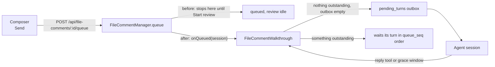

# Send file comments as they are written

Status: approved 2026-09-29. Implemented in the task worktree; the pull request is pending. Mockups: [mockups.html](mockups.html).

## The change in one paragraph

Today a line comment is staged. Pressing **Comment** puts it in the session's review queue,
and nothing reaches the agent until someone opens **Review (N)** and presses **Start review**.
When the queue drains, the review parks as `paused` ("Every comment in this review has been
sent."), so the next comment needs **Resume** before it goes. After this change, sending a
comment IS the delivery request. If nothing is out with the agent and the session's outbox is
empty, the comment goes as its own turn straight away. Otherwise it waits in the queue behind
the comments already ahead of it and goes in its turn, one at a time, exactly as the
walkthrough delivers today. There is no Start step and no staging.

## What stays exactly as it is

The walkthrough in `src/server/file-comment-walkthrough.ts` is not redesigned. Everything that
makes delivery safe is kept unchanged:

- One turn outstanding per session, enforced by the partial unique index and `deliveryBlock`.
- Delivery through the existing human outbox (`pending_turns`), never beside it.
- Re-anchoring the queue before each send, and holding a head whose quote has gone.
- The grace window, the reply tool, and the transcript fallback.
- Reorder, rewrite, and drop on a comment that has not gone yet.
- Drafts: the composer still persists from the first keystroke, so the integrated Files tab and
  the extracted Files window agree. A draft is the text you are still writing; it is not staged
  for delivery and never was.

The change is to WHO starts the walkthrough (the act of sending, not a separate button) and to
what the walkthrough does when it runs dry (goes idle, not paused).

## Flow

## Server changes

1. **One trigger, owned by the manager.** `FileCommentManager` gains a single `onQueued`
   subscriber, fired from the two places a human puts a thread into the queue: `queue()` (the
   composer's Send) and the requeue branch of `appendMessage()` (a reply on an `answered` or
   `unanswered` thread). `src/server/index.ts` wires it to the walkthrough beside the existing
   `createFileCommentWalkthrough` wiring. The manager does not import the walkthrough, and no
   route has to remember to kick delivery, so a later door that queues a thread cannot forget.
2. **`FileCommentWalkthrough.onQueued(sessionId)`.** When the review is `idle`, it calls
   `start()`. When it is `running`, it ticks. When it is `paused`, it does nothing: a person's
   Pause, or a blocker that needs a person (an outdated head, an uncertain delivery, a session
   with no pane), still stands, and the new comment waits behind it. The one exception is a
   legacy row paused with the `drained` or `empty` reason, which is read as `idle` (see
   Upgrade below).
3. **Running dry is idle, not paused.** `pass()` currently calls `stopWith(drained)` or
   `stopWith(empty)` when there is no queued head. Both become a return to `idle` with no
   reason, and `leave()`. The `drained` and `empty` sentences are removed from
   `PAUSE_REASONS` except as the legacy recognition in step 2.
4. **`started_at` resets on idle.** `setFileCommentReviewState` keeps `started_at` across a
   pause and resume (unchanged) but clears it when the state returns to `idle`, so the next
   burst of comments is counted from 1 rather than continuing a count from an hour ago. No
   schema change: this is the `ON CONFLICT` expression only.
5. **Payload wording.** `renderFileCommentPayload` currently tells the agent the last comment
   "is the last of this review". With comments arriving as they are written that is a promise
   the daemon cannot keep, and the existing comment on the scope line already names why a
   broken promise is harmful. The position line becomes `Review comment N; M more queued
   behind it.`, or `Review comment N; nothing else is queued yet.` at the end of the queue, and
   the last-in-queue scope line becomes `Answer this comment only, and do not restructure
   beyond what it asks for: more comments may still follow.` The handle and answer line are
   unchanged.

No new routes, tables, columns, or `ServerEvent` variants. `POST
/api/sessions/:id/file-comment-review` keeps `start` (now labelled Resume), `pause`, and
`dismiss`, so `test/fixtures/route-surface.json` does not move.

## Dashboard changes

Mockups for every state below are in [mockups.html](mockups.html).

1. **Composer.** The primary button reads **Send** instead of **Comment**. The footer gains a
   one-line delivery hint computed by a new pure helper, `composerDeliveryHint(review, queue,
   session)` in `src/web/lib/fileComments.ts`:
   - nothing outstanding, nothing queued, and the session idle: "Goes to the agent now"
   - something ahead: "Waits behind 2 comments"
   - nothing ahead, but another message is still in the session's outbox (one typed into the
     conversation): "Waits for the message already in this session's outbox", or, when that
     message is unconfirmed, "Waits for an unconfirmed message in this session's outbox"
   - nothing ahead and an empty outbox, but the agent is busy (starting, mid-turn, stopping, or
     blocked on a prompt): "Goes to the agent when it is next free"
   - review paused: "Delivery is paused; this waits until you resume"
   - the session cannot take a message (`messageBlockReason` from `src/shared/pane.ts`):
     "This session cannot take messages; the comment will be held"
2. **Thread reply.** The Reply tooltip on an `answered` or `unanswered` thread says the reply
   goes to the agent in its turn, because it now does without a Start.
3. **Review queue panel.** **Start review** is removed. The header shows **Pause** while
   running and **Resume** when paused or when queued comments are sitting idle (the legacy
   case); with nothing queued it shows no button. `reviewAnnouncement` and the empty-state line
   are rewritten for the new model:
   - idle, empty: "Nothing waiting. Comments go to the agent as you send them."
   - running, one out: unchanged ("MC-a41f on plan.md line 84 is out with the agent. 2
     comments waiting.")
   - paused: "Delivery paused. 2 comments waiting. New comments join the queue."
   - idle with queued comments (legacy only): "2 comments waiting. Resume to send them."
4. **Toolbar toggle.** **Review (N)** stays, with the same accessible name, and gains a live
   marker while a comment is out with the agent so the state is visible without opening the
   panel.
5. **Panel auto-open and auto-follow.** Both were built for an explicit Start, where the
   reader had just asked to watch the review. With sending on every comment they would fire
   while the reader is mid-sentence on the next line. See decisions 2 and 3.

## Upgrade and existing state

An existing database can hold two states the new model never produces:

- **Queued threads in an `idle` review** (comments staged but never started). These are sent
  when the daemon starts (decision 4): under the new model a queued comment is a comment its
  writer asked to deliver. The adoption runs once, after the first COMPLETED discovery sweep
  (`Registry.onSessionsObserved`), for the reason `FileCommentManager` reconciles orphans
  there: before that sweep a live session can still be missing from the map, and starting a
  review for it would pause at once with "this session has ended".
- **A review `paused` with the `drained` or `empty` reason.** Read as idle ("parked") by one
  shared predicate in `src/shared/file-comments.ts`, used by `onQueued`, the startup
  adoption, and the panel, so the next comment goes without a Resume. No migration writes
  these rows; the read-side rule is enough and keeps `src/server/db.ts` untouched apart from
  step 4.

## Decisions

Settled in review on 2026-09-29.

| # | Decision | Adopted |
|---|---|---|
| 1 | Keep Pause/Resume as an optional hold | **Keep.** Sending no longer requires it, but it is the only way to hold back the comments behind one already sent, and every blocker pause already uses Resume. It is offered once delivery has started, so the first comment sent always goes |
| 2 | Auto-open the queue panel when delivery starts | **No.** The toolbar marker shows that a comment is out; the panel opens only when a pause needs a person, which is when its controls matter |
| 3 | Follow the outstanding comment into its file | **Only when no composer is open.** Never pull the reader away from a comment they are writing |
| 4 | Staged comments left over from before the upgrade | **Send them when the daemon starts**, after the first completed discovery sweep |

## Tests

| Layer | File | Asserts |
|---|---|---|
| Unit | `test/file-comment-walkthrough.test.ts` | `onQueued` starts an idle review and sends; ticks a running one; leaves a paused one alone; treats a legacy drained pause as idle; running dry goes `idle` with no reason; `adoptQueued` sends a staged queue and skips a paused review, an empty queue, and a missing session |
| Unit | `test/file-comments-store.test.ts` | `started_at` survives pause/resume and clears on `idle` |
| Unit | `test/file-comments-lifecycle.test.ts` | `queue()` and the reply requeue fire `onQueued` once; a draft edit and a reply on an outstanding thread do not |
| HTTP | `test/file-comments-http.test.ts` | `POST /api/file-comments/:id/queue` on an idle session yields a running review and one pending turn; a reply on an `unanswered` thread is delivered as its own turn (ordinal 2) with no Start or Resume |
| Unit | `test/file-comment-startup-delivery.test.ts` | A comment staged in an idle review is sent after the first completed discovery sweep, through `adoptQueuedOnFirstSweep` and a real `Registry`; nothing goes before the sweep, and a person-paused review stays held |
| Unit | `test/file-comment-payload.test.ts` | New position and last-in-queue lines; the answer line is unchanged |
| Unit | a `fileComments` helper test | `composerDeliveryHint` and `reviewAnnouncement` for every state above, including an empty queue with another message in the outbox and an empty queue while the agent is busy |
| Browser | `e2e/specs/file-comment-auto-send.spec.ts` (new) | Send delivers with no Start; a second Send shows "Waits behind 1 comment" and goes after the faked reply; Pause holds a newly sent comment; Resume releases it; the queue drains to "Nothing waiting"; a comment going out does not move a reader who has a composer open; with a typed message still in the outbox the hint says the comment waits for it, and the comment goes once that message is delivered; while the agent is mid-turn the hint says it goes when the agent is next free, and it does |
| Browser | `file-comment-walkthrough.spec.ts`, `file-line-comments.spec.ts`, `file-comment-outdated.spec.ts` | Updated for Send and for no Start review; outdated-head hold and Resume unchanged |

All browser specs keep the fake agents; no model tokens are spent.

## Docs

`docs/ui.md` "Walk the agent through your review" is rewritten for send-as-you-go: no Start
review, the queue as a view of what is out and what is waiting, Pause as an optional hold.
The historical `docs/plans/files-line-comments/` plan is left as the record of the original
decision 4 ("one comment at a time"), which this plan keeps; only the manual start changes.

## Risks

| Risk | Impact | Mitigation |
|---|---|---|
| A comment goes before the writer rereads it | The agent acts on a half-thought | The composer is still the editing surface, and a comment that is waiting can still be rewritten or dropped. After the first comment goes, Pause holds the ones written behind it until Resume; the first Send itself is never held |
| Comments now reach a session that is busy | The turn waits in the outbox for an idle gap, as the first comment of a started review always did | Unchanged outbox behavior; `deliveryBlock` still refuses a second outbox row |
| A session that cannot take messages pauses on the first Send | A pause banner appears right after sending | The composer hint says so before Send, using the same `messageBlockReason` the daemon uses |
| "More comments may follow" makes the agent hold back | Less work per comment | The scope line already asks for this comment only; the change removes a false "last" rather than adding restraint |

## Effort

About 1.5 to 2.5 engineering days in one pull request: roughly 150 to 250 non-test lines across
the walkthrough, manager, store expression, payload, and four web files, plus the tests above
and one new Playwright spec.
