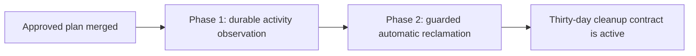

# Automatic stale task worktree cleanup: phased implementation

**Source plan:** [`plan.md`](./plan.md)\
**Approved direction:** Durable Git-state sweep\
**Repository scope:** Mission Control only\
**Phase count:** 2, executed serially

## Outcome

Mission Control will reclaim every worktree still owned by a `done`, `failed`, or `cancelled`
task after 30 days without a Git-visible change. Staged, unstaged, untracked, committed, and
unpushed work all reset the clock when they change, but none block cleanup when that new clock
expires.

The implementation keeps destructive authority in `TaskManager.reclaim()`, persists enough
observation state to survive restarts, and treats unknown Git, process, provider, or ownership
state as a retry instead of permission to delete.

## Incorporated human decisions

- Use a daemon-owned durable Git-state sweep, not a filesystem watcher or an external runner.
- Keep one task-level deadline across the primary and every attached repository.
- Automatically discard local work after the fixed 30-day inactive period, including staged or
  unstaged content and local commits that were never pushed.
- Create implementation phases and schedule them behind this planning session.

## Repository-verified decisions

1. `TaskManager.reclaim()` and `teardownWorktree()` remain the only cleanup path. The retention
   service does not call the native allocator, Treehouse, terminal backends, or `git worktree
   remove` directly.
2. Restart reconciliation currently performs immediate teardown when a task's terminal home is
   proven gone. Phase 2 replaces that destructive branch with terminal settlement plus retention;
   otherwise restart would bypass the approved 30-day boundary.
3. Candidate loading and in-memory pruning currently miss a terminal task whose only remaining
   resource is an attached-repository worktree. Phase 1 establishes one shared all-repository
   predicate and makes durable observation cover that partial-cleanup shape. Phase 2 applies the
   same predicate to cleanup, removal, and UI behavior.
4. `Task.updatedAt`, task completion time, worktree creation time, and filesystem modification
   times cannot prove the last Git-visible activity. The first successful observation of every
   previously unseen resource generation starts a full final 30-day grace period.
5. The worktree manager's maintenance cadence is configurable and can be disabled. Retention gets
   its own daemon lifecycle and fixed internal cadence, with injected clock and scheduler seams for
   tests but no public off switch.
6. The current startup cleanup queue already proves the required per-repository serialization
   model. Phase 2 extracts or extends that mechanism so automatic cleanup cannot form a
   same-repository convoy or bypass foreground acquisition priority.

## Effort and phase-count rationale

Estimated production change: **1,000 to 1,500 lines**, excluding tests and documentation.

Assumptions behind the estimate:

- 350 to 500 lines for a streaming Git/index/worktree fingerprint and its error model;
- 250 to 400 lines for the SQLite ledger, projection helpers, observer lifecycle, and resource
  generation logic;
- 250 to 400 lines for claim/retry orchestration, race guards, and `TaskManager` integration; and
- 150 to 250 lines for the safe browser summary, all-repository UI behavior, and lifecycle copy.

Two phases are justified even though one phase is the default above 200 lines. Combining them
would ask one agent and one review to validate Git parsing, streaming file reads, a migration,
restart recovery, destructive compare-and-swap cleanup, provider-aware partial failure, browser
state, and an end-to-end timer flow at once. Phase 1 is independently operable: it observes and
persists the exact clock inputs without deleting anything, starts the conservative rollout grace
period, and can be inspected in real databases before destructive activation. Phase 2 consumes
that durable evidence and is the only phase that authorizes automatic deletion.

The split is not by application layer. Each phase includes the persistence, lifecycle wiring,
tests, and compatibility changes needed for its own behavior. A smaller third phase for UI, tests,
or documentation would not be independently valuable and would weaken the activation review.

## Phase graph

| Phase | Name | Delivers | Direct dependency | Merge condition |
| --- | --- | --- | --- | --- |
| 1 | [Durable activity observation](./phase-1-durable-activity-observation.md) | Stable aggregate fingerprints, durable deadlines, all-repository candidate ownership, and a non-destructive recurring observer | Planning PR merged | Observation survives restart and cannot reclaim a tree |
| 2 | [Guarded automatic reclamation](./phase-2-guarded-automatic-reclamation.md) | Due cleanup, final revalidation, partial-failure retry, dashboard explanation, lifecycle documentation, and browser proof | Phase 1 merged | Full 30-day behavior passes unit, runtime, and E2E gates |



There is one concurrency group per phase. Phase 2 directly depends on Phase 1, so no
implementation phases may run concurrently.

## Cross-phase contracts

Phase 1 owns these contracts and Phase 2 consumes them without creating alternatives:

- `taskHasWorktrees(task)` or the repository's chosen equivalent enumerates primary and attached
  resource facts through `taskRepoRefs()`.
- A resource generation is deterministic over the task attempt and every cleanup-relevant fact:
  ordered repository position, canonical root and worktree path, recorded provider and lease,
  dispatch boundary, terminal home, terminal resource, and bound session identity.
- The activity fingerprint represents HEAD, complete index state, tracked worktree changes, and
  non-ignored untracked paths across all task worktrees. It stores no file content and returns an
  explicit unknown result if a required read cannot be trusted.
- The ledger is the only durable activity clock. Its row is keyed by task ID and carries generation,
  fingerprint, last change, last observation, due time, cleanup claim/attempt state, retry time, and
  bounded internal error.
- First observation seeds `last_changed_at` at observation time. A later changed fingerprint resets
  it. Unknown observations never advance or fabricate a change boundary.
- Observation is serialized per task, bounded across the daemon, non-overlapping by pass, and
  stoppable during daemon shutdown. It does not depend on `MISSION_WORKTREE_SWEEP_MS`.

Phase 2 owns these additions:

- a compare-and-swap claim over the exact generation and fingerprint before destructive work;
- a final task and fingerprint revalidation immediately before `teardownWorktree()`;
- a shared repository-key cleanup queue and a `TaskManager` reservation that close overlap with
  manual reclaim, reschedule, remove, and another automatic pass;
- retry state that preserves the due boundary across an automatic partial release while adopting
  the generation of the resources still standing; and
- a bounded browser-safe retention summary. Internal hashes, paths beyond existing task fields,
  claim tokens, and raw provider errors never enter the SSE snapshot.

## Merge order

1. Merge Phase 1. Its observer begins the final grace period but cannot delete or return a tree.
2. Rebase Phase 2 on the merged Phase 1 contracts. Do not duplicate the ledger, fingerprint, or
   lifecycle scheduler.
3. Merge Phase 2 only after its destructive-race tests and browser flow pass.

## Final verification strategy

Phase 1 proves deterministic activity detection, migration safety, restart durability, candidate
coverage, bounded concurrency, and a zero-cleanup invariant. Phase 2 proves the full retention
state machine, destructive-boundary races, provider-aware partial release, restart recovery,
dashboard updates, and real native-worktree reuse.

The final branch runs:

```sh
npm run typecheck
npm run lint
npm test
npm run build
npm run smoke
npm run test:e2e
```

The Playwright suite must use the existing fake-agent boundary and built dashboard/daemon. It must
show both sides of the user contract: recent Git-visible activity postpones cleanup, and an aged
terminal task loses its cleanup affordance after the server reclaims the real native worktree.

## Complete-plan audit

- Every approved policy item is owned by one of the two phases.
- Phase 1 cannot perform destructive work and therefore cannot outrun its observations.
- Phase 2 consumes Phase 1's ledger and probe instead of introducing a second clock or Git parser.
- Startup recovery, live `session_remove`, manual cleanup, and automatic cleanup converge on the
  existing task lifecycle and provider-aware teardown.
- Multi-repository partial-release shapes are covered from durable load through UI removal.
- Tests, user-visible copy, and documentation ship with the phase that activates deletion.
