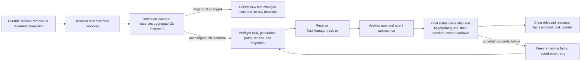

# Automatic stale task worktree cleanup

**Status:** Approved on 2026-08-20\
**Retention rule:** 30 days without a Git-visible worktree change\
**Scope:** Worktrees still owned by terminal Mission Control tasks\
**Implementation sequence:** [`phased-plan.md`](./phased-plan.md) ([rendered](./phased-plan.html))

## Goal

Mission Control should automatically reclaim a task's worktrees after 30 days without a
Git-visible change when either:

- the task's agent exited without recording completion and the task settled into a terminal state;
- the task completed but still retains one or more worktrees; or
- a cancelled or failed cleanup left a terminal task holding a primary or attached-repository
  worktree.

Cleanup is intentionally destructive at the retention boundary. Staged changes, unstaged changes,
untracked files, local commits, and commits that were never pushed do not exempt the tree. A new
Git-visible change resets the full 30-day window.

## Adopted decisions

| Decision | Selected requirement | Consequence |
| --- | --- | --- |
| Cleanup operating model | Durable Git-state sweep | The daemon persists Git-visible activity and deadlines, bounds its observations, and delegates due cleanup to `TaskManager.reclaim()`. |
| Implementation follow-up | Create phased implementation plan | Repository-verified merge phases and dependency-gated implementation tasks are written beside this plan. |

## Repository findings

- `TaskManager` already owns task lifecycle and the provider-aware `reclaim()` operation. That path
  quiesces the launched agent, settles required archives, handles every attached repository, calls
  `teardownWorktree()`, and clears only the resources that were actually released.
- `WorktreeManager` owns native slot allocation and release. Its recurring maintenance currently
  reconciles allocator state and leaked Workflow check leases, but it does not decide how long a
  terminal task retains its work.
- Native, disposable Git, and historical Treehouse worktrees must continue to clean up through the
  provider and exact lease identity stored on the task. A stale cleanup must not infer a provider
  from current settings.
- A durable `session_remove`, not a transient session whose state merely reads `exited`, settles a
  live task. The retention policy should begin from the terminal task row and must not add a second
  session-eviction path.
- Restart reconciliation currently tears down a task immediately when its recorded terminal home is
  proven gone. The 30-day rule must replace that destructive branch: reconcile the task to a
  terminal state, retain its resource facts, and let the retention service own the cleanup deadline.
- Several existing resource checks consider only the primary worktree and terminal home. Candidate
  loading, startup reconciliation, in-memory terminal pruning, removal, and the dashboard cleanup
  affordance must also recognize a task whose only remaining resource is an attached-repository
  worktree after partial teardown.
- Today the product deliberately preserves a terminal task's dirty or unpushed tree for an explicit
  **Clean up** action. This proposal changes that contract after 30 inactive days while preserving
  the existing manual action during the grace period.
- `Task.updatedAt` is not a worktree activity clock. Task metadata, dependency reconciliation, pull
  request observation, and other bookkeeping can move it without any checkout change, while a local
  edit can leave it untouched.
- Multi-repository tasks are reclaimed as one task-level operation. The retention clock therefore
  needs to observe the primary and all attached worktrees, and the newest change in any one of them
  protects the complete set for another 30 days.

## Approved policy

1. **Eligibility is task-owned.** Only `done`, `failed`, or `cancelled` tasks that still name at least
   one worktree are candidates. `backlog`, `dispatching`, and `running` tasks are never age-reclaimed.
2. **Git-visible activity resets the clock.** Observe the aggregate state of every task worktree:
   HEAD, staged content, tracked unstaged content, and non-ignored untracked files. Ignored warm
   dependencies and build caches do not keep a task alive.
3. **Push state is irrelevant.** A local commit changes the fingerprint and restarts the clock when
   it is created. Whether that commit is pushed, merged, or attached to a pull request does not block
   cleanup once the new clock expires.
4. **One task has one retention boundary.** Canonically combine the per-repository fingerprints in
   persisted repository-position order. Any changed tree resets the deadline for all trees.
5. **Cleanup reuses `TaskManager.reclaim()`.** Do not reset a slot, remove a Git worktree, stop a
   terminal home, or clear task fields from the sweeper itself.
6. **Uncertainty retries instead of forgetting.** Unknown process occupancy, an unreadable Git
   state, an unavailable legacy provider, or a partial multi-repository release keeps the remaining
   path and lease facts durable. Retry with bounded backoff and report the failure.
7. **There is no confirmation at expiry.** The existing manual preview remains available before the
   deadline, but the automatic path treats the 30-day policy as the authorization to discard local
   work.
8. **Rollout is conservative for existing trees.** Seed the clock at the first successful
   observation of each previously unseen resource generation. Existing timestamps cannot establish
   prior Git-visible activity, so every pre-feature worktree receives one final full 30-day grace
   period.

## Target design: durable Git-state sweep

Add a daemon-owned task-worktree retention sweeper. On startup and on a bounded
cadence, it selects resource-holding terminal tasks, reads a deterministic aggregate Git-state
fingerprint, and compares it with a small persisted retention ledger.

The ledger records the task's current resource generation, last fingerprint, last observed change,
next eligible cleanup time, and the latest cleanup attempt/error. A new dispatch or replacement
worktree starts a new generation so it cannot inherit an earlier checkout's age. The daemon scans
only terminal tasks with resources, bounds concurrent probes, and serializes cleanup per repository
so a large stale fleet cannot recreate the startup cleanup convoy.

At or after the deadline, the sweeper re-reads the task and its Git state before calling
`TaskManager.reclaim()`. The reclaim path validates the claimed generation before quiescence or
archive work can mutate terminal/session ownership. Immediately before teardown it compares a
stable snapshot of status, attempt, worktree paths, providers, and leases plus a fresh fingerprint.
A changed external generation or fingerprint cancels the attempt and records a fresh 30-day
boundary; cleanup-caused terminal/session changes do not invalidate their own claim. A successful
reclaim removes the retention row after the task update has durably cleared every released
worktree.

### Why it fits

- Matches the daemon-only SQLite boundary and the existing timer, startup reconciliation, and
  provider ownership patterns.
- Survives daemon restarts without relying on open file handles or in-memory timers.
- Detects commits, staging, unstaged edits, and untracked work with the same Git semantics on macOS
  and Linux.
- Provides one place to bound concurrency, persist retry state, test a fake clock, and explain why a
  tree has or has not been reclaimed.

### Tradeoffs

- Each observation spends Git and filesystem reads on every eligible task worktree.
- A change made and fully reverted between two observations is not retained as activity because the
  observable state returned to the prior fingerprint. No work remains to preserve in that case.
- The fingerprint implementation must be careful with large untracked files. Hash Git-visible
  identity and bounded file metadata/content in a way that detects edits without reading ignored
  caches or loading whole repositories into memory.

## Target flow

Keep the policy in the task domain and use the worktree subsystem only through the existing reclaim
operation.

The key ownership direction is:

`terminal task -> retention sweeper -> TaskManager.reclaim() -> provider-aware worktree teardown`.

The sweeper never calls native reset, Treehouse return, or `git worktree remove` directly.

## Implementation outline

### 1. Durable retention state

- Add a migration-backed retention ledger keyed by task ID. Store a resource-generation token,
  aggregate fingerprint, `last_changed_at`, `observed_at`, `cleanup_due_at`, attempt time, retry time,
  and bounded error text.
- Build the generation from the task's dispatch identity and its ordered path/provider/lease tuple.
  Re-dispatch, reschedule, partial release, or attached-repository replacement invalidates stale
  observations.
- Keep internal fingerprints off the global browser snapshot. Expose only bounded cleanup status if
  the existing task surface needs to explain a pending retry.

### 2. Git-visible activity probe

- Create one server-side Git helper that produces a deterministic, streaming fingerprint from HEAD,
  staged state, tracked unstaged state, and non-ignored untracked files.
- Exclude ignored files so warm dependencies, compiler caches, and logs do not pin a task forever.
- Return `unknown` rather than a clean-looking value when Git identity, a path, or required metadata
  cannot be read.
- Seed every previously unobserved resource generation at its first successful observation. Existing
  task timestamps and checkout file timestamps cannot prove the last Git-visible change, so every
  pre-feature tree receives the same full final 30-day grace period.

### 3. Sweeper and cleanup serialization

- Run one pass after task/session startup reconciliation and then at a bounded daemon cadence. The
  30-day policy has no off switch in the initial release; changing pool reconciliation cadence must
  not disable retention.
- Replace restart's immediate teardown for a proven-dead task home with terminal settlement that
  preserves its resource facts. Automatic teardown after restart then follows the same persisted
  deadline as cleanup after a live `session_remove`.
- Limit simultaneous Git probes and allow at most one cleanup touching a physical repository. Reuse
  or extract the repository-key queue already used to prevent startup cleanup convoys.
- Re-read the current task, generation, and fingerprint before any cleanup mutation. Claim the
  ledger row with compare-and-swap, reserve the task in `TaskManager`, and validate that generation
  before quiescence/archive work. Immediately before teardown, compare the stable worktree ownership
  snapshot and a fresh fingerprint; do not make the first generation comparison after operations
  that can legitimately change terminal/session identity.
- Persist failures with exponential backoff capped at one day. Keep retrying until all task-owned
  worktrees are released or the task's resource generation changes.

### 4. Product behavior and documentation

- Keep the existing **Clean up** action available throughout the grace period.
- When automatic reclaim succeeds, the normal task update removes the stale worktree/cleanup
  affordance from every open dashboard without adding browser polling.
- Surface a bounded “automatic cleanup retrying” explanation only when a due task still holds a
  resource after an error. Do not overwrite a completed task's outcome or a failure reason with
  maintenance diagnostics.
- Update the task lifecycle, worktree operations, and configuration documentation to replace the
  current “explicit cleanup forever” contract with the 30-day retention rule.

## Verification

### Unit and integration coverage

- A terminal `done`, `failed`, or `cancelled` task with a stable fingerprint is reclaimed at 30 days,
  including dirty, staged, untracked, committed, and unpushed states.
- A change at day 29 resets the deadline for another 30 days.
- Running, dispatching, and backlog tasks are never candidates.
- A multi-repository task uses the newest activity across all trees and reclaims through one
  task-level operation.
- A re-dispatch or path/lease change invalidates an in-flight observation.
- Daemon restart preserves the deadline and resumes due retries without duplicate cleanup.
- Partial provider failure clears only released trees and retries the remaining resource facts.
- Unknown Git state or process occupancy never reads as inactivity and never drops durable ownership.
- Native, disposable Git, and exact historical Treehouse resources follow their recorded providers.
- Existing pre-ledger tasks receive a defensible baseline or the conservative final grace period.
- A large same-repository stale set is serialized so new dispatch acquisition is not trapped behind
  an unbounded cleanup convoy.

### Repository gates

- Add focused `node:test` coverage for fingerprinting, ledger migration, eligibility, deadlines,
  retries, restart recovery, partial cleanup, and repository serialization.
- Because automatic cleanup changes what a person sees on a task card, add a Playwright spec that
  advances an injected clock, observes the existing cleanup affordance disappear after the server
  event, and proves a recent edit postpones it. Fake agents remain mandatory.
- Run `npm test`, `npm run typecheck`, `npm run lint`, `npm run build`, `npm run smoke`, and
  `npm run test:e2e` after the build.

## Risks and mitigations

| Risk | Mitigation |
| --- | --- |
| Local work is deleted by design | Make the fixed 30-day rule explicit in task/worktree docs and use a Git-visible clock that resets on staged, unstaged, untracked, or committed work. |
| Metadata churn prevents cleanup forever | Exclude ignored files and task/UI bookkeeping from the activity signal. |
| A stale observation targets a replacement lease | Validate the claimed generation before cleanup mutation, then compare stable status/attempt/path/provider/lease ownership and a fresh fingerprint immediately before teardown. |
| Cleanup blocks dispatch | Bound probes and serialize destructive work per repository without queueing an entire fleet ahead of foreground acquisition. |
| Provider or process state is uncertain | Keep durable resource facts, record a bounded failure, and retry. Changes and unpushed commits are not blockers, but unknown ownership or occupancy remains one. |
| Upgrade deletes old work immediately | Seed every unseen resource generation at its first successful observation, granting every pre-feature tree one final full 30-day window. |
| Retention metadata grows forever | Delete ledger rows after complete reclaim or task removal, and reconcile orphaned rows on startup. |

## Non-goals

- Cleaning arbitrary Git worktrees that Mission Control does not own.
- Applying task retention to manual development leases or Workflow check leases.
- Changing the 30-day duration per repository or per task in the first release.
- Preserving local patches, creating rescue branches, pushing commits, or opening pull requests before
  automatic cleanup.
- Treating ignored dependency/cache churn as user activity.
- Adding a second session-eviction, provider-selection, or worktree-removal path.

## Approval record

On 2026-08-20, the human selected the durable Git-state sweep and requested a phased implementation
plan. The filesystem-watcher and external-runner alternatives are no longer implementation options.
