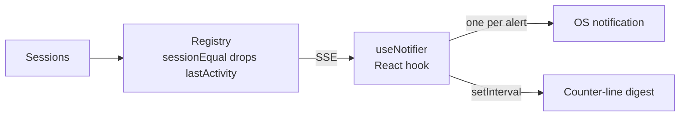
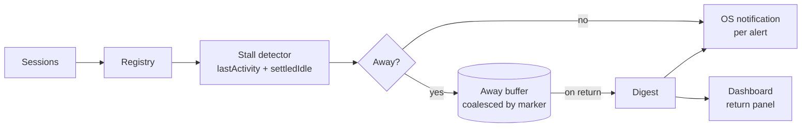

# Away mode

> Going for coffee? Away mode tells you when an agent finishes or gets stuck, and sends a
> short digest so you come back to a summary instead of six blinking tabs.

## Verdict: it half exists, and the half that exists points the wrong way

There is an "AFK mode" in the dashboard today - a toggle, a digest interval, a tested alert
engine, shipped per `docs/plans/auto-pilot/plan.md`. But measured against the sentence above,
turning it on makes things *louder*, not quieter, and two of the three promises are absent.

| The promise | Today | Gap |
|---|---|---|
| "tells you when an agent finishes" | `idle` + `task-done` alerts, gated on `afk` (`src/web/lib/alerts.ts:137,167`) | Works; wants a settle window |
| "or gets stuck" | Nothing. No stall detection anywhere. | **Missing entirely** |
| "a short digest" | A counter line, `"2 need you · 3 working · 1 idle"` (`src/web/lib/alerts.ts:201`) | Not a summary of what *happened* |
| "so you come back to a summary" | Digest fires on a timer *while you're gone* (`src/web/useNotifier.ts:107`) | Nothing fires on **return** |
| "instead of six blinking tabs" | One OS notification per alert, unbatched (`src/web/useNotifier.ts:97`) | **Backwards** - AFK adds alert kinds |

The repo already scores this exact row against a prior system, in `todo/foreman-upgrades.md:39`:

| Away mode | `/afk` daemon: batches, defers, flushes on return | One-by-one browser alerts, no batching |
|---|---|---|

And `todo/foreman-upgrades.md:41` names the stuck gap: *"No notion of 'session died with work
unfinished'"*.

### Four concrete defects

1. **AFK amplifies instead of buffering.** `detectAlerts` adds `idle` and `task-done` when
   `settings.afk` is on, and `useNotifier` fires `new Notification(...)` per alert in a loop.
   Walking away from six sessions is exactly when you get six notifications.
2. **Away mode dies with the tab.** The whole feature is a `setInterval` inside a React hook,
   with state in `localStorage` (`src/web/lib/alertSettings.ts:4`). The desktop app works
   around this by disabling background throttling *specifically* to keep the AFK digest alive
   in a hidden window (`src/main/window.ts:86-87`) - a workaround that names the problem.
3. **"While you were away" is a lie about the network, not about you.** The only catch-up
   notification (`src/web/useNotifier.ts:85`) is keyed to an SSE *reconnect*. It fires when the
   connection dropped, not when you came back.
4. **The client cannot see the signal stuck detection needs.** `sessionEqual`
   (`src/server/registry.ts:2038`) deliberately excludes `lastActivity` and `lastSeen` from the
   change comparison, so a still-alive session doesn't emit an SSE event every 1.5s poll. A
   session going quiet therefore produces **no client event at all**. Any elapsed-time detector
   either runs server-side or needs its own client ticker inventing the clock the server
   already has.

### What we can build on

The foundations are good and should not be rewritten:

- `detectAlerts()` is pure, edge-triggered per cause, and unit-tested (`test/alerts.test.ts`,
  345 lines).
- `settledIdle(s, now, settleMs)` (`src/server/foreman/queue-machine.ts:104`) is the existing,
  correct predicate for *genuinely* finished. Its settle window absorbs hook reordering - a
  `PostToolUse` can land after a `Stop` and briefly un-idle a session - which today's raw
  bucket-transition alert does not.
- `Session.lastActivity` (`src/shared/types.ts:170`) is the raw material for stall detection;
  nothing derives from it yet.
- `classifyPending()` and its `marker` (`src/server/foreman/pending.ts:57`) already model a
  *waiting episode* with a stable id - the natural dedupe key for a buffer, rather than
  inventing one.
- The daemon has an established pattern for periodic jobs: a self-scheduling
  `unref(setTimeout(tick, ...))`, with `src/server/goal/refiner.ts` as the worked example of a
  *model-backed* one (Haiku, 30s cap, concurrency limit, per-session debounce, silent fallback).
- `runClaudeText(prompt, { model, timeoutMs })` (`src/server/claude-cli.ts:207`) is the
  existing primitive for a short LLM-written summary.
- `app_config` (`src/server/db.ts:143`) with `getAppConfig`/`setAppConfig`, plus the Foreman
  Zod-blob pattern (`src/server/foreman/config.ts`, routes at `src/server/routes.ts:876`), is
  the template for durable server-side settings.
- `SettingsModal.tsx:13-16` already anticipates a "Notifications" category; alert settings
  currently live only in the topbar popover.

### One subtlety worth stating plainly

`isIdleNudge` (`src/server/registry.ts:1997`, with a long comment at `:1959-1996`) documents a
known hole: Claude fires `Notification` both for "I need you" and for a ~60s idle nudge, so
treating both as `awaiting_input` made every settled session claim it needed you. The
consequence is that **a session that ends its turn with a question in prose reads `idle`, and
nothing nags.** A state-only stuck detector will miss that case entirely; only an elapsed-time
rule over `idle` catches it. This is a third flavour of stuck, distinct from "working but
silent" and from "blocked on an ask nobody answered".

## The shape of the fix

Three changes, in dependency order:

1. **Invert the alert path while away.** Away mode stops being an amplifier and becomes a
   buffer: attention-level events still get through (or don't - see decision 4), everything
   else accumulates into a coalesced event log keyed by session, instead of firing.
2. **Add stall detection.** Derive "stuck" from `lastActivity`, so a session that claims to be
   working but has gone silent - or has sat idle long enough that its last turn was probably a
   question - becomes a first-class alert kind.
3. **Flush on return.** When you come back, one notification and one in-dashboard panel
   summarize what happened, and the buffer clears.

### Flow change

Today, every event takes the same path straight to the OS, one notification each, and the
elapsed-time signal never leaves the server:

After, a stall detector reads the clock the registry already has, an away buffer sits between
detection and delivery, and the digest is emitted once on return rather than on a timer:

## Decisions

Selected 2026-07-18. These are settled; the rationale is kept because it constrains the build.

### 1. Away state lives daemon-side

The server owns the away flag, the stall detector, and the event buffer, with state in
`app_config` following the Foreman Zod-blob pattern and a poller shaped like
`goal/refiner.ts`.

This was also the only workable option, not merely the best one. Defect #4 is decisive: the
stall detector's whole input is elapsed `lastActivity`, and `sessionEqual`
(`src/server/registry.ts:2038`) deliberately excludes that field from the SSE change
comparison. A client-side detector is structurally blind to the one signal it needs, and would
have to reconstruct on a ticker a clock the server already keeps. Away mode also stops dying
with the tab, which lets `src/main/window.ts:86`'s `backgroundThrottling: false` workaround be
revisited later.

### 2. The digest is model-written, over a deterministic fallback

One Haiku call via `runClaudeText`, exactly as `goal/refiner.ts` does for card goals, turning
the buffered events into a few sentences of what actually happened.

The structured rollup gets built regardless: it is the fallback when `claude` is missing,
logged out, slow, or over its timeout, and per `goal/refiner.ts`'s precedent that fallback is
error handling rather than configuration - it degrades silently and nothing breaks. So the
build order is rollup first, narrative on top.

### 3. "Stuck" means silent, or an ask nobody answered

Four rules, all deterministic:

1. `reportBucket(s) === "working"` and `lastActivity` older than the stall threshold.
2. `idle` for longer than a (longer) threshold - the `isIdleNudge` hole, where a turn that
   ended in a prose question is indistinguishable from a settled session.
3. A gate parked beyond a threshold.
4. A Foreman escalation nobody answered.

Rules 2-4 are the "waiting on a human who left" case, which is the most likely way a coffee
break actually costs you time. Rule 1 alone would miss all of them.

### 4. Attention breaks through; everything else buffers

Anything needing a human - needs-input, parked gate, Foreman escalation, task failed, and now
`stuck` - notifies immediately even while away. Informational events (`idle`, `task-done`)
accumulate into the buffer and land in the return digest.

This keeps away mode useful rather than merely quiet: you are pulled back only for things
genuinely blocked on you, and the six blinking tabs collapse into one digest.

### 5. Entry: manual toggle only, for now

The existing toggle stays and moves server-side. Automatic entry via
`powerMonitor.getSystemIdleTime()` or window focus/blur is **deferred** - it needs a new
preload IPC channel (`src/preload/index.ts` has none) and it is the piece most likely to
misfire on a second monitor or a background tab. Revisit once the manual path is proven.

## Build order

Each step lands independently and is testable on its own.

1. **`stuck` alert kind + stall rules.** Pure functions over `Session` and a `now`, in shared
   code so server and client agree. The only genuinely new detection logic; everything after
   is plumbing. Tested the way `test/alerts.test.ts` tests the engine.
2. **Away config in `app_config`.** Zod blob + `getAwayConfig`/`setAwayConfig` +
   `GET`/`PUT /api/away`, mirroring `src/server/foreman/config.ts` and
   `src/server/routes.ts:876`. Carries `away`, `awaySince`, the thresholds, and `digestMinutes`.
3. **The away buffer.** A pure reducer folding alerts into a per-session coalesced map keyed on
   `pending.ts`'s `marker` where one applies. Repeat events replace rather than append.
4. **The poller.** `unref(setTimeout(tick, ...))` beside `goal/refiner.ts`: run the stall rules,
   fold results into the buffer, emit attention events through the existing path.
5. **The digest.** Structured rollup first, then the Haiku narrative on top with the rollup as
   its fallback.
6. **Client.** Toggle reads/writes the server config instead of `localStorage`; a return panel
   renders the digest; `useNotifier` suppresses info-severity alerts while away.

## Out of scope

- Cross-device delivery (phone push, Slack, email). There is no transport for it today, and the
  screenshot describes coming back to the machine.
- Changing the alert engine's existing attention causes. `detectAlerts` is correct and tested;
  this plan adds a kind and changes *delivery*, not detection of what already works.
- Foreman's supervision behaviour. Away mode observes; it does not act on your behalf.

## Testing

`test/alerts.test.ts` is the model: the engine is pure, so the buffer, the stall rule, and the
digest assembly should all be pure functions tested the same way, with the hook and the daemon
poller doing delivery only. Cases worth pinning:

- A stall that resolves before you return must not appear as stuck.
- The buffer must coalesce repeat events per session (keyed on `pending.ts`'s `marker` where
  one applies) rather than append.
- Returning with an empty buffer must produce no notification at all.
- A `PostToolUse` landing after a `Stop` must not register as finished-then-restarted; this is
  what `settledIdle`'s settle window is for.
