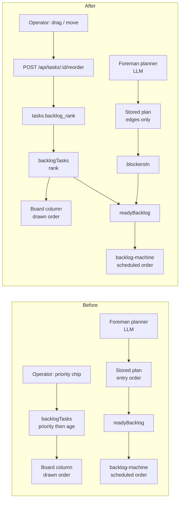
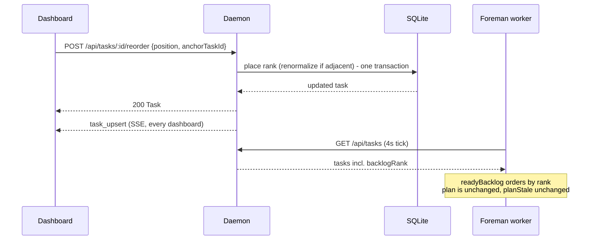

# Plan: Manual backlog order

Status: accepted - decisions taken, phases to follow
Owner: ai-harness
Related: [`../backlog-autopilot/plan.md`](../backlog-autopilot/plan.md) (the scheduler this
reorders the input of), [`../dispatch/plan.md`](../dispatch/plan.md) (the backlog and the two
ways work reaches an agent), [`../foreman/plan.md`](../foreman/plan.md) (the worker loop).

## Goal

Let a human say what should run first by putting it first. Dragging a backlog item above
another makes Foreman take it first, and dragging it down makes Foreman take it later - with
one stated exception, dependencies, which still gate everything. Work that arrives on its own
- a task source sweep, a recurring mission, a retro follow-up, an MCP `create_task` - lands at
the **bottom**, because nothing that files itself gets to jump the queue you arranged.

## What is true today, and why this is worth doing

The backlog has three orderings and none of them is the operator's.

1. `backlogTasks` (`src/shared/session.ts`) sorts by `byPriorityThenAge` - priority first,
   oldest first inside a priority. This is the order the **board column draws**.
2. `readyBacklog` (`src/shared/backlog.ts`) walks the **stored plan's entry order** first
   and appends whatever the plan does not name, oldest first. This is the order the
   **scheduler decides from** (`backlog-machine.ts` (`decideBacklogTick`) and the order `nextUpTaskId` marks
   `next up` from.
3. The plan's entry order is a **topological sort whose tie-break is the model's own array
   order** (`topoOrder`, `src/server/foreman/backlog-plan.ts` (`topoOrder`). The planner prompt is
   never shown a task's priority (`buildBacklogPrompt`, `backlog-prompt.ts` (`buildBacklogPrompt`).

Put together: **for any item the plan covers, the priority chip changes where the card is
drawn and does not change what Foreman takes next.** Two independent ready items are ordered
by a model that was never told which one you care about. The column and the scheduler
disagree, and the column is the one that looks authoritative.

There is a second fact that makes the fix small. `readyBacklog` ends with
`.filter((t) => blockersIn(t, index).length === 0)`, so **every item in the ready list has no
unmet dependency at all**. An edge from one ready item to another is impossible by
construction - if it existed, the dependent would not be ready. So the ready list needs no
topological consideration of its own: any total order over it is dependency-safe, and today
that order is simply the model's. Replacing it with the operator's costs nothing structural.

`topoOrder`'s doc comment in `backlog-plan.ts` already says this out loud: *"`readyBacklog` filters on blockers rather
than position, so this ordering is a READOUT more than a schedule."* This plan makes the
readout the operator's, and leaves the plan doing the one thing only it can do - supplying
inferred edges.

## The rule, in one sentence

**Foreman takes the highest ready item in the order you arranged; an item with an unsatisfied
prerequisite is not ready, and an item that arrives on its own arrives at the bottom.**

## What the human does

- **Drag a card up or down the Backlog column.** It stays where you dropped it, and the
  `next up` mark moves with it if it landed at the top of the ready set.
- **Move it without a mouse.** Every card carries `Move up`, `Move down`, `Move to top` and
  `Move to bottom`, reachable from the keyboard, so the gesture is not mouse-only and the
  Playwright spec drives the same route a drag does.
- **Read the order and believe it.** The Backlog column, the Line's Backlog drawer, the
  Sitrep's backlog section and the scheduler all read one list in one order.

Nothing about parking, labels, launch-anyway or drag-to-assign changes. The priority chip
keeps its picker and its colour and stops deciding position - the one deliberate behaviour
change, taken at review and argued below.

## Architecture

Five edits, three of them one-liners. The load-bearing decision is that **rank is a fact on
the task row, not a fact in the stored plan** - so a reorder is a single-row write, costs no
model call, and cannot make the plan stale.

### `tasks.backlog_rank` - the column

`addColumn(d, "tasks", "backlog_rank", "INTEGER")` in `migrate()`, nullable, beside the
`priority`/`labels`/`enabled` block at `db.ts` (the `priority`/`labels`/`enabled` block in `migrate`. Named `backlog_rank` rather than `rank`
because `RANK` is a SQLite window-function keyword and a bare `rank` in a future query reads
ambiguously; named on the wire as `backlogRank` for the same reason.

Nullable is deliberate: `addColumn` returns true only when it actually added, which is the
repo's existing hook for a **one-time backfill**. On the add, every existing `status='backlog'`
row is numbered in its current `byPriorityThenAge` order, so the column arrives describing the
order the board already showed and upgrade day changes nothing visible.

**An unranked row is healed, not tolerated.** A row that goes NULL after the migration - an
older build opening a newer database, a restored row - cannot simply be left to sort last,
because `appendRank` gives the *next* arrival a finite rank and finite sorts above NULL. One
unranked row would therefore push every task filed after it above itself, which is the opposite
of the bottom-insertion rule. So `healUnrankedBacklog` gives any unranked backlog row a rank
below every ranked one, in `created_at` order; it runs unconditionally at daemon start and again
inside `appendRank`, and is a no-op once the backlog is clean. The comparator's NULL branch is
then a safety net rather than a state the ordering depends on.

`CREATE INDEX IF NOT EXISTS idx_tasks_backlog_rank ON tasks(status, backlog_rank)` goes in the
migration next to its column, per the change contract - not in the CREATE block, which does
not run on an existing database.

### Rank allocation - `src/server/backlog-rank.ts`

Sparse integers, `RANK_STEP = 1024`. Appending is `max(backlog_rank) + RANK_STEP`. Inserting
between two neighbours is their midpoint. When two neighbours are adjacent integers there is
no midpoint, so the whole backlog is **renormalized** to `RANK_STEP` spacing in the same
transaction and the placement is retried once.

The alternative - rewriting every rank on every move - is simpler to reason about and rejected
on write amplification: a move would `UPDATE` every backlog row and publish a `task_upsert`
for each, so one drag on a 300-item backlog is 300 events to every connected dashboard. Sparse
integers make the common move one row and one event, and pay the full rewrite only on the rare
collision. Both are correct; this is the one that stays correct at size.

Allocation runs **inside the daemon**, in `TaskManager`, under the same write path everything
else uses. The Foreman worker never touches SQLite and does not here either.

### `Task.backlogRank` on the wire

`number | null` on the `Task` type (`src/shared/types.ts`), persisted and read back in
`db.ts`'s task upsert and row mapper. It is not accepted on `DispatchSchema` or
`UpdateTaskSchema` - a rank is never something a creating caller names, because "where in the
queue" is a statement about the queue and not about the task. It changes through exactly one
route.

### The comparator - `src/shared/task.ts` and `src/shared/session.ts`

```ts
export function byBacklogRank(a: Task, b: Task): number {
  const rank = (a.backlogRank ?? Infinity) - (b.backlogRank ?? Infinity);
  if (rank !== 0 && Number.isFinite(rank)) return rank;
  return a.createdAt - b.createdAt || (a.id < b.id ? -1 : a.id > b.id ? 1 : 0);
}
```

`backlogTasks` sorts by this instead of `byPriorityThenAge`. That is the single chokepoint -
the board column, the Sitrep, the drawer's blocked and parked bands, `plannableBacklog`'s
400-item head and `readyBacklog`'s base list all read through it, so one edit moves every
surface together and none of them can drift.

The tie-break chain is total on purpose. Two rows can share a rank (a backfill collision, a
restored backup, a null), and a comparator that returned 0 there would let the same two cards
swap places between renders for no reason a human could see.

`byPriorityThenAge` survives in exactly one role - **the migration backfill**, which orders
the backlog once on the day the column is added. Nothing calls it after that. It keeps its
tests because that one call has to be right, and it keeps its export for no other reason.

### `readyBacklog` - the plan supplies edges, rank supplies order

```ts
export function readyBacklog(tasks: Task[], plan: BacklogPlan | null): Task[] {
  const index = backlogIndex(tasks, plan);
  return backlogTasks(tasks)
    .filter((task) => task.enabled && taskKindAllowsBacklog(task.kind))
    .filter((task) => blockersIn(task, index).length === 0);
}
```

The plan-walking loop goes. `plan` is still a parameter and still load-bearing: `backlogIndex`
reads it for the inferred edges every blocker question is asked against. What it stops doing
is deciding position, which is the change.

This is safe for the reason argued above - a ready item has no unmet edge, so the ready set
has no internal edges to respect. It is not safe by luck: `blockersIn` is the guard, it is
tested across every dependency state, and the equivalence is worth a test of its own.

### The one place ordering is not the whole answer

`decideBacklogTick` has two action paths and they read the ready list differently
(`decideBacklogTick`'s assign and dispatch paths in `backlog-machine.ts`):

- **dispatch** takes `candidates[0]` - strictly the head, so it follows your order exactly.
- **assign** scans the list for the first item that has a free agent *in its repo, on its
  harness* - so if the head is a Codex task in repo A and the only free agent is a Claude
  agent in repo B, a lower item is assigned first.

That is pre-existing and it is **kept** (see the decisions below). Strict head-first would
honour your order absolutely and leave a free agent idle rather than let a lower item pass,
which is the worse trade. It is the one exception to the rule at the top of this plan, so it
is written into the docs rather than left to be discovered.

### `POST /api/tasks/:id/reorder` - the one route

```ts
export const ReorderTaskSchema = z.discriminatedUnion("position", [
  z.object({ position: z.literal("top") }),
  z.object({ position: z.literal("bottom") }),
  z.object({ position: z.literal("before"), anchorTaskId: z.string().min(1) }),
  z.object({ position: z.literal("after"), anchorTaskId: z.string().min(1) }),
]);
```

An anchor rather than an index, because an index is a claim about a list the caller last saw
and the daemon's list has moved on since. Status codes follow the sibling routes' contract:

- `404` no such task, or no such anchor.
- `409` the task is not in the backlog, the anchor is not in the backlog, or the anchor is the
  task itself. A card that dispatched between the drag and the drop is a state conflict the
  operator can see, not a silent no-op.
- `200` returns the updated `Task`, like `dispatch`/`assign`/`complete`, so the caller reads
  the new rank off the reply instead of racing its own `task_upsert`.

Placement, renormalization and the resulting `task_upsert` publish happen in one transaction,
so two dashboards dragging at once produce two orderings that are each a real ordering, and
never a half-applied one.

### The board and the drawer

`BacklogColumn` gains a drop target *between* cards. The card is already `draggable` and
already carries `application/x-mission-task`, and `SessionTile` already accepts that payload -
so one drag can end in two places, and **which drop target it lands on decides which thing
happens**: an agent tile assigns, a gap in the column reorders. No second payload type, no
handle, no mode.

Two details the existing card already teaches. The priority `<select>` stops `mousedown`
because the card is `draggable`; the new move buttons need the same treatment. And the card is
click-to-edit, so they need `onClick` stopped too or a move would open the dispatch modal on
the way past.

The move buttons are ordinary focusable controls with `aria-label`s naming the task - `Move
"Fix the flaky test" up` - because the app selects by role and label and never by
`data-testid`, and because a reorder that only exists as a mouse gesture is a reorder half the
surfaces cannot test and some people cannot perform.

`BacklogDrawer` needs no ordering change - its ready band is `readyBacklog` verbatim and
follows automatically - but its header comment currently states plan-entry order as the rule
in force, and `NextUpPlanner` explains the head row by quoting the planner's `reason`. Both
say something that stops being true. The planner's reason stays worth quoting (it is why the
*dependencies* are what they are); what the head row now needs to say first is that it is the
head because it is where you put it.

## The flow that changes

**Before.** The operator writes a priority chip. The chip changes `backlogTasks`, which the
board draws. Separately, Foreman's planner reads the backlog through a model, and the stored
plan's entry order is what `readyBacklog` hands the scheduler. The operator's input reaches
the drawing and not the schedule.

**After.** The operator writes a rank through one route. The rank is on the task row, arrives
at every dashboard and at the Foreman worker through the ordinary task snapshot, and is the
order `readyBacklog` returns. The planner still runs, and its output is consumed for edges
only - `blockersIn` reads it, `readyBacklog` no longer walks it for position.



The reorder round trip touches no model and no scheduler state:



The second diagram's point is the `Note`: **a reorder never makes the plan stale.**
`planStale` is coverage (`some(t => !entries.has(t.id))`), not a fingerprint, so moving a card
costs zero model calls. That is why rank lives on the task and not in the plan.

## What does not change

- **Dependencies still gate.** `blockersIn`, declared and inferred, is untouched. Dragging a
  blocked item to the top makes it the first thing to run *when it unblocks*, and until then
  the card reads blocked exactly as it does now. Operator-declared edges remain
  unoverridable; `launch anyway` on an inferred-only block is unchanged.
- **Parking is unchanged.** A parked item keeps its rank and its place in the column; it is
  simply not in the ready set. `plannableBacklog` still keeps parked items in the planner's
  input for the reason it always did - hiding one deletes the inferred edges pointing at it.
- **The 400-item planning head** is still `.slice(0, PLANNABLE_LIMIT)`, now over rank order,
  which is an improvement: the items you put at the top are the ones that get a dependency
  read, rather than the ones a priority chip happened to lift.
- **Capacity, allowlist, mode, the free-agent predicate, serial fallback** - all untouched.
- **Priority chips and labels keep rendering**, on every surface that draws them today, and
  the Sitrep's markdown copy still carries both. What changes is only that the chip no longer
  moves a card - see the decisions below.

## Edge cases, decided

- **A task re-entering the backlog** (`reschedule`, a restart-recovered dispatch that never
  provisioned) keeps the rank it already has, so a recovered dispatch reappears where it was
  rather than at the bottom of a queue it never left. A task that never had one is appended.
- **Multi-repo tasks** rank like any other. They are dispatch-only, so they can be the head
  and be passed over by the assign path, which is already how they behave.
- **A rank on a non-backlog row** is left alone rather than nulled. Nothing reads it outside
  `backlogTasks`, and keeping it is what makes the bullet above one line instead of a state
  machine.
- **Two dashboards, one anchor.** Both moves succeed and the second one wins its own
  placement. There is no lock and no version field: the anchor is re-read inside the
  transaction, so the result is always a real ordering of the real backlog.
- **The `next up` mark** is still `readyBacklog[0]`, so it follows the drag with no separate
  computation to drift.

## Testing

`test/` for everything that is a function, `e2e/` for the gesture - the repo's line, not a
new one.

- `test/backlog-rank.test.ts` - append, midpoint, the adjacent-neighbour renormalize and its
  retry, `top`/`bottom`, a null rank sorting last, and the total tie-break chain.
- `test/backlog-plan.test.ts` (extend) - the load-bearing equivalence: for any backlog and any
  plan, every task in `readyBacklog` has zero unmet edges, so no ready pair can be ordered by
  a dependency. Plus: a reorder does not change `planStale`.
- `test/backlog-machine.test.ts` (extend) - dispatch takes the top-ranked ready item;
  reordering changes which item is dispatched with no replan; and the assign path's exception
  is pinned as kept - a lower ready item with a matching free agent is assigned ahead of a head
  that has none, which is the one place the order is deliberately not absolute.
- `test/task-triage.test.ts` / `task-triage-render.test.ts` (extend) - `backlogTasks` orders
  by rank, and the column still does not sort for itself.
- `test/backlog-reorder-http.test.ts` - the route through `buildApp`: 404 on a missing task
  and a missing anchor, 409 on a dispatched task, a dispatched anchor and a self-anchor, 200
  returning the moved task, and the placement surviving a reopen.
- `test/db-*` (extend) - the backfill runs exactly once, orders by `byPriorityThenAge`, and an
  already-migrated database is not renumbered on the next open.
- `e2e/specs/backlog-reorder.spec.ts` - the requirement, end to end and with no model tokens
  spent: file three backlog tasks, move the third to the top through the UI, confirm the
  column and the Line drawer both read the new order and the `next up` mark moved, then let
  autopilot launch and confirm it took the one that was moved up. A second case drags a card
  onto an agent tile to prove the assign gesture still works from the same drag. A third
  drives the move with the keyboard alone.

## Documentation

Same change, not a follow-up: `docs/dispatch-and-backlog.md` (the priority table's "Sorts"
column stops being the whole story), `docs/work-queues.md` (the autopilot section's ordering
sentences), `docs/foreman.md` where it describes what the planner's order decides, and this
plan's own file.

## Out of scope

- **Per-repo or per-agent sub-orders.** One backlog, one order.
- **Ranking anything but the backlog.** Sessions, reviews, work queues and pipelines each have
  their own ordering and none of them is this.
- **Teaching the planner about rank.** The prompt stays as it is. The model is asked for
  edges; the order is the operator's and does not need a model's opinion folded into it.
- **Any bulk re-sort, including "Sort by priority".** It was offered at review and not taken.
  A one-click rewrite of every rank is easy to press by accident and impossible to undo, and a
  rule that re-sorted continuously would take the order back off the human this plan is handing
  it to. If hand-ordering proves to be the wrong amount of work, that is the moment to design
  an undoable bulk re-triage - with evidence for what it should do.
- **Bulk multi-select drag.** One card at a time.

## Decisions taken

Four choices were open when this plan went for review. All four are resolved; the plan body
above is written as the resolution, and the reasoning is kept here so a later reader does not
reopen a settled question.

| Decision | Taken | Why |
|---|---|---|
| **Priority vs manual order** | **Rank is the only order. Priority is pure annotation.** | What you see is the order, full stop. The chip still colours the card and still filters, and it never moves anything. The accepted cost is stated below. |
| **The reorder gesture** | **Drag in the column, plus keyboard move controls.** | The drag is the one already on the card; the drop target decides whether it assigns or reorders. The buttons are what make it accessible and Playwright-drivable. |
| **The assign path's scan** | **Keep it.** Dispatch takes your head; assign may take a lower item that has a free agent. | The no-change option. Strict head-first would idle a free Claude agent while the head is a Codex task in another repo. Documented as the one exception to the rule. |
| **Rank allocation** | **Sparse integers, renormalize on collision.** | One row and one `task_upsert` per move. A full rewrite is trivially correct and pushes 300 events per drag on a 300-item backlog. |

### The accepted cost of "priority is annotation"

**A swept `P0` lands at the bottom and stays there until somebody moves it.** That is a real
loss of a behaviour that exists today: `priorityFrom` maps a GitHub label onto a task priority
(`task-sources/github-issues.ts` (`priorityFor`), `priorityFromJira` does the same for Jira, and today
that mapping lifts the task in the column on its own.

It is accepted rather than mitigated, and the reason is the point of the whole feature. An
order that a sweep can rearrange is not an order you set - it is an order you and a cron loop
share, and the next surprise is a P0 you had deliberately put at position 20 jumping back to
the top overnight. The chip is not wasted: it is exactly the signal you scan the column for
when deciding what to drag, and it still filters and still colours.

**A "Sort by priority" button was offered and not taken.** It stays out of scope rather than
becoming a follow-up: a one-click bulk rewrite of every rank is easy to press by accident and
impossible to undo, and nothing in the plan needs it. If reordering by hand turns out to be
the wrong amount of work in practice, that is the point to design an undoable bulk re-triage,
with evidence for what it should do.

`byPriorityThenAge` therefore survives in exactly one role: **the migration backfill**. It
orders the backlog once, on the day the column is added, so upgrade day changes nothing
visible - and then nothing calls it again. It keeps its tests for that reason.
