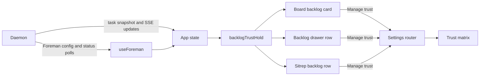

# Backlog repository-trust alert

## Outcome

When Foreman is running live with backlog autopilot enabled, an enabled backlog task that
cannot be scheduled because one or more of its repositories are outside Foreman's allowlist
will use the existing inline backlog notification slot. The amber status line will name the
missing repository grants, explain that unattended scheduling is withheld while manual launch
still works, and offer **Manage trust** to open the existing Trust matrix.

The notice will appear wherever the backlog task is already rendered:

- the Board's Backlog card;
- the Line's Backlog drawer row;
- the Sitrep backlog row.

This is a durable, task-local explanation, not an operating-system notification. It should
remain visible while the condition remains true and disappear when the Foreman grant lands.

## What the repository already provides

- `src/server/foreman/backlog-machine.ts:331-347` filters tasks with
  `taskReposAllowlisted` and returns `no backlog item is in a repo Foreman is trusted to act
  in` before readiness or capacity is considered. The new UI should explain that exact gate.
- `src/shared/allowlist.ts` owns `cwdAllowlisted` and `taskReposAllowlisted`, including the
  rule that every repository attached to a multi-repo task must be allowlisted. It currently
  returns only a boolean, so the UI cannot name which grants are missing without repeating
  the matcher.
- `App.tsx` already holds the SSE task list plus `useForeman`'s polled config and status. The
  browser therefore has the task repository set, `enabled`, `mode`, `autoBacklog`, worker
  liveness, and `repoAllowlist`; no new daemon endpoint or wire field is needed.
- `BacklogColumn` already reserves `.bl-recovery` immediately beneath a task's footer metadata
  for persisted `task.error` copy. It uses attention amber and `role="status"`; the dispatch
  restart E2E spec proves an interrupted launch appears there with its retry explanation.
- `ReportPanel` mirrors `task.error` in the Sitrep backlog row as a status line before dependency
  copy. This is the same passive, task-local explanation grammar at a wider width.
- `BacklogDrawer` currently omits persisted task errors from its rows. Its identity stack contains
  title and metadata inside a fixed-height row, so completing the existing notification pattern
  there is part of this feature.
- `DeadBlockerButton` is not the pattern to extend. It is an active resolver for a stopped
  prerequisite, with Reschedule and Mark done actions. Repository trust is passive scheduling
  posture and belongs in the existing inline notification slot.
- `openSettingsAnchor("trust", "trust/matrix")` already deep-links from App to the Trust
  matrix. The notice can use the same route rather than inventing a grant shortcut.
- Existing backlog copy and state projections live in `src/web/lib/backlog-copy.ts`, which is
  the right browser-side owner for deciding when this particular explanation should render.

## Product behavior

### Eligibility

Add a pure `backlogTrustHold(task, state)` projection. It returns the task's missing repository
roots only when all of these are true:

1. Foreman config and status have loaded;
2. Foreman is enabled, in `live` mode, and its worker is running;
3. backlog autopilot is enabled;
4. the task is in Backlog, enabled, error-free, and of a kind that permits unattended backlog
   scheduling;
5. at least one primary or attached repository is not covered by Foreman's allowlist.

The task-local trust notice is suppressed when a stronger existing explanation already owns the
row: a parked task keeps `autopilot will skip this`, and a task carrying a launch error keeps
that exact manual-retry reason. Foreman-off, non-live, autopilot-off, and worker-down states
remain queue-level conditions explained by the Foreman control and Backlog drawer footer.

A dependency does not suppress the trust notice. A phase may correctly read `after Phase 1`
and also carry the trust notice, because completing Phase 1 cannot make an untrusted repository
schedulable. This is especially important for phased backlogs where every row shares the same
missing grant.

| Situation | Task notice |
|---|---|
| Current case: live worker, autopilot on, enabled task, `calendar-buddy` absent from allowlist | Show and name `calendar-buddy` |
| Task also waits on a live prerequisite | Show beside the existing dependency mark |
| Task is parked | Hide; the existing parked explanation owns the row |
| Task carries a dispatch error | Hide; the exact recovery error owns the row |
| Foreman is off, not live, worker-down, or autopilot is off | Hide; existing queue-level status owns the condition |
| Every task repository is allowlisted | Hide |
| Multi-repo task with one missing grant | Show and name only the missing repository |

### Copy and interaction

Use the same reading position and persistent-status semantics as a recoverable dispatch error:

> Autopilot cannot schedule this task: calendar-buddy is not trusted for Foreman. Manual launch
> still works. Manage trust

For multi-repo tasks, name only missing repository leaves in task order. Put canonical paths in
tooltips or accessible text when duplicate leaves need disambiguation. The notice uses
`role="status"`, not `role="alert"`, because it is persistent state that may appear on several
tasks at once.

**Manage trust** is a compact inline text action at the end of the notice. It stops card click and
drag propagation, then deep-links to the existing Trust matrix. Granting trust remains a confirmed
Settings action, not a one-click grant inside the task. Manual launch stays on the existing card or
row control.

Persisted `task.error` owns the slot when present. A failed or interrupted launch is more specific
than a trust posture and already explains its recovery. The derived trust notice appears only when
that stronger reason is absent. Do not write the trust explanation into `task.error`, add dismissed
state, or optimistically remove it after navigation.

## Visual direction

The single job is to explain a withheld unattended launch to an operator scanning a dense queue.
The design reuses the exact place where the product already explains a launch that returned to
Backlog:

- keep the notice directly beneath Board metadata, in the Sitrep's existing status line, and in
  the Backlog drawer identity stack;
- use `--attention` amber because a repository grant needs operator action, while persisted launch
  errors keep precedence and each host's existing tone;
- inherit the current small text, wrapping, spacing, typography, and `role="status"` behavior;
- make the missing repository leaf the signature detail, with canonical paths available for
  disambiguation;
- keep **Manage trust** visually subordinate as an inline remedy, not a new chip, icon, or panel.

Existing slot with trust copy:

```text
┌ Backlog task ───────────────────────┐
│ Phase 1: App skeleton               │
│ [on] [priority]                     │
│ ship  codex                  2m ago │
│ Autopilot cannot schedule this task:│
│ calendar-buddy is not trusted.      │
│ Manual launch still works.          │
│ Manage trust                        │
│ [launch new agent]                  │
└─────────────────────────────────────┘
```

## Data and request flow

No new request is introduced. Existing task and Foreman projections meet in App, then a pure
browser helper determines whether each task needs the notice. The only action routes through
the existing Settings navigation.



## Implementation

### 1. Expose the missing repository set from the shared allowlist owner

- Add a browser-safe helper in `src/shared/allowlist.ts` that returns the primary and attached
  repository roots not covered by the supplied allowlist, preserving task repository order.
- Reimplement `taskReposAllowlisted` as `missing.length === 0` so the scheduler's boolean gate
  and the UI's named explanation cannot drift on path boundaries or multi-repo behavior.
- Extend focused allowlist tests for exact paths, trailing slashes, nested roots, and a
  multi-repo task where only one attached repository is missing.

### 2. Add one task-level projection and one copy owner

- In `src/web/lib/backlog-copy.ts`, define the small view-state input assembled from the loaded
  Foreman config/status and implement `backlogTrustHold` with the eligibility table above.
- Keep repository selection in the shared allowlist helper and browser-only wording in
  `backlog-copy.ts`.
- Add copy helpers for singular and plural summaries so the Board, drawer, Sitrep, status text,
  and inline remedy cannot describe the same hold differently.

### 3. Reuse the existing task-notification slot

- Add a small shared `BacklogTaskNotice` presentation beside the other backlog leaf components, or
  share a notice model if host markup must remain surface-specific. It accepts notice copy, tone,
  and the optional Trust remedy without owning scheduling state.
- Feed persisted `task.error` and the derived trust hold through one precedence helper so Board,
  Backlog drawer, and Sitrep cannot show competing task notices.
- Keep the Board notice in the current `.bl-recovery` position and preserve its wrapping and
  `role="status"` contract. Generalize the class name only if that improves ownership without
  restyling existing recovery copy.
- Generalize Sitrep's `.report-task-error` line into danger and attention variants in the same
  position. Add the missing equivalent to the Backlog drawer identity stack without changing the
  drawer's fixed row height.
- Leave `DeadBlockerButton`, `ChecksFailedIcon`, and `.bl-deadblock-*` unchanged.

### 4. Wire the same projection into all three backlog surfaces

- In `App.tsx`, assemble a nullable backlog trust view from `foreman.config` and
  `foreman.status`, and define the existing Trust deep-link callback once.
- Thread that view and callback through `SessionViewProps` and `BoardView` to
  `BacklogColumn`, directly to `BacklogDrawer`, and directly to `ReportPanel`.
- Derive each row's missing repository list with `backlogTrustHold`, resolve its notice precedence,
  and render the result in the task's existing notification position.
- Stop card/drawer-row propagation before navigating to Trust. Close the Backlog drawer or Sitrep
  before routing when their current navigation contract requires it. The Trust matrix's existing
  anchor and flash behavior owns the landing.
- Let the next `useForeman` config poll remove every resolved notice. Do not maintain local
  dismissed or optimistic alert state.

### 5. Document the visible contract

- Update `README.md` near Backlog details to say that live autopilot tasks outside Foreman's
  trust list carry an inline explanation and remain manually launchable.
- Update `docs/dispatch-and-backlog.md` beside parked and stopped-task explanations with the
  new repository-trust notice, its three surfaces, multi-repo behavior, and Trust remedy.
- Update `docs/ui.md` for the Backlog drawer row marks and the Manage trust transition.
- Keep `docs/foreman.md`'s allowlist description aligned if the visible wording changes.

## Verification

### Pure and render tests

- Add focused tests for `backlogTrustHold`: loaded/live/running/autopilot gates, allowed and
  missing primary repos, one missing attached repo, parked suppression, launch-error
  suppression, and coexistence with a dependency.
- Add a render test proving Board, Backlog drawer, and Sitrep place the same derived notice in their
  established task-notification positions and that allowed tasks render none.
- Pin singular/plural copy, missing-repo ordering, `role="status"`, no `role="alert"`, and the
  attention versus persisted-error tone and precedence.
- Extend the dispatch-restart recovery coverage to ensure persisted `task.error` still occupies the
  slot and suppresses the trust notice.
- Run focused tests with the repository's required preload:

  ```sh
  node --test --import ./test/setup-state.mjs --import tsx \
    test/backlog-trust-alert.test.ts test/backlog-trust-alert-render.test.ts
  ```

### Browser and visual verification

- Add a Playwright case, using fake agents only, that seeds a live Foreman heartbeat and
  config with autopilot on but the task repository absent from the allowlist.
- On the Board, Backlog drawer, and Sitrep, locate the inline status, assert the repository and
  manual-launch copy, and activate **Manage trust**.
- Assert navigation reaches `#/settings/trust` and the Trust matrix anchor is visible.
- Grant the repository through the existing Trust control or config route and assert the
  notice disappears after the polled config update without reloading.
- Seed a dependency chain and prove the downstream row retains both its `after …` mark and
  the trust notice. Seed a parked or launch-error task and prove no duplicate trust notice.
- Capture a review screenshot in the gitignored e2e artifacts directory showing the reused inline
  notification slot across several cards and one drawer row. Do not commit evidence artifacts.

### Gates

Run `npm run typecheck`, `npm run lint`, `npm test`, `npm run build`, `npm run smoke`, and
`npm run test:e2e`. Run the Electron drawer geometry coverage because adding a third identity line
must preserve the fixed row height and three-row viewport cap.

## Acceptance criteria

- In the diagnosed `calendar-buddy` case, all four enabled, error-free backlog tasks show an amber
  inline status in the existing notification position even though three also wait on another phase.
- Each notice states that `calendar-buddy` is missing from Foreman's live trust and that manual
  launch remains available.
- **Manage trust** reaches the existing Trust matrix; granting Foreman access removes the
  notice from every affected task after the normal config refresh.
- A multi-repo task names only repositories whose grants are missing and stays withheld until
  every repository is covered.
- Parked tasks and tasks carrying launch errors retain their existing single explanation
  without a second trust notice.
- The Board, Backlog drawer, and Sitrep use one notice projection and the existing task-error
  placement; no trust-specific alert control is introduced.
- No new database column, endpoint, alert-center event, desktop notification, scheduling rule,
  or automatic trust grant is introduced.

## Out of scope

- Changing Foreman's allowlist policy or scheduler precedence.
- Automatically granting trust from a backlog card.
- Adding a queue-wide banner in place of task-local warnings.
- Adding desktop, sound, toast, or Away-digest notifications for a persistent configuration
  condition.
- Generalizing every backlog hold into one new server-side reason protocol.
