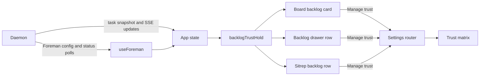

# Backlog repository-trust alert

## Outcome

When Foreman is running live with backlog autopilot enabled, an enabled backlog task that
cannot be scheduled because one or more of its repositories are outside Foreman's allowlist
will carry an amber warning control. Opening it will name the missing repository grants,
explain that unattended scheduling is withheld while manual launch still works, and offer
**Manage trust** to open the existing Trust matrix.

The warning will appear wherever the backlog task is already rendered:

- the Board's Backlog card;
- the Line's Backlog drawer row;
- the Sitrep backlog row.

This is a durable, task-local explanation, not an operating-system notification. It should
remain visible while the condition remains true and disappear when the Foreman grant lands.

## What the repository already provides

- `src/server/foreman/backlog-machine.ts:331-347` filters tasks with
  `taskReposAllowlisted` and returns `no backlog item is in a repo Foreman is trusted to act
  in` before readiness or capacity is considered. The new UI should explain that exact gate.
- `src/shared/allowlist.ts` owns `cwdAllowlisted` and `taskReposAllowlisted`, including the
  rule that every repository attached to a multi-repo task must be allowlisted. It currently
  returns only a boolean, so the UI cannot name which grants are missing without repeating
  the matcher.
- `App.tsx` already holds the SSE task list plus `useForeman`'s polled config and status. The
  browser therefore has the task repository set, `enabled`, `mode`, `autoBacklog`, worker
  liveness, and `repoAllowlist`; no new daemon endpoint or wire field is needed.
- `DeadBlockerButton` in `src/web/components/session-bits.tsx` is the established task-alert
  pattern. It renders the same warning control on the Board and Sitrep, while the Backlog
  drawer also consumes it. The control has a tooltip, an accessible name, an anchored dialog,
  outside-click and Escape dismissal, and an actionable remedy.
- `openSettingsAnchor("trust", "trust/matrix")` already deep-links from App to the Trust
  matrix. The warning can use the same route rather than inventing a grant shortcut.
- Existing backlog copy and state projections live in `src/web/lib/backlog-copy.ts`, which is
  the right browser-side owner for deciding when this particular explanation should render.

## Product behavior

### Eligibility

Add a pure `backlogTrustHold(task, state)` projection. It returns the task's missing repository
roots only when all of these are true:

1. Foreman config and status have loaded;
2. Foreman is enabled, in `live` mode, and its worker is running;
3. backlog autopilot is enabled;
4. the task is in Backlog, enabled, error-free, and of a kind that permits unattended backlog
   scheduling;
5. at least one primary or attached repository is not covered by Foreman's allowlist.

The task-local warning is suppressed when a stronger existing explanation already owns the
row: a parked task keeps `autopilot will skip this`, and a task carrying a launch error keeps
that exact manual-retry reason. Foreman-off, non-live, autopilot-off, and worker-down states
remain queue-level conditions explained by the Foreman control and Backlog drawer footer.

A dependency does not suppress the trust warning. A phase may correctly read `after Phase 1`
and also carry the trust alert, because completing Phase 1 cannot make an untrusted repository
schedulable. This is especially important for phased backlogs where every row shares the same
missing grant.

| Situation | Task warning |
|---|---|
| Current case: live worker, autopilot on, enabled task, `calendar-buddy` absent from allowlist | Show and name `calendar-buddy` |
| Task also waits on a live prerequisite | Show beside the existing dependency mark |
| Task is parked | Hide; the existing parked explanation owns the row |
| Task carries a dispatch error | Hide; the exact recovery error owns the row |
| Foreman is off, not live, worker-down, or autopilot is off | Hide; existing queue-level status owns the condition |
| Every task repository is allowlisted | Hide |
| Multi-repo task with one missing grant | Show and name only the missing repository |

### Copy and interaction

The closed control uses the existing outlined warning triangle and an accessible label such as:

> Autopilot cannot schedule “Phase 1”: calendar-buddy is not trusted for Foreman

Its tooltip gives the same one-sentence summary. The opened dialog is labelled
`Why autopilot cannot schedule <task title>` and contains:

- singular copy: `Foreman is live, but calendar-buddy is not trusted for live actions.`;
- plural copy for multi-repo tasks, followed by a compact list of only the missing repository
  names and full-path tooltips;
- `Manual launch still works.` so the warning does not imply the task itself is disabled;
- one **Manage trust** button that closes the alert and deep-links to the Trust matrix.

Granting trust is intentionally not a one-click action inside the task card. Trust remains the
single editor and confirmation surface for repository grants. Manual launch stays on the
existing card or row button, so the alert does not duplicate it.

The warning control does not use `role="alert"`. It is persistent state that may appear on
several tasks at once, and announcing every row as a live alert would flood assistive technology.
The button has a complete accessible name, the popover is a labelled `dialog`, focusable actions
remain keyboard reachable, and Escape returns to the trigger as the existing backlog popovers do.

## Visual direction

The single job is to explain a withheld unattended launch to an operator scanning a dense queue.
The design stays inside Mission Control's existing backlog grammar:

- use `--attention` amber because a repository grant needs operator action, not `--danger`,
  which the stopped-prerequisite alert reserves for work that failed or was cancelled;
- reuse the 12px outlined warning triangle, the existing panel, border, foreground, dim-text,
  shadow, and focus tokens, and inherit the app's typography;
- keep the closed state icon-sized so four tasks sharing one missing grant do not become four
  repeated paragraphs;
- reuse the dead-prerequisite popover geometry and interaction, with an attention-tone modifier
  rather than a parallel visual system;
- make the missing repository name the signature detail: a short monospace leaf in the lead,
  with its canonical path available in the list or tooltip.

Closed and opened states:

```text
┌ Backlog task ───────────────────────┐
│ Phase 1: App skeleton               │
│ [on] [priority]                     │
│ ship  codex                  2m ago │
│ ⚠                                   │
│ [launch new agent]                  │
└─────────────────────────────────────┘
  └─ opens ────────────────────────────┐
     Why autopilot cannot schedule…    │
     calendar-buddy is not trusted     │
     for Foreman's live actions.       │
     Manual launch still works.        │
                         [Manage trust] │
     ──────────────────────────────────┘
```

## Data and request flow

No new request is introduced. Existing task and Foreman projections meet in App, then a pure
browser helper determines whether each task needs the warning. The only action routes through
the existing Settings navigation.



## Implementation

### 1. Expose the missing repository set from the shared allowlist owner

- Add a browser-safe helper in `src/shared/allowlist.ts` that returns the primary and attached
  repository roots not covered by the supplied allowlist, preserving task repository order.
- Reimplement `taskReposAllowlisted` as `missing.length === 0` so the scheduler's boolean gate
  and the UI's named explanation cannot drift on path boundaries or multi-repo behavior.
- Extend focused allowlist tests for exact paths, trailing slashes, nested roots, and a
  multi-repo task where only one attached repository is missing.

### 2. Add one task-level projection and one copy owner

- In `src/web/lib/backlog-copy.ts`, define the small view-state input assembled from the loaded
  Foreman config/status and implement `backlogTrustHold` with the eligibility table above.
- Keep repository selection in the shared allowlist helper and browser-only wording in
  `backlog-copy.ts`.
- Add copy helpers for singular and plural summaries so the Board, drawer, Sitrep, tooltip,
  accessible name, and dialog cannot describe the same hold differently.

### 3. Build the shared warning control

- Add `BacklogTrustAlert` beside `DeadBlockerButton` in
  `src/web/components/session-bits.tsx`.
- Reuse `ChecksFailedIcon`, the existing popover lifecycle, tooltip behavior, and outside-click
  and Escape handling. Accept the task title, missing repository roots, and `onManageTrust`.
- Render repository leaves for quick scanning and canonical roots for disambiguation. Keep
  **Manage trust** as the only new action.
- Generalize or group the existing `.bl-deadblock-*` structural styles only as far as needed
  to share geometry. Add an attention-tone trust modifier; do not restyle the danger alert.

### 4. Wire the same projection into all three backlog surfaces

- In `App.tsx`, assemble a nullable backlog trust view from `foreman.config` and
  `foreman.status`, and define the existing Trust deep-link callback once.
- Thread that view and callback through `SessionViewProps` and `BoardView` to
  `BacklogColumn`, directly to `BacklogDrawer`, and directly to `ReportPanel`.
- Derive each row's missing repository list with `backlogTrustHold` and render the shared
  control beside the task's existing scheduling marks.
- From the Backlog drawer and Sitrep, close the current surface before navigating to Trust.
  Board navigation can route directly. The Trust matrix's existing anchor and flash behavior
  owns the landing.
- Let the next `useForeman` config poll remove every resolved warning. Do not maintain local
  dismissed or optimistic alert state.

### 5. Document the visible contract

- Update `README.md` near Backlog details to say that live autopilot tasks outside Foreman's
  trust list carry an inline explanation and remain manually launchable.
- Update `docs/dispatch-and-backlog.md` beside parked and stopped-task explanations with the
  new repository-trust warning, its three surfaces, multi-repo behavior, and Trust remedy.
- Update `docs/ui.md` for the Backlog drawer row marks and the Manage trust transition.
- Keep `docs/foreman.md`'s allowlist description aligned if the visible wording changes.

## Verification

### Pure and render tests

- Add focused tests for `backlogTrustHold`: loaded/live/running/autopilot gates, allowed and
  missing primary repos, one missing attached repo, parked suppression, launch-error
  suppression, and coexistence with a dependency.
- Add a render test modelled on `test/backlog-dead-blocker-render.test.ts` proving the Board,
  Backlog drawer, and Sitrep all render the same shared warning and that allowed tasks render
  none.
- Pin the singular/plural accessible names, missing-repo copy, no `role="alert"`, and the
  attention versus danger style modifiers.
- Run focused tests with the repository's required preload:

  ```sh
  node --test --import ./test/setup-state.mjs --import tsx \
    test/backlog-trust-alert.test.ts test/backlog-trust-alert-render.test.ts
  ```

### Browser and visual verification

- Add a Playwright case, using fake agents only, that seeds a live Foreman heartbeat and
  config with autopilot on but the task repository absent from the allowlist.
- On the Board, Backlog drawer, and Sitrep, locate the warning by role and accessible name,
  open it, assert the repository and manual-launch copy, and activate **Manage trust**.
- Assert navigation reaches `#/settings/trust` and the Trust matrix anchor is visible.
- Grant the repository through the existing Trust control or config route and assert the
  warning disappears after the polled config update without reloading.
- Seed a dependency chain and prove the downstream row retains both its `after …` mark and
  the trust warning. Seed a parked or launch-error task and prove no duplicate trust alarm.
- Capture a review screenshot in the gitignored e2e artifacts directory showing the closed
  warning on several cards and the opened dialog on one. Do not commit evidence artifacts.

### Gates

Run `npm run typecheck`, `npm run lint`, `npm test`, `npm run build`, `npm run smoke`, and
`npm run test:e2e`. Run the Electron drawer geometry coverage if sharing the popover styles or
adding the icon changes row measurements.

## Acceptance criteria

- In the diagnosed `calendar-buddy` case, all four enabled, error-free backlog tasks show an
  amber warning even though three also wait on another phase.
- Opening any warning states that `calendar-buddy` is missing from Foreman's live trust and
  that manual launch remains available.
- **Manage trust** reaches the existing Trust matrix; granting Foreman access removes the
  warning from every affected task after the normal config refresh.
- A multi-repo task names only repositories whose grants are missing and stays withheld until
  every repository is covered.
- Parked tasks and tasks carrying launch errors retain their existing single explanation
  without a second trust warning.
- The Board, Backlog drawer, and Sitrep use one shared control and one copy source.
- No new database column, endpoint, alert-center event, desktop notification, scheduling rule,
  or automatic trust grant is introduced.

## Out of scope

- Changing Foreman's allowlist policy or scheduler precedence.
- Automatically granting trust from a backlog card.
- Adding a queue-wide banner in place of task-local warnings.
- Adding desktop, sound, toast, or Away-digest notifications for a persistent configuration
  condition.
- Generalizing every backlog hold into one new server-side reason protocol.
