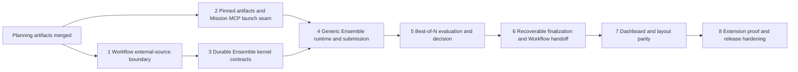

# Multi-Agent Ensembles: Phased Implementation Plan

Status: implementation tasks scheduled\
Date: 2026-07-23\
Source plan: [plan.md](./plan.md)\
Investigated baseline: main at `57ea5bc`

## Incorporated human decisions

- Implement the reusable Ensemble kernel, with `best_of_n@1` as the only enabled product strategy.
- Keep Ensemble orchestration separate from the one-Session Workflow graph and compose them only
  after an exact result is finalized.
- Preserve the broader comparison/collaboration design space through versioned policies, generic
  stages, immutable artifacts, and bounded strategy drivers.
- Generate dependency-linked implementation tasks now.
- Target every implementation task at Claude Code using `claude-opus-4-8` with `xhigh` effort.

There are no unresolved product decisions in this decomposition.

## Repository findings that changed the phase boundaries

1. Workflow Phases 1–3 are implemented, not WIP. `WorkflowManager`, `WorkflowEngine`, stable
   context capture, immutable publishing, bindings, retries, recovery, SSE, Reset cleanup, and Run
   detail already exist. The Ensemble handoff is an additive compatibility slice over shipped code.
2. Workflow persistence currently hard-codes `trigger_source = 'manual'` in run and submission
   inserts. External handoff must first make trigger identity an explicit store input while
   preserving existing manual keys and rows.
3. Workflow Persona attempts have a per-engine limiter of three, but context compaction bypasses it.
   A daemon-owned scheduler must be injected before Ensemble evaluation can honestly share a local
   review-call ceiling.
4. Worktree provisioning and teardown live in `src/server/dispatcher.ts`; there is no
   `src/server/worktree.ts`. Pinned-base and exact-reset work belongs in focused helpers plus that
   existing owner.
5. `TaskManager.dispatch` accepts only a launch-time default model and currently does not pass an
   options object to `Dispatcher.dispatch`. The pinned input and launch-scoped MCP descriptor must
   flow through both layers without changing normal dispatch.
6. Claude's launch-scoped MCP setup is embedded in `ask-channel.ts`, while Codex launch preparation
   currently composes auto-mode and hook overrides only. A shared Mission MCP descriptor is the
   correct seam; a second ad hoc config writer would drift.
7. Session grouping should extend nested `TaskSummary`. It must not add a top-level `Session` field,
   so `SESSION_FIELD_COMPARATORS` needs no new entry.
8. The live browser channel remains one SSE stream. Ensemble summaries add a top-level snapshot
   collection and exhaustive event variants; full members, artifacts, evaluations, and patches stay
   on HTTP.
9. The Workflow page route/tab union is closed over Workflows, Personas, and Runs. The Ensemble
   route should land with the actual list/detail UI, not earlier as a dead tab.
10. Current source files are `src/web/components/session-bits.tsx` and `src/web/lib/api.ts`; phase
    plans use those real paths instead of speculative names from the root plan.

## Phase graph



Phase 1 and Phase 2 are the only parallel implementation group. Their production files are
disjoint except for documentation and they establish independent seams. Phase 3 waits for Phase 1
because both own `protocol.ts`, `db.ts`, and daemon construction; this avoids two migrations and two
competing LLM-concurrency shapes. Phase 4 is the fan-in point for the two foundations.

## Phase index

| Phase | Outcome | Direct prerequisites | Merge notes |
|---|---|---|---|
| [1](./phase-1-workflow-external-source.md) | Shipped Workflow Preview accepts one exact, clean, idempotent external result through a shared daemon review scheduler | Planning session | May run with Phase 2 |
| [2](./phase-2-pinned-artifacts-and-mcp.md) | Dispatcher can provision from one pinned commit, snapshot a worktree immutably, and attach Mission MCP to Claude/Codex launches | Planning session | May run with Phase 1 |
| [3](./phase-3-ensemble-kernel-contracts.md) | Versioned Ensemble contracts, tables, store, strategy compilation, compact SSE state, and Task projection are durable | Phase 1 | Can merge before Phase 2; does not launch |
| [4](./phase-4-generic-runtime-and-submission.md) | Generic engine launches bounded member waves, accepts attributable submissions, captures artifacts, and recovers | Phases 2 and 3 | First fan-in |
| [5](./phase-5-best-of-n-evaluation.md) | `best_of_n@1` anonymously compares eligible immutable artifacts and reaches a human decision boundary | Phase 4 | No destructive finalization |
| [6](./phase-6-finalization-and-workflow-handoff.md) | Human-confirmed select-one finalization, cleanup, restore, and optional exact Workflow handoff recover safely | Phase 5 | Backend feature complete |
| [7](./phase-7-dashboard-and-layout-parity.md) | Dispatch creation, Ensemble history/detail, actions, evidence, and all layout signals form one usable product flow | Phase 6 | UI/API contract lock |
| [8](./phase-8-extension-proof-and-release.md) | Alternative strategy fixtures prove composability; docs, build/package validation, and restart/fault soak make it releasable | Phase 7 | Release gate |

## Cross-phase contracts

These contracts are owned once and inherited by every later phase:

- `EnsembleRun`, member, artifact, stage attempt, evaluation, and outcome are generic durable nouns.
  Scores, ranks, votes, and Best-of-N result fields never migrate onto members or Sessions.
- Strategy ids and versions, artifact kinds/versions, and any persisted driver ids are append-only.
  Active runs execute their immutable compiled plan rather than current defaults.
- `EnsembleEngine` may dispatch only generic stage/driver commands and must never branch on
  `strategyId`. Production strategies compile into the same bounded command vocabulary.
- Every member is a normal Task. TaskManager and Dispatcher remain the only owners of Task state,
  terminal homes, worktrees, cancellation, and cleanup.
- Every Best-of-N member starts from one verified full base SHA. Every submitted Git artifact is an
  immutable private commit/ref created without mutating the real index, branch, or working tree.
- MCP submission identity comes from authenticated Session → Task → active member attribution. No
  caller supplies an ensemble, member, artifact, or sibling id.
- Model outputs are advisory and tool-less. They cannot launch, promote, publish, cancel, reap, or
  delete. Destructive finalization always requires an explicit human decision.
- Workflow remains one Session. External handoff uses one immutable version, one active-note
  conflict rule, one stable source claim, one exact clean snapshot expectation, and the shipped
  capture/engine/recovery paths.
- Workflow and Ensemble lifecycles and retention remain separate. Reset removes the Workflow family
  and claim, not Ensemble history or private refs. A completed Ensemble never recreates a reset run.
- The browser receives compact summaries over the existing SSE stream and fetches bounded detail and
  artifact evidence over HTTP. No polling and no full patches in SSE.
- Session UI extends nested `TaskSummary`; layout-visible props flow through `SessionViewProps` /
  `cardProps`, and all four renderers receive the Ensemble signal.
- Live Workflow/Foreman and Inspector behavior remain gated on their future Workflow phases.
  Ensemble Preview handoff must not silently downgrade a selected Live configuration.

## Merge order and handoffs

1. Merge Phases 1 and 2 in either order.
2. Merge Phase 3 after Phase 1. Phase 3 may merge while Phase 2 is still in review.
3. Merge Phase 4 only after Phases 2 and 3; it consumes both foundations.
4. Merge Phases 5 through 8 in order.

Every phase leaves typecheck and its focused tests green. Hidden/internal seams may exist before a
later product surface, but no route or UI promises behavior that the current phase cannot execute.

## Final verification strategy

Each phase runs its focused tests plus `npm run typecheck`. Phases that touch a build entry,
launch-scoped MCP configuration, or web code also run the relevant build/smoke commands. Phase 8
runs the complete gate:

```text
npm run typecheck
npm test
npm run build
npm run smoke
```

It also runs restart/fault scenarios across planning, launch, submission, evaluation, decision,
every finalization step, Workflow claim/capture, and mixed Claude/Codex launch configuration. The
release is blocked if a test-only adaptive, pairwise, or synthesis strategy needs a new database
table, route family, SSE event, Session field, or layout-specific special case.

## Cross-phase audit record

- 2026-07-23: Rebased the root plan audit onto main `57ea5bc`; Workflow Phases 2 and 3 are now
  implemented.
- 2026-07-23: Moved Workflow route/tab rendering to Phase 7 so Phase 1 does not ship a dead
  navigation target; Phase 1 still owns source metadata and the backend handoff contract.
- 2026-07-23: Replaced speculative `worktree.ts`, server `api.ts`, web `api.ts`, and
  `src/web/session-bits.tsx` paths with the actual Dispatcher, routes, `src/web/lib/api.ts`, and
  `src/web/components/session-bits.tsx` owners.
- 2026-07-23: Kept Phase 1 and Phase 2 concurrent, serialized the durable kernel after Phase 1 due to
  shared schema/migration/daemon files, and made Phase 4 the explicit merge fan-in.
- 2026-07-23: Split browser-safe strategy form metadata from server-only compilers, while allowing
  recovery to load and visibly block unknown persisted strategy/driver keys after a downgrade.
- 2026-07-23: Added a side-effect-free preview endpoint so Dispatch can show an exact launch,
  budget, and Workflow estimate before confirmation without duplicating compilation in the browser.
- 2026-07-23: Routed selected-result restoration through `resetSession` with an injected exact
  artifact reset, preserving the repository's single owner for session-scoped cleanup.
- 2026-07-23: Corrected the root plan's older conceptual sequence to remove nonexistent
  `worktree.ts` / server `api.ts` paths and defer Ensemble routing until the actual dashboard phase.
