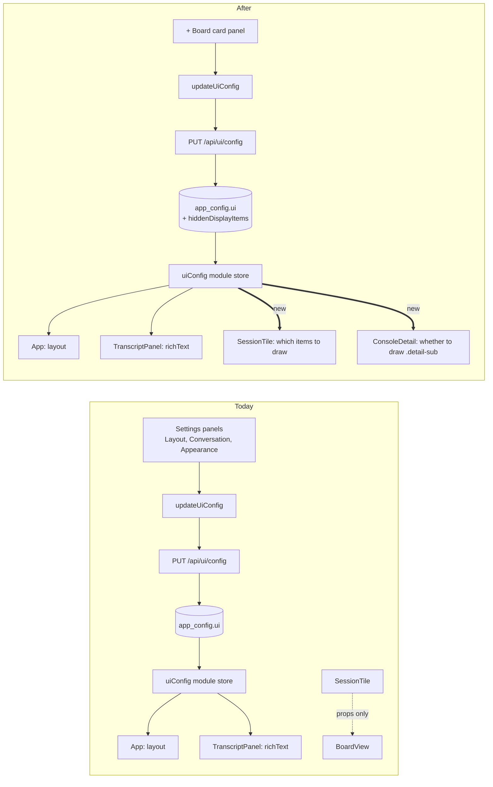
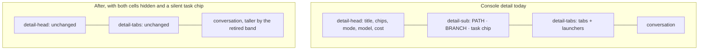

# Board card customization

## Goal

A board card draws two dozen distinct things. Every one of them was added because it was the triage signal
somebody needed, and none of them can be turned off. An operator who never uses Inspector reads the
Inspector flag anyway; an operator running a single model reads the model pill on every card forever;
an operator who lives in the worktree cannot see which worktree a card is in at all.

Give the operator the list and let them choose. **Settings → Display → Board card** becomes a
checklist of every optional item a card can draw, applied live to every card in every column.

Two items are new rather than merely toggleable:

- **Worktree** is not on the card today at all. Adding it as an item makes the card able to answer
  "which checkout is this", which currently requires drilling into the console.
- **Branch** is on the card today (`SessionTile.tsx:321`) but is not toggleable and shares its slot
  with a fallback (`session.gitBranch ?? session.nameSource`).

Once the card can carry both facts, the console detail's `PATH`/`BRANCH` band stops being the only
place they live, and an operator who has moved them to the card can switch the band off and give its
height back to the conversation.

## What ships

### 1. A card item registry

One list, in `src/web/lib/board-card.ts`, of every optional item a card can draw: a stable `id`, the
label the settings panel prints, and the one-line description that explains what the operator loses
by unchecking it. The tile reads the same list. Nothing else may hold a second copy - this is the
same rule `LAYOUTS` follows for layout modes and `detailTabs.ts` follows for the tab strip.

### 2. A `Board card` panel in Settings → Display

A checklist under `LayoutPanel`, `ConversationViewPanel` and `AppearancePanel`, which are already
stacked in that category as "one browser's preference about this screen"
(`SettingsPage.tsx:488-500`). Same `.settings-toggle` control shape as `DispatchSettingsPanel.tsx:33`,
one `data-anchor="display/board-card"` for the ⌘K settings index.

### 3. The preference, in `app_config.ui`

A new `UiConfig` key. No database migration and no new route: `app_config` is a KV of JSON blobs
(`db.ts:920`) and `UiConfigSchema` is not `.strict()`, so a new field costs a default, a schema line,
a `coerce()` line and a hook. This is the payoff of the blob design and is written down at
`docs/agent-guides/change-contracts.md:36`.

### 4. The console detail band becomes optional

`.detail-sub`'s `path` and `branch` cells (`ConsoleDetail.tsx:492-504`) each gain a visibility
preference of their own. When both are off and nothing else occupies the band, the whole `<dl>` stops
rendering and the conversation grows by its height.

## Approved decisions

These were selected by the human during the plan review and are requirements, not open questions.

### D1 - "Worktree selector" means a visibility checkbox, like every other card item

Worktree joins the same checklist as model, effort and cost. It is not a per-fact
Card/Conversation/Both/Neither selector, and it is **not** a control that re-points a session's
worktree - F1 establishes that no such capability exists, and building one is a different plan.

This is what makes the conversation band retirable: the operator moves the fact to the card, then
switches the band off.

### D2 - Defaults preserve today exactly; the operator opts in

An existing install opening the new build sees precisely what it saw before: every card item visible,
and the console detail's `PATH`/`BRANCH` band drawn as it is now. The height is reclaimed only by an
operator who goes and asks for it.

The alternative - shipping the new arrangement as the default - was rejected. It would move facts on
upgrade without being asked, and it would require amending the three e2e assertions F3 identifies
rather than leaving them untouched.

### D3 - The attention flags stay always on

`.tile-marks` - note, review, queue, PR, Inspector, schedule origin, ensemble - is **not** in the
customizable set. Only the runtime and context facts are toggleable. An operator cannot configure
themselves into missing "this session needs you".

The narrower variant that unpinned only the integration-backed flags (PR, Inspector, schedule,
ensemble) was also rejected: it splits one visually uniform row into two classes with different rules,
which is harder to explain than either whole answer.

### D4 - The panel carries a live preview card

A sample card sits in the panel and redraws as items are toggled. This is the one panel in Display
whose entire subject is what a card looks like, so showing the answer in place is worth the fixture
session it costs. See the note under **The preview card** for the constraint that fixture carries.

## Repository findings

Investigated against the code before the design was written. Each of these contradicts a plausible
reading of the request and is binding on implementation.

### F1 - There is no worktree switcher in this product, anywhere

Greps for `switch worktree`, `worktreeSelect`, `selectWorktree`, `changeWorktree`, `WorktreePicker`
and `worktreeSwitch` across `src/`, `test/` and `e2e/` return nothing. A session's worktree is leased
by the daemon at dispatch and is never re-pointed from the dashboard.

What exists is worktree **pool administration**, in Settings only: `useWorktrees.ts:31-44` and
`WorktreeSettingsPanel.tsx`, whose per-slot card offers Copy path, a terminal-backend `<select>`,
Open terminal, Return and Destroy. The `<select>` in `SlotCard` and the "Open a shell in the worktree
with" menu in `LaunchMenu.tsx:322` are **terminal-app** pickers, not worktree pickers.

So "a work tree selector" cannot be reusing something that already ships. It is either a visibility
checkbox in the new list, or a genuinely new capability with no daemon support behind it - a
difference of an order of magnitude in scope. **D1 settled this as the visibility checkbox**, so
nothing in this plan re-points a worktree, and no daemon or route work is owed.

### F2 - The branch is already on the card; the worktree is not

`SessionTile.tsx:321` renders `session.gitBranch ?? session.nameSource` in `.tile-foot`. The fallback
matters: on a session with no branch that slot prints the name source instead, so "hide the branch"
and "hide the foot's left cell" are not the same instruction. The item is the *branch*, and a session
with no branch shows the fallback exactly as it does today.

`session.cwd` is not rendered on the tile at any point. Worktree is a genuinely new item, and it needs
the same treatment the console detail gives it: `shortenCwd()` for the visible string
(`format.ts:254-263`, which only rewrites `/Users/x/` → `~/`) with the full path in a tooltip. A pool
worktree path is sixty characters of bookkeeping - `TranscriptPanel.tsx:376-380` already says so in
its own comment, and prints only the leaf for that reason. **The card should print the leaf, not the
shortened path**, and carry the full path in the tooltip; `.tile-foot` is a two-cell row with no room
for sixty characters.

### F3 - Two live assertions enforce that the worktree path appears exactly once

- `e2e/specs/console-tabs-toolbar.spec.ts:163-166` reads the path out of `.detail-sub .kv`, takes its
  leaf, and asserts that leaf appears **zero** times in the tab strip.
- `test/detail-tabs-ladder.test.ts:104` asserts the tab row's source contains no
  `conv-launch-where|conv-launch-path`.

Both exist because the console-header-density work removed a duplicate path and these stop it coming
back. Neither is violated by putting the path on a board **card**: the board's drill-in morphs the
column into the console rail, and `RailRow` draws no `cwd` (`RailRow.tsx:101-163`), so a card and a
console detail are never on screen together showing the same path. The assertions stay as they are.

But `:163` also *reads* `.detail-sub .kv` to get its subject, and
`e2e/specs/native-worktree-dispatch.spec.ts:107,110,178` assert `.detail-sub dd.mono` contains
`worktree-pools/` and that hovering it shows the full path. **If the conversation's path cell defaults
to hidden, three e2e assertions fail.** **D2 settled this by keeping the defaults**, so all three
specs are left exactly as they are - and that is the property to check when reviewing the diff,
because a spec amended here is a sign the defaults drifted.

### F4 - The vertical saving is real but conditional, and smaller than the old measurement implies

`docs/plans/console-header-density/plan.md:35` measured "killing the `PATH`/`BRANCH` row is worth
55px". That number is still the right order of magnitude - `.detail-sub` is `padding: 10px 22px` over
an ~16px line plus a 1px border (`styles.css:22182-22219`) - but it was measured before the band
acquired company.

The same `<dl>` now also hosts the task chip (`ConsoleDetail.tsx:507-537`) and `TaskRepoPrs`
(`:544`). So hiding `path` and `branch` collapses the band **only when nothing else is in it**.

It usually is nothing else. `taskPillParts` (`src/shared/task.ts:341-353`) returns `silent: true` when
the kind is the default `ship`, the task title equals `session.name`, and there is no outcome and no
`scheduleId` - which is the ordinary dispatched session, because `dispatcher.ts:799` sets a dispatched
session's name to the task title. So the common case reclaims the whole band, and a scout task, a
re-assigned session, a finished task with an outcome link, a scheduled task or a multi-repo task keeps
it and reclaims nothing.

**The plan must say this in the product copy.** A preference that promises height and delivers it
four times out of five is fine; one that promises unconditionally is a bug report waiting to be filed.

### F5 - `RuntimeMetaRow` is shared with the console detail and must not inherit a card preference

`RuntimeMetaRow` (`session-bits.tsx:1566-1621`) draws the model pill, the effort pill and the context
meter, and is mounted by both `SessionTile.tsx:307` and `ConsoleDetail.tsx:487`. Hiding the model on a
card must not hide it in the console detail.

The component already carries one prop of exactly this kind: `showEffort` (`:1569`, `:1573-1574`),
which the board sets `false` so it can mount the interactive `EffortPicker` as a sibling
(`SessionTile.tsx:307-308`). Extending that idea is the right move, and re-inlining the pills in the
tile is not - a private copy is precisely what `session-leaf-parity.test.ts` exists to catch.

Fold `showEffort` into one `omit?: ReadonlySet<"model" | "effort" | "context">` prop rather than
growing a third and fourth boolean. That also fixes the current oddity where one of the three pills
has a switch and the other two do not. The early return at `:1577` widens to "nothing left to draw".

### F6 - `coerce()` in the cache is the silent-failure point

`src/web/lib/uiCache.ts:87-102` rebuilds the cached config **field by field, never a spread**, and its
comment says why: a blob from another build can carry keys that no longer mean anything, and picking
fields drops them rather than forwarding them to the daemon forever.

The consequence is that a new `UiConfig` key which is added to `UI_CONFIG_DEFAULTS` and
`UiConfigSchema` but *not* to `coerce()` will type-check, round-trip through the daemon correctly, and
**reset to its default on every cold paint**. The `guidedDispatch` phase-1 commit (`8bb4a9ff`) touched
`uiCache.ts` for exactly this reason. `test/ui-config-cache.test.ts` is where the regression is
pinned.

### F7 - There is no cross-tab broadcast for `app_config.ui`

`uiConfig.ts:23` states it: the store is deliberately un-polled, and "Reconciling tabs live is a
`ui_config` ServerEvent, noted as follow-up". There is no such event - the only two hits in `src/` are
prose. A second dashboard tab picks up a card-item change on reload, not live.

This is pre-existing, applies equally to layout and every other display preference, and is **not** in
scope here. It is worth one line in the docs so the first person who notices does not file it as a
defect in this feature.

### F8 - Nothing today pins the tile's optional items, which is both the opportunity and the trap

`test/board-tile-render.test.ts` pins the ticker, the runtime row's context percentage, the
no-meta empty case and the held tag. `test/board-tile-pr-link.test.ts` pins the PR flag.
`test/session-leaf-parity.test.ts` and `test/layout-parity.test.ts` pin that the tile, rail and detail
draw the **same shared leaf** for ensembles, Inspector, schedules and runtime.

Those parity tests are the tension in this feature: they exist to stop three surfaces drifting on what
a fact is called, and this feature deliberately lets one surface stop drawing a fact. They keep
passing because the tile still mounts the same leaf - it just may not mount it at all - and because
the defaults draw everything. A registry-coverage test is what stops the next card item from shipping
un-toggleable, and is the direct analogue of the four topbar control registries an earlier session
learned about the hard way.

## Design

### The stored shape: a list of hidden ids, not a map of booleans

```ts
// src/shared/protocol.ts, inside UiConfigSchema
hiddenDisplayItems: z.array(z.string().min(1)).default([]),
```

An **opt-out list of hidden ids**, not `{ model: true, cost: false, ... }`. Three reasons:

1. A card item shipped in a later build is visible to everyone automatically. With a booleans map the
   key is simply absent from every stored config and has to fall back through a default anyway - the
   list gets the same result with no per-item machinery.
2. An id from a future build, or one this build has retired, is inert. That is the same deliberate
   looseness `keybindings: z.record(z.string())` documents at `protocol.ts:2367-2374`: validating the
   id set here would mean a build that removed an item could no longer read its own config.
3. The failure direction is safe. A renamed id lapses to *visible* - the operator sees a fact they had
   hidden, which is a shrug. A booleans map inverted by a bad migration hides facts, which is a
   support ticket.

`trustStaged: z.array(z.string().min(1))` in the same schema is the existing precedent for a plain
string array owned whole by one panel.

The key is `hiddenDisplayItems` rather than `boardCardHidden`, which an earlier draft of this plan
proposed. Phasing the work established that **one array serves both groups** - the card's items and
the conversation's - which is what lets the conversation work ship without touching
`src/shared/protocol.ts` at all. A key called `boardCardHidden` holding `detailPath` would be a lie on
operators' machines, and this key is persisted, so renaming it later orphans everyone's choices.

The ids and their prose live in `src/web/lib/board-card.ts`, not in `src/shared/`, because the daemon
stores them opaquely and has no use for prose it never shows - exactly the split between
`LAYOUT_MODES` (shared, validated) and `LAYOUTS` (web, prose).

### How a card reads it

```ts
// src/web/lib/board-card.ts
export function useDisplayItems(): (id: DisplayItemId) => boolean;
```

One hook over `useUiConfig()`, returning a predicate. `SessionTile` calls it once and gates each
optional item on it. `useSyncExternalStore` is given `getSnapshot` as its server snapshot too
(`uiConfig.ts:100`), so the existing `renderToStaticMarkup` tests keep working and read the shipped
defaults.

### The items

| Item | Drawn at | Notes |
| --- | --- | --- |
| Goal | `SessionTile.tsx:204` | 2-line clamp |
| Live activity | `:212-219` | already gated on `liveActivity()` |
| Workflow panel | `:226-251` | the whole peek/ladder disclosure |
| Model | `session-bits.tsx:1585` | via F5's `omit` |
| Context meter | `session-bits.tsx:1607` | via F5's `omit` |
| Effort | `SessionTile.tsx:308` | the interactive `EffortPicker` |
| Permission mode | `:316` | interactive |
| Cost | `:317` | |
| Branch | `:321` | keeps the `nameSource` fallback, F2 |
| **Worktree** | new, `.tile-foot` | leaf plus full-path tooltip, F2 |
| Last seen | `:322-324` | |

Never optional, and the panel does not list them: the tone spine and card tone (that *is* the state),
the session name and its stretched open button, the agent dot, the `held` tag - which
`SessionTile.tsx:192-194` explains has to carry its own answer because the section rule scrolls
away - and the drag drop-hint, which is transient rather than a preference.

Also never optional, per **D3**: the attention flags in `.tile-marks` (`:253-293`) - note, review,
queue, PR, Inspector, schedule origin, ensemble. That row means "things that want your attention", and
an operator who hides `review` stops seeing that a session needs them. The cost is accepted: an
operator who has never enabled Inspector reads its flag forever. Each of those flags already returns
`null` when it has nothing to say, so an unused integration draws nothing anyway - which is most of
what a toggle would have bought.

### The preview card

**D4** puts a sample card in the panel that redraws as items are toggled. It mounts the real
`SessionTile` against a fixture session, not a hand-drawn mock - a mock is a second source of truth for
what a card looks like, which is the thing this whole feature is built around avoiding.

Two constraints follow. The fixture must populate every optional item, or toggling an item the fixture
lacks does nothing visible and reads as a broken checkbox. And the preview must not be clickable
through to a session that does not exist: it renders inert, with its open button and its interactive
pickers disabled.

### The conversation band

`path` and `branch` in `.detail-sub` become two more entries in the same registry, drawn in the panel
under their own sub-heading so it is clear they are about a different surface. They are not the same
switch as the card's - an operator may reasonably want the path in both places, or in neither, and
coupling them would make one checkbox mean two things with no way to express "neither".

When both are hidden, `taskPillParts(session).silent` is true and there are no repo PRs, the `<dl>`
must not render at all. A guard on the element, not `:empty` in CSS: the band carries padding and a
border, so an empty one is a visible bar of chrome saying nothing - which is the exact thing
`ConsoleDetail.tsx:505-509` already reasons about for the task chip.

### Flows

The preference itself reuses the shipped `app_config.ui` path end to end - no new route, no new
event, no database change. The one arrow that is new is `SessionTile` becoming a `uiConfig` consumer,
which it is not today.



And the layout move the operator is buying, drawn as before and after:



## Scope

In scope:

1. The card item registry and its `UiConfig` key, including the `coerce()` line F6 requires.
2. The `Board card` settings panel in Display, its `data-anchor`, and its `SETTINGS_CONTROLS` entry.
   The panel includes the live preview card D4 approved, mounting the real `SessionTile` inert against
   a fixture that populates every optional item.
3. `SessionTile` gating each optional item, and the `RuntimeMetaRow` `omit` prop F5 requires.
4. The new worktree item on the card, as leaf plus tooltip.
5. `.detail-sub`'s `path` and `branch` cells becoming optional, with the band's render guard.
6. Documentation and Playwright coverage for each of the above.

Out of scope:

- **`RailRow`.** It draws a deliberately different, denser vocabulary - goal-or-activity in one slot,
  no runtime row at all, marks compressed to `◈ ◆ ≡N ≈$` glyphs (`RailRow.tsx:82-97,114`). Hiding
  "cost" on a card should not touch a glyph that means something adjacent but not identical.
- **`BacklogCard`.** It renders tasks, not sessions, and shares no item with this list.
- **A `ui_config` ServerEvent** (F7). Pre-existing, applies to every display preference, documented
  rather than fixed here.
- **Re-pointing a session's worktree.** D1 settled the selector as a visibility checkbox, so no
  daemon, route or lease work is owed here.
- **Making the attention flags toggleable.** D3 pinned them on.
- **Card density, ordering, or a compact variant.** Only visibility. Reordering the items is a
  different feature with a different control, and the per-column width toggle
  (`BoardView.tsx:108-114`) is deliberately a gesture rather than a setting and stays that way.

## Test plan

`test/`:

- **`board-card-items.test.ts`** - a source scan asserting every optional conditional in
  `SessionTile.tsx` is gated on a registry id, and that every registry id is reachable from the
  panel. This is the test that stops the next card item shipping un-toggleable.
- `board-tile-render.test.ts` - extended: an item hidden leaves no trace in the markup; the defaults
  render exactly what ships today.
- `ui-config-cache.test.ts` - the new key survives `coerce()` (F6).
- `settings-search.test.ts` - already fails on an anchor with no rendered control; the new anchor
  satisfies it.
- `console-detail-header.test.ts` - the band renders nothing when both cells are hidden and the pill
  is silent, and still renders when the pill is not.
- `session-leaf-parity.test.ts` / `layout-parity.test.ts` - unchanged and still passing, which is the
  assertion that the tile still mounts the shared leaves rather than inlining copies.

`e2e/`:

- **`board-card-customization.spec.ts`** - the required UI spec. Open Settings → Display, uncheck an
  item, return to the board, assert it is gone from every card, re-check it, assert it is back.
  Selected by role and label; no `data-testid`.
- **`board-card-worktree.spec.ts`** - turning the worktree item on puts the leaf on the card, and
  hovering it shows the full path.
- **`conversation-band-optional.spec.ts`** - with both cells hidden, `.detail-sub` is absent and the
  transcript's share of `.detail-conv` rises. Modelled on `console-tabs-toolbar.spec.ts:177-190`,
  which states its threshold as a share rather than a pixel count for a reason worth copying: the
  absolute figure is a function of the window and the font stack.
- **`board-card-preview.spec.ts`** - toggling an item in the panel changes the preview card in place,
  without leaving Settings, and the preview's controls do not navigate.
- `console-tabs-toolbar.spec.ts` and `native-worktree-dispatch.spec.ts` - **unchanged**, which D2
  guarantees. A diff that touches either of them has moved the defaults (F3).

Not proposed: an Electron geometry test for the reclaimed height. The share-based e2e assertion
measures the same thing in the browser that actually lays the pane out, and the geometry suite's job
is used-height for overflow and clipping, which is not what changed.

## Documentation

- `docs/ui.md` - the Board section and the Layout section, which is where an operator looks for what
  a card draws.
- `docs/skills-and-settings.md` - the Settings chapter's category table gains the panel.
- `docs/agent-guides/change-contracts.md` - a new contract line: **a new board card item is added to
  the registry, or it ships un-toggleable.** This is the same class of obligation as the settings-key
  contract already recorded at `:36`.
- `README.md` - one line if the feature is worth naming there.

## Risks

- **A hidden fact is a fact nobody misses until they need it.** The mitigation is that the panel's
  per-item description says what is lost, not what is drawn; that the genuinely load-bearing items are
  not on the list at all (D3); and that the preview card (D4) shows the consequence before the
  operator leaves the page.
- **The preview drifts from the real card.** Mitigated by mounting the real `SessionTile` rather than
  a mock, which makes drift impossible rather than merely unlikely.
- **The height promise is conditional** (F4). Mitigated by saying so in the panel copy.
- **The registry becomes a fifth thing to remember.** Mitigated by the source-scan test, which is the
  only mitigation that has ever worked in this repository for this class of problem.
