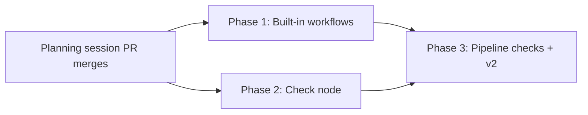

# Phased implementation: built-in workflows and No-Mistakes Review

Source plan: `docs/plans/builtin-workflows/plan.md` (decisions adopted 2026-07-26; rendered
page `plan.html` beside it).

## Incorporated human decisions

1. **Shape**: non-row built-in, following `BUILTIN_PERSONAS`. Ships pre-published. Duplicate
   is the path to a copy the operator owns.
2. **Binding defaults**: Manual plus Preview (`DEFAULT_WORKFLOW_BINDING_DEFAULTS`).
3. **Name**: `No-Mistakes Review`, reserved the way a built-in Persona's name is.
4. **Check node**: adopted, sequenced after the shipped workflow.
5. **Command source**: Mission Control settings keyed by repository root. Recorded by the
   planning session, not submitted through the dashboard, because that channel was
   unavailable. Owned by Phase 2 and the first thing to revisit if it reads wrong.

Decision 4 supersedes adopted decision 2 of
`docs/plans/no-mistakes-workflow-mapping/plan.md`; that file now records the supersession in
both places it asserted the old answer.

## Investigated findings (what the repository actually does)

Verified against `HEAD` at `0f5d045b`.

- **The Persona merge is nine methods, not one.** `WorkflowStore` takes `builtins` as a
  constructor argument (`store.ts:967`) and applies it in `withBuiltins` /
  `withAddressableBuiltins` / `builtinPersona` / `builtinPersonaNamed` / `listPersonas` /
  `personaCatalog` / `getPersona` / `insertPersona` / `updatePersonaCas` /
  `archivePersonaCas`. Workflows need the same treatment across `listWorkflows` (1194),
  `getWorkflow` (1213), `insertWorkflow` (1224), `updateWorkflowCas` (1255),
  `archiveWorkflowCas` (1299), `listWorkflowVersions` (1322),
  `listWorkflowVersionMetadata` (1333), `getWorkflowVersion` (1346), `publishWorkflow` (1354),
  `summary` (1438) and `getWorkflowVersionById` (1463).
- **The store is the only interception point needed.** `WorkflowManager.list()` is
  `listWorkflows().map(summary)` (`manager.ts:394`) and `get()` is `getWorkflow()` plus
  `listWorkflowVersionMetadata()`. Both SSE publication (`registry.upsertWorkflow`) and the
  HTTP routes read through those, so a store-level merge reaches every consumer with no route
  change.
- **`summary()` looks up the published version by row** (`store.ts:1444-1446`), so a built-in
  needs its own arm there or `publishedVersion` reads `null` on the shipped workflow.
- **`archiveWorkflowCas` joins bindings to versions by `workflow_id`** (`store.ts:1307-1311`).
  A built-in has no version rows, so that query cannot see its bindings. The built-in refusal
  must come before it, which it does anyway since built-ins refuse archive outright.
- **No foreign key on `workflow_bindings.workflow_version_id`** (`db.ts:397-399`), so a
  synthetic version id needs no schema change. Foreign keys are ON, but per `AGENTS.md` only
  the ensemble family declares any.
- **The graph the plan specifies is already legal.** `validateWorkflowGraph` accepts an
  at-least-one `submitted` fan-out (`workflow-graph.ts:170-178`), requires both a pass and a
  fail route on Personas and Joins (179-188), requires two distinct Join predecessors each
  contributing exactly one pass and one fail edge (190-207), and requires every cycle to
  include Session. No validator change is needed for Phase 1.
- **`workflow_node_attempts` needs no migration for checks.** `persona_snapshot_json`,
  `runner_id`, `model_id` and `verdict_json` are all nullable (`db.ts:461-478`) and
  `insertAttempt` already writes `input.persona === null ? null : ...`
  (`store.ts:2443`). A check attempt fits the existing row with exit code and bounded output
  in `output_json`. This materially shrinks Phase 2 against the source plan's expectation
  that the row might need widening.
- **The engine switches on node kind in four places**: `engine.ts:150` (session), 213
  (persona), 230 (session return), 256 (all_pass), 319 (end). A check node needs an arm
  beside the persona arm at 213 and a runnable-attempt path beside `runAttempt`.
- **`pump()` currently acquires the review scheduler around every runnable attempt**
  (`engine.ts:405`). A check limiter inside `runAttempt` would still consume a model-review
  slot, so Phase 2 resolves node kind in `pump()` and selects exactly one scheduler before
  either is acquired.
- **The validator switches on node kind in five places**: the `sourcePorts` / `targetPorts`
  tables (`workflow-graph.ts:20-32`), the pass/fail route requirement (180), its label
  ternary (183, 186), and the Join predecessor kind check (198).
- **`StageMember` is `{ nodeId, personaId }`** (`workflow-stages.ts:31-39`), so the Pipeline
  editor cannot express a non-Persona member today. `stageExpressible` returning false
  routes a graph to the Graph view, which is an existing tested path, not a dead surface.
  This is what lets Phase 2 ship without touching the stage projection.
- **The web read-only precedent is exact**: `PersonaEditor.tsx:148-155` renders the built-in
  sentence before the archived one, deliberately ("an operator reading 'Archived' about a
  Persona they never archived would go looking for the wrong control"), `:261` blocks save,
  `:361` sets `readOnly`, `:391` relabels Duplicate, `:395` hides Archive. CSS is
  `.persona-state.builtin` (`styles.css:8321`) and `.persona-list-tag` (8254).
  `WorkflowLibrary.tsx` gates Archive at `:631` and Publish at `:647` on
  `workflow.archivedAt`, which is where the built-in gate joins.
- **`WorkflowConfig` is `{ liveEnabled, repoAllowlist, retention }`**
  (`workflow.ts:486-509`), stored as an `app_config` blob and edited in
  `WorkflowSettingsPanel.tsx`. `WorkflowConfigSchema` uses `.default()`, not `.catch()`, so
  Phase 2 adds no-throw recovery around the complete stored config while extending it.
- **`run()` cannot provide the check output contract.** Its `execFile` implementation kills
  the child at `maxBuffer`, retains output from the beginning, and cannot know the total
  omitted bytes. Phase 2 owns a streaming `spawn` adapter with a bounded tail ring and an
  exact byte count.
- **The binding paths are identities, not a frozen execution directory.**
  `sessionRepoRoot` names the shared main repository for linked worktrees, while
  `sessionCwd` is the live mutable checkout. This is the normal dispatch shape because
  sessions run under `~/.treehouse/`. Phase 2 leases a pre-warmed pooled tree and reuses
  `pinLeasedWorktree` to reset it to the captured commit without deleting ignored
  dependencies. Setup failures are infrastructure, and the lease is returned after every
  exit path and restart.
- **`onPath` resolves slash-containing commands against the daemon cwd.** Phase 2 removes
  that precheck and classifies the real streaming spawn's `ENOENT`, so
  `./scripts/check` and `node_modules/.bin/tsc` resolve from the pinned lease.
- **A direct-child kill does not stop test workers.** Phase 2 gives each command its own
  process group and terminates all descendants on timeout, cancellation, shutdown, and
  startup recovery before returning the reusable lease.
- **A trusted argv does not make branch code trusted.** Commands such as `npm test` load
  scripts and source from the reviewed branch. Phase 2 requires repository allowlisting,
  scrubs auth and credential-shaped environment variables, and makes the consent UI name the
  daemon filesystem authority that remains. A full sandbox is deferred.
- **Tests are flat `test/<feature>-<aspect>.test.ts`**, `node:test` plus
  `node:assert/strict`, React through `renderToStaticMarkup`. The Persona precedents are
  `builtin-personas.test.ts`, `builtin-personas-web.test.ts`, `personas-store.test.ts`,
  `personas-http.test.ts`, `persona-editor-render.test.ts`. A test touching the DB must set
  `HARNESS_HOME` before importing anything that resolves it.
- **README** owns "Workflows and Personas" (anchor `#workflows-and-personas`) with a
  "Built-in Personas" subsection at line 1980. The built-in workflow section belongs beside
  it; the check node extends the node vocabulary the same section describes.

One discrepancy against the source plan, corrected here: the source plan says a check
attempt "needs either widened columns or a synthetic verdict". The repository answers it -
the existing row already accommodates a check with no migration, so Phase 2 adds no
`addColumn` call and no index.

## Phase table

| Phase | Name | Direct prerequisites | Deliverable |
|---|---|---|---|
| 1 | Built-in workflows and No-Mistakes Review | planning session | `builtin` on the workflow types, `BUILTIN_WORKFLOWS`, the store merge and refusals, the shipped graph, read-only web treatment, README, tests |
| 2 | The check node | planning session | `check` node kind end to end: types, zod, validation, slot-to-command settings, consent, bounded execution, Graph-view rendering, README, tests |
| 3 | Pipeline checks and No-Mistakes Review v2 | 1, 2 | `StageMember` union so checks render in the Pipeline editor, then a second built-in version adding the check gates |

Three phases. Phase 1 and Phase 2 are independent vertical slices and may run concurrently.
Phase 3 needs both: it consumes Phase 1's versioned built-in catalog and Phase 2's node kind.

A fourth phase separating "Pipeline support for checks" from "No-Mistakes Review v2" was
considered and rejected. The pipeline work has no consumer other than v2, and v2 must not
ship before it or the flagship built-in would force every operator into Graph view. A phase
whose only purpose is to unblock the next one is a chapter split, not a merge unit.

## Dependency graph and concurrency

Concurrency group: **{Phase 1, Phase 2}**. Neither consumes a contract, migration, route or
generated asset the other owns. They overlap textually in three files and nowhere else:

| File | Phase 1 region | Phase 2 region |
|---|---|---|
| `src/shared/workflow.ts` | `WorkflowDefinition` / `WorkflowSummary` gain `builtin` | `WorkflowDraftNode` union, `WORKFLOW_CHECK_SLOTS`, `WorkflowConfig` |
| `src/shared/protocol.ts` | nothing (built-ins are not created over HTTP) | `WorkflowDraftNodeSchema`, `PublishedWorkflowNodeSchema`, config schema |
| `README.md` | a Built-in workflows subsection | the node vocabulary and Settings rows |

These are ordinary textual conflicts resolvable at merge, not contract dependencies. Whichever
merges second rebases.

## Merge order

Phase 1 and Phase 2 may merge in either order. Phase 3 merges last and requires both.

Phase 3's first commit should re-run `npm run typecheck` against the merged base before
starting, because it is the first point at which the `builtin` flag and the `check` kind are
in the same tree.

## Cross-phase contracts

Established by Phase 1, relied on by Phase 3:

- **`builtinWorkflowId(slug)` and built-in version ids are append-only.** A built-in version
  id reaches durable storage as `workflow_bindings.workflow_version_id` and
  `workflow_runs.workflow_version_id`. Renaming a slug silently repoints a binding an
  operator already has.
- **The built-in catalog holds a LIST of versions per workflow, newest current, not a single
  version.** This is what lets Phase 3 add check gates as version 2 while every binding
  pinned to version 1 keeps resolving. A single-version catalog would strand them, and it is
  cheaper to build the list now than to migrate to it later.
- **Every built-in version is byte-identical for its lifetime, including Persona snapshots.**
  A referenced Persona guidance change appends a new version in the same commit. A test pins
  old versions and requires the newest snapshots to match the current Persona catalog.
- **The addressable projection never shadows.** Binding and run resolution must find a
  built-in version by id even when an operator's same-named row hides the workflow from the
  library listing.
- **Refusals live in the store**, shaped as `{ ok: false, reason: "builtin", current }`,
  matching `PersonaStoreWrite`.

Established by Phase 2, relied on by Phase 3:

- **`WORKFLOW_CHECK_SLOTS` is append-only** and a slot id reaches published graphs.
- **An unconfigured slot passes with a note.** Phase 3's shipped v2 depends on this: it puts
  check nodes into a workflow that runs on repositories with no command configured, and they
  must not fail there.
- **`stageExpressible` returns false for a graph containing a check node** until Phase 3
  changes it. Phase 3 owns making that false into a true, and owns the `StageMember` union.

## Final verification strategy

- `npm run typecheck`, `npm test`, `npm run build`, and the bundle smoke check green on each
  phase's PR, on Node 24 and Node 26 as CI runs them.
- After Phase 3: a fresh state directory (`HARNESS_HOME` pointed at an empty dir) shows
  **No-Mistakes Review** with no authoring step, at version 2, rendering in the Pipeline
  editor with its check stages, opening read-only with Duplicate offered.
- A binding created against version 1 before the upgrade still resolves and still runs after
  it. This is the one regression the phase split can produce and it is checked explicitly.
- README updated in the same change as the behavior it documents, per the repository's
  "Done means" rule.
