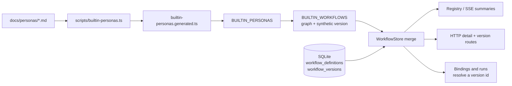
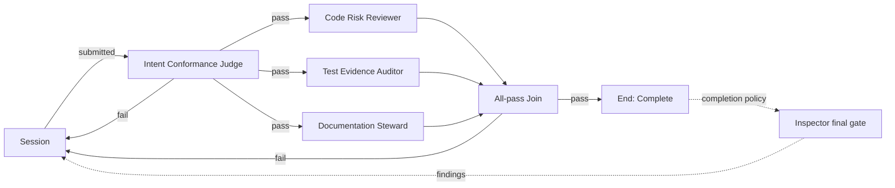

# Plan: Built-in workflows, and shipping No-Mistakes Review

Status: **decisions adopted 2026-07-26**

## The question under review

Four built-in Personas ship today (PR #270). They were authored to compose into one specific
graph, and the README says so: "The four are written to compose as the example workflow in
`docs/plans/no-mistakes-workflow-mapping/plan.md`." That workflow exists only as prose and a
Mermaid block. A fresh install therefore has four ready review roles and **zero workflows**,
so the canonical pipeline is an authoring gesture every operator has to perform by hand,
correctly, from a document they have not read.

This plan ships that graph as a **built-in workflow**: app data, present on a fresh install,
usable without an authoring step. It also adds the one node kind the earlier mapping
deliberately left out, so the shipped workflow can enforce deterministic command gates rather
than deferring all of them to CI.

## Verdict

The graph itself needs no new machinery. Every execution primitive it uses landed with
workflow-builder phases 1 to 5: Persona nodes, the All-pass Join, the Session repair loop,
Live delivery, and the Inspector final gate. What is missing is the **concept of a workflow
that ships with the application**, which today exists only for Personas.

The check node is a genuinely new primitive and is the reason this is more than a data
change. It reverses an adopted decision (see "Relationship to the earlier plan") and it puts
command execution inside a subsystem that has never run one, so it is deliberately sequenced
behind the shipped workflow rather than bundled into it.

## Background: what the repository actually does today

Investigated against `HEAD` at `0f5d045b`.

### Built-in Personas are not rows, and that is load-bearing

`src/server/workflows/builtin-personas.ts` builds `BUILTIN_PERSONAS` from
`builtin-personas.generated.ts`, which `scripts/builtin-personas.ts` compiles from
`docs/personas/*.md`. `WorkflowStore` takes them as a constructor argument and merges them
into every Persona read. The module comment states the reasoning, and it transfers directly
to workflows:

> Nothing to migrate, so an install that never opened the Personas tab still has them.
> No revision history to keep, because there is only ever one revision of a build's copy.
> Edits and archives are refused in the store rather than in each caller, so a customized
> copy is one gesture with an honest name: Duplicate.

Two merge projections exist and they are not interchangeable. `listPersonas` merges through
`personasForDisplay`, where a live operator row **shadows** a same-named built-in.
`personaCatalog` merges without shadowing, because draft validation and Publish must always
resolve a built-in id even when it is hidden behind an operator's copy.

### Workflows are rows, at three levels

`workflow_definitions`, `workflow_versions` and `workflow_bindings` are all SQLite tables
(`src/server/db.ts` lines 365 to 416). A binding pins `workflow_version_id`, and a run pins
both a binding and a version. This is the structural difference from Personas: a Persona is a
read-only leaf, whereas a workflow has a mutable draft, a Publish gesture that mints an
immutable version, and durable references to that version from bindings and runs.

One fact makes a non-row built-in feasible anyway: **`workflow_bindings.workflow_version_id`
is plain `TEXT NOT NULL` with no `REFERENCES` clause.** Foreign keys are ON in `openDb()`, but
per `AGENTS.md` only the ensemble family declares any. A synthetic version id therefore
satisfies every existing write path without a schema change.

### The node vocabulary is exactly four kinds

```ts
export type WorkflowDraftNode =
  | { id: string; kind: "session"; position: Point }
  | { id: string; kind: "persona"; personaId: PersonaId; position: Point }
  | { id: string; kind: "all_pass"; position: Point }
  | { id: string; kind: "end"; outcome: string; position: Point };
```

Ports are tabled by kind in `src/shared/workflow-graph.ts`, and `validateWorkflowGraph`
enforces 26 diagnostic codes over them, including "every cycle must include Session" and
"a join predecessor must be a persona or another join". Nothing in the graph runs a command.

### A new workflow starts empty

`CreateWorkflowSchema` (`src/shared/protocol.ts:2342`) defaults the draft to one `session`
node and one `end` node labelled `"Complete"`, with **no edges**. That draft cannot be
published until an operator wires it, which is exactly the gap this plan closes.

### The delivery tail already exists

`completionPolicy: { kind: "inspector", ... }` gates a passed graph on an adopted PR at the
reviewed head. `restart_workflow` requires a full resubmission that reruns every Persona;
`missingPrAction: "offer_prepare_pr"` surfaces the **Prepare PR in session** action. Between
them these reproduce no-mistakes' `pr` and `ci` steps without the workflow engine ever
calling git or GitHub, which `AGENTS.md` requires ("PR provenance is two signals").

## Relationship to the earlier plan

`docs/plans/no-mistakes-workflow-mapping/plan.md` is the approved gate-by-gate mapping and
remains the reference for **why** each no-mistakes step does or does not become a node. This
plan supersedes exactly one of its adopted decisions.

That plan's adopted decision 2 reads:

> **Deterministic test/lint command gates**: leave outside the graph. CI enforces them at the
> PR head; the Inspector final gate makes them binding. No check-node kind is planned.

That decision is **superseded here**. The reasoning that produced it is still sound as far as
it goes: a Persona cannot run a linter, and a tool-less judge eyeballing a diff for style
drift is the exact overreach the Code Risk Reviewer prompt forbids. But it concluded from
"this is not a Persona" that it is not a node at all, and the intervening phases changed the
cost of the alternative. Deferring every deterministic check to CI means a repair round can
pass all four judges and only then discover that the branch does not compile, which spends
four model calls to learn what one exit code would have said first.

Its other three decisions stand unchanged, and this plan depends on them:

- The four-Persona set is final. No fifth judging role is added here.
- The ship tail stays with the Inspector final gate and the existing PR wrap-up. No
  workflow-owned push, PR, or rebase node.
- Persona texts remain `.md` documents compiled into the build.

## Decisions adopted

Submitted 2026-07-26.

1. **Shape: non-row built-in.** The workflow is app data merged into every read, never a
   SQLite row, following `BUILTIN_PERSONAS`. It ships pre-published with a synthetic version
   id. Customizing it is **Duplicate**, which produces an ordinary operator-owned row.
2. **Binding defaults: Manual plus Preview.** The shipped version carries
   `DEFAULT_WORKFLOW_BINDING_DEFAULTS`. Live delivery and Foreman-complete stay opt-in per
   binding, because both are consent-gated and a binding that requests one without
   authorization is refused rather than downgraded, which would make the shipped default fail
   to bind on a fresh install.
3. **Name: No-Mistakes Review.** It names its provenance, matching how the README already
   introduces the four Personas. The name is reserved the way a built-in Persona's name is,
   with the same historical-shadowing exception for an operator who already owns it.
4. **Check node: adopted.** A fifth node kind that runs a configured command and gates on its
   exit code, sequenced after the shipped workflow so the data change is not held behind the
   execution change.
5. **Command source: Mission Control settings, keyed by repository root.** Recorded by the
   planning session rather than submitted through the dashboard, because the decision channel
   was unavailable at the time. See "Where the command comes from" for the reasoning and the
   named follow-up. This is the one decision here that was not made by the human directly and
   is the first thing to overturn if it reads wrong.

## Part 1: the built-in workflow mechanism

A `builtin: boolean` on `WorkflowDefinition` and `WorkflowSummary`, a `BUILTIN_WORKFLOWS`
catalog, and a merge in `WorkflowStore` mirroring the Persona merge. The design rules that
follow from Personas, restated for the parts that differ:

- **Two projections, same split as Personas.** The display projection shadows a built-in
  behind a same-normalized-name operator row. The addressable projection never shadows,
  because a binding or run holding a built-in version id must always resolve it.
- **The version is regenerated per build, not stored.** `personaSnapshotIsOutdated` already
  special-cases `current.builtin` by comparing guidance Markdown rather than a revision
  number. A built-in workflow whose version snapshots are recompiled from the current
  built-in Persona catalog on every build therefore never reports as outdated, and an upgrade
  that improves a Persona improves the shipped workflow with no operator gesture. This is the
  same guarantee the README already makes for Personas.
- **Writes are refused in the store, not at each caller.** `insertWorkflow`,
  `updateWorkflowCas`, `archiveWorkflowCas` and `publishWorkflow` gain a `"builtin"` refusal,
  matching the Persona methods. A caller-side check would drift.
- **Bindings and runs are unaffected.** They already store an opaque version id string. The
  only change is that resolving one may now hit the built-in catalog instead of a row.

### Data flow



## Part 2: No-Mistakes Review, the first built-in



Intent Conformance runs first as the cheap gate, because there is no point spending three
deeper reviews on a change that has drifted from what was asked. The other three fan out
behind it and their verdicts aggregate into one combined repair packet at the Join. The
completion policy is `{ kind: "inspector", onFindings: "restart_workflow", missingPrAction:
"offer_prepare_pr" }`.

This shape is legal under the current validator without any change: one Session, an
at-least-one `submitted` fan-out, both a pass and a fail route on every Persona and the Join,
two distinct Persona predecessors on the Join, every cycle passing through Session, and one
reachable End. It is also expressible as a **stage pipeline**, so it renders in the Pipeline
editor rather than forcing Graph view.

### How it maps back to no-mistakes

| no-mistakes step | Where it lands here |
|---|---|
| intent | `WorkflowContextSnapshot` plus Intent Conformance Judge |
| review (judge) | Code Risk Reviewer |
| review (fixer) | Session repair loop |
| test (evidence) | Test Evidence Auditor |
| test / lint (command) | Check node (Part 3); CI and the Inspector gate until then |
| document | Documentation Steward |
| rebase, push | Deliberately absent. The engine never calls git |
| pr, ci | Inspector final gate plus **Prepare PR in session** |

Two fidelity notes worth stating rather than discovering later. no-mistakes runs one fixed
reviewer prompt with `auto_fix.review: 0`, so its review step always parks for a human; our
four-way fan-out is a richer decomposition of that single prompt, and a Persona `fail`
closing the round is the same park. And no-mistakes' reviewer keeps a durable session across
rounds, whereas Personas are deliberately cold and receive `priorPersonaFeedback` in the
context packet instead.

## Part 3: the check node

A fifth node kind:

```ts
| { id: string; kind: "check"; slot: WorkflowCheckSlot; position: Point }
```

### The node names a slot, never a command

A published version carrying an arbitrary shell string would be executable content reachable
through the existing version export route, and a built-in workflow hardcoding `npm test`
would be wrong on every repository that is not this one. The node therefore names a **slot**,
and a trusted source outside the graph says what that slot runs.

This is precisely no-mistakes' own model: `commands.test`, `commands.lint` and
`commands.format` are read from `.no-mistakes.yaml` **on the default branch only**, and the
binary disables them outright when that trusted read fails ("trusted repo config: parse
failed; commands/agent from pushed branch will be disabled"). The command a gate runs must
not be attacker-controlled by the branch under review, because the branch under review is the
thing being judged.

`WORKFLOW_CHECK_SLOTS` is **append-only**, because a slot id reaches durable published graphs.

### An unconfigured slot passes with a note

If a repository has no command for a slot, the node must pass and say so, not fail. A shipped
built-in that fails on every repository without configuration is a shipped built-in that is
broken by default. no-mistakes makes the same choice: no configured test command means the
evidence agent runs instead of a hard failure.

### Consent

Running a command from a workflow is at least as consequential as Live delivery, so it is
gated at least as hard: the existing `workflows.repoAllowlist` plus an explicit switch. A
check node in an unauthorized repository refuses with a sentence, in the same shape
`bindingModeBlock` already uses for Live and Foreman-complete.

### Execution

The engine holds no checkout. Evidence capture is a read-only snapshot of the bound session's
worktree, and that worktree has an agent working in it. The check therefore runs against the
captured commit in the session's repository root, with bounded output, a timeout, and its
result recorded on the existing `workflow_node_attempts` row. `workflow_node_attempts` is
shaped around Personas (`persona_snapshot_json`, `runner_id`, `model_id`, `verdict_json`), so
a check attempt needs either widened columns or a synthetic verdict; the phase plan decides
which and owns the migration.

### Where the command comes from

**Decided: Mission Control settings, keyed by repository root.** `WorkflowConfig` gains a
list of `{ repoRoot, slot, command }` entries beside the existing `repoAllowlist`, edited
under **Settings → Workflows**.

The alternative considered was no-mistakes' own model, a trusted file on the repository's
default branch. It is the better long-term answer because the configuration travels with the
repository, and it is named here as a follow-up rather than rejected. It is not what this
plan builds, for two reasons. It requires reading a blob from a branch other than the one
under review, which is real git machinery this subsystem does not have today, and settings
are strictly safer to start from: a command an operator typed into their own settings panel
involves no parsing of branch-controlled content at all, which removes the entire class of
problem the default-branch restriction exists to manage. Adding the file later is additive,
with settings as the override.

A list of entries rather than a `Record<repoRoot, ...>` because repository roots are absolute
paths and make poor object keys, and because the flat shape matches how `repoAllowlist`
already stores roots.

## What this plan does not do

- **No new Personas.** The four-role set is final, and the rejected fifth Lint/Housekeeping
  role stays rejected: a tool-less judge cannot run a linter, which is what the check node is
  for.
- **No workflow-owned delivery.** No rebase, push, or PR node. The Inspector final gate
  consumes an adopted PR; it never creates one.
- **No second built-in on day one.** Shipping a Live plus Foreman-complete variant is
  deferred until the check node exists, so it can be assembled once rather than twice.
- **No change to Persona authoring.** `docs/personas/*.md` plus `npm run personas` is
  unchanged.

## Final verification

- `npm run typecheck`, `npm test`, `npm run build`, and the bundle smoke check green.
- Manual: a fresh state directory shows **No-Mistakes Review** in the Workflows tab with no
  authoring step, opens read-only with Duplicate offered, binds to a live session, and runs
  all four Personas to a verdict.
- README updated in the same change as the behavior it documents.
