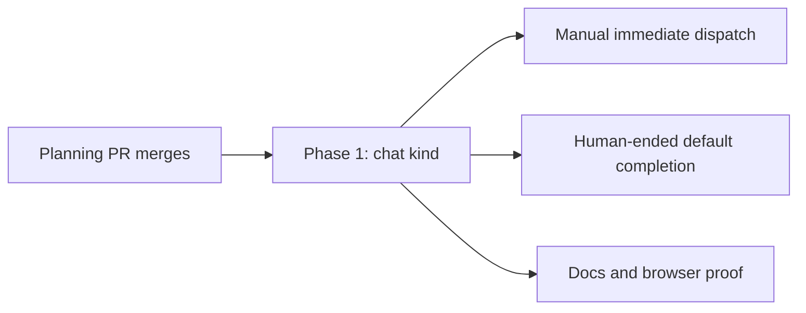

# The `chat` task kind: phased implementation

Source plan: [`plan.md`](./plan.md), rendered at [`plan.html`](./plan.html).

This index turns the approved plan into one merge unit. The feature is a single lifecycle
invariant from creation through completion: a partially landed chat kind would either leak into
the backlog or retain a shipping boundary. Keeping those seams together gives reviewers one
end-to-end behavior to evaluate and leaves no intermediate release with a selectable but unsafe
kind.

## Incorporated human decisions

| Decision | Approved selection | Consequence | Owned by |
|---|---|---|---|
| Opening message | Require an opener | Chat keeps the non-empty `intent` and turn-one delivery contract; the field copy becomes conversational | Phase 1 |
| Creation surfaces | Manual dispatch only | Chat launches immediately from the single-session Dispatch flow and is excluded from every backlog-producing path | Phase 1 |
| Implementation follow-up | Create phased implementation plan | This index and its implementation task are created from the reviewed source plan | Planning session |

## Repository findings that changed the route

Verified against the planning checkout. Paths and ownership describe that commit and may move
before implementation.

- **Manual-only is a service invariant, not a picker filter.** `TaskManager.create` converts a
  request with unmet dependencies into a backlog task even when `backlog` is false. Backlog edits
  can change Kind, and reschedule and assignment paths operate only on backlog rows. The shared
  capability is therefore phrased as "may this kind enter the backlog?" and enforced at task
  creation, update, and later backlog launch boundaries.
- **Every unattended producer already converges on the backlog.** MCP `create_task`, task-source
  ingest, Recurring Missions, ensembles, and Foreman's autopilot all create or consume backlog
  tasks. A single `allowsBacklog(kind)` policy below those producers closes the durable path,
  while their schemas and pickers omit chat to give an early, intelligible refusal.
- **The global tuple currently widens two automated schemas automatically.** Schedule templates
  in `src/shared/protocol.ts` and task-source defaults in `src/shared/task-source.ts` both use
  `z.enum(TASK_KINDS)`. Appending chat without a refinement would make API-authored automation
  accept it even if the UI hid the option.
- **The dispatch modal has two reversible decisions.** `afterWorkForKind` already stashes a
  Workflow when entering a diffless kind. Chat additionally invalidates dependencies because
  any unmet dependency silently schedules the task. Dependency state needs its own lossless
  stash so a chat detour does not erase a task the operator was composing.
- **Foreman has four calls into one eligibility boundary.** `automaticWrapupBlock` is used by
  the pure queue machine, prompted completion, and two worker evidence checks. Adding
  `workflowId` to its input makes `chat + null` one unconditional human-ended reason at all four
  seams, while `chat + explicit Workflow` continues through the existing ordinary safeguards.
- **Empty-diff prompted sessions already retire without shipping.** The new policy is still
  needed for chats that write files and for queue-drain completion. It must run before verifier
  work and Workflow claims so no path spends a judging call or flashes a Ship-it choice first.
- **No delivery or storage mechanism is missing.** The opener already reaches terminal,
  embedded, and Pi sessions as turn one; `tasks.kind` is unconstrained text; task pills already
  draw every non-default kind. Chat needs explicit exhaustive-registry answers, a badge color,
  and tests rather than a migration, runtime, or transcript format.

## Sizing and phase decision

The expected implementation is roughly **250 to 350 non-test lines** across shared policy,
modal behavior, server guards, Foreman eligibility, and documentation, plus focused unit and
browser coverage. Although this crosses the usual small-change range, splitting it would not
create independently valuable merge units:

- vocabulary plus UI without the service and Foreman rules exposes an unsafe kind;
- service rules before the UI create dead behavior with no supported entry point; and
- completion policy depends on the same durable kind and Workflow semantics the dispatch work
  establishes.

The plan therefore uses one vertical phase. Reviewability comes from the ordered contracts and
focused test groups inside the phase, not from merging an incomplete product state.

## Phase map

| Phase | Name | Direct prerequisites | Delivers |
|---|---|---|---|
| 1 | [`chat` kind from dispatch through completion](./phase-1-chat-task-kind.md) | Planning pull request | Durable vocabulary, manual-immediate creation policy, conversational copy, human-ended default completion, presentation, documentation, and end-to-end coverage |

## Dependency and delivery flow

**Concurrency groups.** There is one implementation task, so there are no concurrent phase
branches and no cross-phase merge conflicts. Within the task, shared vocabulary and policy land
first in the working diff; UI, server, and Foreman consumers follow before the commit is opened
for review.

## Cross-phase contracts

Phase 1 establishes the final contracts directly:

- **C-K1** `TASK_KINDS` is `ship`, `scout`, `plan`, `chat` in that order; `ship` remains the
  default and unknown-value fallback.
- **C-K2** one shared predicate states whether a kind may enter the backlog. Chat returns false;
  existing kinds return true.
- **C-K3** `chat` has no task-contract appendix, required Mission MCP tool, archive capture, or
  expected reviewable diff.
- **C-D1** fresh single-session Dispatch is the only supported creation surface for chat and
  requires a non-empty opener.
- **C-D2** entering chat reversibly clears Workflow and dependency defaults; a Workflow chosen
  after chat is selected is an explicit opt-in to ordinary completion.
- **C-F1** Foreman treats `chat + workflowId: null` as human-ended at both prompted and
  queue-drain completion boundaries, without changing needs-input triage.
- **C-U1** manual **Complete & close** remains the normal terminal action; no transcript archive
  or implicit shipping action is added.

## Merge order and compatibility strategy

- The planning pull request must merge first because the implementation task carries these file
  paths, not the documents' contents.
- The implementation is one pull request. Append chat without reordering existing persisted ids.
- No database migration is required. Existing rows and defaults are unchanged; a newer chat row
  degrades to ship when read by an older build through the pre-existing fallback.
- Schedule and task-source readers fail a chat value closed as unsupported automation rather than
  executing it. Task service guards are the final defense for direct HTTP, old clients, and
  internal producers.
- No rollout flag is needed. The feature is visible only after the vocabulary, entry guard, and
  completion policy are all present in the same build.

## Final verification strategy

- Shared contract tests prove tuple order, unique registry entries, badge behavior, persistence,
  archive/prompt/MCP null decisions, and the backlog-eligibility matrix.
- Schema and service tests prove chat is accepted for an immediate no-dependency dispatch and
  refused for explicit backlog, dependencies, backlog editing, schedules, task sources, and
  internal backlog production.
- Foreman unit tests exercise both queue-drain and prompted completion for chat with and without
  an explicit Workflow, including a changed-file case so the existing empty-diff shortcut cannot
  mask the policy.
- Dispatcher tests prove the opener reaches terminal, embedded, and Pi paths unchanged and gains
  no generated appendix.
- A Playwright spec uses fake agents and covers compact plus guided selection, `c`, conversational
  copy, Workflow and dependency restoration, missing backlog controls, idle without shipping UI,
  a later conversational turn, and **Complete & close**.
- Full gates: `npm run typecheck`, `npm run lint`, `npm test`, `npm run build`, `npm run smoke`,
  and `npm run test:e2e` after the focused tests pass.

## Complete cross-phase audit

Performed after the phase file was written and reconciled against the accepted source plan.

- **Every approved product decision has exactly one implementation owner.** Phase 1 owns the
  required opener and manual-only surface. The planning session owns only the chosen follow-up.
- **Every durable consumer is on or behind C-K2.** Direct HTTP, dependency-induced backlog,
  backlog edits, schedules, task sources, ensembles, MCP-created tasks, rescheduling, assignment,
  and autopilot were checked. UI omission is treated as presentation, never enforcement.
- **Every completion entry point reaches C-F1.** The queue machine, prompted completion, and both
  worker evidence calls use `automaticWrapupBlock`; the phase passes Workflow identity through all
  four rather than creating a second completion predicate.
- **The explicit Workflow exception remains ordinary, not privileged.** It bypasses only the
  chat-specific human-ended block and still runs the existing scout/review-artifact safeguards,
  evidence checks, and Workflow claim rules.
- **No migration or new artifact format is hidden in the phase.** Persistence already accepts the
  value, the opener already uses the standard delivery path, and archive capture remains null.
- **No source-plan non-goal was pulled in.** There is no transcript export, chat skill, MCP tool,
  runtime, live kind conversion, or change to operator-started sessions without a task.
- **One apparent split was rejected deliberately.** Vocabulary/presentation and completion could
  be separate code-review topics, but either merge order leaves a selectable chat that can ship or
  unreachable completion policy. The one-phase dependency graph is the compatibility result.
