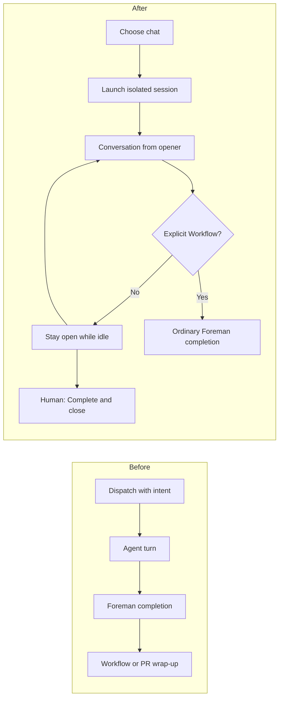

# The `chat` task kind

## Outcome

Mission Control gains a fourth durable task **Kind**, `chat`, appended after `ship`, `scout`,
and `plan`. A chat launches an isolated agent session for an open-ended conversation rather
than for a change, report, or plan. It expects no artifact, adds no task-specific MCP or skill
requirement, captures nothing into the archive library, and starts with **After work: None**.

The normal chat has no machine-verifiable finish line. Foreman must not interpret a pause in
the conversation as completed work or offer shipping actions. The human keeps chatting for as
long as useful, then uses the existing **Complete & close** action to record the outcome and
end the session.

The experience should read plainly:

1. Pick **chat** under **Kind** and open the session.
2. Talk to the agent without promising a code change, report, or plan.
3. When the conversation is over, choose **Complete & close**. Nothing is archived or shipped
   automatically.

## Repository findings

- `TASK_KINDS` in `src/shared/types.ts` is the append-only picker-order tuple
  `['ship', 'scout', 'plan']`. `ship` must stay first because `DEFAULT_TASK_KIND`, every
  automated default, and the persisted-value fallback derive from index 0.
- `TASK_KIND_INFO`, `KIND_PRODUCES_A_DIFF`, `KIND_CONTRACT`,
  `KIND_MISSION_MCP_TOOLS`, `CAPTURE_KIND`, `KIND_TAKES_REVIEW_ARTIFACT_CLASSIFIER`, and
  `GUIDED_KIND_KEYS` are exhaustive `Record<TaskKind, ...>` registries. Adding `chat` to the
  tuple intentionally makes the compiler demand a decision at each behavioral seam.
- The dispatch form already derives its Kind options from the tuple. `hasReviewableDiff`
  drives the reversible stash-and-restore rule for **After work**. Marking chat as diffless
  therefore moves the selection to None on entry and restores the exact previous selection
  when the operator returns to a diff-producing kind.
- A non-default kind automatically appears in task pills. Backlog chips still need an explicit
  `.bl-kind-chat` color because that surface has no fallback rule.
- All newly created tasks require a non-empty `intent`. The dispatcher uses it as turn one,
  derives an untitled task's name from it, and delivers it after the agent is ready. The
  approved chat behavior preserves this contract: an opener may be exploratory, but it is
  still the first conversational turn.
- A dispatched task invites Foreman. After a settled response, Foreman verifies the durable
  Goal and can claim a Workflow or offer a PR wrap-up. The existing non-shipping blocks cover
  scout and review artifacts, not an open-ended conversation. A chat-specific policy is
  therefore required; `hasReviewableDiff: false` only changes the form default.
- **Complete & close** already supplies the correct explicit end boundary. It marks the task
  done with an optional outcome, then closes the session, without requiring a pull request.
- `tasks.kind` is unconstrained text and its reader validates against `TASK_KINDS`, falling
  back to `ship` for an unknown value. Appending `chat` needs no database migration.
- Recurring Missions and task-source defaults render and validate against the same global kind
  tuple today. The dispatch service also converts any task with an unmet dependency into a
  backlog task, and a backlog edit may currently change Kind. The approved manual-only scope
  therefore requires an explicit shared backlog-eligibility capability enforced below the UI,
  not only filtered picker options.

## Product semantics

### Vocabulary and presentation

Append `chat` to `TASK_KINDS`; never reorder the existing values. Add the following registry
answers:

| Contract | `chat` answer |
|---|---|
| Label | `chat` |
| Purpose | `have an open-ended conversation` |
| Picker blurb | `Talk with an agent without a planned artifact. No after-work.` |
| Reviewable diff | `false` |
| Kind contract appended to the prompt | none; preserve the human's conversational words |
| Required Mission MCP tools | none |
| Archive capture | none |
| Guided mnemonic | `c` |
| Backlog/task-pill presentation | visible `chat` badge with its own color |

The absence of a prompt appendix is deliberate. `ship` also preserves the operator's words
exactly. Chat is a lifecycle promise made by Mission Control, not a second prompt that spends a
turn telling the agent to be conversational. If the human later asks for concrete work, the
agent should follow that message; the task does not silently turn itself into another kind.

### After-work Workflow

`hasReviewableDiff('chat')` returns false. The existing dispatch-form rule then:

- stashes the current Workflow and preselects **None** when entering chat;
- leaves None unchanged when moving between chat, scout, and plan;
- restores the exact stashed Workflow when returning to ship; and
- preserves a Workflow the operator deliberately picks after choosing chat.

For a normal chat with None selected, Foreman never offers **Ship it**, sends a
Straight-to-PR instruction, or claims a Foreman-complete Workflow. If an operator explicitly
selects a Workflow after choosing chat, that choice is an opt-in completion path and may use
the ordinary Foreman completion behavior. This makes “defaults to no workflow” meaningful
without turning the Workflow control into a selection that can never run.

### Human-ended completion

Introduce one shared kind-policy predicate for whether Foreman may infer completion. It must
consider both the durable kind and whether the operator explicitly selected an after-work
Workflow:

- chat plus `workflowId: null` is human-ended;
- chat plus an explicit Workflow may use the ordinary completion path; and
- ship, scout, and plan keep their existing behavior.

Apply that predicate before every prompted or queue-drain completion claim. A human-ended chat
retires the settled episode without a verifier call, Workflow claim, wrap-up card, or shipping
instruction. It remains a running task and live session. Later human messages create later
conversation episodes, and **Complete & close** remains the only default terminal action.

This policy does not disable Foreman's question triage. Foreman may still help when the agent
asks for input; it only stops Foreman from treating conversational idle as a shippable finish.

### No artifact lifecycle

Chat maps to `null` in the archive gateway and contributes no task contract or Mission MCP
requirement. Cleanup, cancel, restart recovery, and manual completion use the ordinary
non-archived task paths. No chat transcript export or conversation archive is introduced.

If a chat unexpectedly changes files, the existing Diff view still shows them. Mission Control
does not auto-publish those changes under a chat contract. The operator can either complete the
chat without shipping, or start a separate ship task for work that should land. Changing a
running task's kind remains out of scope because kind is provisioning intent and is currently
frozen after dispatch.

## Opening-message behavior

The repository treats `intent` as both the durable task request and turn one. Chat preserves
that contract. The dispatch form requires a non-empty opening message and sends it through the
existing terminal, embedded, or Pi delivery path without a chat appendix or synthetic greeting.

The copy should invite exploration rather than demand a deliverable, for example **What would
you like to talk about?** The opener establishes the initial Goal, but the chat kind prevents a
settled reply from being mistaken for a shipping boundary while no Workflow is selected.

## Creation-surface scope

Chat is **manual immediate dispatch only**. It is a person opening a conversation, so it appears
in the main Dispatch Kind selector and guided pass but not in Recurring Missions, task-source
defaults, MCP task creation, ensemble members, or Foreman backlog autopilot inputs.

Express this as one shared `TaskKind` capability that answers whether a kind may enter the
backlog. The main single-session Dispatch picker includes every kind; backlog editing, ensemble
dispatch, Recurring Missions, and task-source defaults derive from the backlog-compatible
subset. The dispatch UI hides **Add to backlog** and dependency scheduling for chat, while the
task service refuses a chat that is explicitly backlogged, acquires dependencies, is edited into
a backlog row, or reaches a backlog-only internal producer. This keeps API callers and recovery
paths inside the same invariant. Existing kinds remain backlog-compatible.

## Flow

Today every dispatch starts with a task objective and every ordinary pause can enter Foreman's
completion path. Chat still starts from an opening message, but idle after a conversational
reply stays open until the human closes it.



## Implementation plan

### 1. Extend the durable kind and exhaustive registries

- Append `chat` to `TASK_KINDS` in `src/shared/types.ts`; keep ship first and update the
  contract comment.
- Add chat to `TASK_KIND_INFO` and `KIND_PRODUCES_A_DIFF` in `src/shared/task.ts`.
- Add the `c` mnemonic to `GUIDED_KIND_KEYS`.
- Add explicit chat answers to `KIND_CONTRACT`, `KIND_MISSION_MCP_TOOLS`,
  `CAPTURE_KIND`, and the Foreman kind-policy registry.
- Add `.bl-kind-chat` alongside the other backlog kind colors.
- Add the approved backlog-eligibility capability and make every picker, schema, and durable
  producer apply it at the appropriate boundary.

### 2. Add chat-aware creation behavior

- Keep the shared protocol's non-empty intent rule and the existing dispatcher delivery paths.
  Change only the chat-facing field copy so it asks for an opening topic rather than an
  artifact-oriented objective.
- Hide backlog and dependency actions while chat is selected. Reversibly stash and clear draft
  dependencies on entry, then restore them when returning to a backlog-compatible kind without
  losing operator input.
- Enforce manual immediate dispatch in the dispatch schema and task service. Refuse direct
  backlog requests, dependencies, backlog kind edits, and internal backlog production for chat;
  a hidden button is not a lifecycle invariant.

### 3. Keep conversational idle out of shipping

- Add the chat-aware, Workflow-aware automatic-completion policy at the common Foreman
  boundary used by queue-drain and prompted completion.
- Retire settled human-ended chat episodes without verification, Workflow claims, wrap-up
  cards, or injected shipping instructions. Keep task and session live.
- Preserve needs-input triage and explicit Workflow behavior.
- Pin manual **Complete & close** as the normal chat exit and verify Kill still records an
  unfinished chat as failed or cancelled, matching existing task semantics.

### 4. Cover every visible and durable surface

- Extend unit tests for tuple order, registry completeness, persistence round trips, unknown
  persisted-kind fallback, task pills, prompt/MCP/archive decisions, Workflow stash and
  restore, title behavior, and Foreman completion policy.
- Add dispatcher tests showing the opener reaches terminal, embedded, and Pi paths unchanged
  and that chat adds no task contract or MCP requirement.
- Add a Playwright spec under `e2e/` that selects chat in both compact and guided dispatch,
  asserts its copy and mnemonic, verifies None is selected and reversibly restored, launches a
  chat, confirms idle does not surface shipping UI, sends a conversational turn, and finishes
  through **Complete & close**.
- The browser spec also proves automated editors omit chat, Add to backlog and dependency
  scheduling are unavailable for chat, and the server refuses a backlogged chat.
- Update `README.md`, `docs/dispatch-and-backlog.md`, `docs/foreman.md`, and any affected UI
  documentation so Kind, after-work, and completion descriptions name chat accurately.

## Compatibility and migration

- No SQLite migration is required. Existing task rows keep their values, and newer `chat`
  rows already fit the text column.
- Older builds continue to read an unknown chat row as ship through the existing fallback.
  This is conservative for data retention but not semantic preservation, so normal downgrade
  guidance should avoid dispatching a chat row from an older build.
- Existing ship, scout, and plan dispatch requests, prompts, launch arguments, archive
  behavior, and Foreman policy must remain unchanged.
- The default remains ship. Chat is appended and never becomes an implicit choice for MCP,
  schedules, task sources, ensembles, backlog edits, rescheduling, or any other backlog producer.

## Non-goals

- No chat transcript archive, export format, or Library reader.
- No new chat-specific skill, MCP tool, workflow, database table, or session runtime.
- No live conversion of a running chat into ship, scout, or plan.
- No change to the default task kind.
- No change to ordinary operator-started sessions that have no Mission Control task.

## Risks

- **Foreman policy could be only half-applied.** Prompted completion and queue-drain
  completion are separate entry paths. Both must use one shared policy or a chat can still
  surface Ship it from one path.
- **Global tuple derivation can expose chat to automation accidentally.** The automatable
  subset must be a shared contract read by schemas, editors, and dispatch guards, not a
  visual-only filter.
- **A manual Workflow override changes chat semantics.** The UI copy and tests must make clear
  that choosing a Workflow opts back into an inferred completion boundary.

## Verification

Run focused tests during implementation, then the full required gates:

```sh
node --test --import ./test/setup-state.mjs --import tsx test/task-kinds.test.ts
node --test --import ./test/setup-state.mjs --import tsx test/task-kind-persistence.test.ts
node --test --import ./test/setup-state.mjs --import tsx test/guided-dispatch-steps.test.ts
node --test --import ./test/setup-state.mjs --import tsx test/queue-machine.test.ts
node --test --import ./test/setup-state.mjs --import tsx test/dispatcher-runtime.test.ts
node --test --import ./test/setup-state.mjs --import tsx test/pi-harness.test.ts
npm run typecheck
npm run lint
npm test
npm run build
npm run smoke
npm run test:e2e
```

Runtime verification must include the built dashboard and fake agents so no model tokens are
spent. The evidence should show chat in the Kind control, the no-workflow default and
restoration, an idle chat with no shipping prompt, a conversational turn, and manual
completion.

## Incorporated human decisions

| Decision | Approved selection | Consequence |
|---|---|---|
| Opening message | Require an opener | Chat keeps the existing non-empty intent and turn-one delivery contract; only the field copy changes |
| Creation surfaces | Manual dispatch only | Chat is immediate and human-initiated; backlog, dependencies, schedules, sources, ensembles, MCP creation, and autopilot do not offer it |
| Implementation follow-up | Create phased implementation plan | This approved source is decomposed into merge-aware phase documents and dependency-linked implementation tasks |
